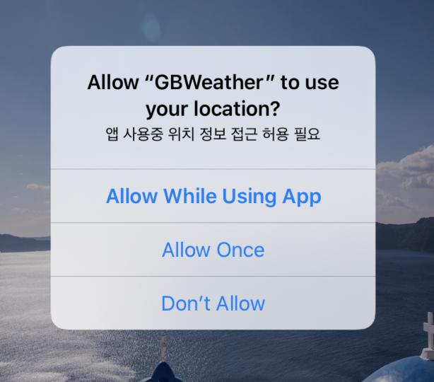

# Weather Forecast App Solve

### 구현 내용

1. 현재 위치의 좌표를 통해서 날씨 데이터 받아오기
2. 네트워크를 통한 날씨 Json 데이터 파싱
3. 화면 스크롤시 그림이 오른쪽으로 이동 및 블러  효과
4. 왼쪽 리로드 버튼을 통해서 배경화면을 변경하고 날씨 데이터 에니메이션 추가


### 주요 소스코드

- 최초 실행시 사용자의 권한을 요청하는 부분

  - 

  - ```swift
    // MARK: - CLLocationManagerDelegate
    extension WeatherForecastVC: CLLocationManagerDelegate {
      func checkAutorizationStatus() {
        switch CLLocationManager.authorizationStatus() {
          case .notDetermined:
          locationManager.requestWhenInUseAuthorization()
          case .restricted, .denied : break
          case .authorizedWhenInUse: // 앱 사용중 허용
          fallthrough
          case .authorizedAlways: // 항상 허용
          startUpdatingLocation()
          @unknown default: fatalError()
        }
      }
      func startUpdatingLocation() {
        // 권한 확인
        let status = CLLocationManager.authorizationStatus()
        guard status == .authorizedAlways || status == .authorizedWhenInUse,
          CLLocationManager.locationServicesEnabled() else { return }
        
        locationManager.desiredAccuracy = kCLLocationAccuracyBest // 가장 정확하게 측정
        locationManager.distanceFilter = 1000.0 // 1km
        locationManager.startUpdatingLocation()
        fetchWeatherData()
      }
    
      // 사용자가 최초로 권한은 수정한 뒤 해당 권한을 통해 최초 날씨 데이터 불러옴
      func locationManager(_ manager: CLLocationManager, didChangeAuthorization status: CLAuthorizationStatus) {
        fetchWeatherData()
      }
    }
    ```

- 현재 위치를 통한 날씨 Json 데이터 받아오는 부분

  - 사용자의 현재 위치를 받아 URL을 생성하여 데이터를 받아오는 부분

  - JSON Serialization을 통한 json 데이터 파싱

  - 현재 날씨를 가져오는 부분만 

  - ```swift
    func fetchCurrentWeatherDataByLocation(location: CLLocationCoordinate2D, completion: @escaping(CurrnetWeatherDataModel) -> ()) {
    
        let urlString = "https://api.openweathermap.org/data/2.5/weather?lat=\(location.latitude)&lon=\(location.longitude)&appid=\(myApi)"
    
        guard let url = URL(string: urlString) else { return print("Fail to get URL in currentWeateherURL") }
    
        URLSession.shared.dataTask(with: url) { (data, response, error) in
          if let error = error {
            print("error", error.localizedDescription)
            return
          }
    
          guard let response = response as? HTTPURLResponse,
            (200..<400).contains(response.statusCode)
            else { return print("Http response Error") }
    
          guard let data = data else { return print("Fail to get CurrentWeather Data") }
    
          if let jsonObject = try? JSONSerialization.jsonObject(with: data) as? [String: Any] {
    
            guard let subMainData = jsonObject["main"] as? [String: Double] else { return }
            guard let subWeatherData = jsonObject["weather"] as? [[String: Any]] else { return }
    
            let time = jsonObject["dt"] as! Int
    				// 데이터 전달을 위한 데이터 셋 생성
            if let weatherImageName = subWeatherData[0]["icon"] as? String,
              let weatherDescription = subWeatherData[0]["main"] as? String,
              let topTemp = subMainData["temp_max"],
              let bottomTemp = subMainData["temp_min"],
              let currentTtemp = subMainData["temp"] {
    
              let currnetWeatherData = CurrnetWeatherDataModel.init(
                weatherImageName: weatherImageName,
                weatherDescription: weatherDescription,
                topTemp: topTemp,
                bottomTemp: bottomTemp,
                currentTemp: currentTtemp,
                time: time
              )
    					// 컴플리션 블록을 통한 결과 값 전달
              completion(currnetWeatherData)
            } else {
              print("Make DataSet Fail in CurrnetWeather")
            }
    
          }
        }.resume()
      }
    ```

- 현재 지역의 날씨 데이터를 받아와서 UI에 적용해주는 부분

  - ```swift
    // MARK: - Network Handler
      func getCurrentWeatherData(location: CLLocationCoordinate2D) {
        networkService.fetchCurrentWeatherDataByLocation(location: location) { (currentWeatherData) in
          DispatchQueue.main.async {
            
            // 현재 위치를 기반으로 도시 이름을 가져오는 함수
            self.geocode(latitude: location.latitude, longitude: location.longitude) { (placemark, error) in
              if let error = error {
                print("error",error.localizedDescription)
                return
              }
              // 옵셔널 처리를 위한 guard 문
              guard let place = placemark?.first else { return }
              guard let cityName = place.administrativeArea else { return }
      
                                                                                      												
              // a HH:mm 으로 Date 포멧
              if let time = currentWeatherData.time {
                let lastUpddatTime = self.titleTimeDateFormatter.string(from: Date(timeIntervalSince1970: TimeInterval(time)))
                // 도시 이름과 상단의 최종 시간
                self.titleLabel.text = "\(cityName)\n\(lastUpddatTime)"
              }
              self.mainTableHeaderView.currnetWeatherData = currentWeatherData
            }
          }
        }
      }
    ```

- 사용자가 스크롤 할때 블러 효과와 이미지가 움직이는 에니메이션 부분

  - 스크롤 할때의 Y 값을 이용하여 Y 값에 비례하는 효과 부여

    - ```swift
      func scrollViewDidScroll(_ scrollView: UIScrollView) {
      
        // 블러 처리를 위한 변경 값
        if scrollView.contentOffset.y > 0 && scrollView.contentOffset.y < 600 {
          blurAlphaPoint = scrollView.contentOffset.y * 1.5 / 1000 // 0 ~ 900
        }
      
        // 배경화면 이동을 위한 변경 값, 이동에 따른 변화를 적당히 제한하기 위한 최소 최대값 지정
        if scrollView.contentOffset.y > 0 && scrollView.contentOffset.y < 500 {
      
          if tempValue > scrollView.contentOffset.y  {
            // 스크롤이 아래로 이동할 떄
            mainImageView.center.x -= scrollView.contentOffset.y / 1000
            blurEffectView.center.x -= scrollView.contentOffset.y / 1000
          } else {
            // 스크롤이 위로 이동할 때
            mainImageView.center.x += scrollView.contentOffset.y / 2000
            blurEffectView.center.x += scrollView.contentOffset.y / 2000
          }
          // 이전 데이터 저장
          tempValue = scrollView.contentOffset.y
        }
      }
      ```

- 갱신 버튼에 따른 에니메이션 

  - 네이게이션 버튼은 회전이 안되어 right버튼에 커스텀 뷰를 올리고 그 위에 버튼을 생성하여 커스텀 뷰 자체를 회전 시킴

  - ```swift
    @objc func tabReloadButton(_ sender: UIButton) {
        
        let imageString = ["cloud","lightning","rain","sun"].randomElement()!
        // 메인 이미지에 대한 에니메이션
        UIView.transition(with: self.mainImageView,
                          duration: 0.3,
                          options: .transitionCrossDissolve,
                          animations: {
                            self.mainImageView.image = UIImage(named: imageString)})
        // 버튼과 테이블에 대한 에니메이션
        UIView.animateKeyframes(withDuration: 1, delay: 0, animations: {
          UIView.addKeyframe(withRelativeStartTime: 0, relativeDuration: 0.25, animations: {
            self.customBarView.transform = self.customBarView.transform.rotated(by: CGFloat(Double.pi / 2))
            self.tableView.alpha = 0
          })
          UIView.addKeyframe(withRelativeStartTime: 0.25, relativeDuration: 0.25, animations: {
            self.customBarView.transform = self.customBarView.transform.rotated(by: CGFloat(Double.pi / 2))
            
            self.tableView.center.x += self.view.frame.width
          })
          UIView.addKeyframe(withRelativeStartTime: 0.5, relativeDuration: 0.25, animations: {
            self.customBarView.transform = self.customBarView.transform.rotated(by: CGFloat(Double.pi / 2))
            self.tableView.alpha = 1
            self.tableView.center.x -= self.view.frame.width
          })
          UIView.addKeyframe(withRelativeStartTime: 0.75, relativeDuration: 0.25, animations: {
            self.customBarView.transform = self.customBarView.transform.rotated(by: CGFloat(Double.pi / 2))
          })
        }) { (finish) in
          if finish {
            // 에니메이션 종료 후 데이터 갱신
            guard let location = self.locationManager.location?.coordinate else { return }
            self.getCurrentWeatherData(location: location)
            self.getForecastWeatherData(location: location)
          }
        }
      }
    ```

  - 

