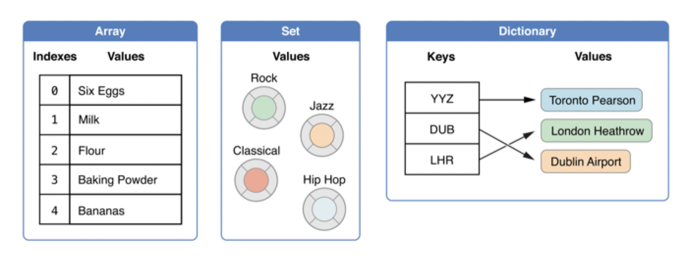

# playgrond 를 통한 기본 문법 연습 11 - Set

## collection


- 특징 

  - 앱에서 데이터를 처리하기 위한 데이터 모음 방식 
  - 대표적인 3가지 방법
  - 
    - Array : ordered collections of values
    - Dictionary : unordered collections of key-value associations
    - Set : unordered collections of unique values

---

### Set

- 특징
  
  - Set Literal = Array Literal
  - Unique Value
  - Unordered Collection
  
- Set 선언 및 초기화 방법

  - ```swift
    // 선언 방법
    let fruitsSet: Set<String> = ["Apple", "Orange", "Melon"]
    let numbers: Set = [1, 2, 3, 3, 3]
    let emptySet = Set<String>()
    ```


- Set 갯수 구하기기

  - ```swift
    let x: Set = [1, 2, 3, 4, 5]	// 순서가 없다
    let y: Set = [1, 2, 3, 4, 5]	// 순서가 없다
    x															// 출력할때 마다 다름
    y
    
    //fruitsSet[0]    // 순서 X -> Index X
    x.first   // O
    
    if fruitsSet.contains("Apple") {
      print("Contains Apple")
    }
    
    let productSet: Set = ["iPhone", "iPad", "Mac Pro", "iPad Pro", "Macbook Pro"]
    
    for element in productSet {
      if element.hasPrefix("i") {
        print(element)
      }
    }
    ```
    
  
- Set 값 추가

  - ```swift
    // Set에서는 insert만 있음, 순서 무시
    var stringSet: Set<String> = []
    stringSet.insert("Apple")
    stringSet											// {"Apple"}
    
    stringSet.insert("Orange")		// inserted true
    stringSet											// {"Apple","Orange"}
    
    stringSet.insert("Orange")		// 중복되는 값은 무시한다. /inserted false
    stringSet											// {"Apple","Orange"}
    
    ```
  
- Set 값 변경

  - ```swift
    stringSet = ["Apple", "Orange", "Melon"]
    
    stringSet.remove("Apple")
    stringSet
    
    if let removed = stringSet.remove("Orange") {
      print("\(removed) has been removed!")
    }
    
    stringSet
    
    stringSet.removeAll()
    ```

- Set 값 비교 

  - ```swift
    var favoriteFruits = Set(["Apple", "Orange", "Melon"])
    var tropicalFruits = Set(["Banana", "Papaya", "Kiwi", "Pineapple"])
    
    if favoriteFruits == tropicalFruits {
      print("favoriteFruits == tropicalFruits")
    } else {
      print("favoriteFruits != tropicalFruits")		 // favoriteFruits != tropicalFruits\n"
    }
    
    
    var favoriteFruits1 = Set(["Orange", "Melon", "Apple"])
    var favoriteFruits2 = Set(["Apple", "Melon", "Orange"])
    
    favoriteFruits1 == favoriteFruits2							// ture
    favoriteFruits1.elementsEqual(favoriteFruits2)	// false 순서까지 비교
    ```

- Set 포함 관계

  - ```swift
    // group1 ⊇ group2
    let group1: Set = ["A", "B", "C"]
    let group2: Set = ["A", "B"]
    
    
    // superset
    group1.isSuperset(of: group2)
    group1.isStrictSuperset(of: group2)
    
    // strictSuperset - 자기 요소 외 추가 요소가 최소 하나 이상 존재해야 함
    group1.isSuperset(of: group1)
    group1.isStrictSuperset(of: group1)
    
    // subset도 같은 방식
    group2.isSubset(of: group1)
    group2.isStrictSubset(of: group1)
    group2.isStrictSubset(of: group2)
    ```

