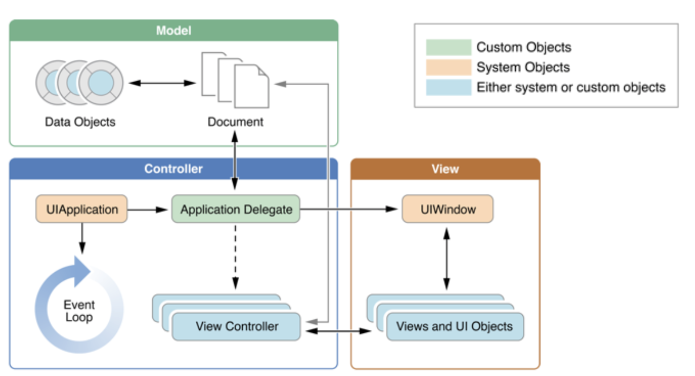
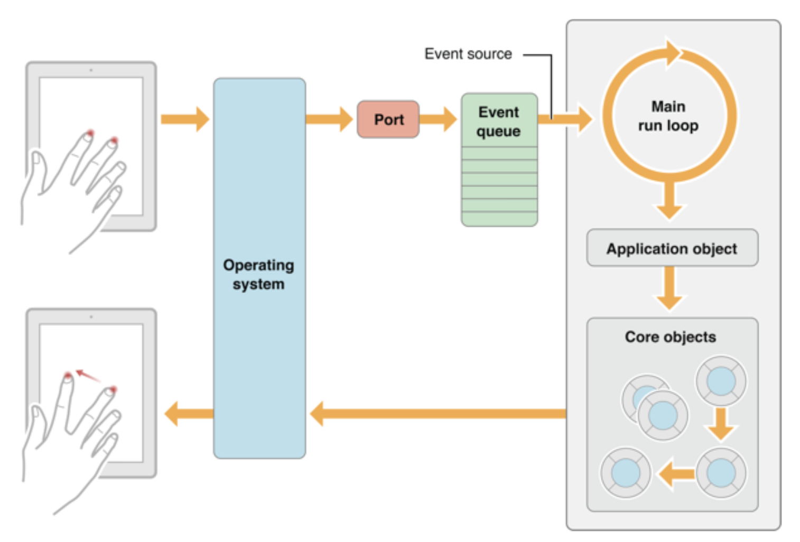
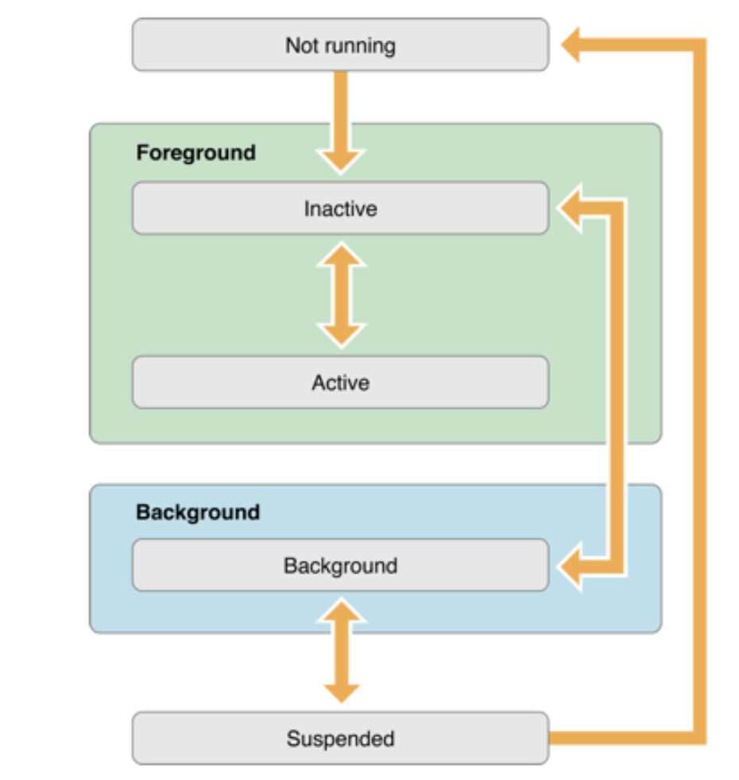
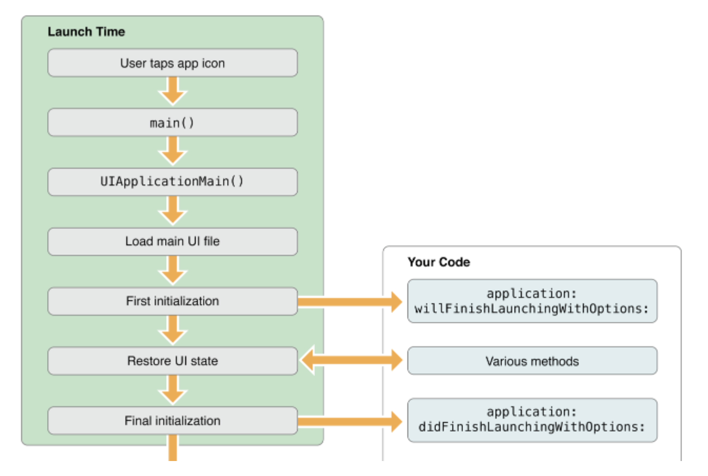

# The App Life Cycle 

### The Structure of an App

- 

- MVC 모델

  - model
    - 모델의 상태에 변화가 있을 때 컨트롤러와 뷰에 이를 통보한다.
  - View
    - 사용자가 볼 결과물을 생성하기 위해 모델로부터 정보를 얻어 온다.
  - Controller
    - 모델에 명령을 보냄으로써 모델의 상태를 변경할 수 있다.

  

  [참조: MVC모델 위키피디아](https://ko.wikipedia.org/wiki/모델-뷰-컨트롤러)

  

### Main Run Loop



- 이벤트를 받아 운영체제에서 인식하여 port를 통해 정해진 서비스(어플리케이션) 으로 전달
- 어플리케이션은 이 Event를 Queue형태로 받아 순서대로 처리
- 처리된 결과는 운영체제를 통해 UI에 보내지고, 사용자는 변화 확인 가능
- 이벤트의 종류
  - Touch, Romote Control, Shake motion events
  - Acclerometer, Magnetometer, Gyroscope 

### iOS 앱의 상태 변화



- Not Running 
  - 아무작업 없는 백그라운드 앱이 메모리에서 종료된 상태
  - 아이폰에서 앱을 키고 안쓰면 suspended -> 장기간 미사용 -> Not Running
- Inactive : 실행 중이지만 이벤트를 받고있지 않은 상태, 
  - EX) 앱 실행 중 미리알림 또는 일정 얼럿이 화면을 덮어서 앱이 이벤트를 받지 못하는 상태
- Active : 어플리케이션이 실제로 동작하고 있는 상태
- Background : 백그라운드 상태에서 실질적인 동작을 하고 있는 상태
  - ex) 백그라운드에서 음악을 실행, 걸어온 길 트래킹 등
- Suspended : 백그라운드 상태에서 활동을 멈춘 상태, 빠른 재 실행을 위하여 메모리에 적대된 상태이지만 실질적으로 동작하고 있지는 않음, 메모리가 부족할 때 비로소 시스템이 강제종료하게 됨


### iOS 앱 실행 과정 상세



- 앱이 동작하는 순서와 실제 소스코드와 연결되는 상세 프로세스
- Your Code의 실제 부분

```swift
// AppDelegate.swift 파일 내 내용

@UIApplicationMain // 이 앱의 시작점이라고 볼수 있다.
class AppDelegate: UIResponder, UIApplicationDelegate {

    var window: UIWindow? // 생성해줌

    // 제일 처음에 시작되고 나서 어떤 작업을 진행하기 위한 초기 작업
    func application(_ application: UIApplication, didFinishLaunchingWithOptions launchOptions: [UIApplication.LaunchOptionsKey: Any]?) -> Bool {
        
        print("didFinishLaunchingWithOption")
        return true
    }
  
// --- 생략 ---
```

### 참조 

- **iOS 버전 관련 호환성 처리 방법**
- IOS 13부터 SencDelegate.swift 가 생김
  
- iOS 12까지는 아직 Appdelegate 에서 처리
  
-  [ AppDelegate만 사용할 때 ]
  
  1. SceneDelegate.swift 삭제
  
  2. AppDelegate.swift 파일에서 UISceneSession Lifecycle 부분 삭제
  
  3. AppDelegate.swift 파일에 **var** window: UIWindow? 프로퍼티 작성
  
  4. Info.plist에서 Application Scene Manifest 키 삭제


