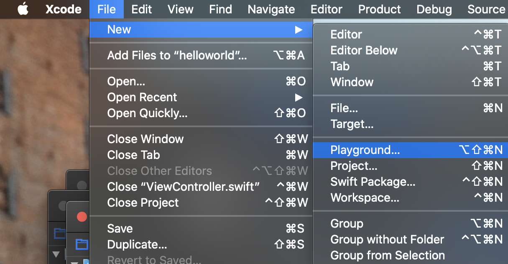
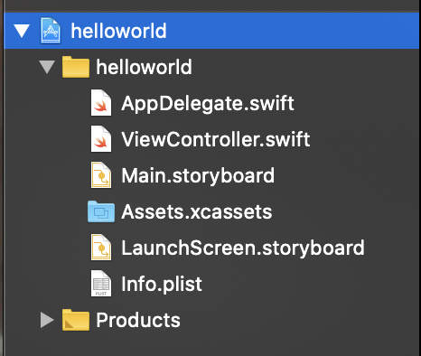
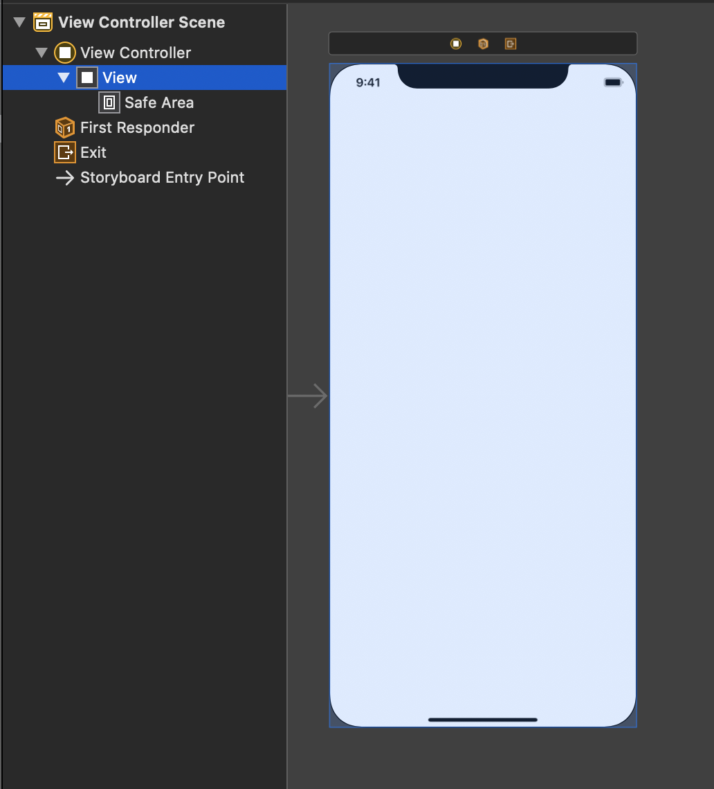
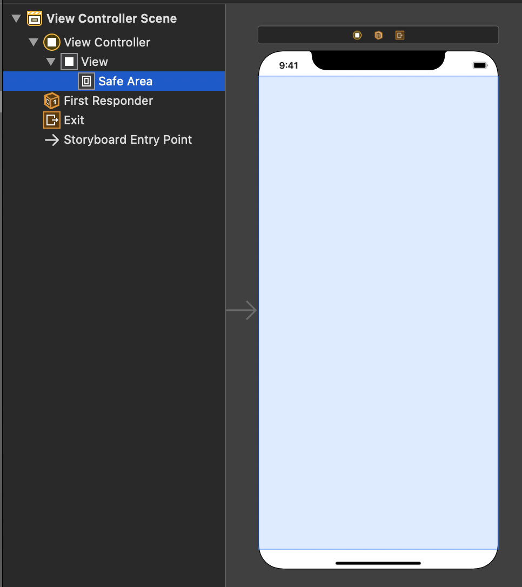
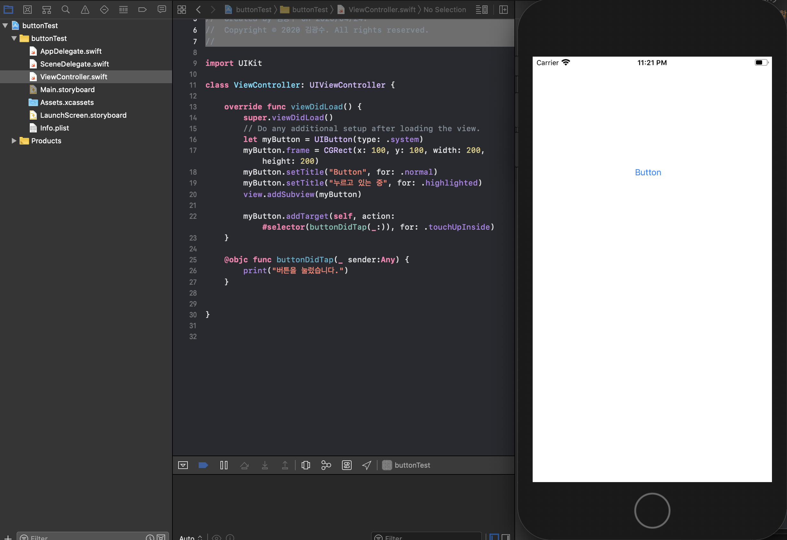

Xcode기초 및 버튼 만들기

## Xcode 프로젝트 생성

1. FIle -> New -> Project 선택



2. Single View App 선택


3. 프로젝트 이름 설정 및 swift, Storyboard 선택


## 프로젝트 구성 요소



### Main.StoryView

1. View : 화면 전체 부분
   - 아이폰 화면에 출력 할 수 있는 전체 화면 



2. Safe Area : 노치 부분, 상태창을 제외한 부분
   - 화면에 컨텐츠를 표시할때 이러한 사항을 고려하여 화면 구성 필요



### ViewController.swift


```swift
import UIKit

//화면과 연결 된 부분
class ViewController: UIViewController {
  	//UIViewController에서 이미 정의되어 있는 viewDidLoad를 재정의 해줌
    override func viewDidLoad() {
        super.viewDidLoad()
        print("viewDidLoad")    
        view.backgroundColor = .blue
    }
}
```

- UIViewController에 정의된 view ( 단축키 : control + command)

```swift

@available(iOS 2.0, *)
open class UIViewController : UIResponder, NSCoding, UIAppearanceContainer, UITraitEnvironment, UIContentContainer, UIFocusEnvironment {
    open var view: UIView! 
    //-- 생략 --
  	// 정의 되어 있는 viewDidLoad()
    open func viewDidLoad()
    //-- 생략 -- 
}
```


### Xcode 단축키 

- command+ option + control + shift : playground 신규 생성
- command + shit + n : project 신규 생성

- command + shift + o : 파일명으로 이동
  - 파일명 검색 후 option + Enter // 옆에 창에 신규로 추가
- command + shift + l : 오브젝트 추가 
- command + R : 빌드 및 실행
- command  + B : 빌드
- command + . : 앱 실행 종료
- command + l + 번호 : 해당 라인으로 이동
- command + ctrl + 함수,변수 클릭 : 해당 함수, 변수가 정의 보기(Apple 공식 문서)

### 화면에 버튼 추가하기

- 소스코드

```swift
//
//  ViewController.swift
//  buttonTest
//
//  Created by 김광수 on 2020/04/23.
//  Copyright © 2020 김광수. All rights reserved.
//

class ViewController: UIViewController {
		// 버튼과 화면을 이어주는 소스코드
    @IBOutlet private weak var button: UIButton!
    
    override func viewDidLoad() {
        super.viewDidLoad()
        //버튼 객체 생성
        let myButton = UIButton(type: .system)
      	// 버튼 위치를 강제로 지정 main view를 기준으로 한 좌표값 및 버튼의 넓이 높이 지정
        myButton.frame = CGRect(x: 100, y: 100, width: 200, height: 200)
      	// 버튼 상태에 따라 이름 지정 
      	// 버튼 상세 옵션 =>.nomal:평상시 .highlighted:버튼을 눌렀을 경우
        myButton.setTitle("Button", for: .normal)
        myButton.setTitle("누르고 있는 중", for: .highlighted)
      	// 실제 화면에 myButton 추가 
        view.addSubview(myButton)
        // 버튼을 눌렀을 때 어떤 행동을 할지 지정
        myButton.addTarget(self, action: #selector(buttonDidTap(_:)), for: .touchUpInside)   
    }
    // 버튼을 눌렀을 떄 처리할 내용 함수 기입
    @objc func buttonDidTap(_ sender:Any) {
        print("버튼을 눌렀습니다.")
    }
}
```

- 실행 결과



