# UI Guide & View Frame

## UI Guide

### iPhone Resolution 아이폰 해상도

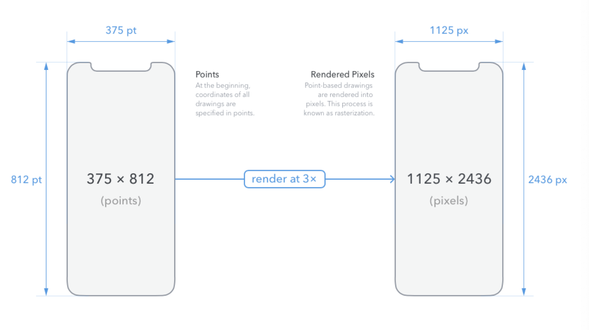

- 아이폰은 기기마다 해상도가 조금씩 다르고, 픽셀을 기반으로 랜더링이 가능하여 각각의 기기마다 맞는 형태의 이미지를 적절하게 변환하여 넣어줘야 함
- 해상도에 적절한 이미지를 넣어주면 앱 다운로드기 최적의 이미지를 기기별로 다운로드하여 아이폰 기능 및 저장공간 최적화 지원
- [ 참조 : 아이폰 기기별 해상도](https://www.paintcodeapp.com/news/ultimate-guide-to-iphone-resolutions)

#### 이미지 랜더링에 따른 이미지 크기 변화 테스트

1.  프로젝트 생성 후 Assets.xcassets에 이미지 파일 등록

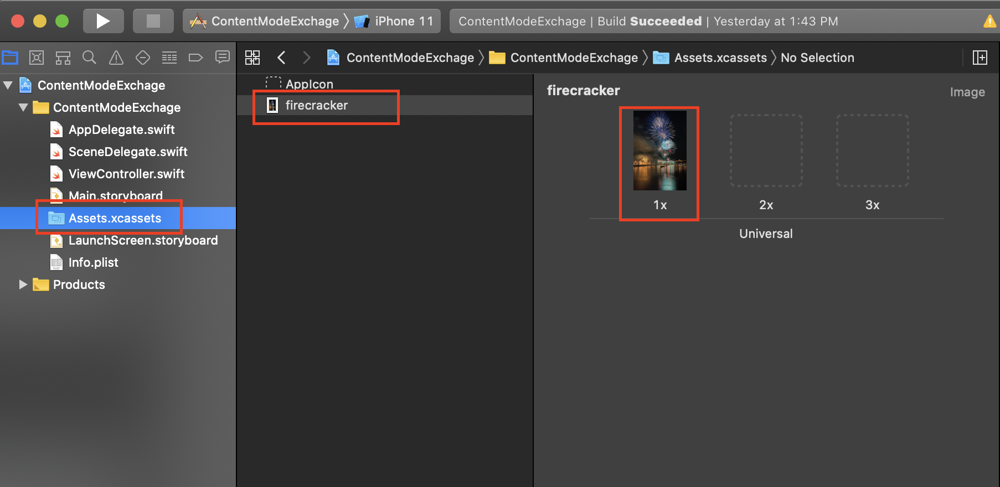


2. Storyboard 이동 후 ImageView 등록

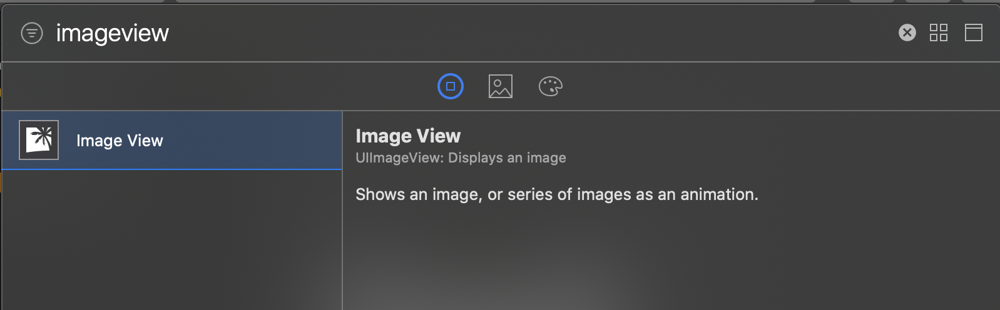


3. Image View 선택 후 왼쪽 속성 설정
   - image: image View를 통해 보여줄 이미지 선택
   - Content Mode : Image Veiw에 추가한 이미지를 정렬할 방법
   - BackGround : Image View의 배경 색 설정

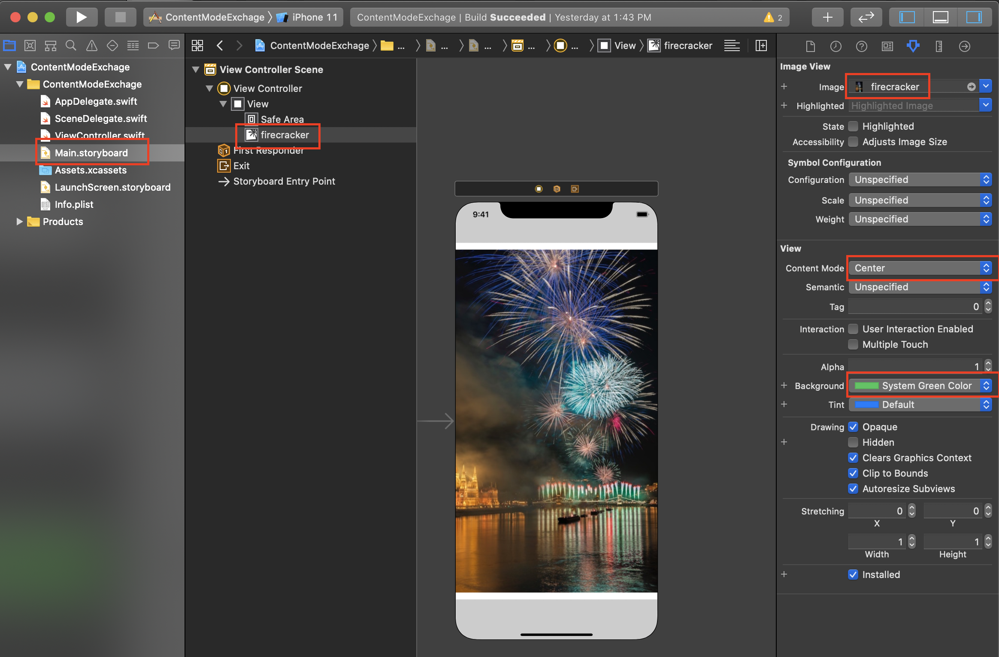


4. 이미지 랜더링 변경에 따라서 아이폰 화면내 이미지가 표시되는 크기가 달라짐

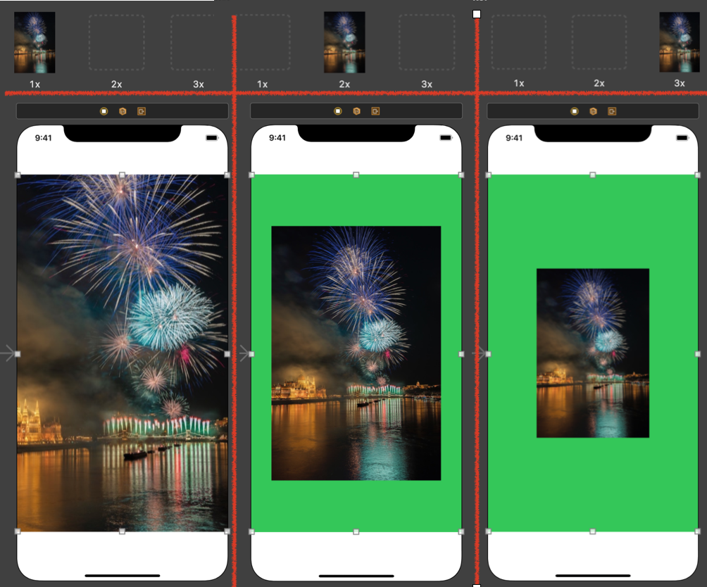


#### 아이폰 이미지 설정 옵션

##### Scale 옵션

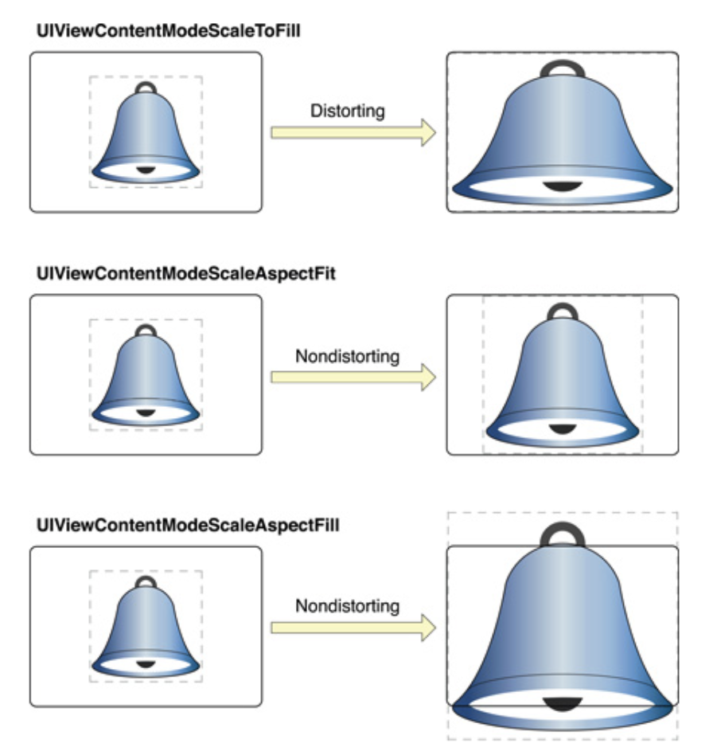

- ScaleToFill : Image View 크기에 꽉 찾도록 이미지 변경, 이미지 해상도 저하 문제 발생
- AspectFit : 이미지의 가로 높이 비율을 유지하면서 화면에 꽉 채움, 좌우 공백 문제 발생
- AspectFill : 이미지의 가로를 기준으로 화면에 꽉 채움, 이미지 뷰 범위 초과 문제 발생

##### Positioning

- 녹색 부분은 Image View이고, 옵션에 따라서 그림(별표시)의 위치가 변경된다

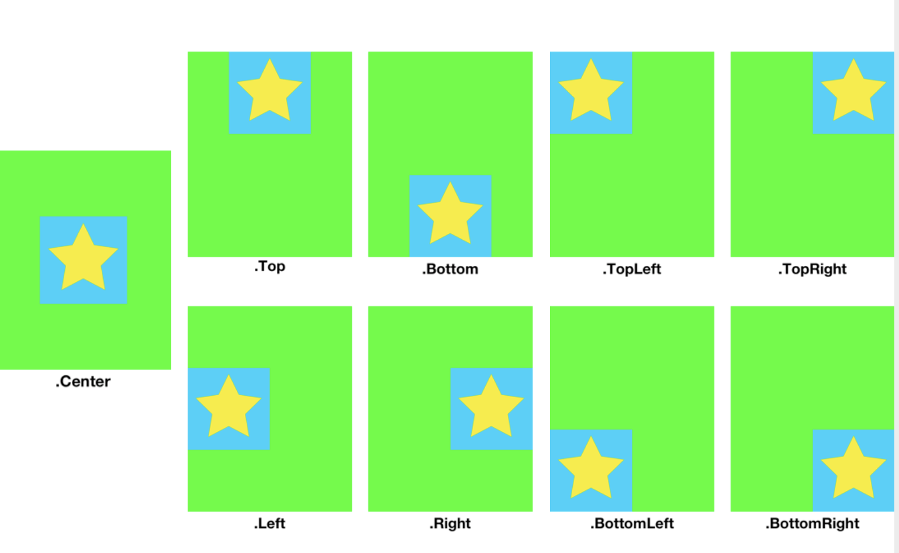


## Coordinate System Orientation

### View Frame

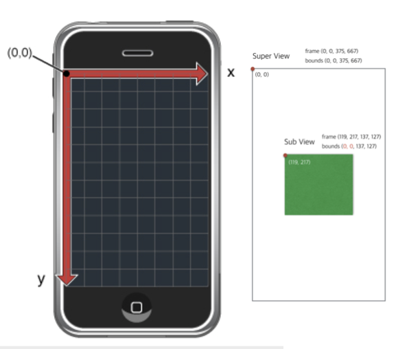

- 아이폰은 좌표 시스템으로 되어 있으며 왼쪽 최상단이 (0,0) 
- 가로 x 좌표, 세로 y좌표를 통해서 View 안에 객체들을 표시
- subView는 상위 View의 시작점을 기준으로 좌표가 재설정됨

### Frame & Bounds


- Frame으로 정의된 subView의 경우 이동시 상위 frame이동시 subView역시 같이 이동
- bounds으로 설정된 View의 경우 이동시  bounds 설정된 뷰의 기준이 이동하여 해당 뷰의 subView가 이동한 것처럼 보여짐

### Frame Bounds 예제

- 소스코드

```swift
//: A UIKit based Playground for presenting user interface
  
import UIKit
import PlaygroundSupport

class MyViewController : UIViewController {
    override func loadView() {
        let view = UIView()
        view.frame.size = CGSize(width: 375, height: 667)
        view.backgroundColor = .gray
        self.view = view
    }

    override func viewDidLoad() {
        super.viewDidLoad()
        let greenview = setupSuperView()
        let redview = setupSubView(superView: greenview)
        
        //자신을 그리는 위치를 x, y만큼 변경한다.
        //greenview.bounds.origin = CGPoint(x: 50, y: 50)

        print("---greenview---")
        print(greenview.frame)
        print(redview.bounds)
        print("---redview---")
        print(redview.frame)
        print(redview.bounds)
    }
    
    func setupSuperView() -> UIView {
        let greenview = UIView()
        greenview.backgroundColor = .green
        greenview.frame = CGRect(x: 50, y: 50, width: 200, height: 200)
        view.addSubview(greenview)
        return greenview
    }
    
    func setupSubView(superView: UIView) -> UIView {
        let redview = UIView()
        redview.backgroundColor = .red
        redview.frame = CGRect(x: 100, y: 100, width: 80, height: 80)
        superView.addSubview(redview)
        return redview
    }
    
}
// Present the view controller in the Live View window
PlaygroundPage.current.liveView = MyViewController()
```

- 왼쪽  Bounds 미적용, 오른쪽 Bounds 적용
- bounds 변경시 greeview를 현재 위치에서  x+50,y+50 위치에서 다시 그려짐
  - 실제로 오른쪽 아래로 이동한것은 greenView이지만, redView가 왼쪽 위로 올라간 것처럼 보여짐

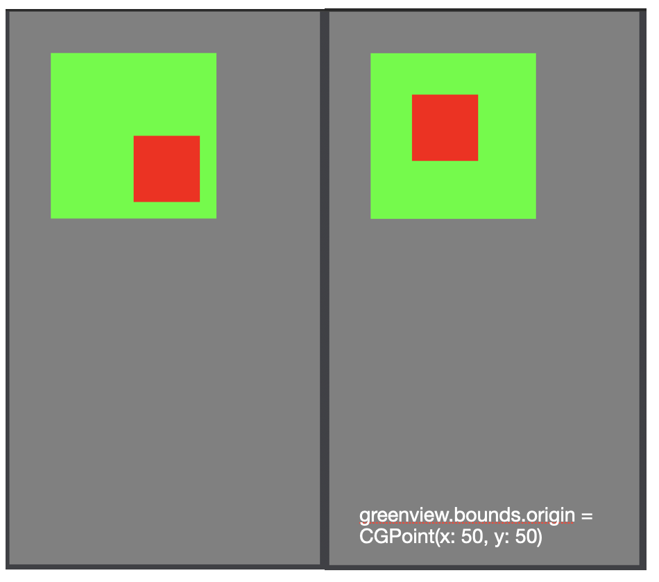


## Practice

- 아래 그림과 같이 ViewFrame 구현하기


- 소스코드 

```swift
//: A UIKit based Playground for presenting user interface
  
import UIKit
import PlaygroundSupport

class MyViewController : UIViewController {
    override func loadView() {
        // main view 생성
        let view = UIView()
        view.backgroundColor = .white
        //iPhone 8 size 375, 667
        view.frame.size = CGSize(width: 375, height: 667)
        self.view = view
    }
    
    override func viewDidLoad() {
        // subView 생성 함수
        let topViewRec = setupTopViewRec()
        let botViewRec = setupBottomViewRec()
        //main view에 하위 view 추가
        view.addSubview(topViewRec)
        view.addSubview(botViewRec)
    }
    //top 쪽 사각형 생성
    func setupTopViewRec() -> UIView {
        let topview = UIView()
        topview.frame = CGRect(x: 15, y: 15, width: 345, height: 100)
        topview.backgroundColor = .blue
        
        return topview
    }
    // Bottom 쪽 사각형 생성
    func setupBottomViewRec() -> UIView {
        let bottomView = UIView()
        bottomView.frame = CGRect(x: 15, y: 552, width: 345, height: 100)
        bottomView.backgroundColor = .blue
        return bottomView
    }
}
// Present the view controller in the Live View window
PlaygroundPage.current.liveView = MyViewController()
```

- 완성된 화면

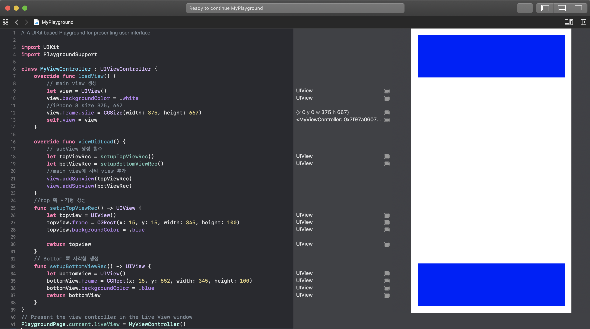


### Practice 2

- 문제 

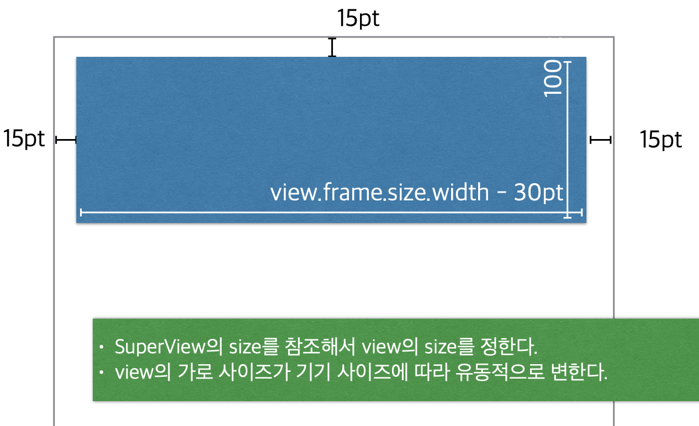

- 소스코드

```swift
//: A UIKit based Playground for presenting user interface
  
import UIKit
import PlaygroundSupport

class MyViewController : UIViewController {
    override func loadView() {
        // main view 생성
        let view = UIView()
        view.backgroundColor = .white
        //main Frame 크기를 아래와 같이 변경
        view.frame.size = CGSize(width: 350, height: 450)
        self.view = view
    }
    
    override func viewDidLoad() {
        // subView 생성 함수
        let topViewRec = setupTopViewRec()
        let botViewRec = setupBottomViewRec()
        //main view에 하위 view 추가
        view.addSubview(topViewRec)
        view.addSubview(botViewRec)
    }
    //top 쪽 사각형 생성
    func setupTopViewRec() -> UIView {
        let topview = UIView()
      	// view.frame.size.width를 통해 main frame에 크기를 받아 좌우 여백(30) 제외
        topview.frame = CGRect(x: 15, y: 15, width: view.frame.size.width-30, height: 100)
        topview.backgroundColor = .blue
        
        return topview
    }
    // Bottom 쪽 사각형 생성
    func setupBottomViewRec() -> UIView {
        let bottomView = UIView()
      // view.frame.size.width를 통해 main frame에 크기를 받아 좌우 여백(30) 제외
      // view.frame.size.height를 통해 main frame에 높이를 받아
      // 도형의 세로(100), 하위 여백(15) 총 115 제외
        bottomView.frame = CGRect(x: 15, y: view.frame.size.height-115, width: view.frame.size.width-30, height: 100)
        bottomView.backgroundColor = .blue
        return bottomView
    }
}
// Present the view controller in the Live View window

let vc = MyViewController()
//플레이 그라운드의 main Frame 크기를 아래와 같이 변경
vc.preferredContentSize = CGSize(width: 350, height: 450)
PlaygroundPage.current.liveView = vc

```


