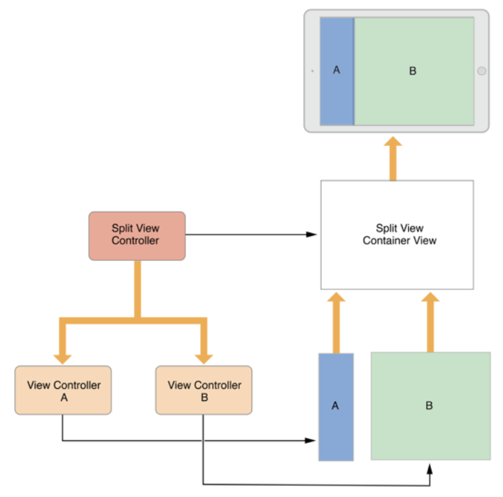
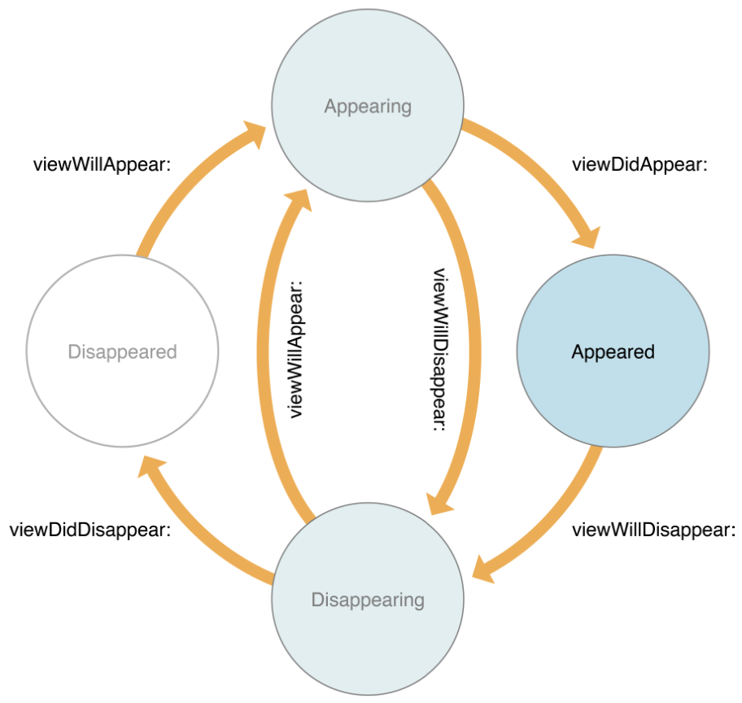
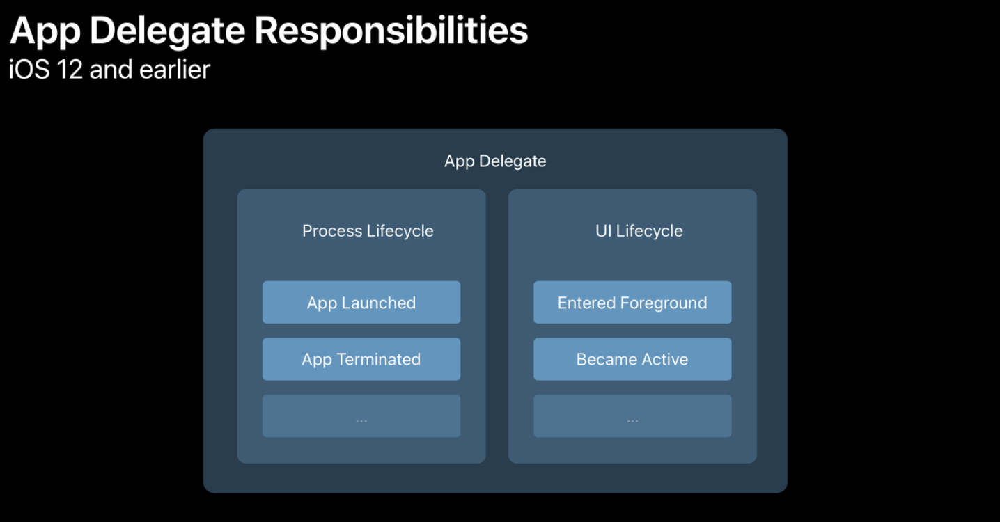
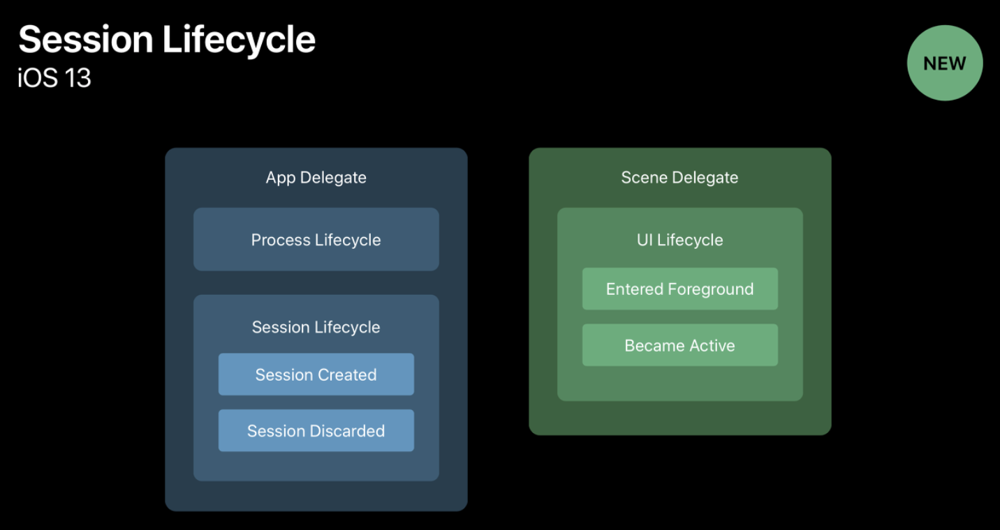
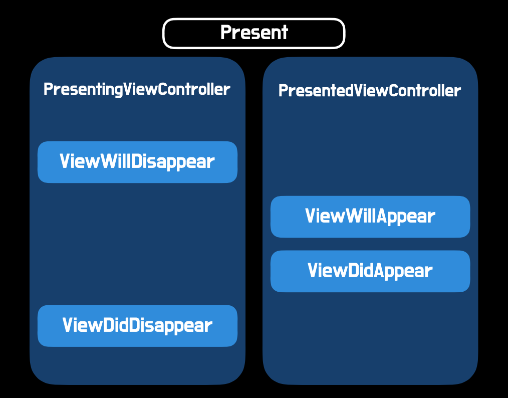
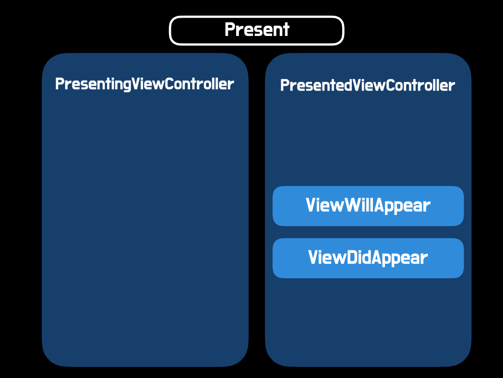
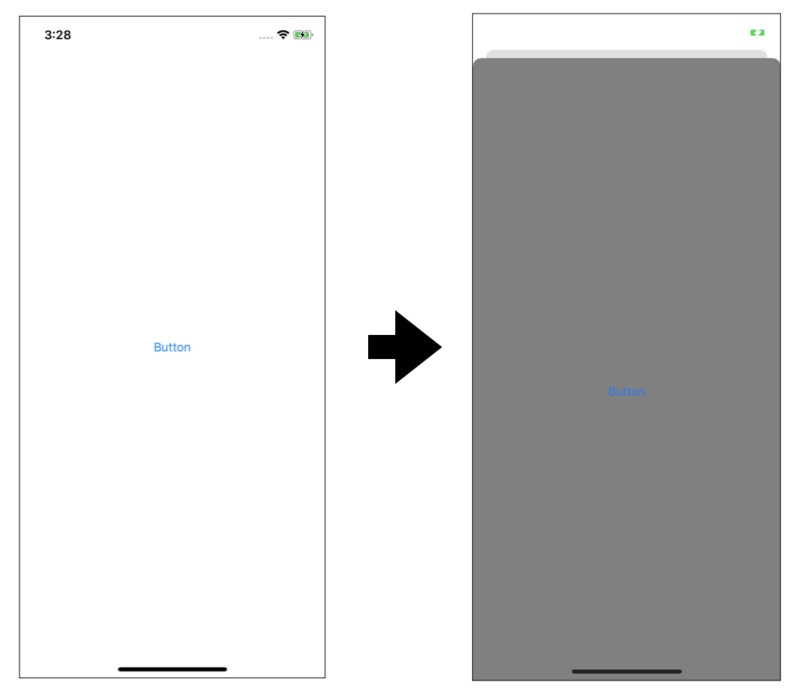
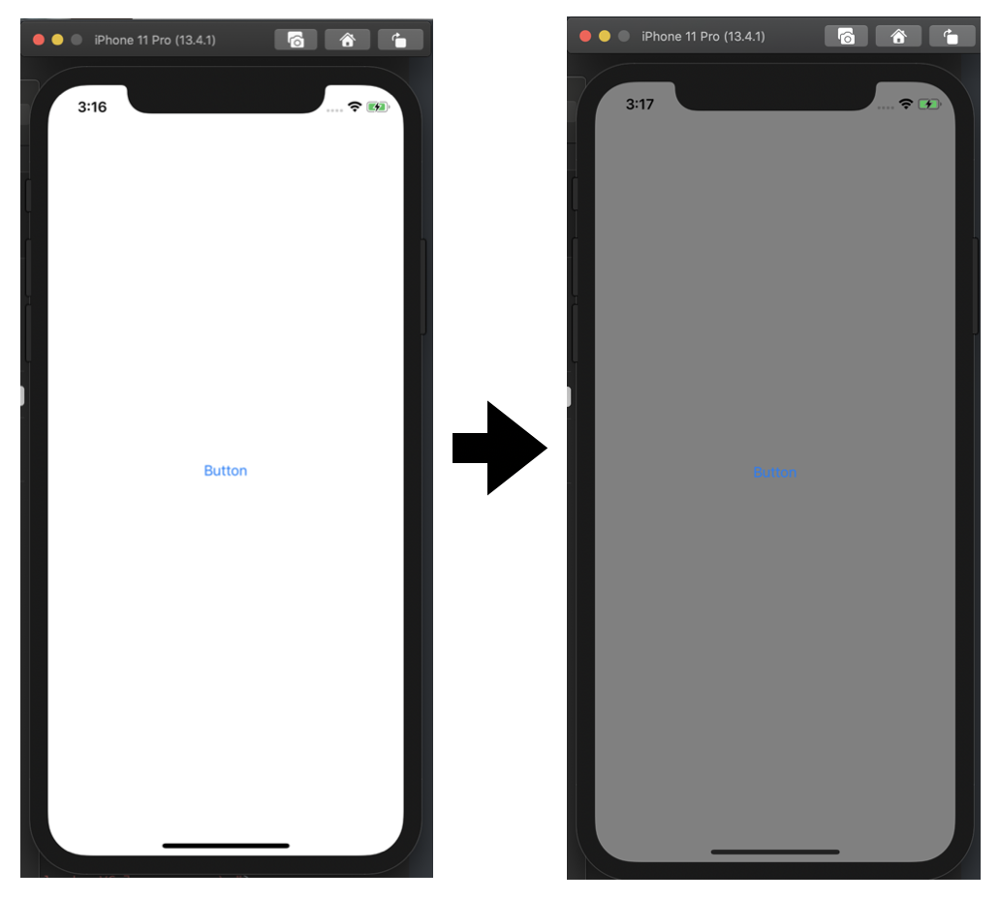

# UIViewController

## 주요 역할

### 역할

- 앱 구조의 뼈대, 모든 앱에 반드시 하나 이상, 대부분의 많은 수의 ViewController로 구성
-  View Management : 뷰 계층 관리, 모든 뷰 컨트롤러마다  RootView를 지나며, 화면에 표시하기 위해서는 해당 RootView 계층에 속해야 함
- Date Marchaling : 자신이 관리하는 View와  Data 간 중개 역할
- Resource Management 
  - 뷰 컨트롤러가 생성한 모든 뷰의 객체들은 뷰 컨트롤러의 책임
  - 뷰 컨트롤러의 생명 주기에 따라 생성되었다가 자동 소멸되기도 하지만 ARC 개념에 맞게 관리 필요
  - 메모리 부족 시 didReceiveMemoryWarning 메서드에서 꼭 유지하지 않아도 되는 자원들은 정리 필요
- Adaptivity : 현재 환경에 적절한 방법으로 화면이 적용되로록 할 책임을 가짐

### 종류

1. Content View controller
   - 모든 뷰를 단족으로 관리
   - UIViewController, UITableViewController, UICollectionViewController등
2. Container View Controller
   - 자체 뷰 + 하나 이상의 자식 뷰 컨트롤러가 가진 루트뷰 관리
   -  각 컨텐츠를 관리하는것이 아닌 루트뷰만 관리하며 컨테이너 디자인에 따라 크기 조정
   -  UINavigationController, UITabbarController, UIPageViewController 등

## The View Controller Hierarchy

- The root View Controller
  -  UIWindow -> View Controller -> view
    - UIWindow는 직접 뷰를 가질 수 없음
- ViewController Lify Cycle
  - UIWindow -> Container View Controller -> ViewController, ViewController
- Presented View Controllers
  - View Controller들 사이에서 화면을 이동하는 방법
  - UIWindow -> View Controller  -> View Controller  -> View Controller 



## ViewController Life Cycle




---

## [실습1]  iOS버전(12, 13)에 따른 ScenceDelegate, AppDelegate

- Why?
  - iOS 12 까지는 대부분의 앱이 하나의 Window 였지만, iOS 13부터는 Window의 개념이 scene으로 대체되고 아래의 사진처럼 하나의 앱에서 여러개의 scene을 가질 수 있게 됨.





[그림 출처](https://velog.io/@dev-lena/iOS-AppDelegate와-SceneDelegate)

### iOS13 이상일 경우 설정 방법

- SceneDelegate.swift 파일
  - IOS 13 이상, 스토리보드를 사용하지 않을때 사용하는 방식

```swift
import UIKit

class SceneDelegate: UIResponder, UIWindowSceneDelegate {
    var window: UIWindow?
    func scene(_ scene: UIScene, willConnectTo session: UISceneSession, options connectionOptions: UIScene.ConnectionOptions) {
        guard let windowScene = (scene as? UIWindowScene) else { return }
        
        // IOS 13 이상, 스토리보드를 안쓸떄 사용하는 방식
        
        window = UIWindow(windowScene: windowScene)
        window?.rootViewController = ViewController()
        window?.frame = UIScreen.main.bounds 
        // 지금 추가한 뷰가 현재 루트 프레임과 크기가 동일해짐
        //view를 추가하기 전에 미리 깔아놓은 View라고 이해하자
        window?.backgroundColor = .systemBackground 
        // light mode -> white , Dark mode -> black
        // system이 붙은 색은 모두 ios13이상에서만 사용가능
        // 주변환경에 따라서 색을 변경해줌
        window?.makeKeyAndVisible() // 윈도우가 여러개일떄 키 윈도우로 지정하고, 보여주도록
    }
}
```


### iOS 12 일 경우 설정 방법

- AppDelegate.swift (SceneDelegate.swift 삭제)

```swift
import UIKit

@UIApplicationMain
class AppDelegate: UIResponder, UIApplicationDelegate {

    var window: UIWindow?

    func application(_ application: UIApplication, didFinishLaunchingWithOptions launchOptions: [UIApplication.LaunchOptionsKey: Any]?) -> Bool {
        
        //스토리보드 + SceneDelegare 안 쓸 때
        window = UIWindow(frame: UIScreen.main.bounds) // 이 부분이 다름
        window?.rootViewController = ViewController()
        window?.backgroundColor = .red
        window?.makeKeyAndVisible()

        return true
    }
		// 하위 코드는 기본 
    // MARK: UISceneSession Lifecycle

    func application(_ application: UIApplication, configurationForConnecting connectingSceneSession: UISceneSession, options: UIScene.ConnectionOptions) -> UISceneConfiguration {
        // Called when a new scene session is being created.
        // Use this method to select a configuration to create the new scene with.
        return UISceneConfiguration(name: "Default Configuration", sessionRole: connectingSceneSession.role)
    }

    func application(_ application: UIApplication, didDiscardSceneSessions sceneSessions: Set<UISceneSession>) {
        // Called when the user discards a scene session.
        // If any sessions were discarded while the application was not running, this will be called shortly after application:didFinishLaunchingWithOptions.
        // Use this method to release any resources that were specific to the discarded scenes, as they will not return.
    }

```


## [실습2]  ViewController 내 추가 버튼을 통한 화면 이동하기

- ViewController 을 전환하면서 FullScreen, Sheet Style의 차이점을 확인
- ViewController를 전환하는 방법 확인

### 기본 코드

- ViewController 와 Nextview 화면을 두개 만들어 버튼을 추가한 뒤 버튼을 누르면 화면을 이동하는 코드

```swift
import UIKit

class ViewController: UIViewController {

    override func viewDidLoad() {
        super.viewDidLoad()
        // Do any additional setup after loading the view.
        view.backgroundColor = .white
        
        let button = UIButton(type: .system)
        button.setTitle("Button", for: .normal)
        button.sizeToFit()
        button.center = view.center
        button.addTarget(self, action: #selector(didTapButton(_:)), for: .touchUpInside)
        view.addSubview(button)
        
    }
		// ViewController -> NextViewController
    @objc func didTapButton(_ sender:Any) {
        let nextVC = NextViewController()
      	// 화면을 띄워줌
        present(nextVC, animated: true)
    }

}
```


```swift
import UIKit

class NextViewController: UIViewController {

    override func viewDidLoad() {
        super.viewDidLoad()
        view.backgroundColor = .gray
        let button = UIButton(type: .system)
          button.setTitle("Button", for: .normal)
          button.sizeToFit()
          button.center = view.center
          button.addTarget(self, action: #selector(didTapButton(_:)), for: .touchUpInside)
          view.addSubview(button)
    }
    // NextViewController -> ViewController
    @objc func didTapButton(_ sender:Any) {
        let nextVC = NextViewController()
      	// dissmiss를 통해 화면을 가림으로 기존 화면으로 넘어감
        dismiss(animated: true)
    }
}

```


## Full Screen , Sheet 방식의 화면 전환 진행 프로세스 차이점 

### Full Screen 화면 전환 방식



### Sheet Style 화면 전환 방식



### **[iOS13 스타일의 Sheet 예제]**

- #### SheetStyle Test

  - 새로운 화면이 추가될때 전체화면이 아닌 Sheet(card) 형태로 올라오는 방식




- #### ViewController 소스코드

```swift
import UIKit

class ViewController: UIViewController {

    override func viewDidLoad() {
        super.viewDidLoad()
        print("\n---------- [ view dId load - VC ] ----------\n")
        view.backgroundColor = .white
        
        let button = UIButton(type: .system)
        button.setTitle("Button", for: .normal)
        button.sizeToFit()
        button.center = view.center
        button.addTarget(self, action: #selector(didTapButton(_:)), for: .touchUpInside)
        view.addSubview(button)
        
    }
		//버튼 누를때 화면이 전환되도록 설정
    @objc func didTapButton(_ sender:Any) {
        let nextVC = NextViewController()
        nextVC.modalPresentationStyle = .automatic // .automatic iOS13 이상
        present(nextVC, animated: true)						// 화면을 띄어줌
    }
    
    override func viewWillAppear(_ animated: Bool) {
      super.viewWillAppear(animated)
      print("\n---------- [ viewWillAppear - ViewController ] ----------\n")
    }
    
    override func viewDidAppear(_ animated: Bool) {
      super.viewDidAppear(animated)
      print("\n---------- [ viewDidAppear - ViewController] ----------\n")
    }
    
    override func viewWillDisappear(_ animated: Bool) {
      super.viewWillDisappear(animated)
      print("\n---------- [ viewWillDisappear - ViewController] ----------\n")
    }
    
    override func viewDidDisappear(_ animated: Bool) {
      super.viewDidDisappear(animated)
      print("\n---------- [ viewDidDisappear - ViewController ] ----------\n")
    }
    
    deinit {
        print("Deinitialized - VC")
    }
}
```

- #### NextViewContoller 소스코드

```swift
import UIKit

class NextViewController: UIViewController {

    override func viewDidLoad() {
        super.viewDidLoad()
        view.backgroundColor = .gray
        let button = UIButton(type: .system)
          button.setTitle("Button", for: .normal)
          button.sizeToFit()
          button.center = view.center
          button.addTarget(self, action: #selector(didTapButton(_:)), for: .touchUpInside)
          view.addSubview(button)
    }
    //NextViewController의 화면상의 버튼 액션 연결
    @objc func didTapButton(_ sender:Any) {
        let nextVC = NextViewController()
        dismiss(animated: true)							//화면을 지워주는 함수 
    }

    override func viewWillAppear(_ animated: Bool) {
      super.viewWillAppear(animated)
      print("\n---------- [ viewWillAppear - next vc ] ----------\n")
    }
    
    override func viewDidAppear(_ animated: Bool) {
      super.viewDidAppear(animated)
      print("\n---------- [ viewDidAppear - next vc ] ----------\n")
    }
    
    override func viewWillDisappear(_ animated: Bool) {
      super.viewWillDisappear(animated)
      print("\n---------- [ viewWillDisappear - next vc ] ----------\n")
    }
    
    override func viewDidDisappear(_ animated: Bool) {
      super.viewDidDisappear(animated)
      print("\n---------- [ viewDidDisappear - next vc ] ----------\n")
    }
}

```


#### Sheet Style 결과 값

- ViewController 의 상태는 변하지 않고, NextViewController의 상태만 변경됨

```
---------- [ view dId load ] ----------
---------- [ viewWillAppear - next vc ] ----------
---------- [ viewDidAppear - next vc ] ----------
---------- [ viewWillDisappear - next vc ] ----------
---------- [ viewDidDisappear - next vc ] ----------
```


### **[Full Screen 방식의 App Life Cycle 테스트]**

- #### 테스트 화면

  - 버튼 누를 시 **전체 화면**으로 화면이 생성됨(회색)



- #### ViewController 소스코드 

```swift
import UIKit

class ViewController: UIViewController {

    override func viewDidLoad() {
        super.viewDidLoad()
        print("\n---------- [ view dId load - VC ] ----------\n")
        // Do any additional setup after loading the view.
        view.backgroundColor = .white
        
        let button = UIButton(type: .system)
        button.setTitle("Button", for: .normal)
        button.sizeToFit()
        button.center = view.center
        button.addTarget(self, action: #selector(didTapButton(_:)), for: .touchUpInside)
        view.addSubview(button)
        
    }

    @objc func didTapButton(_ sender:Any) {
        let nextVC = NextViewController()
        nextVC.modalPresentationStyle = .fullScreen //풀스크린방식으로 적용
        present(nextVC, animated: true)
    }
    
    override func viewWillAppear(_ animated: Bool) {
      super.viewWillAppear(animated)
      print("\n---------- [ viewWillAppear - ViewController ] ----------\n")
    }
    
    override func viewDidAppear(_ animated: Bool) {
      super.viewDidAppear(animated)
      print("\n---------- [ viewDidAppear - ViewController] ----------\n")
    }
    
    override func viewWillDisappear(_ animated: Bool) {
      super.viewWillDisappear(animated)
      print("\n---------- [ viewWillDisappear - ViewController] ----------\n")
    }
    
    override func viewDidDisappear(_ animated: Bool) {
      super.viewDidDisappear(animated)
      print("\n---------- [ viewDidDisappear - ViewController ] ----------\n")
    }

}
```

- #### NextViewController.swift

```swift
import UIKit

class NextViewController: UIViewController {
    
    //viewDidLoad()의 경우 최초에 실행될때 메모리에 저장됨, 단순히 화면이 가려질경우 재생성 안됨
    //willAppear, dismiss는 지속적으로 호출됨
    
    override func viewDidLoad() {
        super.viewDidLoad()
        print("\n---------- [ view dId load - next VC ] ----------\n")
        view.backgroundColor = .gray
        let button = UIButton(type: .system)
          button.setTitle("Button", for: .normal)
          button.sizeToFit()
          button.center = view.center
          button.addTarget(self, action: #selector(didTapButton(_:)), for: .touchUpInside)
          view.addSubview(button)
    }
    
    @objc func didTapButton(_ sender:Any) {
        let nextVC = NextViewController()
        dismiss(animated: true)
    }

    override func viewWillAppear(_ animated: Bool) {
      super.viewWillAppear(animated)
      print("\n---------- [ viewWillAppear - next vc ] ----------\n")
    }
    
    override func viewDidAppear(_ animated: Bool) {
      super.viewDidAppear(animated)
      print("\n---------- [ viewDidAppear - next vc ] ----------\n")
    }
    
    override func viewWillDisappear(_ animated: Bool) {
      super.viewWillDisappear(animated)
      print("\n---------- [ viewWillDisappear - next vc ] ----------\n")
    }
    
    override func viewDidDisappear(_ animated: Bool) {
      super.viewDidDisappear(animated)
      print("\n---------- [ viewDidDisappear - next vc ] ----------\n")
    }
}

```

- #### FullScreen 방식 실행 결과

  - ViewController 및 NextViewController 동시에 상태 변경

```
---------- [ view dId load - VC ] ----------
---------- [ viewWillAppear - ViewController ] ----------
---------- [ viewDidAppear - ViewController] ----------
---------- [ view dId load - next VC ] ----------
---------- [ viewWillDisappear - ViewController] ----------
---------- [ viewWillAppear - next vc ] ----------
---------- [ viewDidAppear - next vc ] ----------
---------- [ viewDidDisappear - ViewController ] ----------
Deinitialized - next VC
---------- [ viewWillDisappear - next vc ] ----------
---------- [ viewWillAppear - ViewController ] ----------
---------- [ viewDidAppear - ViewController] ----------
---------- [ viewDidDisappear - next vc ] ----------
Deinitialized - next VC
```


## 기타 관련 함수

```swift
// UIViewController 생성 관련 옵션
let nextVC = NextViewController()
nextVC.modalPresentationStyle = .automatic		// .automatic iOS 13 이상, .fullScreen 
nextVC.isModalInPresentation = true           // 아래로 내려서 없애는것 방치

// UIViewController를 화면에 띄워줌
func present(UIViewController, animated: Bool, completion: (() -> Void)?)

// 해당 화면을 가려줌 (메모리상에는 저장되어 있어서, present시 메모리에서 불러옴)
func dismiss(animated: Bool, completion: (() -> Void)?)

// 계층적 정보를 이용한 ViewController 선택
presentingViewController // 나를 띄운 VC
presentedViewController  // 내가 띄운 VC
presentingViewController?presentingViewController //중첩가능 부모의 부모 뷰

// 다른 UIViewContoller의 객체에 접근하기 위해서는 as형 변환을 통해서 UIViewController객체로 바꿔준 후 해당 화면내 객체에 접근가능 (해당 화면에서 접근하려는 객체는 프로퍼티로 변환해주어야 함)
if let vc = presentingViewController as? ViewController {
    vc.button.setTitle("click", for: .normal)
}
```

