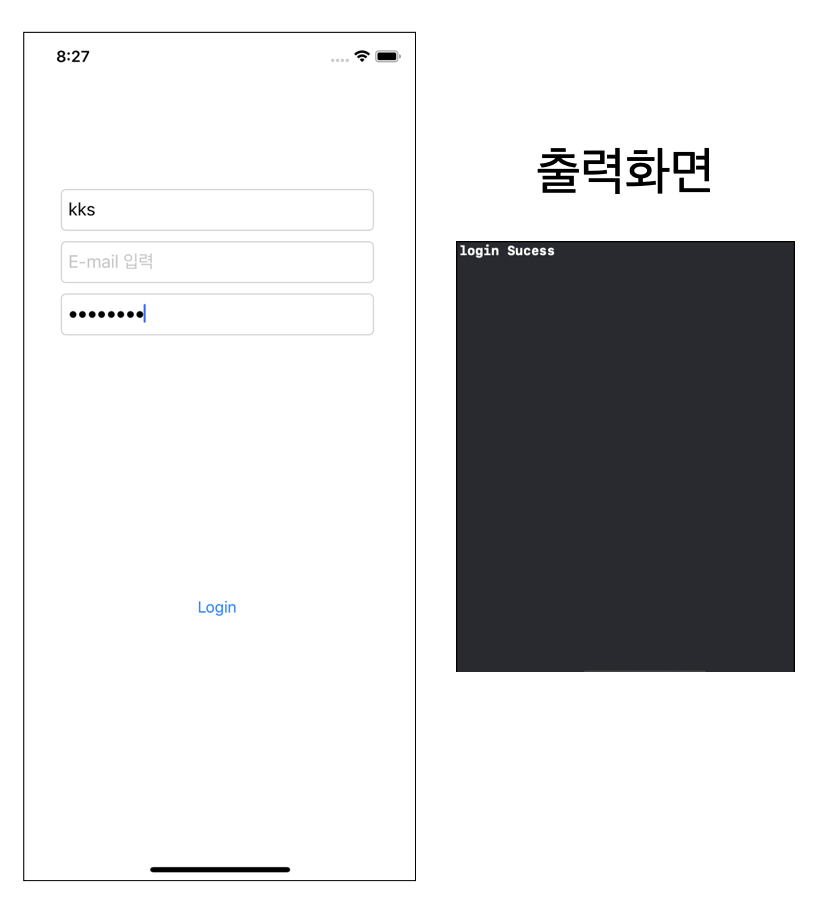
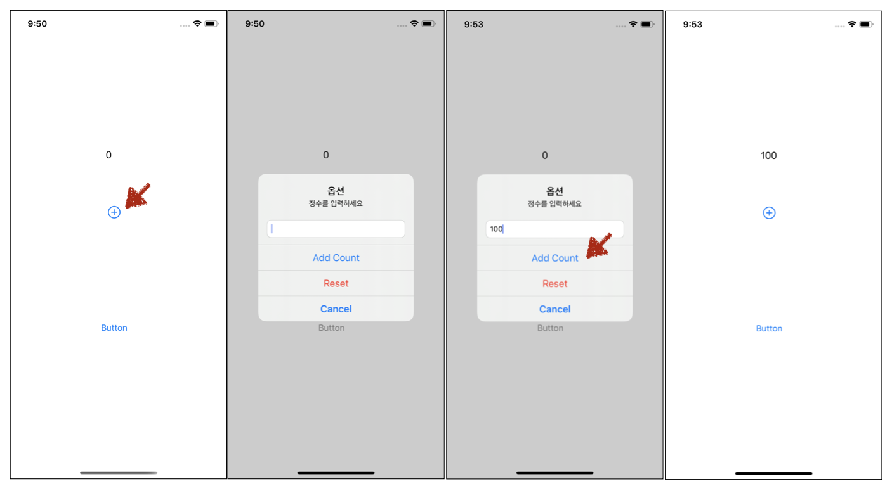
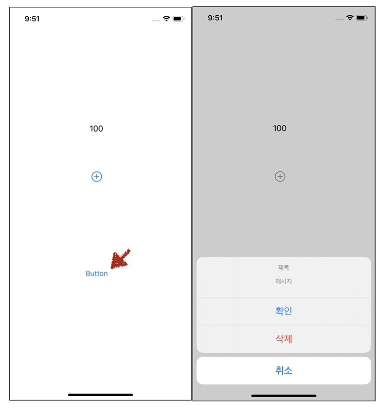

# UITextField, UIAlert

## [ UITextField ]

- **용도** 
  - 사용자로부터 텍스트를 입력받을때 사용하는 필드

### UITextField를 활용한 로그인 화면 제작

-  **UI** 완성 화면



- **소스코드**

```swift
import UIKit

class ViewController: UIViewController {

    let idTextField = UITextField()
    let passwordTextField = UITextField()
    // login 계정 | 테스트를 위한 임시 저장
    let myLoginID = "kks"
    let myPasswdString = "12345678"
    
    override func viewDidLoad() {
        super.viewDidLoad()
        // Do any additional setup after loading the view.
        
        
        idTextField.frame = CGRect(x: 35, y: 150, width: 300, height: 40)
        idTextField.placeholder = "ID 입력"
        idTextField.font = .preferredFont(forTextStyle: .body)
        idTextField.keyboardType = .URL
        idTextField.borderStyle = .roundedRect
        view.addSubview(idTextField)
        
        let emailTextField = UITextField()
        emailTextField.frame = CGRect(x: 35, y: 200, width: 300, height: 40)
        emailTextField.placeholder = "E-mail 입력"
        emailTextField.font = .preferredFont(forTextStyle: .body)
        emailTextField.keyboardType = .URL
        emailTextField.borderStyle = .roundedRect
        view.addSubview(emailTextField)
        
        
        passwordTextField.frame = CGRect(x: 35, y: 250, width: 300, height: 40)
        passwordTextField.placeholder = "Password 입력"
        passwordTextField.font = .preferredFont(forTextStyle: .subheadline)
        passwordTextField.keyboardType = .URL
        passwordTextField.borderStyle = .roundedRect
      	//패스워드 입력 시 *** 표기로 변경
        passwordTextField.isSecureTextEntry = true
        view.addSubview(passwordTextField)
        
        let loginButton = UIButton(type: .system)
        loginButton.setTitle("Login", for: .normal)
        loginButton.sizeToFit()
        loginButton.frame = CGRect(x: 135, y: 500, width: 100, height: 100)
        loginButton.addTarget(self, action: #selector(tapLoginButton(_:)), for: .touchUpInside)
        view.addSubview(loginButton)
    }
    
    @objc func tapLoginButton(_ sender:Any) {
				// textfild에서 값 가져와서 비교
        if idTextField.text == myLoginID {
            if passwordTextField.text == myPasswdString {
                print("login Sucess")
            }
        }
    }
}
```


## [ UIAlert ] 

- 용도
  - alert, 팝업창을 통해 사용자로부터 입력을 받거나 취소등 다양한 기능 수행

### UITextField를 활용한 로그인 화면 제작

- **UI 기능 1번**
  1. 화면상에 "+"버튼을 통해 사용자로부터 정수값을 받음
  2. "Add Count" 기능을 통해 숫자를 추가할 경우
  3. 배경 화면의 textField에 숫자 표기



**UI 기능  2번**

1. 화면상에 "Button"버튼을 통해 화면 하단에서 팝업 발생



- **소스코드**

```swift
import UIKit

class ViewController: UIViewController, UIAlertViewDelegate {
 		// 전역 변수 설정
  	// numberValue 변경 시 didSet내 지정된 동작 수행
    var numberValue: Int = 0 {
        didSet {
            textLabel.text = String(numberValue)
        }
    }
    var textLabel = UILabel()
    
    override func viewDidLoad() {
        super.viewDidLoad()
        
      	//textLabel 관련 설정
        textLabel.frame = CGRect(x: 165, y: 200, width: 100, height: 100)
        textLabel.text = String(numberValue)
        view.addSubview(textLabel)
        
      	//사용자로부터 숫자를 입력받아 textLabel에 해당 숫자로 변경하는 버튼
        let addbButton = UIButton(type: .contactAdd)
        addbButton.frame = CGRect(x: 130, y: 300, width: 100, height: 100)
        addbButton.addTarget(self, action: #selector(showAlertAddMebu(_:)), for: .touchUpInside)
        view.addSubview(addbButton)
        
        // alertButton 생성 - alert 테스트 용도
        let alertButton = UIButton(type: .system)
        alertButton.setTitle("Button", for: .normal)
        alertButton.sizeToFit()
        alertButton.frame = CGRect(x: 130, y: 500, width: 100, height: 100)
                view.addSubview(tableView)
        view.addSubview(alertButton)
        
    }
    
    //사용자로부터 숫자를 입력받아 textLabel에 해당 숫자로 변경하는 버튼 누를 때 액션 정의
    @objc func showAlertAddMebu(_ sender:Any) {
      	// preferredStyle .alert -> 화면 중앙 상의 팝업형태로 나옴
        let addAlertMenu = UIAlertController(title: "옵션", message: "정수를 입력하세요", preferredStyle: .alert)
        //숫자를 입력받기 위한 textField 추가
        addAlertMenu.addTextField()
        // alert 창의 "Add Count" 메뉴 누를 시 
        let addAction = UIAlertAction(title: "Add Count", style: .default) { _ in
            if let text = Int((addAlertMenu.textFields?.first?.text)!) {
                self.numberValue += text
            }
            
        }
        // alert 창의 "Reset" 메뉴 누를 시 
        let resetACtion = UIAlertAction(title: "Reset", style: .destructive) { _ in                                                               
 						// 화면에 숫자 텍스트 라벨 값 초기화                                                                            
            self.numberValue = 0
        }
        // alert 창의 "Cancle" 메뉴 누를 시
        let cancelAction = UIAlertAction(title: "Cancel", style: .cancel) { _ in
            
        }
        
      	//각 메뉴 alert창에 추가
        addAlertMenu.addAction(addAction)
        addAlertMenu.addAction(resetACtion)
        addAlertMenu.addAction(cancelAction)
        // 화면에 띄우기
        present(addAlertMenu, animated: true)
    }

  	// 
    @objc func showAlert(_ sender:Any) {
      	// .actionSheet 를 통해 하단에서 올라오는 형태로 생성
        let alertController = UIAlertController(
            title: "제목",
            message: "메시지",
            preferredStyle: .actionSheet)
        
        let okAction = UIAlertAction(title: "확인", style: .default) { _ in
            print("확인")
        }
        
        let deleteAction = UIAlertAction(title: "삭제", style: .destructive) { _ in
            print("삭제")
        }
        
        let cancelAction = UIAlertAction(title: "취소", style: .cancel) { _ in
            print("취소")
        }
        
        alertController.addAction(okAction)
        alertController.addAction(cancelAction)
        alertController.addAction(deleteAction)
        
        present(alertController, animated: true)
    }
}


```


