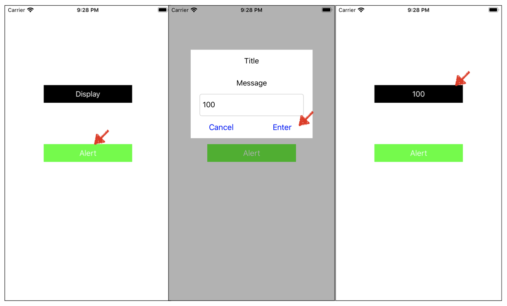
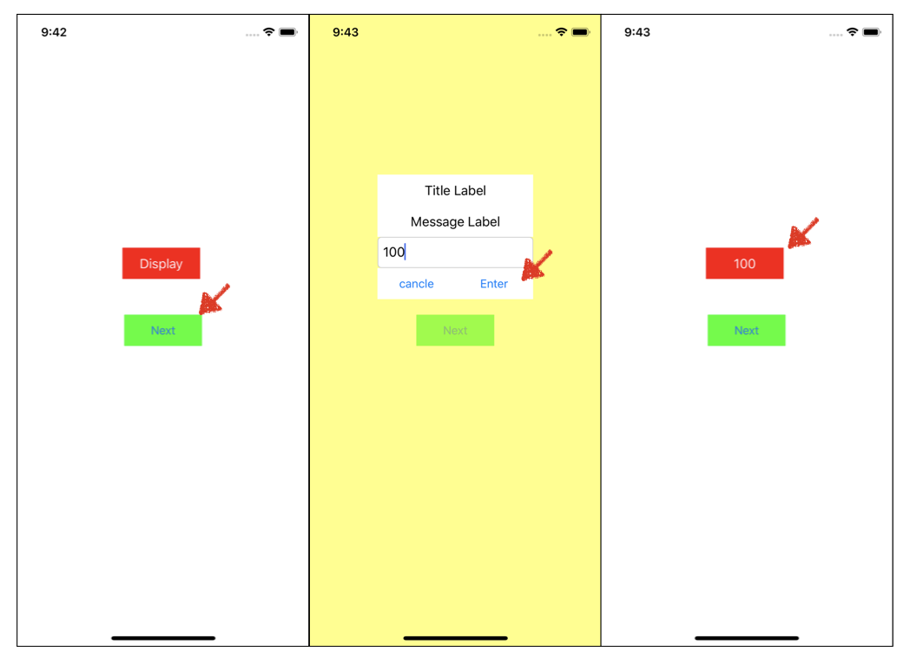

# UIAlert 심화 with UIView

## 강의 내용

### 앱 구현 내용

1. 동작 방식

   - alert 버튼과 display 라벨 추가
   - alert버튼 누를 시 새로운 팝업과 동시에 사용자로부터 텍스트를 입력받음
   - enter누를 시 100d이 초기 화면에 표기됨

2. 제약 사항

   - 단, UIAlertController를 쓰지 않고 구현하기
   - [힌트] alert버튼을 눌렀을 때 새로운 view 가 나오도록 하고 반투명하게 하는 옵션

   ```swift
   view.backgroundColor = UIColor.yellow.withAlphaComponent(0.5)
   ```

3. 구현 예시 화면




## 나의 구현 내용 

- 앱 동작 화면 
  - 전체 뷰에 버튼.라벨,텍스트필드를 직접 절대 값으로 잡아줌




- **소스코드**
  - ViewController.swift / 메인 화면

```swift
import UIKit

class ViewController: UIViewController {
		// 전역 변수 설정
    let textLable = UILabel()
    // 값이 변경되면 라벨을 자동을 바꿔주도록 설정
    var inputString:String = "" {
        didSet {
            textLable.text = inputString
        }
    }
    
    override func viewDidLoad() {
        super.viewDidLoad()
        view.backgroundColor = .white
        //nextButton 생성
        let nextButton = UIButton(type: .system)
        nextButton.frame = CGRect(x: 120 , y: 300, width: 100, height: 40)
        nextButton.center = view.center
        nextButton.backgroundColor = .green
        nextButton.setTitle("Next", for: .normal)
      	//Button과 Action 연결
        nextButton.addTarget(self, action: #selector(nextButtonAction), for: .touchUpInside)
        view.addSubview(nextButton)
        
        //textLabel 생성
        textLable.frame = CGRect(x: 135, y: 300, width: 100, height: 40)
        textLable.backgroundColor = .red
        textLable.textColor = .white
        textLable.textAlignment = .center	// 라벨 내 글자 정렬방식
        textLable.text = "Display"
        view.addSubview(textLable)
        
    }

    @objc private func nextButtonAction(_ sender:Any) {
        let vc = AlertViewController()
      	//버튼 클릭 시 AlertViewController로 이동 
        vc.modalPresentationStyle = .overFullScreen
        present(vc, animated: true)
    }
}
```


 - AlertViewController.swift / 버튼 누를 시 뜨는 창
   	- 버튼 각각 절대값 지정해줌


## 개선 사항 - view안에 작은 뷰를 통해 버튼,라벨,필드 추가

- 위와 같이 view에 개별 추가하게되면 추후 UI변경이나 기능추가로 인해 발생하는 수정사항을 일일이 수정해줘야 한다.
- 하지만 작은 view을 추가생성 하고, 신규 View에 추가할 경우 신규로 추가한 view만 수정해주면 됩

### 수정된 구현 내용

- 개선 내용
  1.  baseUI() 함수를 통해 일부 화면 구성 기능을 이동
  2. 화면 관련 숫자 사전 정의
  3. 신규 화면 생성
  4. 각 버튼 라벨 별 신규 view 추가에 따른 위치 지정 방식 변경
  5. 버튼 타겟을 통일시킨 후 Switch 함수를 통해 이벤트를 발생시키는 sender를 구별하여 처리하는 방법을 별도 생성
- 소스코드 : AlertViewController.swift 

```swift
import UIKit

class AlertViewController: UIViewController {
    
    let textField = UITextField()
   
    private let enterButton = UIButton()
    private let cancelButton = UIButton()
    
    override func viewDidLoad() {
        super.viewDidLoad()
          baseUI()
        }
    // 1. baseUI() 함수를 통해 일부 화면 구성 기능을 이동    
    private func baseUI() {
        view.backgroundColor = UIColor.yellow.withAlphaComponent(0.5)
        // 2. 화면 관련 숫자 사전 정의
        let padding:CGFloat = 50
        let baseWidth:CGFloat = view.frame.width - padding*2
        let baseheight:CGFloat = 40
        
        //3. 신규 화면 생성
        private let myAlertVeiw = UIView()
        myAlertVeiw.frame = CGRect(x: padding, y: 200, width: baseWidth , height: baseheight)
        myAlertVeiw.backgroundColor = .white
        view.addSubview(myAlertVeiw)

        let myAlertViewWidth:CGFloat = myAlertVeiw.frame.width
        // 4. 각 버튼 라벨 별 신규 view 추가에 따른 위치 지정 방식 변경
        let titleLabel = UILabel()
        titleLabel.frame = CGRect(x: 0, y: 0, width: baseWidth, height: baseheight)
        titleLabel.text = "Title Label"
        titleLabel.textAlignment = .center
        titleLabel.backgroundColor = .white
        myAlertVeiw.addSubview(titleLabel)
        
        let messageLabel = UILabel()
        messageLabel.frame = CGRect(x: 0, y: baseheight, width: baseWidth, height: baseheight)
        messageLabel.text = "Message Label"
        messageLabel.textAlignment = .center
        messageLabel.backgroundColor = .white
        myAlertVeiw.addSubview(messageLabel)

        
        textField.frame = CGRect(x: 0, y: baseheight*2, width: baseWidth, height: baseheight)
        textField.placeholder = "Input Text"
        textField.becomeFirstResponder() // 해당 뷰가 팝업될때 커서가 자동으로 이동 (편의성 기능)
        textField.backgroundColor = .white
        textField.borderStyle = .roundedRect
        myAlertVeiw.addSubview(textField)
        
        cancelButton.setTitle("cancel", for: .normal)
        cancelButton.setTitleColor(.blue, for: .normal)
        cancelButton.sizeToFit()
        cancelButton.frame = CGRect(x: 0, y: baseheight*3, width: baseWidth/2, height: baseheight)
        cancelButton.addTarget(self, action: #selector(buttonAction(_:)), for: .touchUpInside)
        cancelButton.backgroundColor = .white
        myAlertVeiw.addSubview(cancelButton)
        
        
        enterButton.setTitle("Enter", for: .normal)
        enterButton.setTitleColor(.blue, for: .normal)
        enterButton.sizeToFit()
        enterButton.frame = CGRect(x: myAlertViewWidth/2, y: baseheight*3, width: baseWidth/2, height: baseheight)
        enterButton.addTarget(self, action: #selector(buttonAction(_:)), for: .touchUpInside)
        enterButton.backgroundColor = .white
        myAlertVeiw.addSubview(enterButton)

    }
  // 5. 버튼 타겟을 통일시킨 후 Switch 함수를 통해 이벤트를 발생시키는 sender를 구별하여 처리하는 방법을 별도 생성
  @objc private func buttonAction(_ sender: UIButton) {
      switch sender {
      case cancelButton:
        break
      default:
        // 가드문을 통해 사용자가 문자열 입력을 확인함, 오류일 경우 return
        guard let vc = presentingViewController as? ViewController else { return }
        vc.inputString = textField.text ?? ""
        
        break
      }
      // 현제 창 내리가 = 이전화면 돌아가기 
      dismiss(animated: false)
    }
}

```

