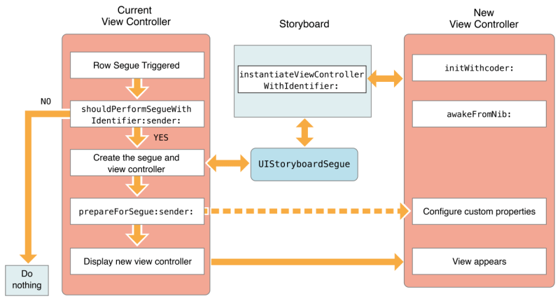
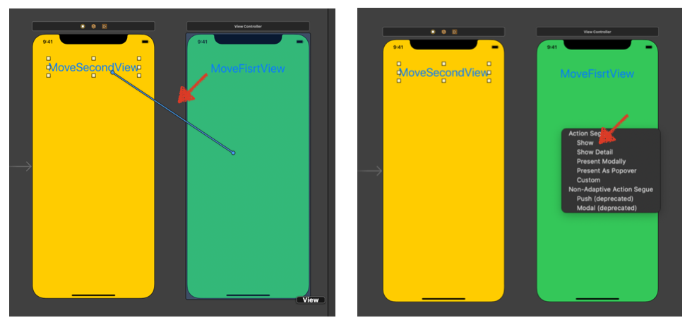
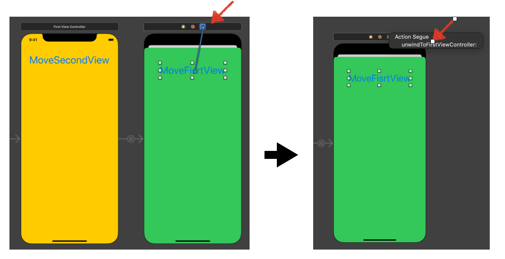
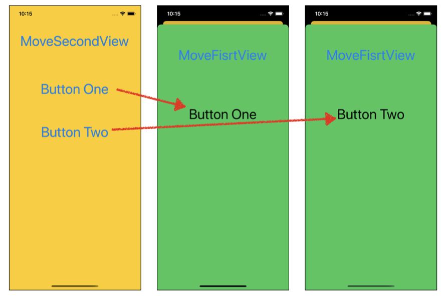
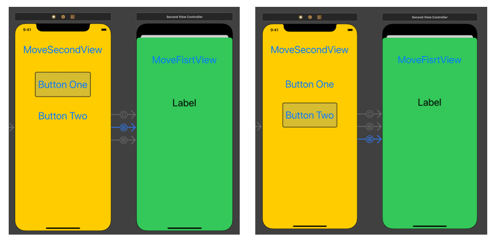
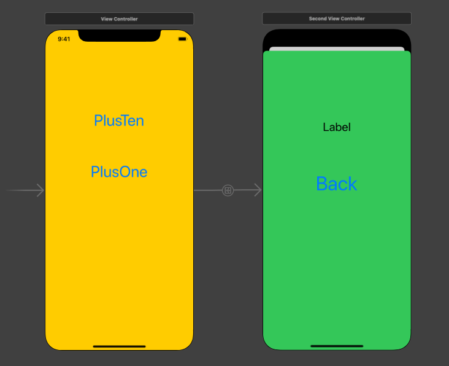
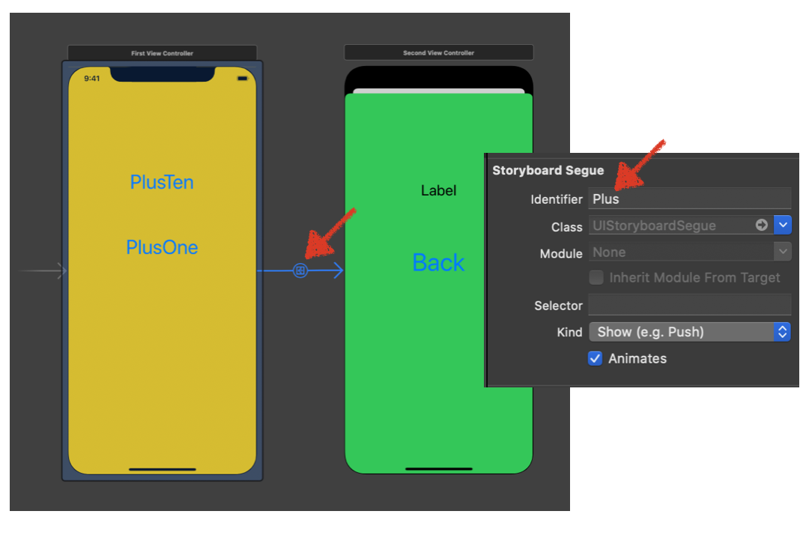

# StoryBoard with Segue

## Segue 개요

### UIStoryboardSegue

- 정의 
  - 두 뷰 컨트롤러 사이의 비주얼적인 전환 및 전환 준비를 하는 오브젝트이다.
- 기능
  - [`prepare(for:sender:)`](https://developer.apple.com/documentation/uikit/uiviewcontroller/1621490-prepare) 
    - segue발생이 탐지되면 스토리보드는 현재  view Controller의 prepare 함수를 호출하여 실행한다
  -  [`performSegue(withIdentifier:sender:)`](https://developer.apple.com/documentation/uikit/uiviewcontroller/1621413-performsegue) 
    - segue 오브젝트를 직접 만들수는 없다. 대신에 실행중인 스토리보드는 segue가 발생할때만 오브젝트를 생설할 수 있다. 사용자는 위의 메소드를 사용하여 원한다면 segue 오브젝트를 실행하여 원하는 viewController로 이동할 수 있다.
  - Segue 속성에 접근하는 방법
    - segue.source : 이동 전 View Controller
    - segue.destination : 이동할 대상 View Controller
    - segue.identifier : segue 오브젝트의 식별자 
  - [`func perform()`](https://developer.apple.com/documentation/uikit/uistoryboardsegue/1621912-perform)
    - Performs the visual transition for the segue.
- 종류
  - show : 가장 일반적인 세그웨이로 새 화면으로 이동함, stack구조로서 새 화면이 원래 화면 위를 덮는 구조
  - Show Detail : SplitView구조에서 원래 화면을 Master, 새 화면을 detail로 표시함
  - Present Modally : 새 화면이 모달처럼 원해 화면 위 전체를 뒤덮습니다. 원래 화면은 새 화면 뒤에 그대로 존재하게 됨
  - Propover Presentation : 아이패드에서 팝업창을 띄웁니다. 아이폰 앱에서는 큰 의미 없음
  - Custom :사용자 정의 세그웨이를 만듭니다.
- 상태 변화




## [ Segue 실습 ] 1. 버튼을 통한 뷰 이동

### 화면 구현

- Segue  등록 방법
  1. 버튼 생성 후 Ctrl 누른 상태로 드래그
  2. 옆에 있는 뷰로 드래그 후 



​		3.  FirstViewController.swift에 아래 함수 추가

```swift
@IBAction func unwindToFirstViewController(_ unwindSegue: UIStoryboardSegue) {

}
```

​		4. SecondView 내 MoveFirstView 버튼 상단으로 delegate추가



- segue 설정에 따라 화면 팝업 형태 변경
  - automatic
  - full Screen

### 소스코드

- ViewController.swift

```swift
import UIKit

class FirstViewController: UIViewController {

    override func viewDidLoad() {
        super.viewDidLoad()
        // Do any additional setup after loading the view.
    }
  	// 되돌아 오기 위한 함수 추가
    @IBAction func unwindToFirstViewController(_ unwindSegue: UIStoryboardSegue) {
    
    }
}
```


## [ Segue 실습 ] 2. 버튼을 통한 뷰 이동, 버튼의 텍스트 다음 뷰에 표시

### 화면 구성

- 버튼을 눌르면 다음 view 로 넘어가면서 새로운 뷰에 있는 라벨에 버튼 택스트 표시




### 소스코드

- Main.stroyboard
  - Button One, Button Two -> segue 등록



- ViewController.swift

```swift
import UIKit

class FirstViewController: UIViewController {
		// 버튼의 타이틀을 저장할 문자열
    var buttonString:String = ""
    
    override func viewDidLoad() {
        super.viewDidLoad()
    }
  	// 되돌아 오기 위한 함수 추가
    @IBAction func unwindToFirstViewController(_ unwindSegue: UIStoryboardSegue) {
    }
    // segue에 의해 뷰가 불러오기 전에 실행되는 함수
    override func prepare(for segue: UIStoryboardSegue, sender: Any?) {
      //secondViewContoller에 대한 라벨
        guard let secondVC = segue.destination as? SecondViewController else { return }
        secondVC.getFirstString = buttonString
    }
    
    @IBAction func TabButton(_ sender: UIButton) {
        //버튼으로부터 택스트 추출
        guard let sendString = sender.currentTitle else { return }
        buttonString = sendString
    }
}
```


- SecondViewController.swift

```swift
import UIKit

class SecondViewController: UIViewController {
		// 데이터를 표시할 라벨 설정
    @IBOutlet weak var stringLabel: UILabel!
		// viewController 에서 받아올 문자열을 저장할 변수
    var getFirstString:String = ""
    override func viewDidLoad() {
        super.viewDidLoad()
      	// 뷰 로드시 라벨 추가
        stringLabel.text = getFirstString
    }

}
```


## Master Segue 실습

- ViewController와 SecondViewController를 각각 등록
-  ViewController에서 "PlusTen" 버튼 클릭시 SecondViewController 내에 숫자 +10
-  ViewController에서 "PlusOne" 버튼 클릭시 SecondViewController 내에 숫자 +1
  - 단, 40이 넘으면 더이상 버튼이 눌리지 않도록 설정
- SecondViewController에서는 back 버튼으로 다시 돌아가도록 구현

### 구현 화면



### 소스코드

- StoryBoard
  - master segue identifier 설정 -> **Plus**
  - Master Segue의 경우 view 전체가 선택됨



- FirstViewController.swift

```swift
import UIKit

class FirstViewController: UIViewController {
  var number:Int = 0  // 숫자 계산을 위한 변수

  override func viewDidLoad() {
    super.viewDidLoad()
    // Do any additional setup after loading the view.
  }

	// 버튼이 눌려지면 아래 함수가 실행됨
  @IBAction func perforn(_ sender : UIButton) {
    // sender(button)의 현재 버튼 이름을 통해서 +1 or +10
    guard let title = sender.currentTitle else {return}
    if title == "PlusTen" { // +10
      number += 10
    } else if title == "PlusOne" { // +1
      number += 1
    } else {
      number += 0
    }
	 // PlusTen버튼을 눌렀을때 number값이 40이 넘으면 화면 전환 안됨 
    if number < 40 {
      // 화면 전환 실행  "Plus" Master segue를 통한 전환
      performSegue(withIdentifier: "Plus", sender: sender)
    }
  }
	//segue에 의해서 화면 전환이 일어나기전에 실행되는 함수
  override func prepare(for segue: UIStoryboardSegue, sender: Any?) {
    // segue의 destination정보르 받아와, 이동할 view Controller의 변수를 사용할수 있게됨
    guard let secondVC = segue.destination as? SecondViewController else { return }
		// 변수 전달
    secondVC.secondViewNumber = number
  }

  //unWind를 통해 SecondViewController에서 되돌아 올수 있도록 설정
  @IBAction func unWindToFirstViewController(_ unwindSegue: UIStoryboardSegue) {

  }
}
```

- SecondViewcontroller.swift

```swift
import UIKit

class SecondViewController: UIViewController {

    @IBOutlet weak var countLabel: UILabel! // 화면에 숫자를 표시하기 위한 라벨
    var secondViewNumber:Int = 0 // FirstViewController에서 받아온 umber를 받기 위한 변수
  
    override func viewDidLoad() {
        super.viewDidLoad()   
      	// 화면 로드시 해당 레이블에 숫자 표시
        countLabel.text = String(secondViewNumber)
    }
}

```

## Refernce

- Apple Doc
  - [UIStoryboardSegue](https://developer.apple.com/documentation/uikit/uistoryboardsegue)
- 블로그
  - http://blog.naver.com/jdub7138/220393890771