# Navigation Controller, TabBar Controller, UserDefauts


## Navigation Controller 

### 이론

- 뷰 컨트롤러의 컨테이너로써 스택기반의 스키마를 통해 계층적으로 뷰를 이동 시켜줌

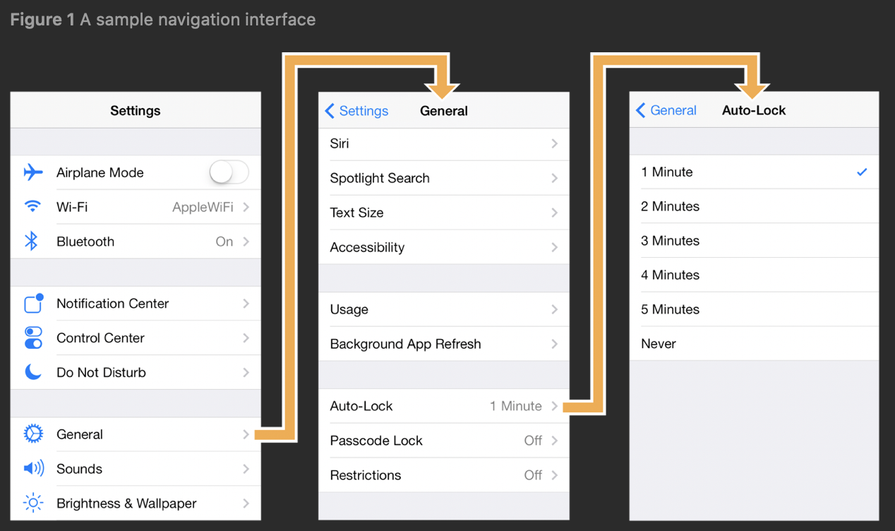

- 화전 전환 시 자동으로 상단에 navigationController( <Setting, <General ) 을 자동으로 추가해주고 이전화면으로 이동할수 있도록 해줌

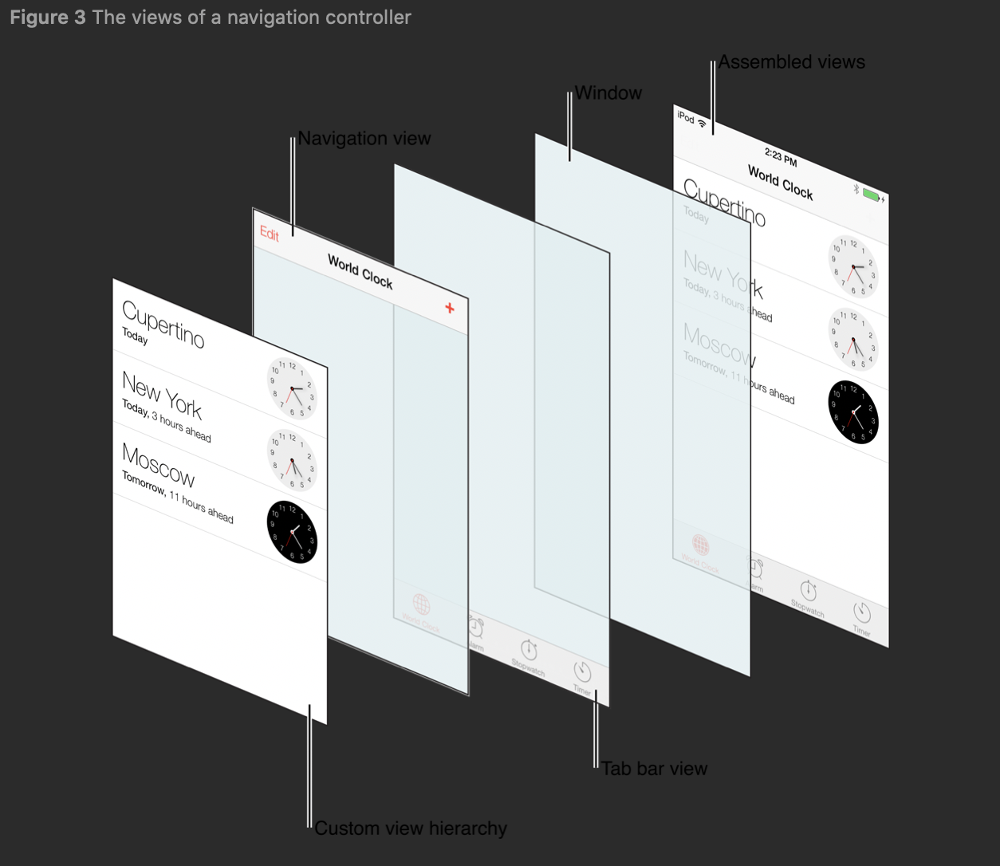


### StoryBoard 방식 구성

#### 구현 화면

- 화면 두개를 추가하고, NavigationController를 통해서 화면 사이를 이동하도록 구성


#### 화면 구현 방법

1. Nabigation Controller 생성
   1. ViewController 선택 후 하단의 Navigation Contoller선택
   2. 자동으로 Navigation Controller생성 후 기존 ViewController와 연결됨

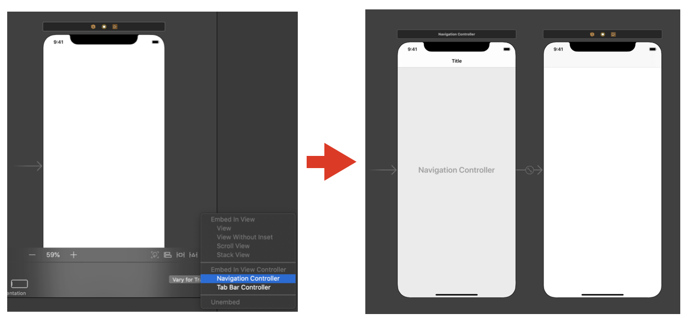

2. Navigation Controller기본 설정
   1. title설정
    2. Bar Button Item추가 후 next로 이름 변경
    3. 신규 View Controller추가

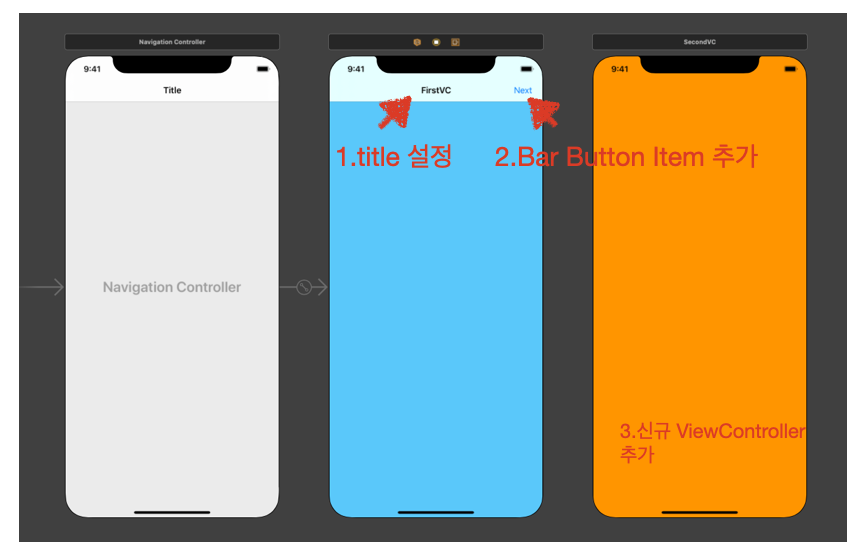

3. ViewController의 BarButtonItem을 통해 신규 View Controller로 이동
   1. 추가한 BarButtonItem을 다음 뷰 컨트롤러로 연결
   2. 연결시 `Show` 로 지정
      - show로 지정할 경우 navigation controller가 적용되어 있으면 자동으로 스택으로 들어가게되어 네비게이션 바가 자동으로 생성됨
      - present modal은 완전히 새로 띄우는 방식( show랑 다름 )

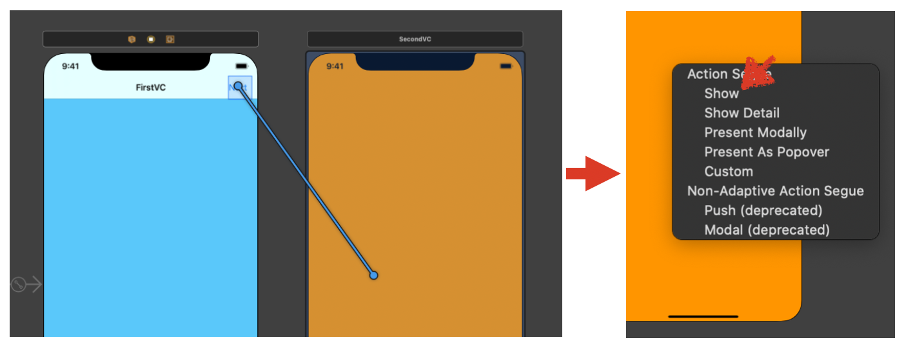

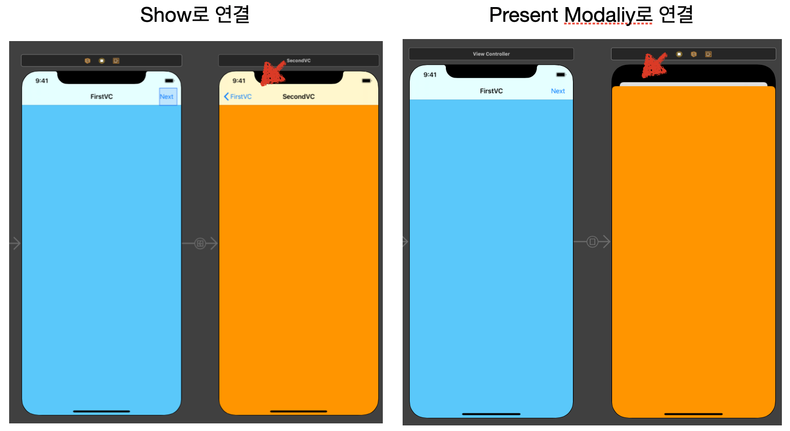

[그림] 연결 방식에 따른 차이점 


### Navigation Contoller 소스코드 구현 방식

#### 구현 화면

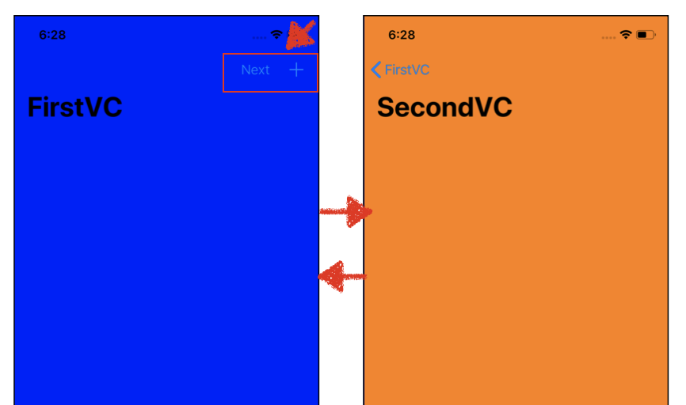


#### 소스코드

- viewController.swift

```swift
import UIKit

class ViewController: UIViewController {

  override func viewDidLoad() {
    super.viewDidLoad()
    view.backgroundColor = .blue
    // title 지정
    navigationItem.title = "FirstVC"
    // Large Title 옵션 적용
    navigationController?.navigationBar.prefersLargeTitles = true

    // BarButtonItem 설정
    let barButtonItem1 =  UIBarButtonItem(title: "Next", style: .plain, target: self, action: #selector(pushViewController(_:)))
    let barButtonItem2 =  UIBarButtonItem(barButtonSystemItem: .add, target: self, action: #selector(pushViewController(_:)))
		// BarButtonItem 적용 
    navigationItem.rightBarButtonItems = [barButtonItem2,barButtonItem1]
  }

  @objc private func pushViewController(_ sender: Any) {
    //불러올 ViewController변수 생성
    let secondVC = SecondViewController()
    navigationController?.pushViewController(secondVC, animated: true)
    // 다른 ViewController을 불러오는 방식
    //show(secondVC, sender: sender)
  }
}
```


- SecondViewController.swift

```swift
import UIKit

class SecondViewController: UIViewController {

    override func viewDidLoad() {
        super.viewDidLoad()
        navigationItem.title = "SecondVC"
        view.backgroundColor = .orange
    }
    
    override func viewDidAppear(_ animated: Bool) {
        super.viewDidAppear(animated)
        // popViewController 를 통한 이전 화면으로 자동이동
        navigationController?.popViewController(animated: true)
    }
}
```

**+소스코드** : [링크](https://github.com/tootoomaa/FastCampus_IOS_school/blob/master/TIL/SourceCode/200509_navigationController/)


## TabBarController

#### 이론

- 어떤 자식뷰를 보여줄것인지를 선택할 수 있는 radio-style 선택 인터페이스룰 제공하는 컨테이너 뷰 컨틀롤러
- 화면 하단에 위치하며 다른 View로 연결되어 있음

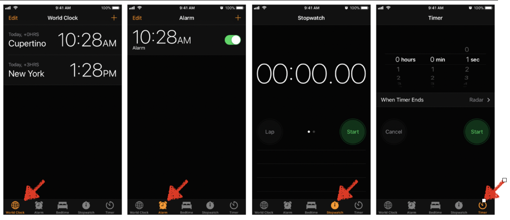


### StoryBoard를 이용한 화면 구현

#### 구현 화면

- 하단에 TabBarController를 추가하고 아래 컨트롤러에 따라서 화면이 변경됨

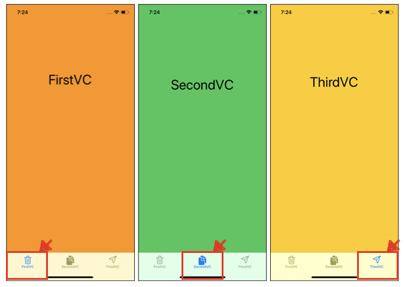


#### 구현 방법

1. Tab Bar Controller 추가

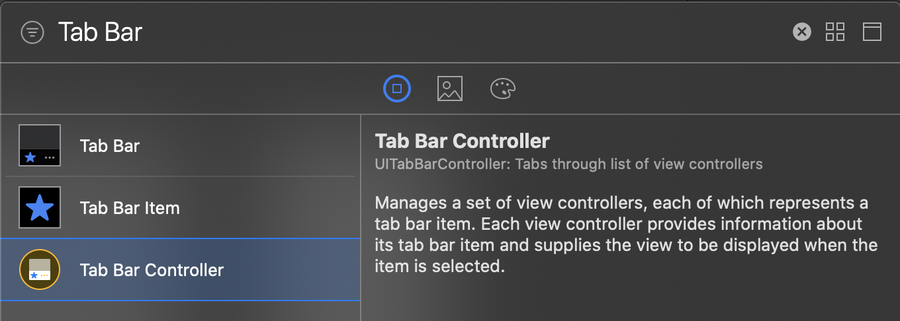

2. Tab Bar Controller 추가 확인

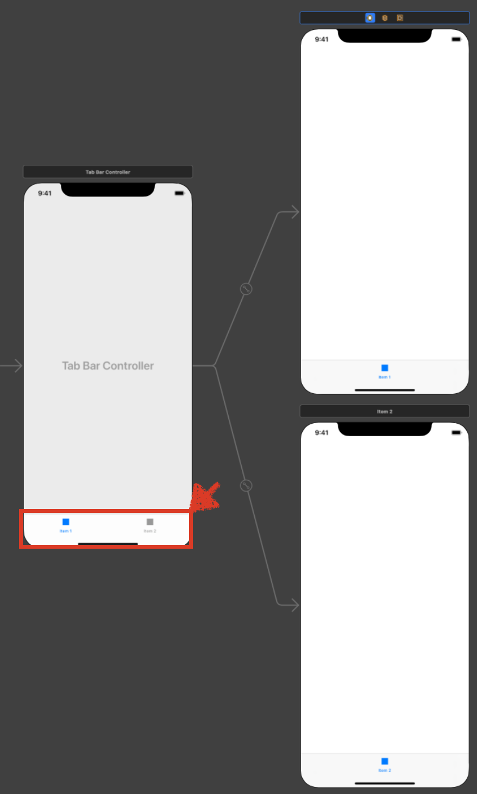

3. 화면 추가 하기
   1. 4번째 View Controller추가
   2. TabBarController -> View Controller 연결
   3. ViewController 추가


4. 화면 별 타이틀 및 이미지 설정

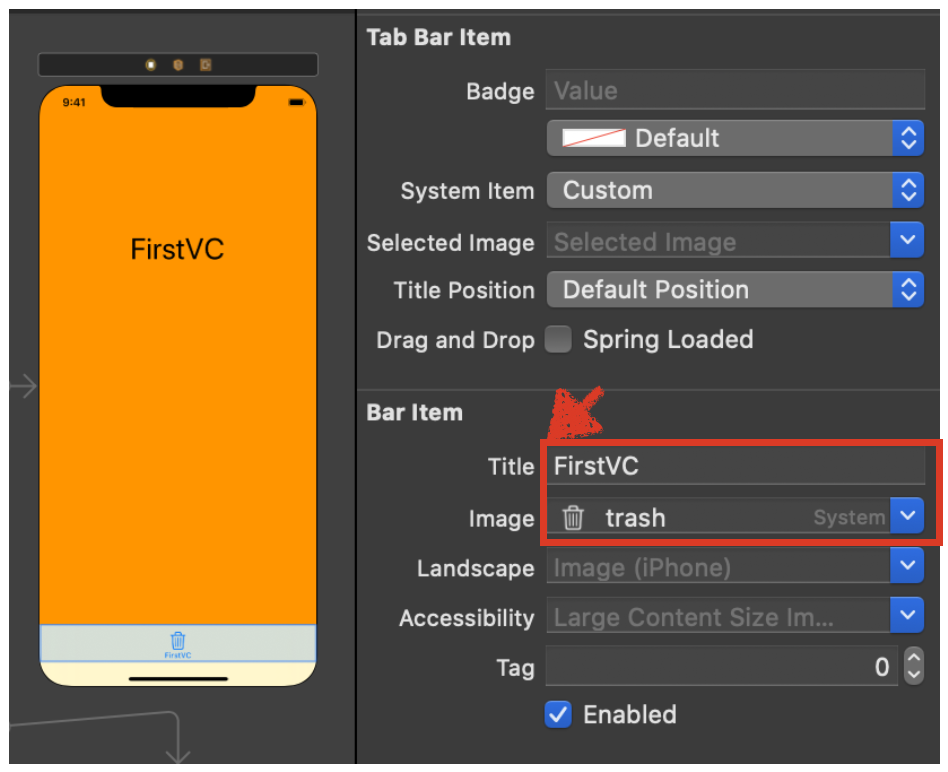

5. 실행 후 확인

### 소스코드를 이용한 화면 구현

#### 구현 화면

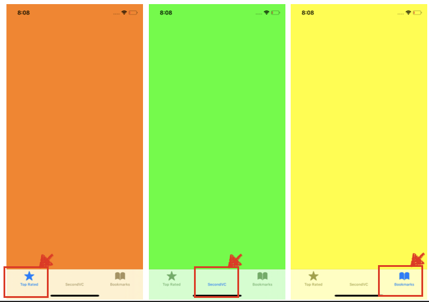

#### 소스코드

- SceneDelgate.swift

```swift
import UIKit

class SceneDelegate: UIResponder, UIWindowSceneDelegate {

  var window: UIWindow?

  func scene(_ scene: UIScene, willConnectTo session: UISceneSession, options connectionOptions: UIScene.ConnectionOptions) {
		// tabBarViewController에 연결할 뷰 정의
    let firstVC = FirstViewController()
    let secondVC = SecondViewController()
    let thirdVC = ThirdViewController()
		// tabBarViewController 생성
    let tabBarController = UITabBarController()
		// tabBarViewController에 해당 화면 추가
    tabBarController.viewControllers = [firstVC, secondVC, thirdVC]
		// 각 버튼 아이탬 생성
    firstVC.tabBarItem = UITabBarItem(tabBarSystemItem: .topRated, tag: 0)
    secondVC.tabBarItem = UITabBarItem(title: "SecondVC", image: UIImage(named: "bolt.circle") , tag: 1)
    thirdVC.tabBarItem = UITabBarItem(tabBarSystemItem: .bookmarks, tag: 2)

    window?.rootViewController = tabBarController
    window?.backgroundColor = .sytemBackground
    window?.makeKeyAndVisible()
  }
}
```

**+소스코드** : [링크](https://github.com/tootoomaa/FastCampus_IOS_school/blob/master/TIL/SourceCode/200508_TabBarController_new)

### UserDefaults

#### 사용 방법

- iOS에서 데이터를 파일에 저장하기 위해 사용하는 대표적인 클래스 중 하나
- 간단한 정보를 저장하고 불러올 때 사용하며 내부적으로 pList 파일로 저장

```swift
// 기본적인 저장 방법
UserDefaults.standard.set(10, forKey: "Ten")	
UserDefaults.standard.integer(forKey: "Ten")	// 10

//Double 타입 변수 저장
UserDefaults.standard.set(Double.pi, forKey: "Double Pi")
UserDefaults.standard.double(forKey: "Double Pi")

// Bool 타입 변수 저장
UserDefaults.standard.set(true, forKey: "True")
UserDefaults.standard.bool(forKey: "True")

// object로 가져올 때는 Any 타입이므로 타입 캐스팅 필요
// 오류 방지를 위한 타입 케스팅, as 사용
if let someType = UserDefaults.standard.object(forKey: "Date") as? Date {
  someType
}
```

#### 오류 처리

- 저장히자 않은 키를 통해 값을 불러올때 다음과 같이 오류 값이 발생됨

```swift
UserDefaults.standard.integer(forKey: "WrongKey") // 0
UserDefaults.standard.bool(forKey: "WrongKey")    // false
UserDefaults.standard.object(forKey: "WrongKey")  // nil
```

#### Key, value 출력 방볍

```swift
// Key 값만 출력
print(Array(UserDefaults.standard.dictionaryRepresentation().keys))

// value 값만 출력
print(Array(UserDefaults.standard.dictionaryRepresentation().values))
```


## Refrence

- Apple Doc
  - [UINavigationController](https://developer.apple.com/documentation/uikit/uinavigationcontroller)
  - [UITabBarController](https://developer.apple.com/documentation/uikit/uitabbarcontroller)

 