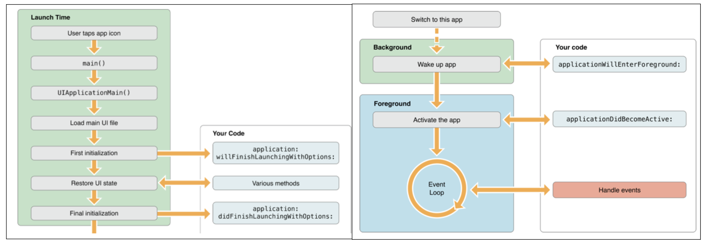
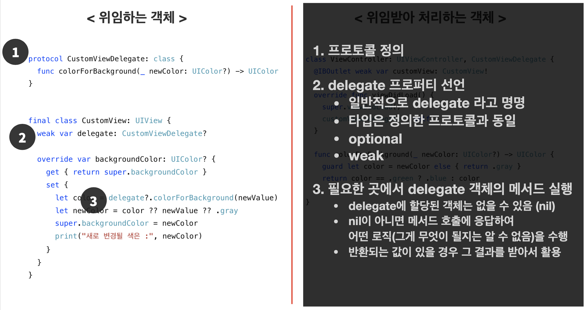
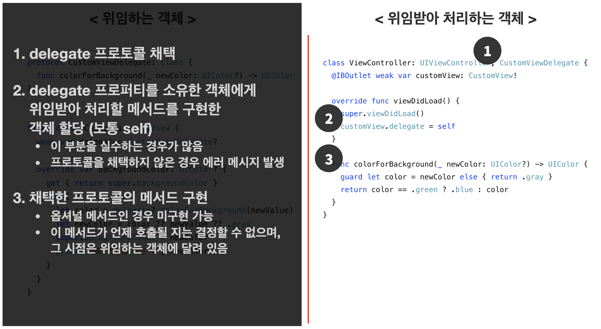
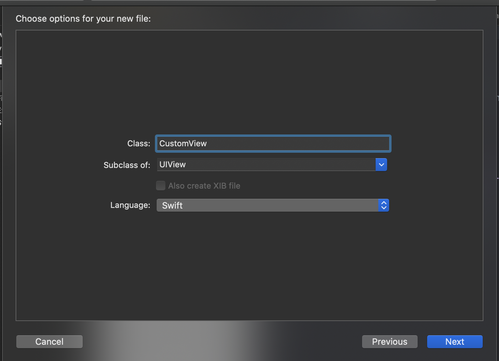
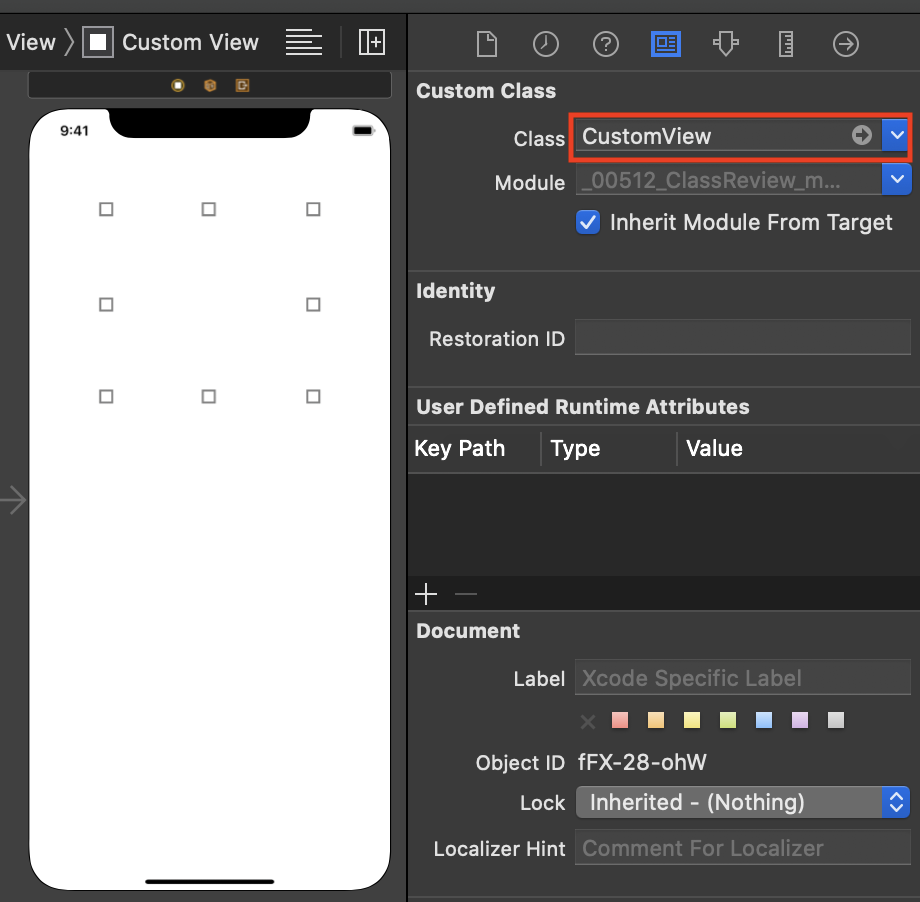
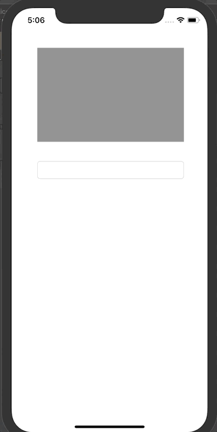
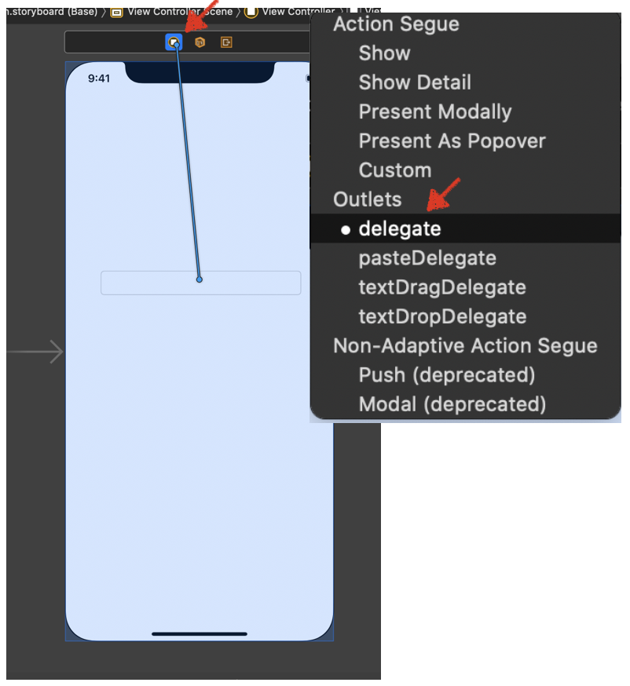

# AppDelegate 

## 기초 이론

### 정의 

- 특정 로직을 내가 아닌 다른 객체가 대신 구현하도록 위임하는 형태의 디자인 패턴
- 요청하는 객체와 요청에 응답할 객체로 나누어 작성
- 주로 다음와 같은 상황에 사용
  - 뷰가 밭은 이벤트나 상태를 뷰 컨트롤러에게 전달하여 처리 (View -> ViewController)
  - 뷰 구성에 필요한 정보를 뷰 컨트롤러가 결정 (View -> ViewController)
  - 주요 코드는 숨기고 특정 상황에 대해서만 커스터마이징 할 수 있도록 제공




### AppDelegate 실습 전 코드 리뷰





### AppDelegate 실습 1 - View를 추가한뒤 해당 view의 배경 색을 변경하고 변경되는 색을 알려주는 기능 추가

#### 구현 화면


#### 구현 코드

```swift
import UIKit

class ViewController: UIViewController {

  @IBOutlet weak var customView: CustomView!
  override func viewDidLoad() {
    super.viewDidLoad()

    setBackgroundColor()
  }
	// customView의 바탕색을 변경하는 함수 생성
  func setBackgroundColor() {
    let colors:[UIColor] = [.systemRed, .systemBlue, .systemGray, .systemPink]
    customView.backgroundColor = colors.randomElement()
    print(customView.backgroundColor)
  }
}
```

-> 위와 같이 작성할 경우 다른 ViewController에서도 동일한 기능이 필요한 경우 해당 함수를 다시 작성을 해줘야 하는 불편함이 있다

### AppDelegate 실습 2 - CustomView Class를 추가하여 해당 기능 구현

1. UIView의 서브클레스인 CustomView 추가



2. mainStoryBoard에 추가한 view를 CustomView 연결



3. 소스코드 수정

- ViewController.swift

```swift
import UIKit

class ViewController: UIViewController {

    @IBOutlet weak var customView: CustomView!
    override func viewDidLoad() {
        super.viewDidLoad()
        // 기존과 동일하게 customview의 배경색 변경
      	// veiw controller는 코드상 변경 없음
        customView.backgroundColor = .red
    }
}
```

	- CustomView.swift

```swift
import UIKit

class CustomView: UIView {
		// UIView 를 상속 받은 CustomView는 backgroundColor를 사용할 수 있음
  	// 이를 이용하여 내가 원하는 기능을 추가해줌
    override var backgroundColor: UIColor? {
        get { super.backgroundColor }
        set {
            super.backgroundColor = newValue
          	// 내가 추가로 원하는 기능, 변경되는 값 출력
            print("새로 변경될 색은 :", super.backgroundColor)
        }
    }
}
```

4. 실행 화면 및 출력 확인


### AppDelegate 실습 3. 아래 조건을 만족하는 기능 구현

- green -> blue, nil -> gray, 나머지 색상은 그대로 적용

```swift
import UIKit

class CustomView: UIView {

    override var backgroundColor: UIColor? {
        get { super.backgroundColor }
        set {
            guard newValue != nil else {
                super.backgroundColor = .gray
                return
            }
            if newValue == .green {
                super.backgroundColor = .blue
            } else {
                super.backgroundColor = newValue
            }
            print("새로 변경될 색은 :", super.backgroundColor!)
        }
    }
}
```


### AppDelegate 실습 4. 택스트를 입력받아 그 택스트에 맞는 색상으로 view 변경 with

#### 구현 화면



#### delegate 연결



#### 소스코드 

- customVeiw.swift

```swift
// 프로토콜 생성
protocol CustomViewDelegate: class {  // class 만 쓸수 있게 지정
    func colorForBackground(_ newColor: UIColor?) -> UIColor
}

class CustomView: UIView {
    weak var delegate: CustomViewDelegate?
    override var backgroundColor: UIColor? {
        get { super.backgroundColor }
        set {
            let color = delegate?.colorForBackground(newValue)
            let newColor = color ?? newValue ?? .gray
            super.backgroundColor = newColor
            print("새로 변경될 색은 :", newColor)
        }
    }
}
```

- ViewController.swift

```swift
import UIKit

class ViewController: UIViewController  {
    
    @IBOutlet weak var customView: CustomView!
    
    override func viewDidLoad() {
        super.viewDidLoad()
        customView.delegate = self
        customView.backgroundColor = nil
    }
}

//MARK: - CustomViewDelegate
// delegate를 상속받는 경우 Protocol을 반듯이 지정해야 함
extension ViewController: CustomViewDelegate {
    func colorForBackground(_ newColor: UIColor?) -> UIColor {
        print("set colloer")
        guard let color = newColor else { return . gray }
        return color
    }
}

//MARK: - UITextFieldDelegate
extension ViewController: UITextFieldDelegate {
    func textFieldShouldReturn(_ textField: UITextField) -> Bool {
        textField.resignFirstResponder()
        return true
    }
    
    func textFieldDidEndEditing(_ textField: UITextField) {
        guard let text = textField.text else {return}
        switch text {
        case "red":
            customView.backgroundColor = .red
        case "blue":
            customView.backgroundColor = .blue
        case "orange":
            customView.backgroundColor = .orange
        default:
            customView.backgroundColor = .black
        }
    }
}

```

