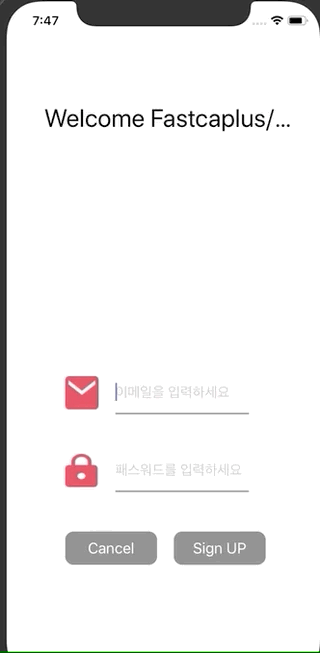

# LoginPage 만들기

## 구현 Ui 및 제약사항

### 구현 UI


### 제약 사항 및 구현 코드 일부

**[ 필수 구현 기능 ]**

1. 별도 첨부한 이미지와 같이 UI 구현. 원하는 형식으로 바꿔도 무관
2. 텍스트 필드는 UITextFieldDelegate 이용 
3. 키보드에 의해 아이디와 비밀번호 textField가 가릴 수 있으므로 
   키보드가 나타날 때는 텍스트필드 위로 끌어올리고 내려갈 때는 같이 내려가기

```swift

override func viewDidLoad() {
  super.viewDidLoad()
  view.backgroundColor = .white

  //textField delegate 처리를 위한 설정
  idTextField.delegate = self
  passwdTextField.delegate = self
  
  //키보드 내리는 notification 알림
  NotificationCenter.default.addObserver(self, selector: #selector(textViewMoveUp), name: UIResponder.keyboardWillShowNotification, object: nil)

  NotificationCenter.default.addObserver(self, selector: #selector(textViewMoveDown), name: UIResponder.keyboardWillHideNotification, object: nil)

}

extension SignupVC: UITextFieldDelegate{

  func textField(_ textField: UITextField, shouldChangeCharactersIn range: NSRange, replacementString string: String) -> Bool {
    let newLength = (textField.text?.count)! + string.count - range.length
    if newLength > 16 {
      textField.text?.removeLast()
    }
    return !(newLength > 16)
  }

  //화면 터치하여 키보드 내리기
  override func touchesBegan(_ touches: Set<UITouch>, with event: UIEvent?) {
    self.view.endEditing(true)
  }

  @objc func textViewMoveUp(_ notification: NSNotification){
    if let keyboardSize = (notification.userInfo?[UIResponder.keyboardFrameEndUserInfoKey] as? NSValue)?.cgRectValue {
      UIView.animate(withDuration: 0.3, animations: {
        self.view.transform = CGAffineTransform(translationX: 0, y: -keyboardSize.height)
      })
    }
  }

  @objc func textViewMoveDown(_ notification: NSNotification){
    self.view.transform = .identity
  }
}
```

:point_right: [참고 링크](https://developer-fury.tistory.com/22)

4. 미리 설정해둔 아이디와 비밀번호가 동일할 경우 로그인이 완료된 메인 화면으로 이동 

5. 메인 화면에서는 입력받은 아이디를 출력하는 Label을 띄우고  
   다시 로그인 화면으로 돌아갈 수 있는 Sign Out 버튼 구성 

**[ 추가 기능 (1) ]**

1. 미리 설정해둔 아이디와 비밀번호가 다를 경우 텍스트필드의 바탕화면을 일시적으로 빨갛게 만들었다가 원상 복구하기 

```swift
// 로그인 페이지에서 사용자의 아이디와 패스워드 칸이 입력 되지 않은경우 텍스트필드의 배경화면을 일시적으로 변경
if idTextField.text == "" || passwdTextField.text == "" {
  UIView.animate(withDuration: 0.3) {
    self.idTextField.backgroundColor = .red
    self.passwdTextField.backgroundColor = .red
    self.idTextField.backgroundColor = .white
    self.passwdTextField.backgroundColor = .white
  }
}
```

2. 텍스트필드에 입력할 수 있는 최대 글자 수는 16자까지 

```swift
extension LoginVC: UITextFieldDelegate{
  func textField(_ textField: UITextField, shouldChangeCharactersIn range: NSRange, replacementString string: String) -> Bool {
    // 텍스트 필드에 입력된 스트링의 카운트를 확인하고, 최대 15까지 입력 가능
    // 마지막 글자를 지우는 이유는 입력이 가능하기 문
    let newLength = (textField.text?.count)! + string.count - range.length
    if newLength > 16 {
      textField.text?.removeLast()
    }
    return !(newLength > 16)
  }
```

3. 아이디와 비밀번호는 모두 4 ~ 16자 사이여야 함  

```swift
// 회원가입 페이지에서 신규 사용자가 가입시 아이디, 패스워드 길이를 체크하여 4글자보다 작을 경우 재입력 요구
guard let userId = self.idTextField.text,
let password = self.passwdTextField.text else {return}

if userId.count < 4 || password.count < 4 {
  let idCountError = UIAlertController(title: "아이디, 패스워드 오류", message: "4글자 이상 입력 부탁드립니다.", preferredStyle: .alert)
  let idCheckAction = UIAlertAction(title: "확인", style: .default) { _ in

                                                                  }
  idCountError.addAction(idCheckAction)
  self.present(idCountError, animated: true, completion: nil)
}
```


**[ 추가 기능 (2) ]**

1. 자동 로그인 
   한 번 로그인에 성공했으면 Sign Out을 하기 전에는 앱을 껏다 켜도 자동 로그인된 상태로 메인 화면으로 진입

   - 구현된 UI

   

   

   - AppDelegate.swift 의 내용 

```swift
@UIApplicationMain
class AppDelegate: UIResponder, UIApplicationDelegate {

    var window: UIWindow?

    struct SavedUserData {
        static var mainview = "mainview"
        static var loginStatus = "loginstatus"
        static var userName = "username"
    }

    func application(_ application: UIApplication, didFinishLaunchingWithOptions launchOptions: [UIApplication.LaunchOptionsKey: Any]?) -> Bool {
     
        window = UIWindow()
      
      	// UserDefaults를 통해서 사용자가 최종적으로 로그인 한 상태인지 확인하는 값을 넣어
      	// 로그인, 로그아웃할떄 값을 변경해주도록 설정
        if let view = UserDefaults.standard.string(forKey: SavedUserData.mainview) {
            if view == "MainVC" {
                window?.rootViewController = MainVC()	// 기존 사용자가 로그인 하고 있는 경우
            } else {
                window?.rootViewController = LoginVC() // 로그아웃하고 로그인 페이지를 기본페이지로
            }
        }
        window?.makeKeyAndVisible()
        return true
    }
}
```

- Login.swift, 로그인 시 저장되는 UserDefaults

```swift
guard let username = idTextField.text, let password = passwdTextField.text else  {return}
// 사용자 정보 확인
guard let passwd = userDataDic[username.lowercased()] else {
  // 패스워드 및 사용자 정보 오류기 알람 버튼
  let addAlertMenu = UIAlertController(title: "로그인 오류", message: "사용자 및 패스워드 를 확인하세요", preferredStyle: .alert)
  // alert 창의 "Cancle" 메뉴 누를 시
  let cancelAction = UIAlertAction(title: "Cancel", style: .cancel) { _ in }
  //각 메뉴 alert창에 추가
  addAlertMenu.addAction(cancelAction)
  // 화면에 띄우기
  present(addAlertMenu, animated: true)
  return
}
// 패스워드 맞을시 로그인
if password.lowercased() == passwd {

  let mainVC = MainVC()
  mainVC.newUserId = username
  mainVC.modalPresentationStyle = .fullScreen
  present(mainVC, animated: true, completion: nil)
	// 로그인 페이지 입력되어 있는 값 초기화
  idTextField.text = ""
  passwdTextField.text = ""

  let window = UIWindow()
  window.rootViewController = MainVC()
  //User Data Save
  UserDefaults.standard.set("MainVC", forKey: SavedUserData.mainview)
  UserDefaults.standard.set(username ,forKey: SavedUserData.userName)
}
```

- MainVC.swift - 로그인 한뒤 페이지에서 로그아웃 했을때 처리 되는 부분

```swift
@objc func tabLogoutButton(_ sender: UIButton) {
  if UserDefaults.standard.bool(forKey: SavedUserData.loginStatus) {
		// 사용자가 로그아웃된 상태로, LoginVC(로그인)화면을 시작화면으로 설정
    UserDefaults.standard.set("LoginVC", forKey: SavedUserData.mainview)
    // 사용자의 이름 정보 삭제
    UserDefaults.standard.set(nil ,forKey: SavedUserData.userName)

    let loginView = LoginVC()
    loginView.modalPresentationStyle = .fullScreen
    present(loginView, animated: true, completion: nil)
  } else {
    dismiss(animated: true, completion: nil)
  }
}
```


2. 회원 가입 페이지 
   회원가입 페이지를 만든 뒤 회원 가입한 유저의 아이디와 비밀번호를 추가하고
   그것으로도 로그인 할 수 있도록 구현하기



## 최종 소스코드 

:point_right:  [링크](../SourceCode/200514_LoginPage)


