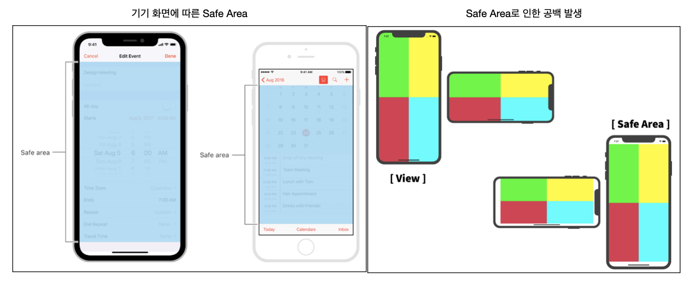
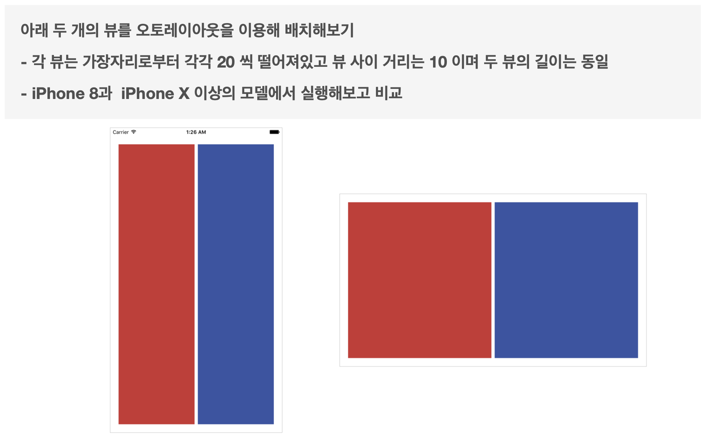
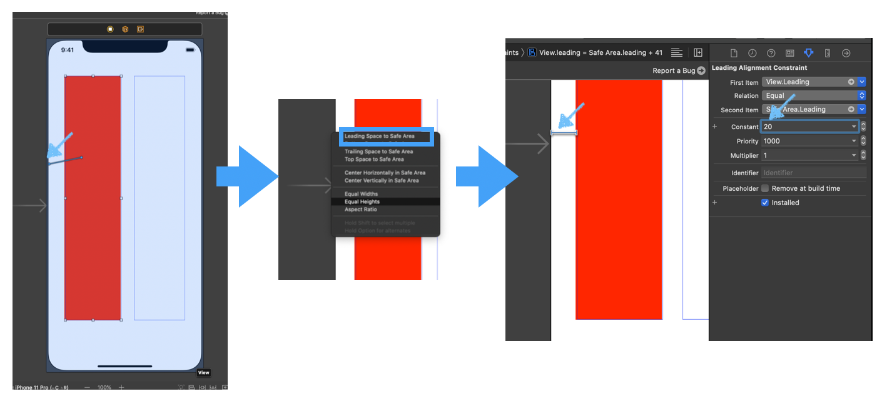
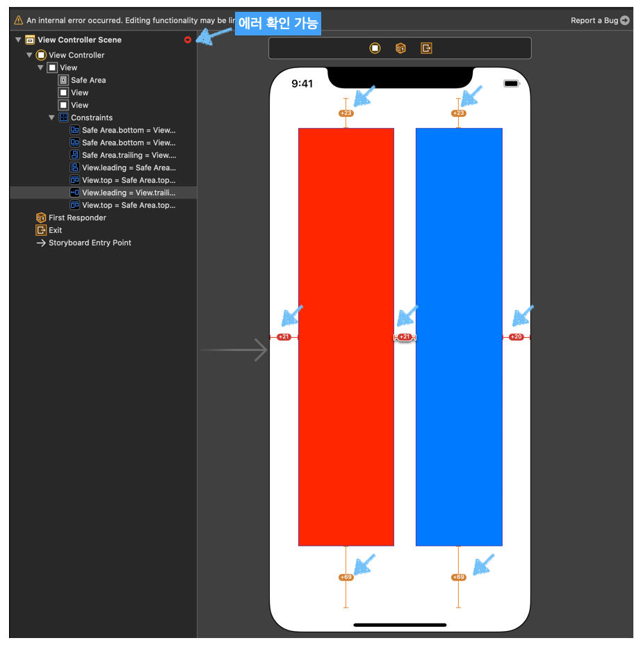
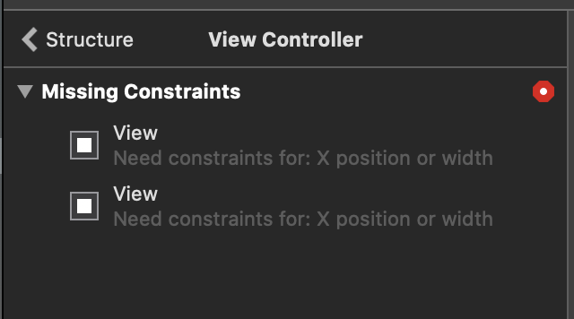
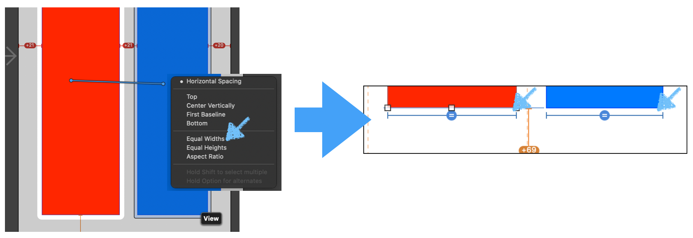
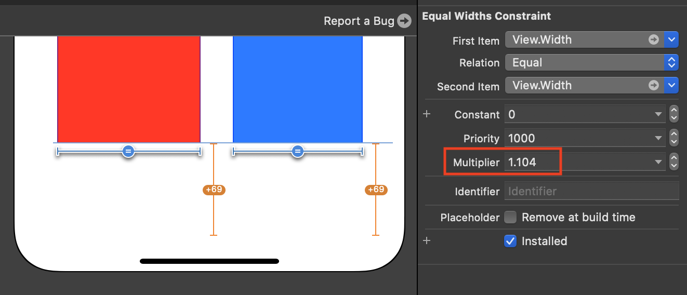

## AutoLayout 

## 기초 이론

### 정의 

- 뷰에 주어진 제약조건에 따라 뷰의 크기와 위치를 동적으로 계산해 배치하는 것
- 외부 또는 내부의 변화에 동적으로 반응하여 유저 인터페이스 구성

### 변화

외적 변화 요소 | 내적 변화요소
--|--
- 서로다른 크기 | - 앱에서 보여지는 컨텐츠의 변화
- 기기 회전 | - 국제화 지원(텍스트, 날짜 등)
- iPad /Iphone+ 등의 SplitView | Dynamic Type 지원

### 유저 인터페이스 구성을 위한 3가지 주요 접근 방식


- Frame 기반의 프로그래밍 방식
  - 원점의 위치와 크기를 통해 그릴 영역 계산
  - 가장 유연하며 빠른 성능
  - 모든 뷰에 대해 개별적인 설정과 관리
  -  동적인 변화에 대한 설계 및 디버그, 유지 관리 에 많은 노력 필요
- Autoresizing masks
  - 상위 슈퍼 뷰의 바운드가 변경되었을때 자신의 크기를 어떻게 재종하는지를 결정짓는 정수형 비트 마스트
  - 상위 뷰에 따라 자동으로 크기 조절
- Auto Layout
  - 제약 조건을 이용해 유저 인터페이스 정의
  - 뷰간의 관계 설정을 통한 크기와 위치 계산
  - 내/외부 변경 사항에 동적으로 반응
  - Frame 기반에 비해 느린 성능

### The Safe Area of an interface

#### 

- 전체 View 와는 별개로 Safe Area가 존재함
- Safe Area는 네이게이션 뷰로 인해 가려지는 부분이 없는 순수한 화면 영역

#### AutoLayout Practice 

##### 구현 목표



##### Main StoryBoard 구현 방법

1. UIView 2개 추가
2. Auto Layout 설정 
   - 좌, 우, 상, 하 가운데 모두 설정 해줌





3. 위와 같이 설정 하고 실행할 경우 에러가 발생한다.

   -> 도형의 width를 설정해주지 않아서 시스템에서 자동으로 그리는 것이 불가능해서 발생하는 오류



4. 뷰를 1:1로 정확하게 나누기 위해서 아래와 같이 조치
   -  Equal Widths 설정 -> view. 하단의 width autoLayout 확인



5. Width AutoLayout 선택 후 Attribute inspecter에서 `multiplier`1로 설정 ( 5:5 비율 )



6. 실행하여 결과 확인

##### code(frame)을 통한 구현 방법

- ViewController.swift

```swift
import UIKit

class ViewController: UIViewController {
    
    let redView: UIView = {
        var view = UIView()
        view.backgroundColor = .red
        return view
    }()
    
    let blueView: UIView = {
        var view = UIView()
        view.backgroundColor = .blue
        return view
    }()
    
    override func viewDidLoad() {
        super.viewDidLoad()
        
        view.addSubview(redView)
        view.addSubview(blueView)

    }
    // View Safe Area Insets이 변경될 경우 설정이 필요한것 셋팅
    override func viewSafeAreaInsetsDidChange() {
        super.viewSafeAreaInsetsDidChange()
        print("---viewSafeAreaInsetsDidChange--")
        print(view.safeAreaInsets) // 변경되는 값 확인
        
    }
    
    // layout를 변경하기 위한 목적으로는 바로 아래에 작성 필요
    override func viewWillLayoutSubviews() {
        super.viewWillLayoutSubviews()
     
        var sidePadding:Double = 20.0 // 좌우, 상하 여백을 위한
        var midPaddng:Double = 10.0		// 뷰 사이의 가운데 공간
        
        let viewWidth:Double = Double(view.frame.size.width) 	// 현재 View의 넓이
        let viewHeigh:Double = Double(view.frame.size.height)	// 현재 View의 높이
        let safeTop:Double = Double(view.safeAreaInsets.top)	// safeArea의 top 좌표
      	let safebottom:Double = Double(view.safeAreaInsets.bottom) // safeArea의 Bottom 좌표
      	// 도형으로 나타날 뷰의 넓이 높이 구하는 함수
        let rectWidth:Double = Double(viewWidth - sidePadding*2 - midPaddng)/2
        let rectHeigth:Double = Double(viewHeigh - sidePadding*2 - safebottom*2)
        
      	// red View 그리기
        redView.frame = CGRect(x: sidePadding, y: safeTop + sidePadding, width: rectWidth, height: rectHeigth)
       	// blue View 그리기
        blueView.frame = CGRect(x: Double(redView.frame.maxX) + midPaddng, y: safeTop + sidePadding, width: rectWidth, height: rectHeigth)  
    }
    
    override func viewWillAppear(_ animated: Bool) {
        super.viewWillAppear(true)
        print("--viewWillAppear--")
        
    }
    override func viewDidAppear(_ animated: Bool) {
        super.viewDidAppear(true)
        print("--viewDidAppear--")
    }
}
```

