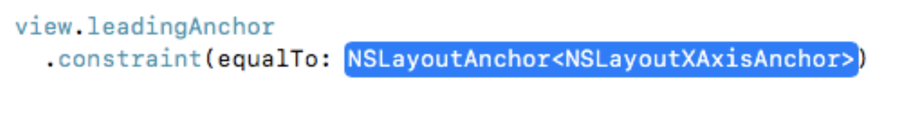
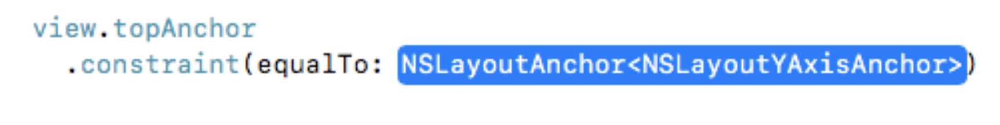
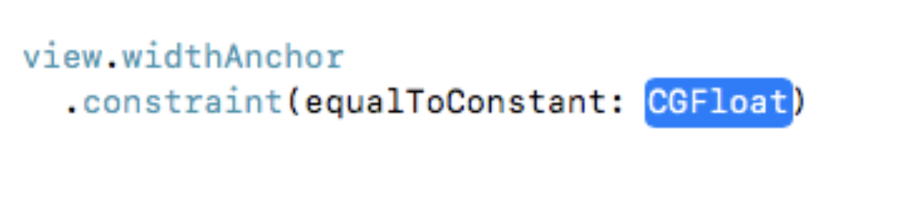
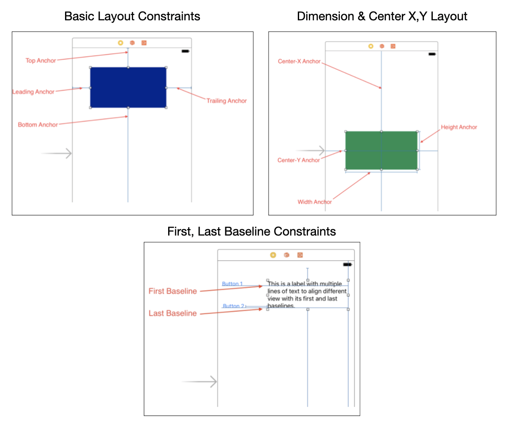
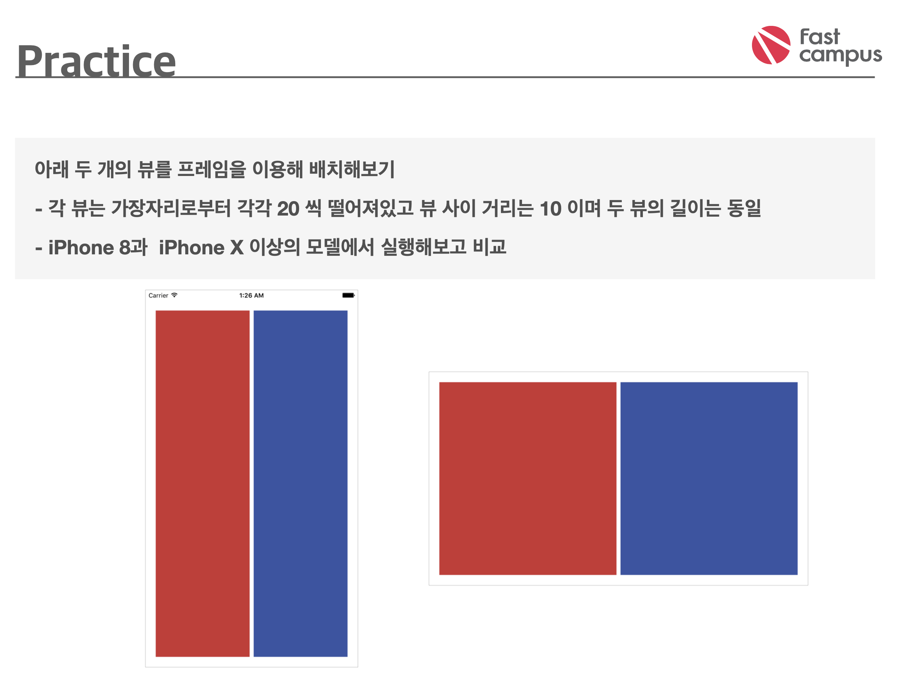
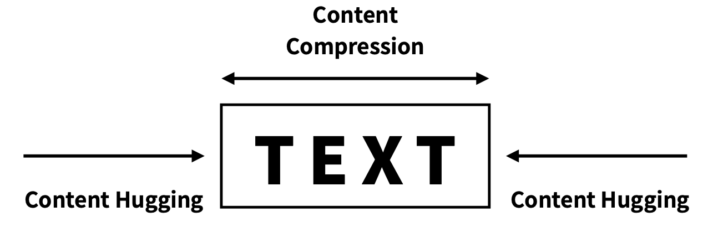

# AutoLayout with Code

## AutoLayout Anchors

#### AutoLayout 종류

1. Horizontal Layout Anchors
   - view의 수평선, x축에 관련된 제약조건
   - NSLayoutXAxisAnchor 클래스의 객체
     - Leading anchor
     - Tailing anchor
     - Left anchor
     - Right anchor
     - Center-X anchor



2. Vertical Layout Anchors
   - View의 주직선, Y축에 관련된 제약조건
   - NSLayoutYAxisAnchor 클래스의 객체
     - Top anchor
     - Bottom anchor
     - Center-Y anchor
     - Last baseline anchor



3. Dimension Layout Anchors
   - View의 크기 정의
   - NSLayoutDimension클래스의 객체
     - Width anchor
     - Height anchor



#### AutoLayout Example




### AutoLayout 실습



### Source Code 

```swift
import UIKit

class ViewController: UIViewController {
    
    override func viewDidLoad() {
        super.viewDidLoad()
        
        let redView = UIView()
        redView.backgroundColor = .red
        let blueView = UIView()
        blueView.backgroundColor = .blue
        
        view.addSubview(redView)
        view.addSubview(blueView)
        
        redView.translatesAutoresizingMaskIntoConstraints = false
        let safeArea = view.safeAreaLayoutGuide
        NSLayoutConstraint.activate([
            redView.topAnchor.constraint(equalTo: safeArea.topAnchor, constant: 20),
            redView.bottomAnchor.constraint(equalTo: safeArea.bottomAnchor, constant: -20),
            redView.leadingAnchor.constraint(equalTo: safeArea.leadingAnchor, constant: 20),
            redView.trailingAnchor.constraint(equalTo: blueView.leadingAnchor, constant: -10),
            redView.widthAnchor.constraint(equalTo: blueView.widthAnchor, multiplier: 1, constant: 0)
        ])
        
        blueView.translatesAutoresizingMaskIntoConstraints = false
        NSLayoutConstraint.activate([
            blueView.topAnchor.constraint(equalTo: safeArea.topAnchor, constant: 20),
            blueView.bottomAnchor.constraint(equalTo: safeArea.bottomAnchor, constant: -20),
            blueView.leadingAnchor.constraint(equalTo: redView.trailingAnchor, constant: 10),
            blueView.trailingAnchor.constraint(equalTo: safeArea.trailingAnchor, constant: -20),
            blueView.widthAnchor.constraint(equalTo: redView.widthAnchor, multiplier: 1, constant: 0)
        ])
    }
}

```


##  Intrinsic Content Size

### 정의

- 고유의 콘텐츠 크기( 컨텐츠를 잘라내거나 줄이지 않고도 온전히 표현할 수 있는 최소한의 공간)
- 뷰에 따라 다른 형태를 가질 수 있음
- 레이아웃 작업시 이 사이즈를 통해 제약 조건을 자동 생성하여 적용


### CHCR

- Intrinsic Size의 값을 기준으로
  - Content Hugging : 더 이상 늘어나지 못하도록 최대 크기에 제한
  - Content Compression Resistance : 더 이상 줄어들지 못하도록 최소 크기에 제한



### Priority

- 각각의 제약 조건은 1~1000 사이의 우선 순위를 가짐
- Required(1000), High(700), Low(250)
- 상충되는 제약조건이 적용되어 있다면 우선순위가 높은 것으로 적용


#### Programmatically

```swift
UILayoutPriority(900)
UILayoutPriority(800)
UILayoutPriority.required 		// 1000
UILayoutPriority.defaultHigh	// 750
UILayoutPriority.defaultLow		// 250

UILayoutPriority.dragThatCanResizeScene 		// 510
UILayoutPriority.sceneSizeStayPut 					// 500
UILayoutPriority.dragThatCannotResizeScene 	// 490
UILayoutPriority.fittingSizeLevel 					// 50

// set
view.setContentHuggingPriority(.defaultHigh, for: .horizontal) view.setContentCompressionResistancePriority(.required, for: .vertical)
// get
view.contentHuggingPriority(for: .horizontal) view.contentCompressionResistancePriority(for: .vertical)
```

