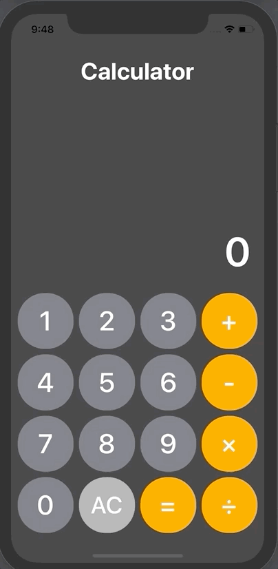
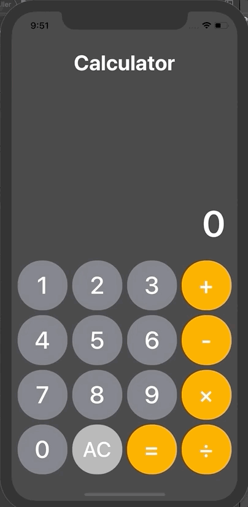

# Calculate Build

## 구현 내용 및 테스트 케이스

### [ 계산기 구현 내용 ]

- displayLabel 에는 2 + 3 / 4 와 같이 여러 개의 표현식이 출력되지 않고 결과창에는 항상 숫자만 표현
- 곱하기(×)와 나누기(÷) 기호는 control + command + spacebar를 눌러서 수학 기호를 사용해야 함
- 2 + 3 * 4를 하면 2 + (3 * 4) = 14가 되는 게 아니라 (2 + 3) * 4 와 같이 항상 누른 순서대로 연산
- 2 + =  순으로 누르면 현재 displayLabel에 표현된 숫자인 2가 더해져 2 + 2 = 4 와 같이 동작
  단, 다시 한 번 = 를 누르면 더 이상 계산되지 않음
- 2 + + + x - 3 = 순으로 누르면 최종적으로 - 연산자가 적용되어 2 - 3 = -1


- 등호(=)를 눌러 계산 결과가 나온 뒤 연산자를 누르지 않고 바로 숫자를 입력하면 
  기존의 값은 초기화되고 다시 처음부터 시작
- displayLabel에 입력할 수 있는 숫자는 최대 13자리.  (계산 결과로 인해 나오는 숫자는 무관)

### [ 테스트 케이스 예시 ]

> 12 = 3          => 결과: 3  -  12는 초기화 되고 최초에 3을 누른 것부터 다시 시작
> 12 + 3 = + 4 =  => 결과: 19 -  12 + 3 + 4 = 19
> 12 + 3          => 결과: 12 (화면상에는 3) - 아직 3이 더해지지 않은 상태
> 12 + 3 -        => 결과: 15 -  -버튼이 눌려지는 순간 앞의 + 연산이 수행됨
> 12 + = = =      => 결과: 24 -  12 + 12 = 24,  등호(=)는 이전 연산자에 대해 한 번만 계산
> 12 + =          => 결과: 24 -  12 + 12 = 24
> 12 + 3 * + - *  => 결과: 15 -  연산자만 바꾸는 것은 결과에 영향 없이 다음에 수행할 연산자를 덮어씀 
> 12 + - * / 3 =  => 결과: 4  -  마지막으로 누른 연산자(/)로 연산. 12 / 3 = 4
> 12 +-*/ +-*/    => 결과: 12 -  연산자를 막 바꿔가면서 눌렀을 때 이상 없는지 체크
> 5 + 1 =       => 결과: -4 -  초기 상태에서 -버튼부터 누르고 시작할 때도 정상적으로 연산
> 1 * 2 + 3 / 2 - 1 = => 결과: 1.5 -  연산자 우선순위와 관계없이 항상 앞에 있던 연산자부터 계산
> 숫자를 큰 수나 작은 수 음수로 바꿔가며 결과가 제대로 나오는지 테스트해보기


## 구현 내용

### 소스코드

- CalculatorMainView.swift

```swift
import UIKit

var numberLeft:Double = 0
var numberRight:Double = 0
var operand:String = ""

final class CalculatorMainView: UIViewController {
    
    @IBOutlet weak var mainTextLabel: UILabel!
    var userTypingCheck = false
    
    private struct operandStrunct {
        var numberLeft:Double = 0
        var numberRight:Double = 0
        var firstOper = ""
        var SecondOper = ""
    }
    private var saveData = operandStrunct()
    
    override func viewDidLoad() {
        super.viewDidLoad()      
    }
    
    @IBAction func tabButtonAction(_ sender: UIButton) {
        guard let inputText = sender.currentTitle else {
            print("Button의 title을 가져오지 못했습니다.")
            return
        }
        
        if Double(inputText) == nil { // String형 변수 처리
            guard let getNumber = mainTextLabel.text else {
                print("mainTextLabel 에 데이터가 없습니다.")
                return
            }
            userTypingCheck = false // mainTextlabel 을 초기화 하기 위한 코드
            calculateCore(getNumber, inputText)
            numberLeft = Double(getNumber)!
        } else {                    // Int형 변수 처리
            if !userTypingCheck {   // 처음 입력을 시작함
                mainTextLabel.text = inputText
                userTypingCheck = true
            } else {
                if inputText == "0" && mainTextLabel.text == "0"{
                } else if mainTextLabel.text == "0" {
                    mainTextLabel.text = inputText
                } else {
                    mainTextLabel.text! += inputText
                }
            }
        }
    }
    
    func initailizationSaveData() {
        saveData.firstOper = ""
        saveData.SecondOper = ""
        saveData.numberLeft = 0
        saveData.numberRight = 0
    }
    
    //MARK: - calculateCore
    func calculateCore(_ inputNumber:String,_ inputOperand: String ) {
        //AC 입력 받은 경우 모든사항 초기화
        if inputOperand == "AC" {
            print("초기화 실행")
            initailizationSaveData()
            mainTextLabel.text! = "0"
            return
        }
        // 첫번째 operand를 받앗을때 처리
        // 결과값 임시저장 변수
        var operandResult:Double = 0
        
        if saveData.firstOper == "" {
            if inputOperand == "=" {
                print("처음들어온 데이터가 = ")
                return
            }
            print("데이터가 처음 들어온 경우")
            saveData.numberLeft = Double(inputNumber)!
            saveData.firstOper = inputOperand
            print(saveData)
        } else if userTypingCheck == false && saveData.numberLeft == Double(inputNumber) && inputOperand != "=" {
            print("연산자만 바뀌는 경우 방지")
            print(saveData)
            saveData.firstOper = inputOperand
        } else { // 두번째 operand를 받았을때 처리
            //두번째 number 및 operand 저장
            print("데이터가 두번째 들어온 경우 // numberRight있음")
            print(saveData)
            saveData.numberRight = Double(inputNumber)!
            saveData.SecondOper = inputOperand
            switch saveData.firstOper {
            case "+":
                operandResult = saveData.numberLeft + saveData.numberRight
                saveData.numberLeft = operandResult
            case "-":
                operandResult = saveData.numberLeft - saveData.numberRight
                saveData.numberLeft = operandResult
            case "×":
                operandResult = saveData.numberLeft * saveData.numberRight
                saveData.numberLeft = operandResult
            case "÷":
                operandResult = saveData.numberLeft / saveData.numberRight
                saveData.numberLeft = operandResult
            case "=":
                operandResult = saveData.numberLeft
                initailizationSaveData()
            default:
                print("Error")
            }
            print(operandResult)
            saveData.numberRight = 0
            saveData.firstOper = saveData.SecondOper
            saveData.SecondOper = ""
            mainTextLabel.text! = String(operandResult)
            print(saveData)
        }
    }
}

```


### 오류 및 개선 필요 사항

1. 앞서서 입력한 숫자와 다음 숫자가 같을 경우 계산 안됨 

   - 증상
     - 3+3+3+3+ 시, 6+6+6+6 시 더하기가 실제로 이루어지지 않음
     - 연산자가 들어온 경우 이전 입력값과 다음 입력값이 같으면 처리가 안되도록 적용한 부분이 문제

   

   - 원인 : else if 구문 중 saveData.numberLeft 와 inputNumber 부분 문제로 보여짐

   ```swift
   else if userTypingCheck == false && saveData.numberLeft == Double(inputNumber) && inputOperand != "=" {
     print("연산자만 바뀌는 경우 방지")
     print(saveData)
     saveData.firstOper = inputOperand
   } 
   ```

   - 해결

     - 기존 입력된 값과 추가로 입력된 값이 같을 경우를 조건에서 제외

     ```swift
     else if userTypingCheck == false && inputOperand != "=" {
                 print("연산자만 바뀌는 경우 방지")
                 print(saveData)
                 saveData.firstOper = inputOperand
     }          saveData.numberLeft = Double(getNumber)!
     ```

     - userTypingCheck의 순서가 함수 뒤에 있어서 위 else if에 들어가지 않음
     - 쓰레기 코드로 인해 의도하지 않은 값이 변경됨

     ```swift
     // 기존 코드
     if Double(inputText) == nil { // String형 변수 처리
       guard let getNumber = mainTextLabel.text else {return}
       userTypingCheck = false // mainTextlabel 을 초기화 하기 위한 코드
       calculateCore(getNumber, inputText)
       numberLeft = Double(getNumber)! // 쓰레기 코드
     } 
     
     // 변경된 코드
     if Double(inputText) == nil { // String형 변수 처리
       guard let getNumber = mainTextLabel.text else {return}
       userTypingCheck = false // mainTextlabel 을 초기화 하기 위한 코드
       calculateCore(getNumber, inputText)
     }
     ```

2. 앞에서 입력한 일부 데이터가 남아있어, "=" 표시를 반복해서 넣을경우 해당 값이 불러와지는 에러

   - 증상
     - 앞서 저장된 6이 계산이 완료 되고도 남아 있어 오류값 출력

   

   - 원인 : = 누를시 초기화 함수의 오류로 보여짐

   ```swift
   case "=":
   	operandResult = saveData.numberLeft
   	initailizationSaveData()
     return // <-- 추가로 해결
   // = 누를시 초기화하고 해당 함수를 종료하지 않아 뒤에 연결된 코드를 통해서 쓰래기 값이 저장됨
   ```


### 수정된 소스코드

:point_right: [링크](../SourceCode/200519_Calculate_basic)

### 추가 개선 사항

- MVC 모델 적용
- UI를 소스코드로 구성하기