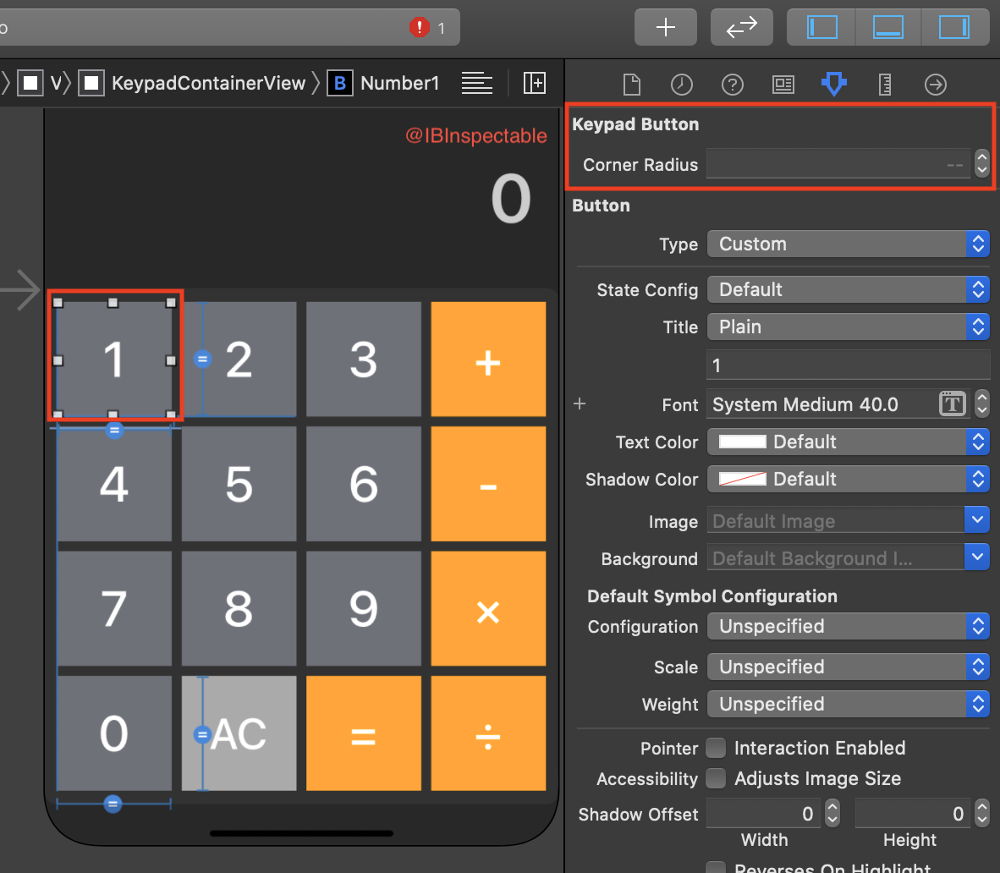
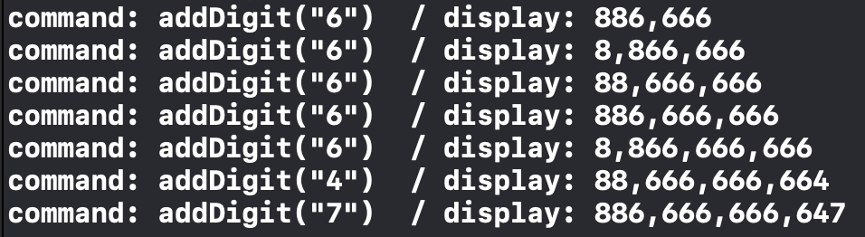

# Build Calculator Final (Best Practice)

### Enum을 활용 계산시 구현

```swift
import Foundation

final class Calculator {
  private enum Operator: String {
    case addition = "+"
    case subtraction = "-"
    case multiplication = "×"
    case division = "÷"
    
    var calculate: (Double, Double) -> Double {
      switch self {
      case .addition:         return (+) // return ( $0 + $1 )
      case .subtraction:      return (-) // return ( $0 - $1 )
      case .multiplication:   return (*) // return ( $0 * $1 )
      case .division:         return (/) // return ( $0 / $1 )
      }
    }
  }
  
  private var accumulator = 0.0
  private var bufferOperator: Operator?
  private var shouldResetText = true
  
  // 숫자 버튼으 눌렀을때 처리하는 구문
  private func addDigit(value newValue: String, to oldValue: String) -> String {
    let displayString = shouldResetText ? newValue
      : oldValue.count > 12 ? oldValue
      : oldValue + newValue
    shouldResetText = false
    return displayString
  }
  // 연산자 버튼을 눌렀을때 처리하는 구문
  private func calculate(for newValue: String) -> Double {
    let operand = Double(newValue)!
    // 이전에 들어온 연산자가 없으면 opperand 리턴
    // 있으면 calculate(accumlate, operand) 실행 후 결과 값 리턴
    return bufferOperator?.calculate(accumulator, operand) ?? operand
  }
  
  // 변경값을 수정 해주는 함수
  private func changeState(accumulator: Double, op: Operator? = nil) {
    self.accumulator = accumulator
    bufferOperator = op
  }
  
	// 실제 연산이 수행되는 부분
  func performCommand(_ command: Command, with displayText: String) -> String {
    var result: Double?
    switch command {
    case .addDigit(let input):
      return addDigit(value: input, to: displayText)
    case .operation(let op):
      let hasChangedOp  = bufferOperator != nil && shouldResetText
      let accu = hasChangedOp ? accumulator : calculate(for: displayText)
      result = hasChangedOp ? Double(displayText) : accu
      changeState(accumulator: accu, op: Operator(rawValue: op)!)
    case .equal: result = calculate(for: displayText)
      fallthrough
    case .clear: changeState(accumulator: 0)
    }
    shouldResetText = true
    return String(result ?? 0)
  }
}

```


### IBInspectable 

- 사용자가 StoryBoard에서 원하는 값을 입력할 수 있도록 지원



```swift
import UIKit

@IBDesignable
final class KeypadButton: UIButton { 
    @IBInspectable // 추가하
    var cornerRadius: CGFloat = 0 {
        didSet { layer.cornerRadius = cornerRadius }
    }
}
```

### Logging Tip

- 로그를 남길때 보기 편하게 설정하기



```swift
let padStr = "\(command)".padding(toLength: 14, withPad: " ", startingAt: 0)
```

