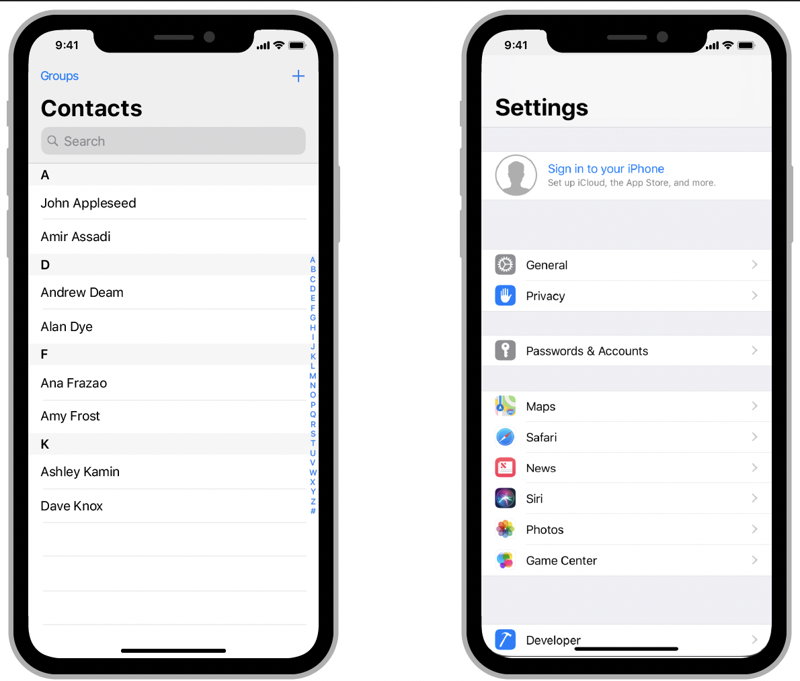
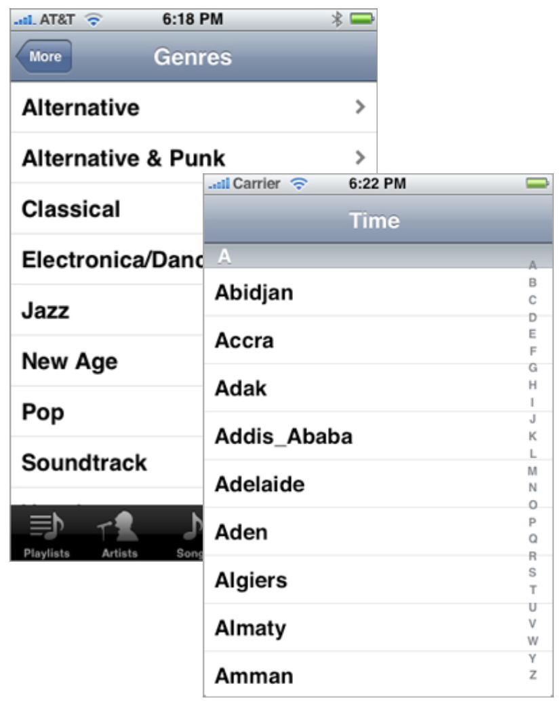
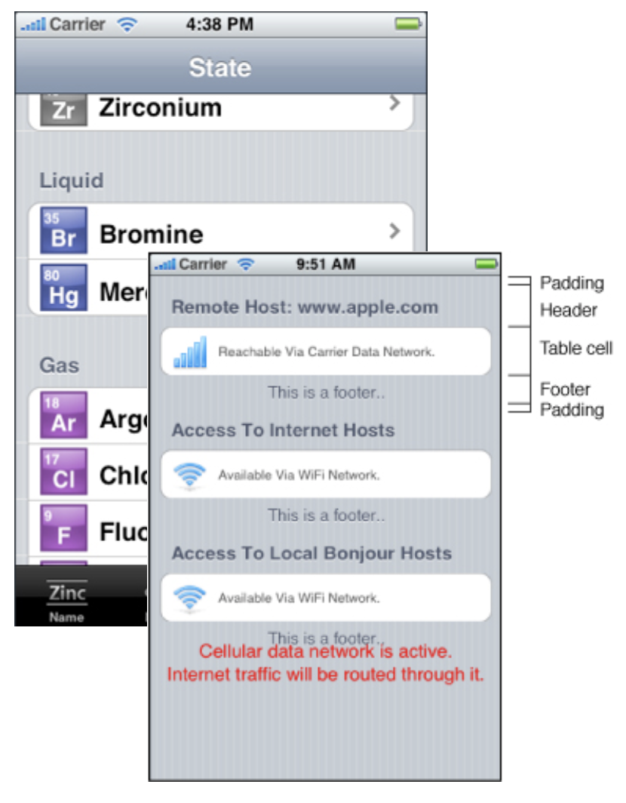
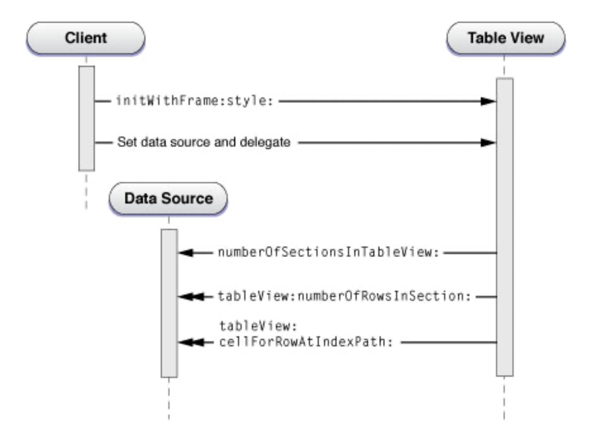
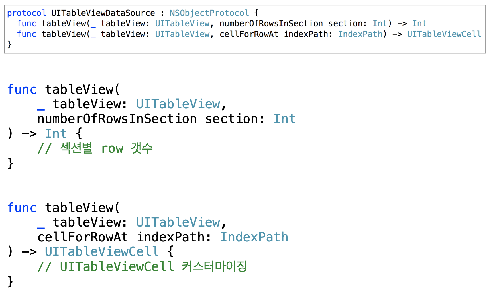
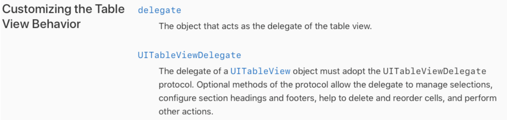
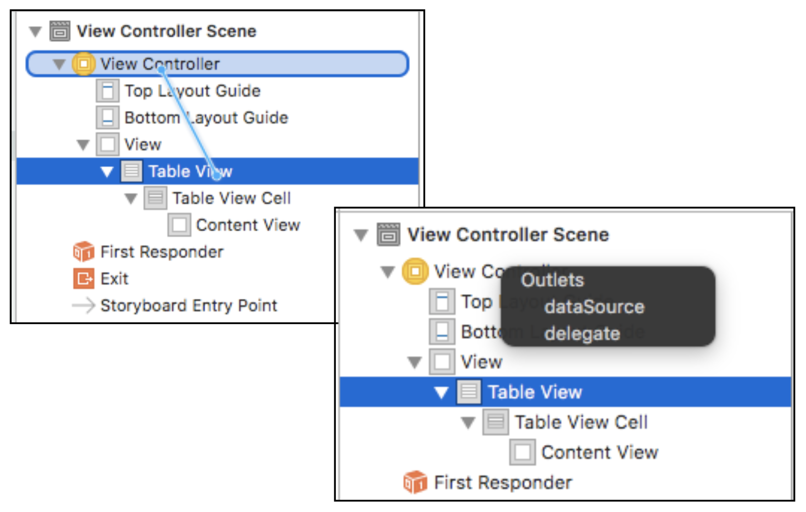
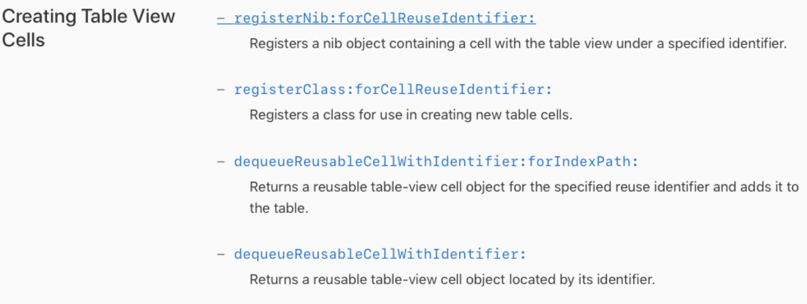
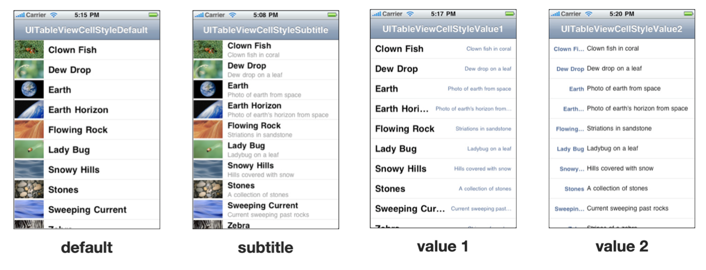
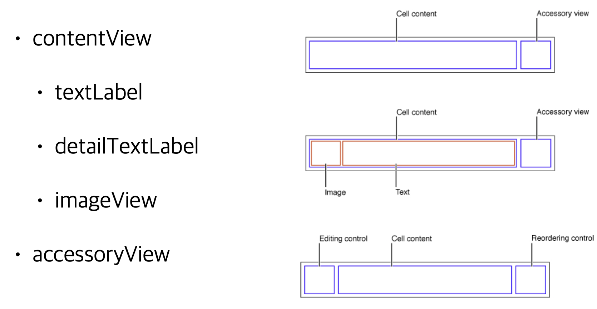

# UITableView

## 기초 이론

### 정의

- UIScrollView를 상속받아 리스트 형태로 반복되는 아이탬을 보여주기 위한 뷰
- Plain Style / Grouped Style

###  UITableView 종류

1. **Plain Table view**

   

   - 기본 스타일
   - 하나 이상의 섹션을 가질 수 있으며 

   - 각 섹션은 다시 하나 이상의 로우를 가짐 각 섹션은 그 자신의 헤더/푸터 뷰를 
가질 수 있고 해당 섹션이 보여질 때 
 헤더뷰는 Top, 푸터뷰는 Bottom 에 고정
   - 섹션을 빠르게 검색할 수 있도록 
 Indexed List 를 설정 가능

2. **Grouped Table Views**

   

   - 관련된 아이템들을 하나의 그룹으로 그룹핑
   - 데이터 계층 구조에 대한 상세 정보를 표현 하는 데 적합한 형태
   - Plain 스타일과 달리 헤더뷰와 푸터뷰가
 Top, Bottom 에 고정되지 않음

### UITableViewDataSource 동작 원리 및 설정 방법

1. UITableViewDataSource

   - TableView에서 표현할 데이터를 제공하는 데 사용하는 프로토콜

   

2. UITableViewDataSource 동작 원리

3. UITableViewDataSource Protocol with Func

### UITableViewDelegate

1. 정의
   - Interaction과 관련한 동작을 커스터마이징하는 프로토콜
2. UITableViewDelegate Detail

3. Delegate 적용 방법

### UITableViewCell

1. 정의
   - TableView에서 사용하는 각 아이템을 담는 컨테이너
   - 반복되는 셀을 매번 생성, 해제, 재할당하는 부담을 덜기 위해 화면에 보여지지 않은 부분의 셀을 재사용

2. UITableViewCell Style

   - Cell의 Style에 따라서 보여지는 방식이 변경

   

   - Cell Style 상세 정보

     

3. UITableViewCell Identifier

   - 각 Cell을 구분하여 재사용하기 위한 식별자

