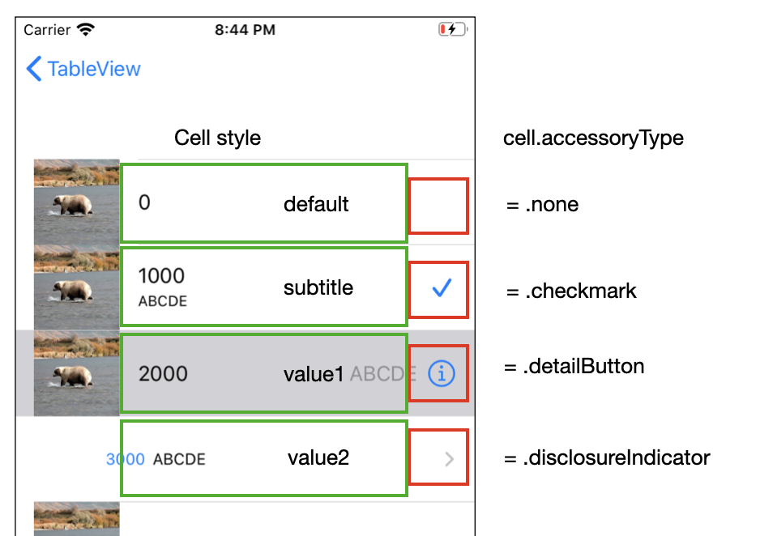
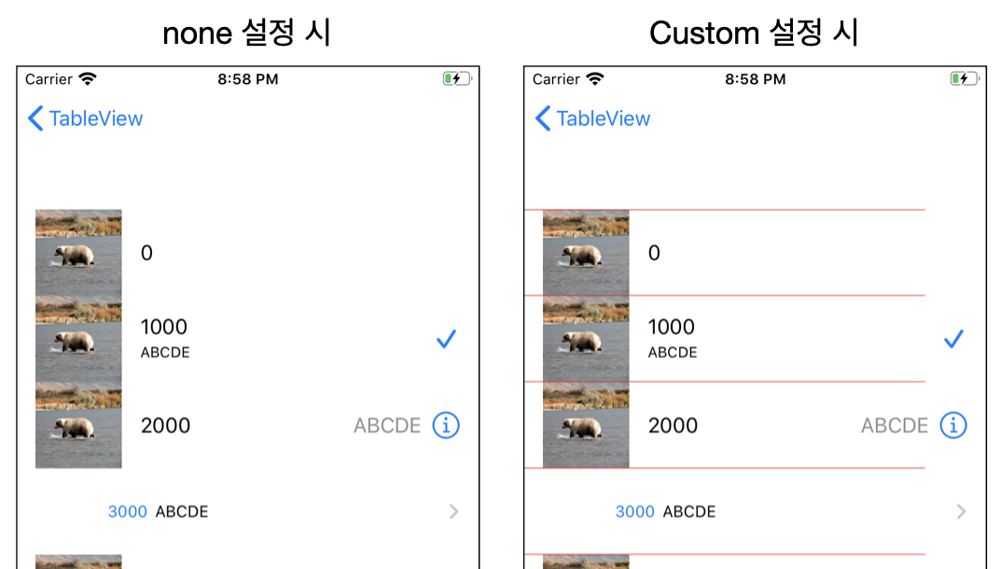
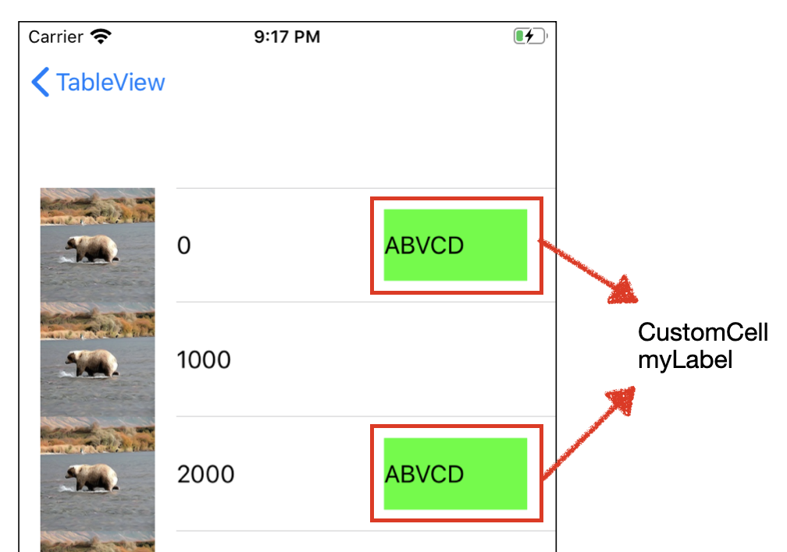
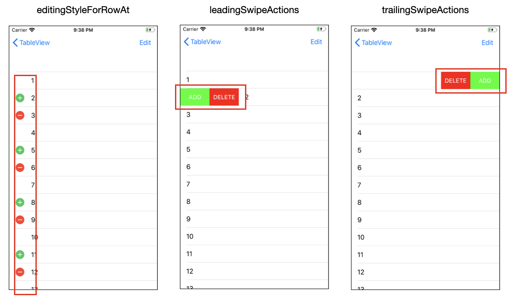

# UITableView Second Class

## Cell Style

- 사용자의 설정에 따라서 다양한 Cell 추가 설정이 가능
- 단, 기본적으로 제공하는 기능을 이용할 경우 위치가 고정됨



- 소스코드

```swift
if indexPath.row % 4 == 0 {
  // 셀 재사용 시도 후 없으면 생성
  cell = tableView.dequeueReusableCell(withIdentifier: "Default")
  ?? UITableViewCell(style: .default, reuseIdentifier: "Default")
  cell.accessoryType = .none
} else if indexPath.row % 4 == 1 {
  cell = tableView.dequeueReusableCell(withIdentifier: "Subtitle")
  ?? UITableViewCell(style: .subtitle, reuseIdentifier: "Subtitle")
  cell.accessoryType = .checkmark
} else if indexPath.row % 4 == 2 {
  cell = tableView.dequeueReusableCell(withIdentifier: "Value1")
  ?? UITableViewCell(style: .value1, reuseIdentifier: "Value1")
  cell.accessoryType = .detailButton
} else {
  cell = tableView.dequeueReusableCell(withIdentifier: "Value2")
  ?? UITableViewCell(style: .value2, reuseIdentifier: "Value2")
  cell.accessoryType = .disclosureIndicator
}
```


- tableVeiw 내에 구분선 커스텀 가능



```swift
// 아예 없애는 경우
tableView.separatorStyle = .none
// 색 변경
tableView.separatorColor = .red
tableView.separatorInset = .init(top: 0, left: 0, bottom: 0, right: 50)
```


## Custom Cell

- 사용자가 Cell 내에 원하는 위치에 버튼이나 라벨을 추가하기 위해 사용하는 방법
- 별도의 UIViewTableCell 파일을 만들어서 분리하여 적용

### 구현 화면



### 소스코드

- TableViewCustomCell.swift

```swift
func tableView(_ tableView: UITableView, cellForRowAt indexPath: IndexPath) -> UITableViewCell {
  let cell: UITableViewCell
	// 홀수번째 행일 경우 Label 추가
  if indexPath.row.isMultiple(of: 2){
    cell = tableView.dequeueReusableCell(withIdentifier: "Custom", for: indexPath)
		// myLabel은 CustomCell에 정의되어 있음
    (cell as! CustomCell).myLabel.text = "ABVCD" 
  } else {
    cell = tableView.dequeueReusableCell(withIdentifier: "Defualt", for: indexPath)
  }

  cell.textLabel?.text = "\(indexPath.row*1000)"
  cell.imageView?.image = UIImage(named: "bear")

  return cell
}
```

- CustomCell.swift

```swift
import UIKit

class CustomCell: UITableViewCell {

  var myLabel = UILabel()
  override init(style: UITableViewCell.CellStyle, reuseIdentifier: String?) {
    super.init(style: style, reuseIdentifier: reuseIdentifier)

    // 커스텀 뷰를 올릴 때는 contentView 위에 추가
    myLabel.textColor = .black
    myLabel.backgroundColor = .green
    contentView.addSubview(myLabel)
  }

  required init?(coder aDecoder: NSCoder) {
    fatalError("init(coder:) has not been implemented")
  }
}
```


## TableView Editing

### 구현화면



### 소스코드

- tableViewEditing

  - leadingSwipeActions

    ```swift
    func tableView(_ tableView: UITableView, leadingSwipeActionsConfigurationForRowAt indexPath: IndexPath) -> UISwipeActionsConfiguration? {
      let addaction = UIContextualAction(style: .normal, title: "ADD") {
        (action, sourceView, actionPerformed)
        in
        print("add action")
        actionPerformed(true)
      }
      addaction.backgroundColor = .green
    
      let deleteAction = UIContextualAction(style: .normal, title: "DELETE") {
        (action, sourceView, actionPerformed)
        in
        print("DELETE action")
        actionPerformed(true)
      }
      deleteAction.backgroundColor = .red
    
      let configure = UISwipeActionsConfiguration(actions: [addaction,deleteAction])
      configure.performsFirstActionWithFullSwipe = false
      return configure
    }
    ```

  - tailingSwipeActions

    ```swift
    func tableView(_ tableView: UITableView, trailingSwipeActionsConfigurationForRowAt indexPath: IndexPath) -> UISwipeActionsConfiguration? {
    
      let addaction = UIContextualAction(style: .normal, title: "ADD") {
        (action, sourceView, actionPerformed)
        in
        print("add action")
        actionPerformed(true)
      }
      addaction.backgroundColor = .green
    
      let deleteAction = UIContextualAction(style: .normal, title: "DELETE") {
        (action, sourceView, actionPerformed)
        in
        print("DELETE action")
        actionPerformed(true)
      }
      deleteAction.backgroundColor = .red
    
      let configure = UISwipeActionsConfiguration(actions: [addaction,deleteAction])
      configure.performsFirstActionWithFullSwipe = false
      return configure
    }
    ```

  - EditingStyle 

    - edit 버튼 눌렀을때 왼쪽 버튼 생성됨
      - 1번 none
      - 2번 insert
      - 3번 delete

    ```swift
    func tableView(_ tableView: UITableView, editingStyleForRowAt indexPath: IndexPath) -> UITableViewCell.EditingStyle {
      let row = indexPath.row
    
      if row.isMultiple(of: 3){
        return .none
      } else if row % 3 == 1 {
        return .insert
      } else {
        return .delete
      }
    }
    
    @objc func switchToEditing() {
      tableView.setEditing(!tableView.isEditing, animated: true)
    }
    
    // 삭제 -> numberOfRowsInSection 변경 -> cellForRowAt 추가될 cell 생성
    func tableView(_ tableView: UITableView, commit editingStyle: UITableViewCell.EditingStyle, forRowAt indexPath: IndexPath) {
      switch editingStyle {
        case .none: print("none")
        case .delete:
        data.remove(at: indexPath.row)	// 실제 데이터 변경 필수
        tableView.deleteRows(at: [indexPath], with: .automatic) // TableView 에도 추가
        case .insert:
        let tempInt = (1...50).randomElement()
        data.insert(tempInt!, at: indexPath.row) // 실제 데이터 변경 필수
        tableView.insertRows(at: [indexPath], with: .automatic) // TableView 에도 추가
    
        default: break
      }
    }
    ```


