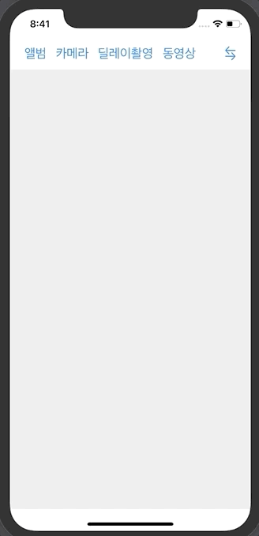
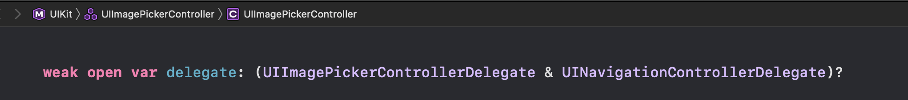
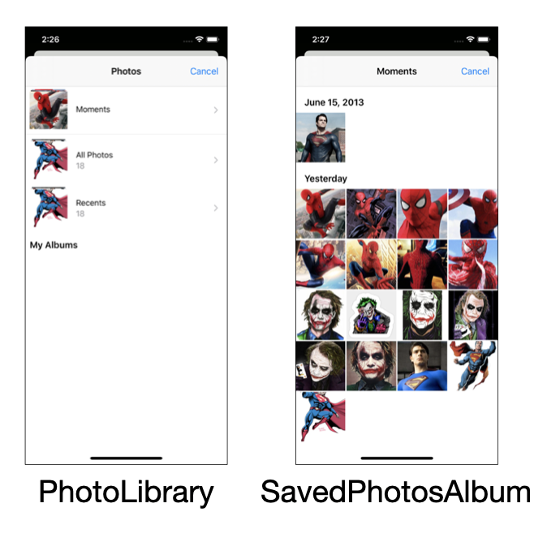
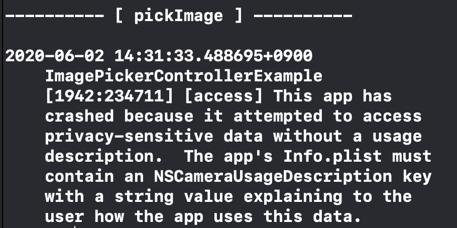
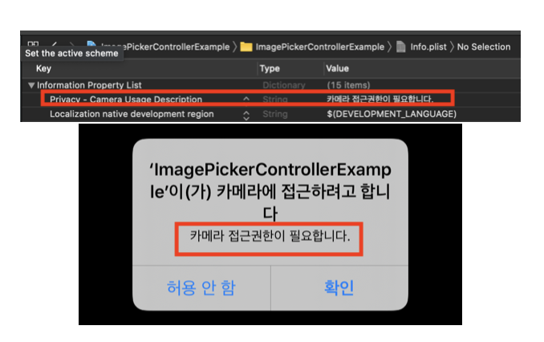

# ImagePicker 

- 사용자의 사진(사진 라이브러리)에서 사진을 선택하여 가져오기 위한 사용 방법


## 1. 사진 라이브러리에서 사진을 선택해 이미지 뷰 표시

### 구현 화면



### 소스코드

1. 이미지 피커 객체 생성

```swift
@IBOutlet private weak var imageView: UIImageView!

// imagePicker를 생성하기 위한 방법 1
private let imagePicker = UIImagePickerController()

// imagePicker를 생성하기 위한 방법 2

//    private lazy var imagePicker: UIImagePickerController = {
//        let imagePicker = UIImagePickerController()
//        imagePicker.delegate = self // lazy가 없으면 self를 못넣음
//        return imagePicker
//    }()

override func viewDidLoad() {
  super.viewDidLoad()

  imagePicker.delegate = self // delegate 적용
}
```

2. UIImagePickerControllerDelegate 정의 하기 위해서는 2가지 Delegate를 적용해야 
   - UIImagePickerControllerDelegate 및 UINavigationControllerDelegate 정의 부분
     
     - 
   - 실제 코드 구현 부분
    
     - ```swift
       extension ViewController: UIImagePickerControllerDelegate, UINavigationControllerDelegate { // delegate 적용
       
         func imagePickerController(_ picker: UIImagePickerController, didFinishPickingMediaWithInfo info: [UIImagePickerController.InfoKey: Any]) {
       
           let originalImage = info[.originalImage] as! UIImage // 이미지를 가져옴
           imageView.image = originalImage
       
           dismiss(animated: true, completion: nil)
         }
       }
       ```
   
3. 이미지피커 sourceType 선택
   - photoLibray - 앨범을 선택하는 화면을 표시 후 팝업된 앨범에서 사진 선택
   
   - camera -  새로운 사진 촬영
   
   - savedPhotosAlbum
   
   - 소스코드
     
     - ```swift
	    @IBAction private func pickImage(_ sender: Any) { // ui상 앨범버튼
        print("\n---------- [ pickImage ] ----------\n")
       imagePicker.sourceType = .savedPhotosAlbum // 차이점 확인하기
        //imagePicker 띄어주기
        present(imagePicker, animated: true, completion: nil)
       }
       ```
       
       
       
     - imagePicker sourceType설정에 따른 변화 
     




## 2. Camera

### 구현 화면

- 카메라 버튼을 눌르면 카메라를 뷰 띄워줌

<video src="../image/200602/200602_CameraButtonAction.MP4"></video>

### 소스코드

1. Camera Button Action 

```swift
@IBAction private func takePicture(_ sender: Any) {
  print("\n---------- [ takePicture ] ----------\n")
  guard UIImagePickerController.isSourceTypeAvailable(.camera) else { return }
  imagePicker.sourceType = .camera // sourceType 카메라 선택

  let mediaTypes = UIImagePickerController.availableMediaTypes(for: .camera)

  print(mediaTypes) // Optional(["public.image", "public.movie"])

  imagePicker.mediaTypes = mediaTypes ?? []
  imagePicker.mediaTypes = ["public.image", "public.movie"] 

  // kUTTypeVidio - 영상
  // kUTTypeMovie - 영상 + 소리
  imagePicker.mediaTypes = [kUTTypeImage,kUTTypeMovie] as [String]

  if UIImagePickerController.isFlashAvailable(for: .rear) {
    imagePicker.cameraFlashMode = .auto
  }

  present(imagePicker, animated: true, completion: nil)
}
```

2. 에러 메시지 발생
   - 아이폰의 민감한 정보가 포함된 사진,연락처, 카메라등에 접근시 반듯이 사용자에게 알림을 띄우고 승인을 받아야함
   - 
   - 적용 후 재실행 




#### 참조 plist.info의 Key, value 변경 방법

1. plist.info 오른쪽 클릭
2. Raw Keys & Values 클릭
3. Infomation Property List 변경 확인


## 3. 딜레이 촬영

### 구현 화면

- 딜레이 촬영 버튼을 누르면 자동으로  카메라 화면이 띄고 2초후에 사진 촬영

<video src="../image/200602/200602_DelayCameraButtonAction.MP4"></video>

### 소스코드

```swift
@IBAction private func takePictureWithDelay(_ sender: Any) {
  print("\n---------- [ takePictureWithDelay ] ----------\n")
	// 현제 디바이스의 카메라 사용 가능 여부 체크
  guard UIImagePickerController.isSourceTypeAvailable(.camera) else { return }
  imagePicker.sourceType = .camera
  imagePicker.mediaTypes = [kUTTypeImage as String]

  // present(imagePicker, animated: true, completion: nil) // 버튼을 누르자 마자 찍히는 문제 발생
  present(imagePicker, animated: true) { 								// 병렬적으로 실행됨 
    DispatchQueue.main.asyncAfter(deadline: .now()+2) { // 2초 지연 추가
      self.imagePicker.takePicture()
    }
  }
}
```


## 4. 동영상 Button

### 구현 화면

<video src="../image/200602/200602_VidioButton.MP4"></video>

### 소스코드

```swift
@IBAction private func recordingVideo(_ sender: Any) {
  print("\n---------- [ recordingVideo ] ----------\n")
  guard UIImagePickerController.isSourceTypeAvailable(.camera) else { return }
  imagePicker.sourceType = .camera

  imagePicker.mediaTypes = [kUTTypeMovie as String]
  //  imagePicker.mediaTypes = ["public.movie"]

  imagePicker.cameraCaptureMode = .video

  guard UIImagePickerController.isCameraDeviceAvailable(.rear) else { return }
  imagePicker.cameraDevice = .rear // 기본 카메라 설정 .front
  imagePicker.videoQuality = .typeMedium	// 영상 품질은 중간
  present(imagePicker, animated: true, completion: nil)
}
```

#### 동영상 촬영 관련 옵션들

```swift
imagePicker.cameraCaptureMode = .photo   // mediaType이 가능할때 설정 가능
imagePicker.startVideoCapture() // 동영상 촬영 시작
imagePicker.stopVideoCapture()  // 동영상 촬영 종료
imagePicker.videoMaximumDuration = 60 // 동영상 촬영시간 조절 (기본 600sec)
imagePicker.videoQuality = .typeLow		// 동영상 저장 품질
imagePicker.videoQuality = .typeHigh		
```


## 5. 수정 가능 토글 버튼

### 구현화면

- 버튼을 누를때마다 사용자가 선택한 이미지를 수정할 수 있도록 적용 및 차단


### 소스코드

```swift
@IBAction private func toggleAllowsEditing(_ sender: Any) { 
  // 불러온 이미지를 수정 가능하도록 설정 변경
  imagePicker.allowsEditing.toggle()
}
```


## 6. 카메라로 찍은 사진 및 동영상 저장

```swift
extension ViewController: UIImagePickerControllerDelegate, UINavigationControllerDelegate {
  func imagePickerController(_ picker: UIImagePickerController, didFinishPickingMediaWithInfo info: [UIImagePickerController.InfoKey: Any]) {

    print("-- didFinishPickingMediaWithInfo --")

    print(info)
    let mediaType = info[.mediaType] as! NSString
    if UTTypeEqual(mediaType, kUTTypeImage) {
      // handle Image Type
      let originalImage = info[.originalImage] as! UIImage    // 이미지를 가져옴
      let editedImage = info[.editedImage] as? UIImage        // editedImage
      let selectedImage = editedImage ?? originalImage
      imageView.image = selectedImage

      // 이미지 라이브러리에 사용자가 찍은 사진 저장
      if picker.sourceType == .camera {
        // '앨범'버튼을 통해서 사진을 불러온 경우 저장 제외
        UIImageWriteToSavedPhotosAlbum(selectedImage, nil, nil, nil)
      }

    } else if UTTypeEqual(mediaType, kUTTypeMovie) {
      // handle Movie Type
      if let mediaPath = (info[.mediaURL] as? NSURL)?.path, UIVideoAtPathIsCompatibleWithSavedPhotosAlbum(mediaPath) {
        UISaveVideoAtPathToSavedPhotosAlbum(mediaPath, nil, nil, nil)
      }
    }

    dismiss(animated: true, completion: nil)
  }
}
```
