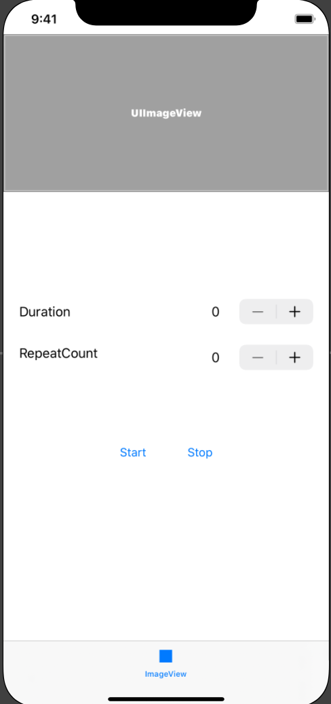
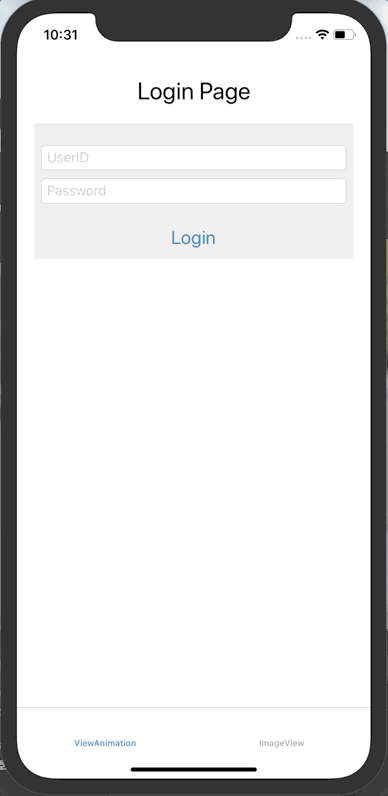
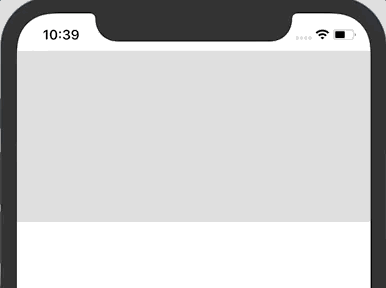
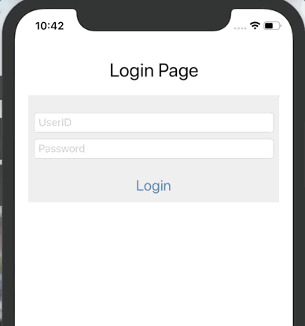
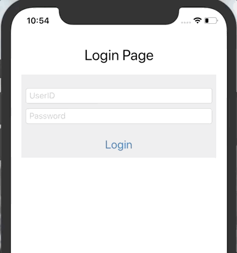
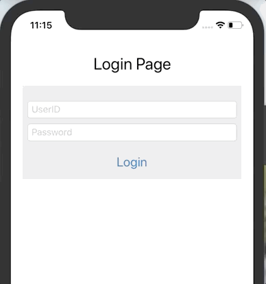

# UIAnimation

- iOS에서 다양한 에니메이션을 사용하기 위한 구현 방법 정리


## 실습 1 - 다수의 이미지를 이용한 실습

### 구현 화면


### 구현 내용

- 총 5가지 이미지를 하단의 옵션에 따라서 보여주는 화면
- Duration : 사진 전환 시 딜레이시간 추가 여부
- RepeatCount : 전체 이미지(5개)를 몇번 반복할지 지정

#### StoryBoard



#### 소스 코드

- ImageAnimationViewController.swift

```swift
import UIKit

final class ImageAnimationViewController: UIViewController {
  
  @IBOutlet private weak var imageView: UIImageView! {
    didSet {
      //imageView에 에니메이션에 적용할 이미지 배열 추가
      imageView.animationImages = images
    }
  }
  @IBOutlet private weak var durationLabel: UILabel!
  @IBOutlet private weak var repeatCountLabel: UILabel!
  
  let images = [
    "AppStore", "Calculator", "Calendar", "Camera", "Clock", "Contacts", "Files"
    ]
    .compactMap(UIImage.init(named:))
  
  override func viewDidLoad() {
    super.viewDidLoad()
    
    //        var arr: [UIImage] = []
    //        for imageName in images {
    //            if let image = UIImage(named: imageName) {
    //                arr.append(image)
    //            }
    //        }
    //        imageView.animationImages = arr
  }
  
  @IBAction private func startAnimation(_ sender: Any) {
    // 에니메이션 시작
    imageView.startAnimating()
  }
  
  @IBAction private func stopAnimation(_ sender: Any) {
    guard imageView.isAnimating else {return}
    // 에니메이션 중지
    imageView.stopAnimating()
  }
  
  @IBAction private func durationStepper(_ sender: UIStepper) {
    durationLabel.text = "\(sender.value)"
    
    // 1 cycle Duration
    // Default: 0.0 - 1/30 second
    imageView.animationDuration = sender.value
  }
  
  @IBAction private func repeatCountStepper(_ sender: UIStepper) {
    let repeatCount = Int(sender.value)
    repeatCountLabel.text = "\(repeatCount)"
    // 반복횟수
    // 기본값: 0 무한 반복
    imageView.animationRepeatCount = repeatCount
  }
}

```


## 실습 2 - 로그인 페이지에서 에니메이션 적용하기

### 실습 화면

- 아이디, 패스워드, 로그인 버튼이 왼쪽 화면 밖에서 가운데로 이동하도록 구현



### 소스코드

- AnimationViewController.swift

```swift
// 로그인 화면이 보여지기 전에 미리 텍스트필드와 버튼을 화면 밖으로 옯겨둠
override func viewWillAppear(_ animated: Bool) {
  super.viewWillAppear(animated)
  userIdTextField.center.x = -view.frame.width
  passwordTextField.center.x = -view.frame.width
  loginButton.center.x = -view.frame.width
} 

// 로그인 화면이 보여지면 실제로 보여질 위치로 지정해줌
override func viewDidAppear(_ animated: Bool) {
  super.viewDidAppear(animated)
  //Frame의 기준은 상위 뷰의 기준 (회색화면)
  // UI상으로 봤을떄 로그인 버튼이 회색 뷰에 올려저 있기 때문에 화면 중간에 오기 위해서는
  // 각각 뷰의 superview (view)의 중간으로 설정해주여야 함
  UIView.animate(withDuration: 0.6) { //에니메이션이 0.6초 동안 진행되도록 설정
    self.userIdTextField.center.x = self.userIdTextField.superview!.bounds.midX
    //print(self.userIdTextField.center.x) // 최종값을 가지고 이동 변경X
  }
  UIView.animate(withDuration: 0.6, delay: 0.5, animations: {
    self.passwordTextField.center.x = self.passwordTextField.superview!.bounds.midX
  })

  //usingSpringWithDamping 1이면 그 자리에 도착
  // 0 이면 계속 튕김
  UIView.animate(
    withDuration: 0.6,
    delay: 1,
    //      usingSpringWithDamping: 0.1,// 0에 가까울수록 큰 진동
    //      initialSpringVelocity: 10,  // 버튼이 움지이는 힘
    options: [],  // .repeat 옵션 등 가능
    animations: {
      self.loginButton.center.x = self.loginButton.superview!.bounds.midX
    }) { isFinished in
        print("isFinished :", isFinished)
    }
}
```

- 로그인 버튼 에니메이션 속성 변경 

```swift
//usingSpringWithDamping 1이면 그 자리에 도착
// 0 이면 계속 튕김
UIView.animate(
  withDuration: 0.6,
  delay: 1,
	usingSpringWithDamping: 0.1,// [변경사항] 0에 가까울수록 큰 진동
	initialSpringVelocity: 10,  // [변경사항] 버튼이 움지이는 힘
  options: [],  // .repeat 옵션 등 가능
  animations: {
    self.loginButton.center.x = self.loginButton.superview!.bounds.midX
  }) { isFinished in
      print("isFinished :", isFinished)
	}
```





## 실습 3 - 로그인 버튼 클릭 시 이동 에니메이션 추가 [ 1 ]

### 실습 화면




### 소스코드

- AnimationViewController.swift

```swift
func addAnimateKeyframes() {
  UIView.animateKeyframes(
    withDuration: 4, 	// <- 전체 에니메이션이 진행되는 시간 4초
    delay: 0,					// 0초(즉시) 시작	
    options: [],
    animations: {
      // 애니메이션 시작과 동시에 1초 동안 우즉트로 100만큼 이동
      UIView.addKeyframe(
        // 0초 뒤 (즉시), 0.25 시간만큼 시작
        withRelativeStartTime: 0, 		// 0 * 0.25	= 0
        relativeDuration: 0.25 				// 4 * 0.25	= 1
      ) {
        self.loginButton.center.x += 100 // 왼쪽으로 100 만큼
      }
      // 0.25초 뒤 1초간 아래로 이동
      UIView.addKeyframe(
        withRelativeStartTime: 0.25,  // 1 * 0.25 = 0.25
        relativeDuration: 0.25        // 4 * 0.25	= 1
      ) {
        self.loginButton.center.y += 100 // 아래로 100 만큼
      }
      // 0.5 초뒤 1초간 왼쪽으로 이동
      UIView.addKeyframe(
        withRelativeStartTime: 0.5,  	// 2 * 0.25 = 0.5
        relativeDuration: 0.25       	// 4 * 0.25	= 1
      ) {
        self.loginButton.center.x -= 100 // 왼쪽으로 100 만큼
      }

      // 0.75 초뒤 1초간 위로으로 이동
      UIView.addKeyframe(
        withRelativeStartTime: 0.75,  // 3 * 0.25 = 0.75
        relativeDuration: 0.25        // 4 * 0.25	= 1
      ) {
        self.loginButton.center.y -= 100 // 위로 100 만큼
      }
    })
}
```


## 실습 4 -  로그인 버튼 클릭 시 이동 에니메이션 추가 [ 2 ]

### 실습 화면

- 버튼 클릭시 하단으로 이동 후 약간 회전한 다음 화면 밖으로 이동



### 소스코드

```swift
func loginButtonMoveAnimation() {
  UIView.animateKeyframes(
    withDuration: 4,
    delay: 0,
    options: [],
    animations: {
      UIView.addKeyframe(
        withRelativeStartTime: 0, 	// 4 * 0 		= 0
        relativeDuration: 0.25 			// 4 * 0.25	= 1
      ) {
        self.loginButton.center.y += 100
      }

      UIView.addKeyframe(
        withRelativeStartTime: 0.25, 	// 4 * 0.25 = 1
        relativeDuration: 0.25 				// 4 * 0.25	= 1
      ) {
        self.loginButton.transform = CGAffineTransform(rotationAngle: .pi/4) // 버튼 회전
      }

      UIView.addKeyframe(
        withRelativeStartTime: 0.5, 	// 4 * 0.5 	= 2
        relativeDuration: 0.25 				// 4 * 0.25 = 1
      ) {
        self.loginButton.center.x += 300
        self.loginButton.center.y -= 200
      }

      UIView.addKeyframe(
        withRelativeStartTime: 0.75, 	// 4 * 0.75	= 3
        relativeDuration: 0.0 				// 4 * 0.25	= 1
      ) {
        self.loginButton.center.x -= 300
        self.loginButton.center.y += 200
        self.loginButton.transform = CGAffineTransform(rotationAngle: .pi*4) // 버튼 정상 회전
      }

      UIView.addKeyframe(
        withRelativeStartTime: 0.75, 	// 4 * 0.75 = 3
        relativeDuration: 0.25 				// 4 * 0.25 = 1
      ) {
        self.loginButton.center.y -= 100
      }
    })

}
```


## 실습 5 -  로그인 버튼 클릭 시 이동 에니메이션 추가 [ 3 ]

### 실습 화면

- 버튼 클릭시 화면 밖으로 이동 후 하단에서 올라옴



### 소스코드

```swift
func loginButtonAnimation() {
  activityIndicatorView.startAnimating() // 시작시 동작중임을 나타내는 indicatorview시작
  let centerOrigin = loginButton.center

  UIView.animateKeyframes(
    withDuration: 1.6,
    delay: 0,
    animations: {
      // 로그인 버튼을 누를때 0.4초 동안 우측 아래로 이동
      UIView.addKeyframe(
        withRelativeStartTime: 0.0,
        relativeDuration: 0.25
      ) {
        self.loginButton.center.x += 50.0
        self.loginButton.center.y += 20.0
      }
			// 1.6 * 0.25 초 뒤 버튼 회전과 동시에 왼쪽 상단으로 이동
      UIView.addKeyframe(
        withRelativeStartTime: 0.25,	// 1.6 * 0.25 초
        relativeDuration: 0.25) {
        self.loginButton.transform = CGAffineTransform(rotationAngle: .pi/4)
        self.loginButton.center.x += 150.0
        self.loginButton.center.y -= 70.0
        self.loginButton.alpha = 0					// 버튼 안보임
      }
			// 1.6 * 0.5 초 뒤 해당 버튼을 원래 위치로 이동 후 아래로 100만큼 이동
      UIView.addKeyframe(
        withRelativeStartTime: 0.5,
        relativeDuration: 0.25) {
        self.loginButton.transform = .identity
        self.loginButton.center = CGPoint(
          x: centerOrigin.x,
          y: self.loginButton.superview!.frame.height + 100
        )
      }
			// 1.6 * 0.75 초 뒤 해당 버튼을 원래 위치로 이동 후 아래로 100만큼 이동
      UIView.addKeyframe(
        withRelativeStartTime: 0.75, // 4 * 0
        relativeDuration: 0.25 // 4 * 025
      ) {
        self.loginButton.center.y -= 130
        self.loginButton.alpha = 1
      }

    }) { (_) in
        self.activityIndicatorView.stopAnimating()  // 종료시 동작중임을 나타내는 indicatorview 중지
       }
}
```

