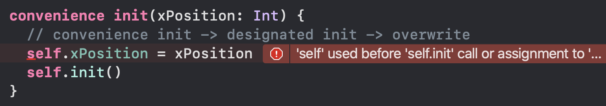
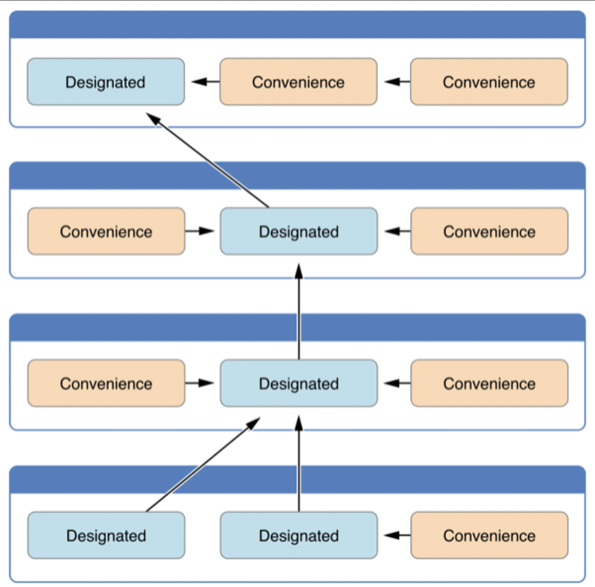
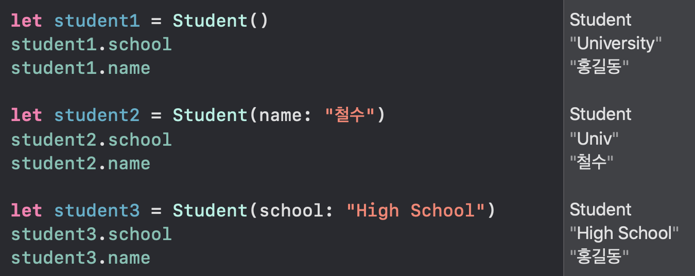

# Class Initializer

## 기초 이론

-  swift 의 객체는 사용하기 전 모든 저장 프로퍼티에 대해 초기화 필수
- 다음 3가지중 하나를 택해 초기화 해야함
  1. 초기값 지정
  2. 옵셔널 타입 - nil 값으로 초기화
  3. 초기값이 없고 옵셔널 타입이 아닌 프로퍼티에 대해서는 초기화 메서드에서 설정 (init)

```swift
class Circle {
  var desc: String?			// 옵셔널 초기화
  var radius: Int = 20	// 초기값 지정
  var xCoordinate: Int	// init()  
  var yCoordinate: Int	// init()
  
  // 초기화 방법 1, 고정값 지정
  init() { 
    xCoordinate = 5
    yCoordinate = 10	
  }

  //초기화 방법 2, 사용자가 지정
  init(xCoordinate: Int, yCoordinate: Int) {	
    self.xCoordinate = xCoordinate
    self.yCoordinate = yCoordinate
  }
}

let circle1 = Circle()		// 초기화 방법 1, 고정값 지정
let circle2 = Circle(xCoordinate: 10, yCoordinate: 5)   //초기화 방법 2, 사용자가 지정

```


## Designated initializer

- 클래스에 반드시 1개 이상 필요
- 초기화가 필요한 모든 프로퍼티를 단독으로 초기화 가능한 Initailizer
- 위에서 사용한  init(),  init(xCoordinate: Int, yCoordinate: Int) 가 여기에 해당
- 초기화 과정에서 반드시 한 번은 호출
- self로 접근가능 ( 초기화와 동시에 접근 )


##  Convenience Initializer

#### 기초 이론

- 단독으로 모두 초기화 할 수 없고 일부만 처리한 뒤 다른 생성자에게 나머지 부분 위임
- 중복되는 초기화 코들르 줄이기 위해 사용
- self로 접근불가 ( self 초기화 필요 )
  - init 이 먼저 되지 않으면 에러생성
  - 

#### 코드 예제

```swift
class Rectangle {
  var width: Int
  var height: Int
  var xPosition: Int
  var yPosition: Int
  var cornerRadius: Int
  
  init() {
    // designated init
    width = 20
    height = 20
    xPosition = 10
    yPosition = 10
    cornerRadius = 5
  }

  // designated init
  init(width: Int, height: Int, xPosition: Int, yPosition: Int, cornerRadius: Int) {
    self.width = width
    self.height = height
    self.xPosition = xPosition
    self.yPosition = yPosition
    self.cornerRadius = cornerRadius
    
    // self.init()  // [Error] designated 생성자에서 다른  designated 생성자 지정 불가
  }
  
  // convenience init으로 지정하고 -> designated init를 추가로 overwrite 가능해짐
  // self 키워드를 사용하려면 self가 초기화가 끝나야 가능함
  convenience init(xPosition: Int) {
    self.init()											// 다른 초기화 사용 가능,  init먼저 하고 뒤에 따로 지정 
    self.xPosition = xPosition			// 따로 지정하고 싶은 부분만 별도 값 받음
  }
  
   // [convenience init -> designated init]
   convenience init(width: Int, height: Int, cornerRadius: Int) {
     //  width, height, cornerRadius 를 받아서 특정 값만 사용자 입력값 사용
		 self.init(width: width, height: height, xPosition: 10, yPosition: 30, cornerRadius: cornerRadius)
  }

  // [convenience init -> convenience init]
  convenience init(cornerRadius: Int) {
    self.init(width: 20, height: 20, cornerRadius: cornerRadius)
  }
}

let rectangle1 = Rectangle(xPosition: 20)
let rectangle2 = Rectangle(cornerRadius: 5)
let rectangle3 = Rectangle(width: 10, height: 10, xPosition: 10, yPosition: 5, cornerRadius: 3)
```


## Failable Initializer

### 기초이론

- 인스턴스 생성시 특정 조건을 만족하지 않으면 객체를 생성하지 않는것
- 생성이 되면 옵셔널 타입을 반환하게 되며, 생성 실패시에는 nil 반환

### 코드 예제

```swift
class Person {
  let name: String
  let age: Int
  
  init?(name: String, age: Int) {
    guard age > 0 else { return nil }
    self.name = name
    self.age = age
  }
}

//Failable Initializer
if let person = Person(name: "James", age: 20) {
  person
}

if let person = Person(name: "James", age: -5) {
  person
} else {
  "Failed"
}
```


## Super Class Initializing

#### 기초이론

- 서브 클래스는 자기 자신 이외에 수퍼 클래스의 저장 프로퍼티까지 초기화 해야 함
- 서브 클래스는 수퍼 클래스의 지정 생성자(Designated Initializer) 호출 필요 (Convenience는 호출 불가)
- 수퍼 클래스의 지정 생성자가 기본 init 함수 하나만 있을 경우는 별도로 작성하지 않아도 자동으로 super.init() 메서드 호출
- 생성자가 여러 개인 경우, 어떤 초기화 메서드를 선택해야 할지 알 수 없으므로 선택해주지 않으면 오류
-  이 때는 서브 클래스에서 수퍼 클래스의 생성자를 명시적으로 선택해주어야 함.
- 편의 생성자(Convenience Initializer)는 무관



#### 코드 예제 

1. Super Class Init

```swift
// ======= Super Class =======
class Base {
  var someProperty: String
  
  init() {  // 초기화하는 함수가 하나만 있을 경우 정상적으로 실행됨
    someProperty = "someProperty"
  }

// 만약 초기화 함수가 2개일 경우 사용자가 정확하게 지정하지 않으면 오류
//  init(_ value: String) {		
//    self.someProperty = "someProperty"
//  }
  
  convenience init(someProperty: String) {
    self.init()
    self.someProperty = someProperty
  }
}

// ======= SubClass =======
class Rectangle: Base {
  var width: Int
  var height: Int
  
  override init() {
    width = 10
    height = 5
    
// 프로그래밍 관점에서 명시적으로 적어주는것이 제일 좋다.    
//    super.init()   // 수퍼 클래스의 지정 생성자가 기본 생성자 하나만 있을 경우 자동 호출
//    super.init(someProperty: "생성자 내에서 수퍼 클래스의 편의 생성자 호출 시 오류")
  }
  
  init(width: Int, height: Int) {
    self.width = width
    self.height = height
  }
}
```


2. Override Init

```swift
// ---------- [ Override Init ] ----------

class Human {
  var name: String
  
  init() {
    self.name = "홍길동"
  }
  init(name: String) {
    self.name = name
  }
}


class Student: Human {
  var school: String
  
  override init() {
    self.school = "University"
    
    // 두 개의 지정 생성자 중 하나 호출
    super.init()
//    super.init(name: "이순신")
  }
  
  init(school: String) {
    self.school = school
    super.init()
  }
  
  
  // 수퍼 클래스의 지정 생성자 오버라이드와 편의 생성자 기능 동시 사용 가능
  convenience override init(name: String) {
    self.init(school: "Univ")			// <- 중복
    self.name = name							// name을 별도로 받음
  }
}

let student1 = Student()
let student2 = Student(name: "철수")
let student3 = Student(school: "High School")

```

- 출력 값




### Question

> 자식 클래스를 먼저 초기화하고 부모 클래스 초기화 메서드를 나중에 호출해야 하는 이유는?

```swift
//---------- [ Self Init First ] ----------

class Shape {
  var name: String
  var sides: Int
  
  init(sides: Int, named: String) {
    self.sides = sides
    self.name = named
    printShapeDescription()
  }
  
  func printShapeDescription() {
    print("Shape Name : \(self.name)")
    print("Sides : \(self.sides)")
  }
}


class Triangle: Shape {
  var hypotenuse: Int
  
  init(hypotenuse: Int) {
    self.hypotenuse = hypotenuse
    super.init(sides: 3, named: "Triangle")
  }
  
  override func printShapeDescription() {
    print("Hypotenuse : \(self.hypotenuse)")
  }
}


print("\nShape")
let rectangle = Shape(sides: 4, named: "Rect") // Sides : 4

print("Triangle")
let triangle = Triangle(hypotenuse: 12)				// Hypotenuse : 12

print("\nShape - Triangle")
let triangle1: Shape = Triangle(hypotenuse: 12)  // Hypotenuse : 12


/*
 자신의 프로퍼티를 초기화 하지 않은 상태로 부모 클래스의 초기화 메서드를 호출했을 경우
 초기화되지 않은 프로퍼티를 사용하게 되는 일이 발생 할 수 있음.
 
 위 코드에서는 부모클래스의 init 메서드에서 printShapeDescription() 을 호출하고 있지만
 실제 실행되는 메서드는 그것을 호출한 객체의 override 된 메서드가 실행되는 것을 확인 가능
 */
```


## Initializer의 다른 특징들

### 기초 이론

- 초기화 이전에 프로퍼티 사용 불가
- 초기화 이전 단계에서 인스턴스 메서드 호출 불가
  - 다른 메서드 호출 중 초기화 되지 않은 프로퍼티를 사용할 수도 있기 때문에 컴파일러 에러 발생

### 코드예제

1. **초기화 관련 예제**

```swift
class Chart {
  var height: Int
  var xPosition: Int
  
  init(height: Int, xPosition: Int) {
    self.height = height
    print(self.height)    // 초기화 이후 사용 가능
//    print(self.xPosition) // 초기화 이전
    
//    self.printValues()     // 저장 프로퍼티 전체 초기화 이전
    self.xPosition = xPosition
//    print(self.height, self.xPosition) // 초기화 이후
//    self.printValues()     // 저장 프로퍼티 전체 초기화 이후
  }
  
  func printValues() {
  }
}

let chart = Chart(height: 10, xPosition: 20)


```

- 초기화가 안되면 self 불가

  - ```swift
    print(self.height)    // 오류 height의 초기화가 뒤에 있음
    self.height = height  
    ```


2. **Extention Initializer**
   - Extension에서는 Convenience Initializer는 추가할 수 있어도 Designated Initialzer는 할 수 없음

```swift
class Rectangle {
  var height: Int
  var xPosition: Int
  
  init(height: Int, xPosition: Int) {
    self.height = height
    self.xPosition = xPosition
  }
}

extension Rectangle {
  convenience init(height: Int) {
    self.init(height: height, xPosition: 10)
  }
  
  // Extension 내에서는 Convenience Initializer 만 가능
  // init(xPosition: Int) {
  //  self.height = 10
  //  self.xPosition = xPosition
  //}
}

let rect1 = Rectangle(height: 10, xPosition: 20)
let rect2 = Rectangle(height: 10)
```


- 오류 내용

```
error: etc.xcplaygroundpage:59:3: error: designated initializer cannot be declared in an extension of 'Rectangle'; did you mean this to be a convenience initializer?
  init(xPosition: Int) {
  ^
  convenience 

```


3. **Required Initializer**
   - 상속받은 클래스에서 반드시 작성해주어야 하는 초기화 메서드가 있을 때 required 키워드 사용
   - 이 경우 서브 클래스에서는 해당 초기화 메서드를 반드시 작성해주어야 하며, override 키워드 생략 가능

```swift
class Animal {
  let name: String
  let age: Int

  init(age: Int) {
    self.age = age
    self.name = "Tori"
  }
  required init(name: String) {
    self.name = name
    age = 3
  }
}

class Dog: Animal {
  let type: String
  
  init(type: String) {
    self.type = type
    super.init(name: "Tori")
  }
  
  required init(name: String) {
    self.type = "Poodle"
    super.init(name: name)
  }
}

let dog1 = Dog(type: "Poodle")
let dog2 = Dog(name: "Tori")
```


4. **Deinitializer**
   - 할당된 객체가 해제될 때 deinit 메서드 호출

```swift
class SomeClass {
  init() {
    // 객체가 생성될때
    print("Initialized")
  }
  deinit {
    // 객체 메모리 해제 시 동작할 코드
    print("Deinitialized")
  }
}


func someFunction() {
  let someClass = SomeClass()
  someClass    // 함수 종료와 함께 해제
}
someFunction()

```


## 강의노트 :point_right: [링크](../LectureNote/Initializer.playground)

