# Git 특강 소스코드 관리 및 협업 방법

## git 기본 명령어

### 

### Branch 관련 명령어

1. 브런치 확인

   - git branch : 로컬브런치를 보여줌

   - git branch -r : 리모트 영역의 브런치를 보여줌

   - git branch - a : 로컬/리모트 영영의 브런치를 보여줌

   - 실습화면

     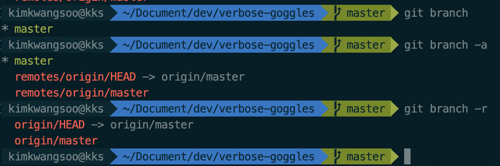

2. 브런치 생성 및 이동

   - git branch <브런치 이름>
     - 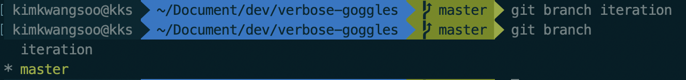
   - git checkout <브런치 이름>
     - 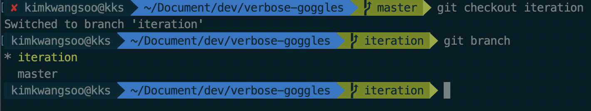

### [ 브런치 실습 1 - 브런치 생성, 소스코드 작성 후 master에 merge ]

- 개요 
  -  iteration 브런치를 생성하여 소스코드 생성한 뒤 master에 merge 후 변화 확인

1. 간단한 파이썬 소스코드 작성
   - iteration 브런치 생성
     - git branch iteration
   - 파이선 소스코드 작성 후 정상 실행 확인
     - master에는 hello를 한번 출력하는 .py 파일 존제

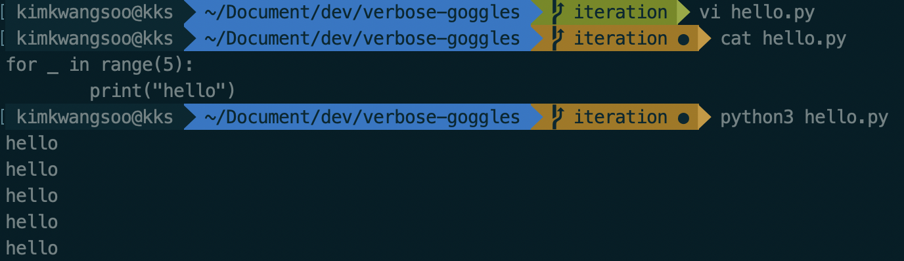

2. 생성한 소스코드 add, commit 진행 
   - git status : 현재 상태 확인
   - git add `파일이름` : 파일을 스테이징 영역에 등록 ( 파일 이름대신 `.` 입력 시 변경된 전체 파일 업로드)
   - git commit -m "`commit Comment 작성`"
   - iteration 브런치에는 hello 5번 출력하는 .py 코드 존제

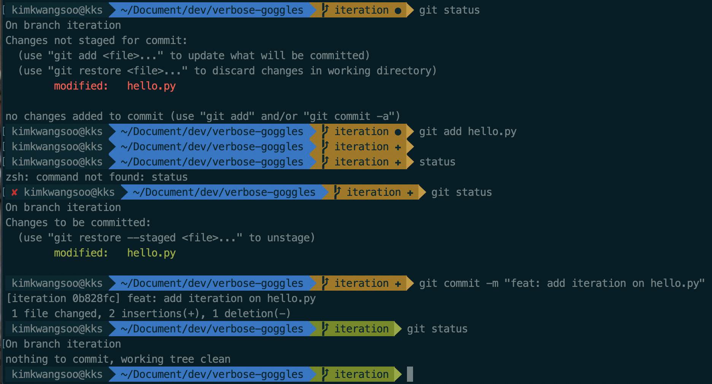

3. 마스터 브런치로 이동 
   - git checkout master
   - master hello.py는 "hello" 한번 출력됨

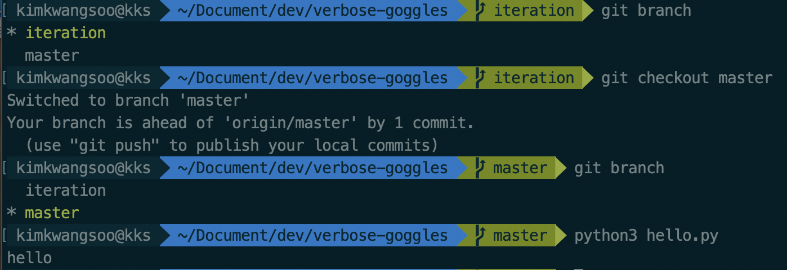

4. iteration브런치 merge 진행 후 소스코드 변경 확인
   - master 브런치내 소스코드가 기존 `hello 한번 출력하는 코드` 가 아닌 iteration에 있던 `hello 5번 출력하는 코드` 로 변경됨

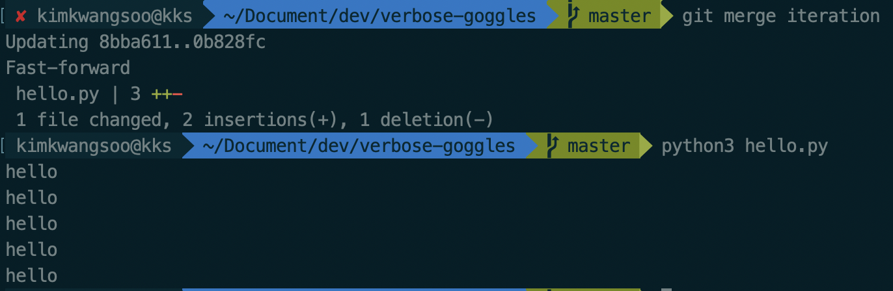

5. merge가 완료된 브런치의 경우 삭제
   - git branch -D `삭제할 브런치 이름`

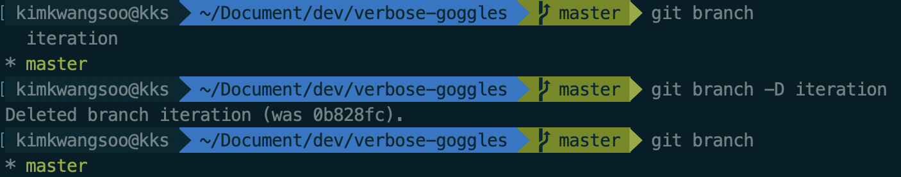

### [ 브런치 실습 2 - 소스코드 충동 상황 생성 후 처리 방법 ]

1. cs 브런치 생성 

2. master 브런치 내의 소스코드 생성 

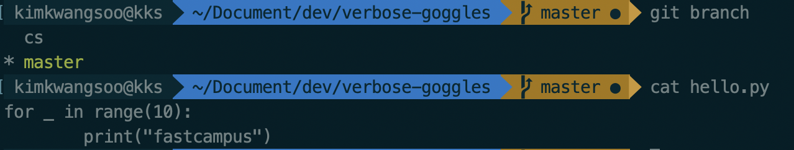

3. master 브런치 내 소스코드 add & Commit

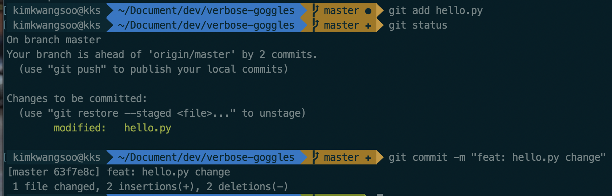

4. cs 브런치 내 소스코드 생성 및 정상 실행 확인 후 add & commit

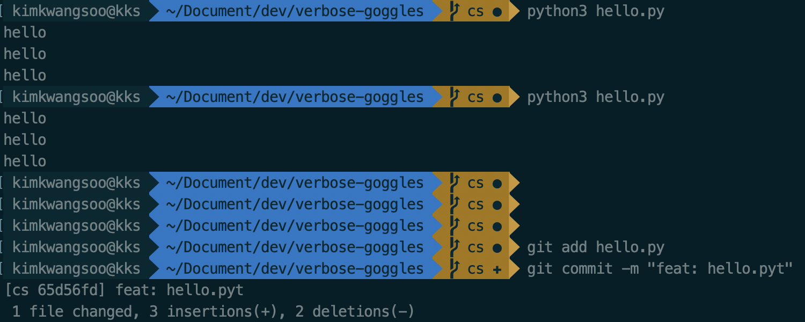

5. master로 checkout 후 merge 시도 후 결과 확인
   - 에러 메시지 확인 `CONFLICT (content) : Merge conflict in hello.py `

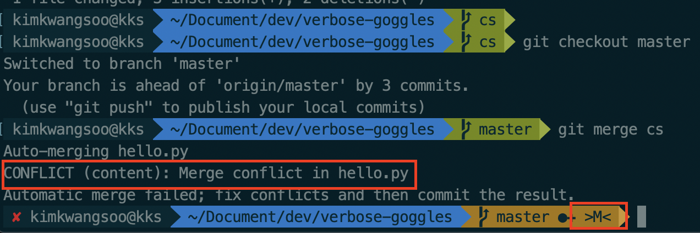

6. 소스코드 수정
   - vi hello.py
     - 수정 전과 같이 충돌이 발생 한 부분의 코드를 둘다 보여줌
     - 구현에 필요한 부분을 적절하게 작성하여 수정 후 저장

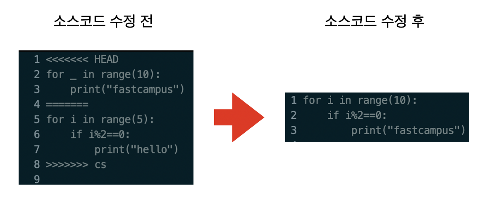

7. 변경된 소스코드가 의도한대로 작동하는지 테스트 한 후 status 확인

8. 변경된 소스코드 add&commit 후 `conflict` 확인
   - 에러없이 잘 commit된 경우 conflict 해소

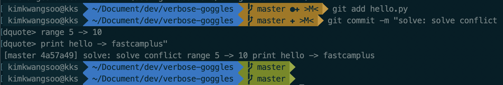

### [ 브런치 실습 3 - git flow을 통한 소스코드 협업 과정 실습 ]

- git Flow 활용 (git Extenstion )
  - 링크 : [git flow](https://danielkummer.github.io/git-flow-cheatsheet/index.ko_KR.html)

1. git flow init을 이용하여 자동으로 브런치 생성
   - develop : 정식 배포가 아닌 개발을 위한 브런치
   - feature : 기능 단위를 개발하기 위한 브런치
   - bugfix : 버그 수정을 위한 브런치
   - hotfix : 긴급한 수정을 요하는 사항을 수정하기 위한 브런치
   - support : 기타 지원 기능을 수정하기 위한 브런치

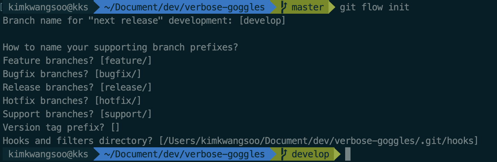

2. feature 기능 개발을 위한 브런치 생성
   - git flow feature start `브런치 이름`
   - 위 명령어는 아래의 명령어들을 통합한 것과 같음
     1. git branch feature/fixtypo
     2. git checkout feature/fixtypo

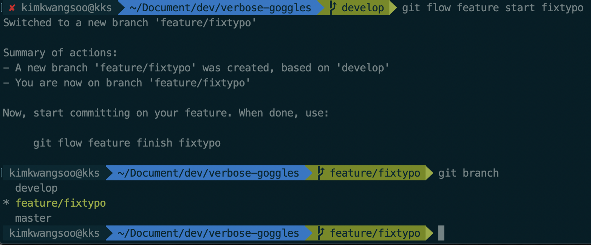

3. 신규 기능 소스코드 추가 후 add&commit

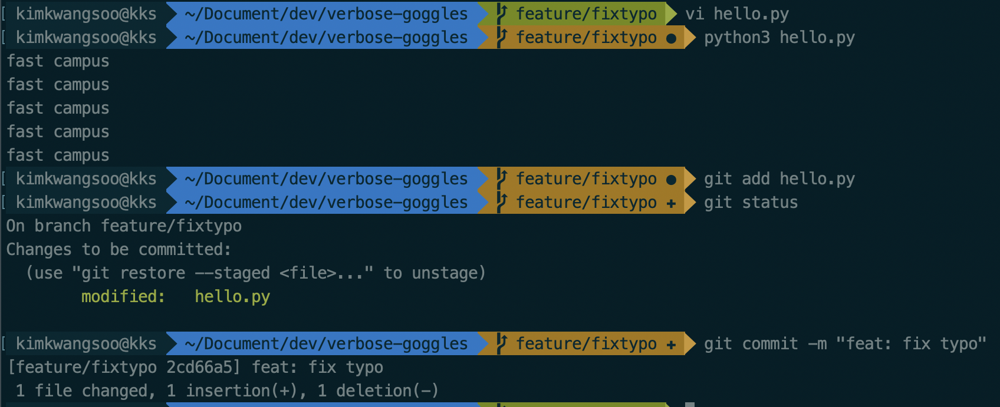

4. git flow feature 종료 
   - 기능 추가 종료시 자동으로 develop에 merge되고 `feature/fixtypo` 는 삭제, develop  브런치로 이동
   - 해당 명령어는 아래의 명령어의 통합
     1. git chechout develop
     2. git merge fixtypo
     3. git branch -D fixtypo

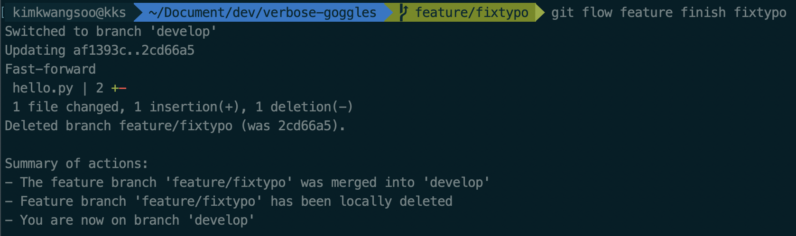

5. 기능이 완료된 사항을 릴리즈 진행
   - 실무에서는 시니어 개발자가 주로 release 진행
   - 버전 정보 
     - v0.0.1.200617001
     - v0 : 메인 버전
     - .0 : 마이너 버전
     - .1 : 하위 기능 
     - 200617 : 배포 날자
     - 001 : 위 날짜의 1번째 배포

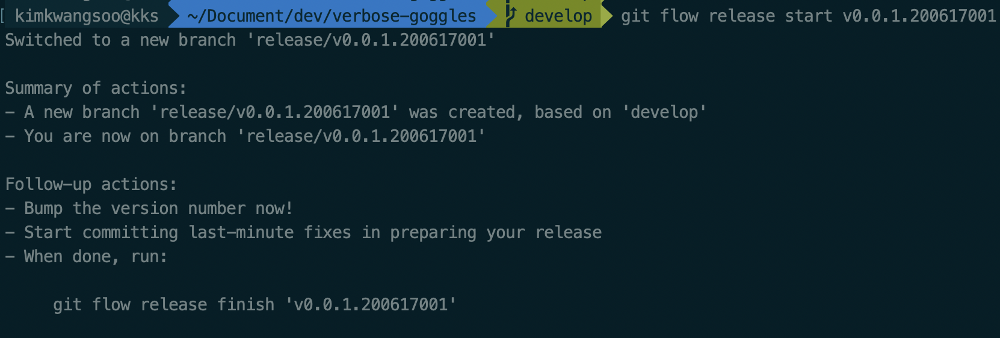

6. merge comment 작성

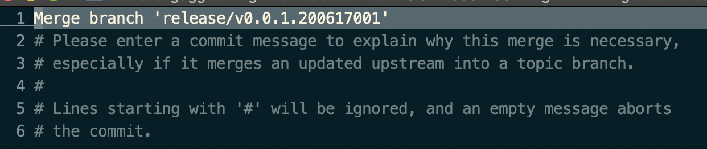

7. 릴리즈 노트 작성
   - 추후 릴리즈 노트를 모아서 기능 업데이트 포트폴리오로 사용 가능
   - 매우 중요함

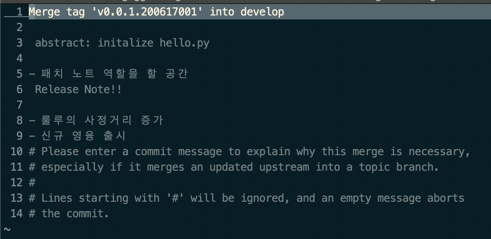

8. 최종 버전 push

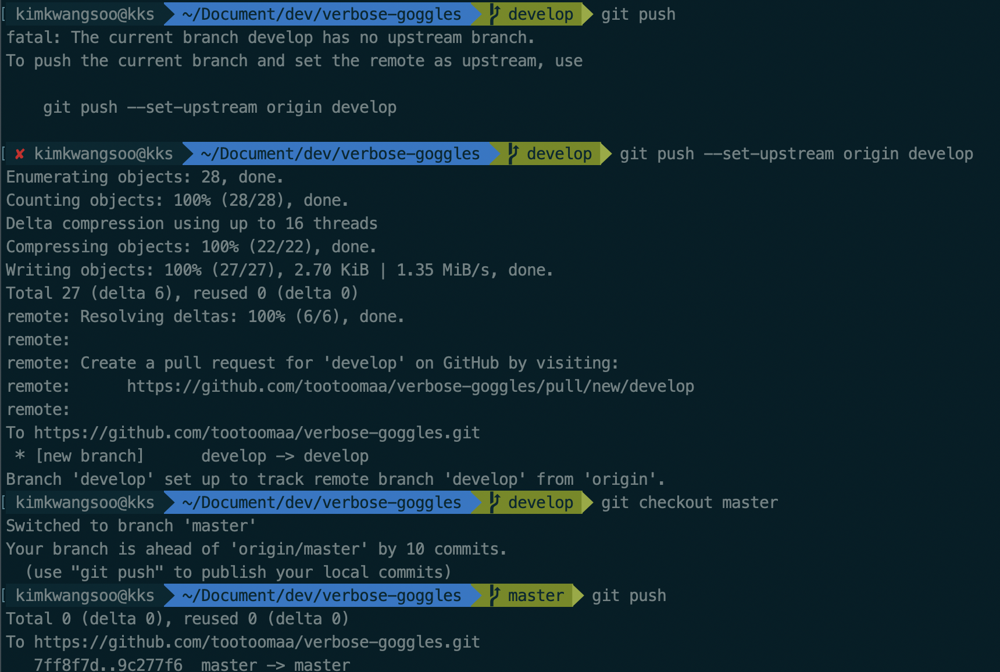

9. github 에서 확인

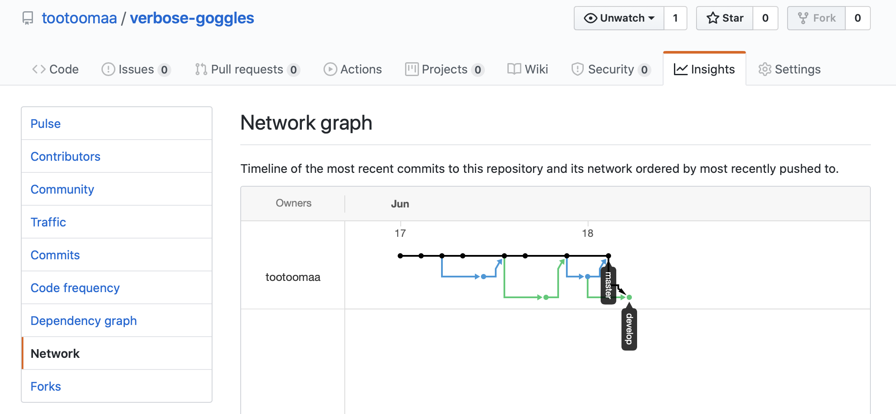