# UICollectionView

## 기초 이론

- 정의
  - 정렬된 자료들을 사용자가 원하는 형식에 맞게 유연하게 표현할 수 있는 객체
  - UITableView 와 비슷하지만 데이터를 다양하게 표현하는데는 CollectionView가 더 확장성이 있음
  - UICollectionView vs UITableView
    - 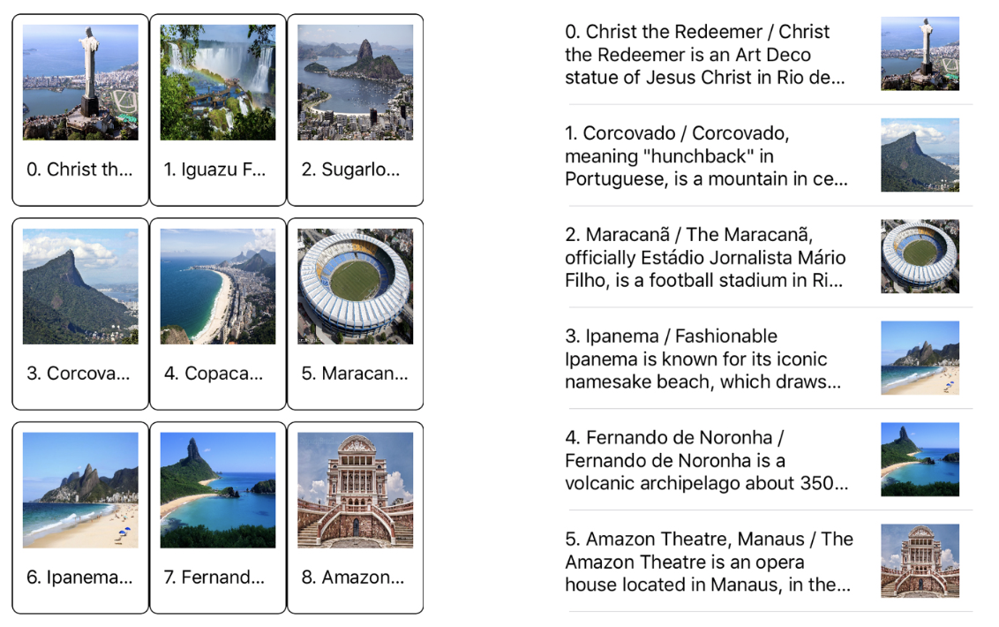

- 데이터 표현 방식 ( Content & Latout )
  - 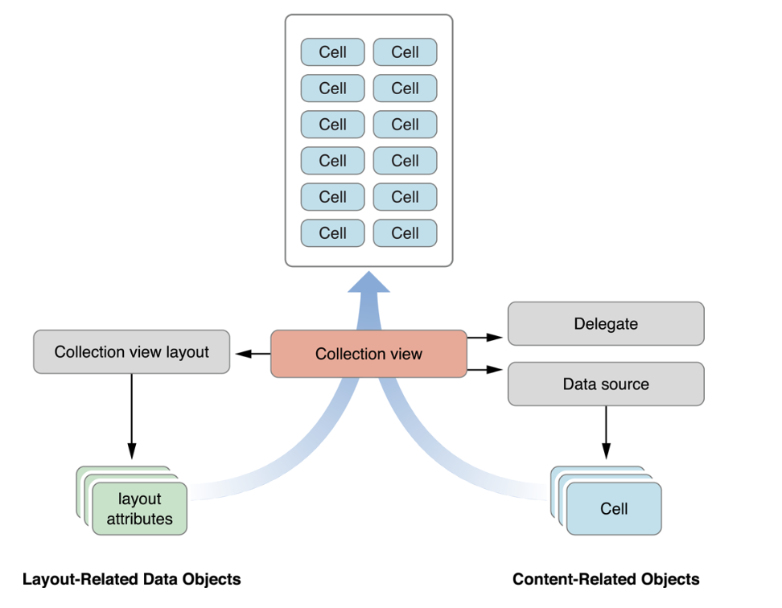
- 관련 class 및 protocol for collection views

| PerPose                                    | Class / Protocol                                             |
| ------------------------------------------ | ------------------------------------------------------------ |
| Top-level containment  and management | UICollectionView UICollectionViewController             |
| Content mangement                     | **[Protocol]** UICollectionVeiwDataSource  **[Protocol]** UICollectionVeiwDelegate |
| Presentation                               | UICollectionReuseableView UICollectionViewCell          |
| Layout                                     | UICollectionViewLayout UICollectionViewLayoutAttributes UICollectionVeiwUpdateItem |
| Flow Layout                                | UICollectionViewLayot **[Protocol]** UICollectionviewDelegateFlowLayout |

- 표현되는 요소의 3가지 타입
  1. 셀 ( Cell )
     - 컬렉션 뷰의 단일 데이터 항목을 표현하는 개체이며, 레아이웃에 의해 배치되는 주요 요소
     - 각 셀은 다중 섹션으로 나누거나 하나의 그룹으로 묶어 표현할 수 있음
     - 컬렉션 뷰의 컨텐츠 영역에 셀들을 배열하는 것이 레아웃 객체(Layout object)의 주요 업무
  2. 보조(보충) 뷰 (Supplementary views)
     - 섹션 또는 컬렉션 뷰 자체에 대한 헤더와 푸터 같은 역할을 하는 뷰
     - 셀처럼 데이터를 표현할수 있을 것은 같지만, 유저가 선택할 수 없는 뷰
     - 선택사항이며, 유저가 선택할 수 없고 레아아웃 객체를 통해 정의
  3. 장식 뷰 (Decoration Views)
     - 컬렉션 뷰의 배경을 꾸미는 데 사용하는 시각적 장식용 뷰
     - 선택사항이며, 유저가 선택할 수 없고 레이아웃 객체를 통해 정의

#### **CollectionViewLayout**

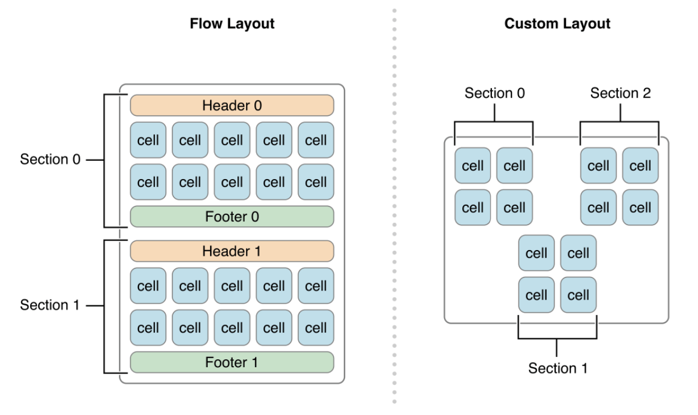

#### **FlowLayout**

- UICollectionViewFlowLayoutClass 
- Scroll Direction - vertical / Horizontal

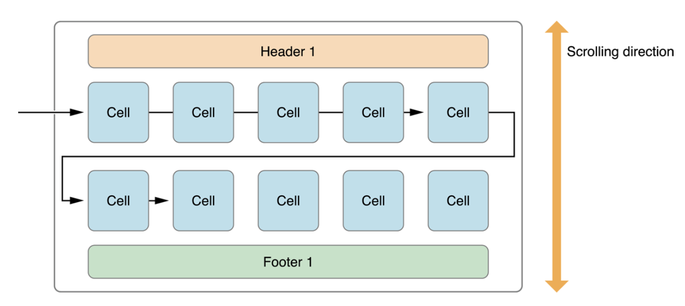

#### **Section Layout**

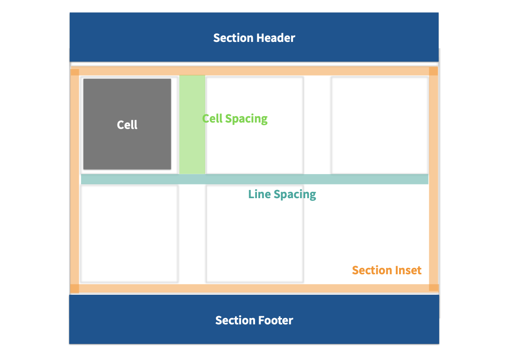

#### 

#### **UICollectionViewDelegateFlowLayout Protocol**

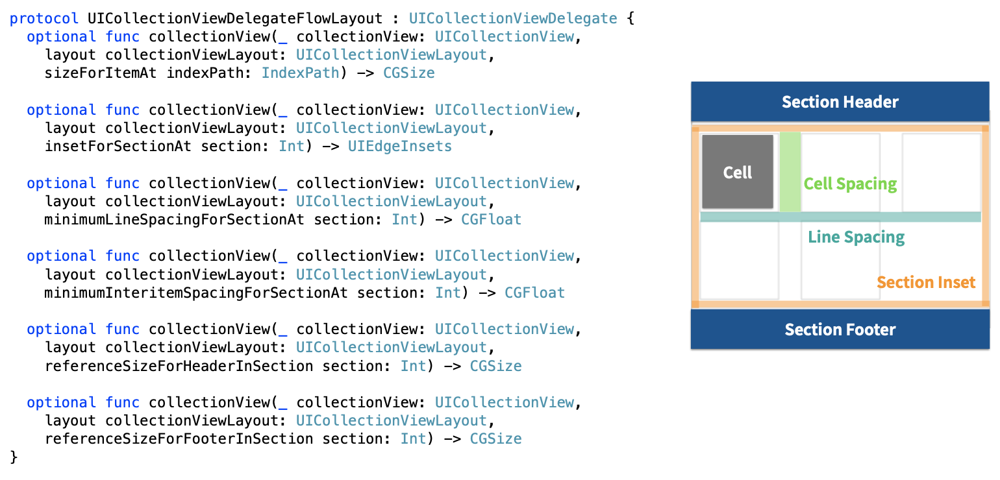

#### Section Inset

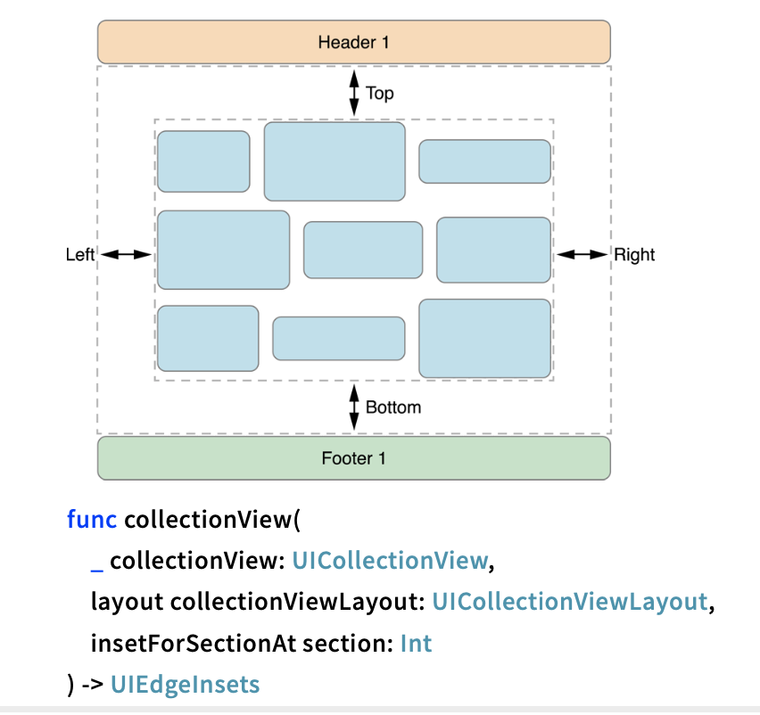

#### Line spacing

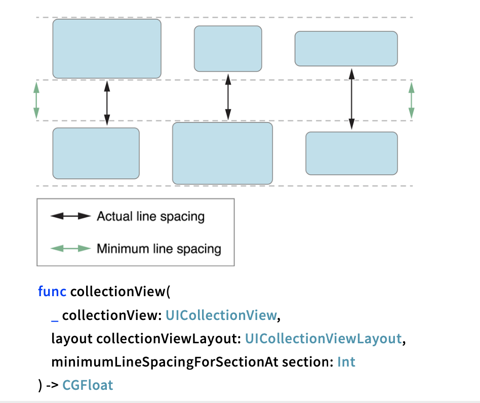

#### Item Size

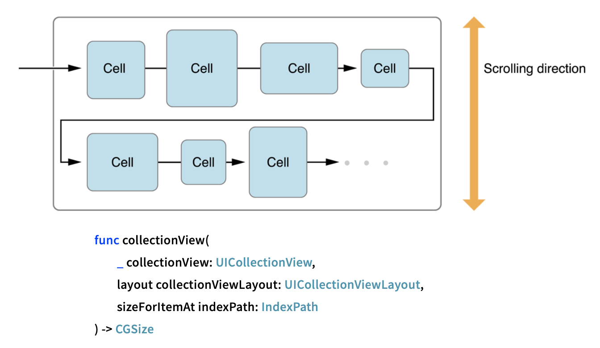

#### **Header / Footer Size**

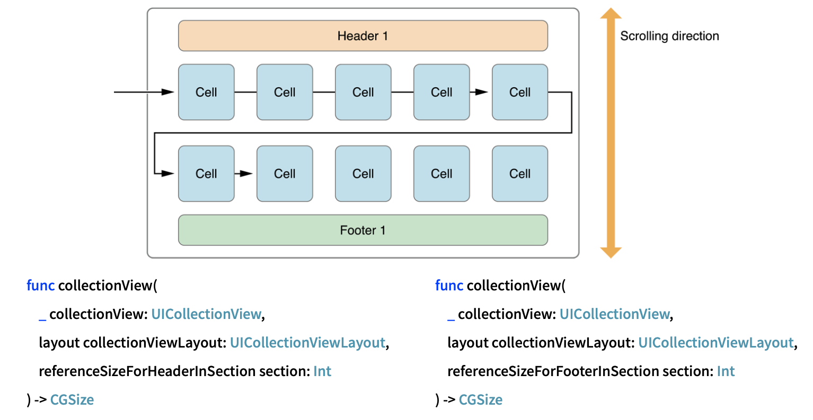

#### **Layout Metrics**

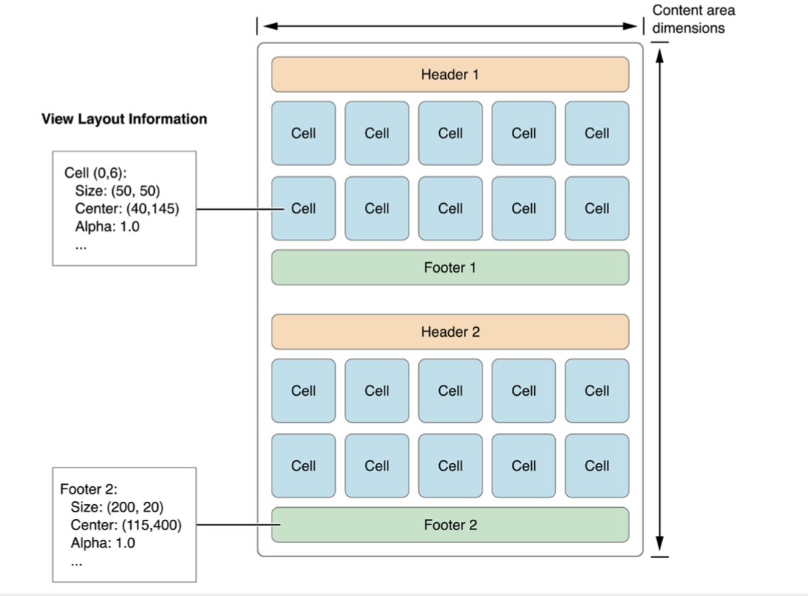

#### **Cell Hierarchy**

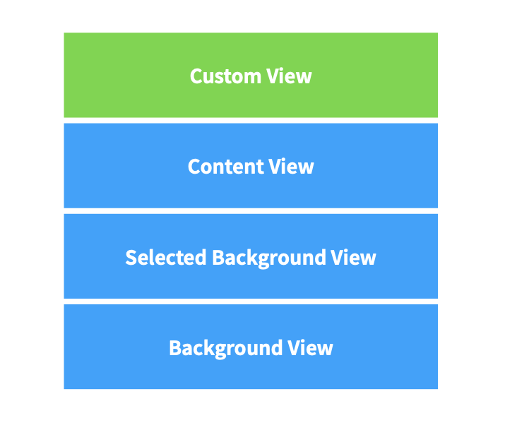

#### **The State of a Cell**

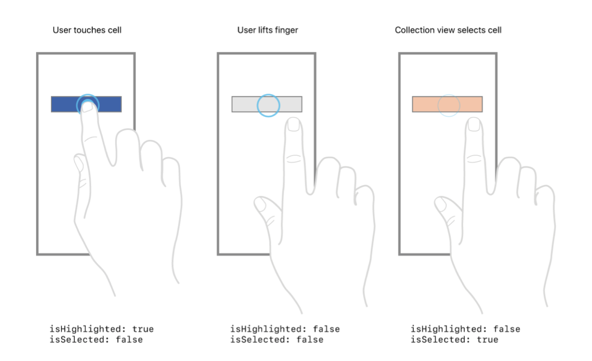

### LectureNote :point_right: [링크](../LectureNote/CollectionView.pdf)

