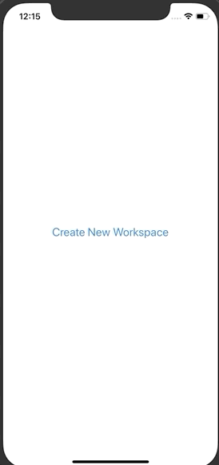
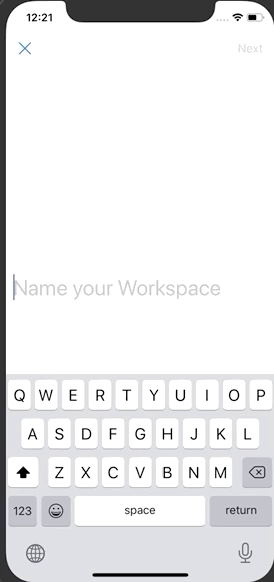

# Build DynamicAutoLayout 실습

## 구현 목표

### 1. 구현 예시

<video src="/Users/kimkwangsoo/Document/dev/FastCampus_IOS_school/TIL/image/200619/200619_resultMainUI.mov"></video>

### 2. 구현 상세 내용

1. CreateNewWSViewController  
   -  버튼을 눌렀을 때 NameWSViewController로 이동하는데 쓰이는 뷰컨트롤러  
2. NameWSViewController
   - 화면이 띄워지면서 동시에 키보드가 올라오도록 구현
   - X 버튼을 눌러서 화면 닫기 (SF Symbol의 xmark 이용)
   - Next 버튼은 텍스트필드에 글자가 하나라도 있어야 활성화  비활성화 상태에서 버튼을 누르거나 키보드 리턴키를 누르면 기기에 진동 주기
   - 텍스트필드에는 생성할 워크스페이스 이름 입력  텍스트필드가 비어 있지 않은 경우 "Name your workspace" 문자열이 텍스트필드 위로 올라오게 하기  텍스트가 없으면 다시 원래 위치로 내려오게 만들기
   - 한글자 이상 입력한 상황에서 Next를 누르거나 키보드의 리턴키를 눌렀을 때,  입력한 텍스트 우측으로 UIActivityIndicatorView 1초동안 띄우기  
   - 1초 뒤에 IndicatorView 없애면서 UrlWSViewController로 이동하기 
   - UrlWSViewController로 이동할 때 현재 입력한 텍스트필드의 문자열 전달하기  
3. UrlWSViewController 
   - 화면이 띄워지면서 동시에 키보드가 올라오도록 구현 
   - 텍스트필드에 전 단계에서 전달한 문자열을 텍스트필드 초깃값으로 지정하고,  텍스트필드에 입력한 문자열에 맞춰 ".slack.com" 문자열이 적절하게 따라 움직이도록 하기 
   - 텍스트필드의 최대 글자수는 20글자. 
   - 텍스트필드에 "error" 또는 "fail" 문자열이 입력되면 텍스트가 좌우로 흔들리는 효과 주기 (영상 후반부 참고)  + 기기에 진동을 주고, 텍스트필드 아래에 오류 메시지 출력 -> "This URL is not available. Sorry!"  해당 오류 메시지는 텍스트 필드 글자를 수정하면 다시 숨기기 
   - 뒤로 가기 버튼은 SF Symbol의 "arrow.left" 이용  (샘플 영상의 뒤로 가기 이미지와 다름) 
   - Next 버튼은 텍스트필드에 글자가 하나라도 있어야 활성화  비활성화 상태에서 버튼을 누르거나 키보드 리턴키를 누르면 기기에 진동 주기


## 구현 상세 내용

#### CreateNewWSViewController

##### 구현 화면



##### 소스코드

- 오토 레이아웃 구성

  - ```swift
    // 오토레이아웃 구성
    view.addSubview(stringButtom)
    stringButtom.translatesAutoresizingMaskIntoConstraints = false
    NSLayoutConstraint.activate([
      stringButtom.centerXAnchor.constraint(equalTo: view.centerXAnchor),
      stringButtom.centerYAnchor.constraint(equalTo: view.centerYAnchor,constant: -50)
    ])
    ```

- 버튼 엑션

  - ```swift
    //MARK: - buttonAction
    @objc func tabStringButton() {
    
      let nameWSVC = NameWSViewController()
      nameWSVC.modalPresentationStyle = .fullScreen
      navigationController?.pushViewController(nameWSVC, animated: true)
    }
    ```


#### NameWSViewController

##### 구현 화면



##### 소스코드

- **오토레아이아웃 관련**

  - ```swift
    fileprivate func configureAutoLayout() {
        view.addSubview(nameTextLabel)
        view.addSubview(nameTextFields)
        view.addSubview(activityIndicator)
        
        nameTextFields.translatesAutoresizingMaskIntoConstraints = false
        nameTextLabel.translatesAutoresizingMaskIntoConstraints = false
        activityIndicator.translatesAutoresizingMaskIntoConstraints = false
        
        NSLayoutConstraint.activate([
          nameTextFields.leadingAnchor.constraint(equalTo: view.leadingAnchor,constant: 10),
          nameTextFields.centerYAnchor.constraint(equalTo: view.centerYAnchor,constant: -50),
          
          nameTextLabel.leadingAnchor.constraint(equalTo: nameTextFields.leadingAnchor),
          nameTextLabel.widthAnchor.constraint(equalTo: nameTextFields.widthAnchor, multiplier: 1),
          nameTextLabel.bottomAnchor.constraint(equalTo: nameTextFields.topAnchor, constant: -5),
          
          activityIndicator.leadingAnchor.constraint(equalTo: nameTextFields.leadingAnchor),
          activityIndicator.centerYAnchor.constraint(equalTo: nameTextFields.centerYAnchor)
        ])
      }
    ```

- **textField delegate**

  - 글자수 제한

  - 사용자의 입력값에 따른 에니메이션 실행 

  - ```swift
    func textField(_ textField: UITextField, shouldChangeCharactersIn range: NSRange, replacementString string: String) -> Bool {
      // 글자의 길이 구하기
      let newLength = (textField.text?.count)! + string.count - range.length
    
      if newLength > 0 && nameTextLabel.alpha != 1 {
        // nameTextLabel 나타내주는
        UIView.animate(withDuration: 0.5, animations: {
          self.nameTextLabel.center.y -= 10
          self.nameTextLabel.alpha = 1
        })
        self.navigationItem.rightBarButtonItem?.isEnabled = true
      } else if newLength == 0 {
        
        // nameTextLabel 사라지는 animation
        UIView.animate(withDuration: 0.5, animations: {
          self.nameTextLabel.alpha = 0			// 사라지도록 지정
          self.nameTextLabel.center.y += 10 // 위치 아래로 이동
        })
        navigationItem.rightBarButtonItem?.isEnabled = false // next버튼 비활성화
      }
    
      // 글자수 제한
      if newLength > 16 {
        textField.text?.removeLast()
      }
      return !(newLength > 16)
    }
    ```

- Next버튼 및 키보드의 return 버튼 눌럿을때 실행되는 함수

  - ```swift
    func userFinishAction() {
      // 현재 textField에 저장된 스트링의 크기 계산
      guard let string = nameTextFields.text else { return }
      let stringSize = (string as NSString).size()
      print(stringSize.width)
    
      // activityIndicator 글자 크기만큼 이동
      self.activityIndicator.center.x += self.activityIndicator.center.x + stringSize.width*2 + 10
      // activityIndicator 에니메이션 실행
      self.activityIndicator.startAnimating()
    
      // 1초 뒤 activityIndicator 종료 후 다음 화면으로 이동
      let time = DispatchTime.now() + .seconds(1)
      DispatchQueue.main.asyncAfter(deadline: time) {
        self.activityIndicator.stopAnimating() // 에니메이션 중지
        // 다음 화면으로 넘어감
        let urlWSVC = UrlWSViewController()
        urlWSVC.userName = self.nameTextFields.text // 다음 화면으로 사용자 이름 전달
        self.navigationController?.pushViewController(urlWSVC, animated: true)
      }
    }
    ```

- 화면 실행시 자동으로 키보드 실행 및 textfield 커서 활성화

  - ``` swift
    override func viewWillAppear(_ animated: Bool) {
      self.nameTextFields.becomeFirstResponder()
    }
    ```

#### UrlWSViewController 

##### 구현 화면


##### 소스코드

- 오토레이아웃 구성

  - ``` swift
    fileprivate func configureAutolayout() {
      view.addSubview(textLabel)
      view.addSubview(urlTextField)
      view.addSubview(informationLabel)
      view.addSubview(followUrlLabel)
      view.addSubview(errorLabel)
    
      urlTextField.delegate = self
    
      textLabel.translatesAutoresizingMaskIntoConstraints = false
      urlTextField.translatesAutoresizingMaskIntoConstraints = false
      informationLabel.translatesAutoresizingMaskIntoConstraints = false
      followUrlLabel.translatesAutoresizingMaskIntoConstraints = false
      errorLabel.translatesAutoresizingMaskIntoConstraints = false
    
      NSLayoutConstraint.activate([
    
        informationLabel.leadingAnchor.constraint(equalTo: view.leadingAnchor,constant: 10),
        informationLabel.trailingAnchor.constraint(equalTo: view.trailingAnchor,constant: -10),
        informationLabel.centerYAnchor.constraint(equalTo: view.centerYAnchor,constant: -20),
    
        urlTextField.leadingAnchor.constraint(equalTo: informationLabel.leadingAnchor),
        urlTextField.bottomAnchor.constraint(equalTo: informationLabel.topAnchor,constant: -100),
    
        textLabel.leadingAnchor.constraint(equalTo: informationLabel.leadingAnchor),
        textLabel.trailingAnchor.constraint(equalTo: informationLabel.trailingAnchor),
        textLabel.widthAnchor.constraint(equalTo: informationLabel.widthAnchor),
        textLabel.bottomAnchor.constraint(equalTo: urlTextField.topAnchor,constant: -5),
    
        followUrlLabel.leadingAnchor.constraint(equalTo: urlTextField.trailingAnchor),
        followUrlLabel.trailingAnchor.constraint(equalTo: view.trailingAnchor),
        followUrlLabel.centerYAnchor.constraint(equalTo: urlTextField.centerYAnchor),
    
        errorLabel.leadingAnchor.constraint(equalTo:urlTextField.leadingAnchor),
        errorLabel.topAnchor.constraint(equalTo:urlTextField.bottomAnchor, constant: 2),
    
    
      ])
    }
    ```

- 전달받은 사용자 이름 자동 입력

  - ```swift
      var userName:String? {
        didSet {
          
          guard let userName = userName else { return }
          urlTextField.text = "\(userName)"
          
        }
      }
    ```

- url textField 관련 부분

  - ``` swift
    func textField(_ textField: UITextField, shouldChangeCharactersIn range: NSRange, replacementString string: String) -> Bool {
      let newLength = (textField.text?.count)! + string.count - range.length
    
      // textField 를 다시 수정할 떄  ErrorLabel을 숨겨줌
      errorLabel.isHidden = true
    
      // Next 버튼 활성화&비활성화 제어
      navigationItem.rightBarButtonItem?.isEnabled = (newLength != 0 ? true : false)
      // 글자수 제한
      if newLength > 20 {
        textField.text?.removeLast()
    
      }
      return !(newLength > 20)
    }
    ```

- 사용자가 입력이 모두 끝났을때 처리 방법

  - next 버튼 & 키보드 return 입력 시 처리

  - ``` swift
    func userEndEditting() {
      let text = urlTextField.text?.lowercased()
      if text == "error" || text == "fail"  {
        let impactFeedbackGenerator = UIImpactFeedbackGenerator(style: .heavy)  // 원하는 스타일로 변경
        impactFeedbackGenerator.prepare()   // 진동 준비
        impactFeedbackGenerator.impactOccurred()   // 진동
        errorLabel.isHidden = false // Error 라벨 표시
      }
    }
    ```


## 전체 소스코드 :point_right: [링크](../SourceCode/200619_SlackNewWorkspaceUI)


