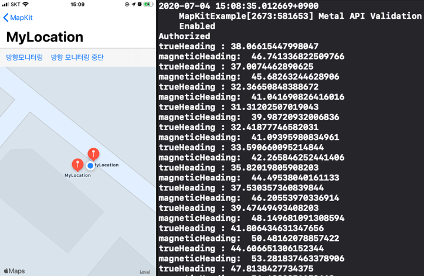

# CoreLocation Practice

## 실습 1 - 방향 모니터링

### 구현 화면

- 방향 모티터링 클릭 후 아이폰 좌우 회전시 변경된 방향의 각도를 알려줌
- 움직이는 방향으로 추가 `핀`을 생성해줌




### 소스코드

- Location 정보를 사용하기 위한 기초 셋팅 부분
  1. LocationManager 인스턴스 생성
  2. 위치 정보 접근을 위한 권한 처리
  3. 사용자가 승인한 권한을 통해 위치 정보 접근

```swift
// 1. Location Manager를 통해서 위치와 관련한 작업 처리
let locationManager = CLLocationManager() 

override func viewDidLoad() {
  super.viewDidLoad()

  locationManager.delegate = self

  // 권한 요청
  checkAuthorizationStatus()

  //나의 위치를 보여줌
  mapView.showsUserLocation = true
  mapView.mapType = .standard //위성 정보 .satellite, .hybrid₩
}

// 2. 사용자에게 권한을 요청하기 위한 설정
func checkAuthorizationStatus() {
  switch CLLocationManager.authorizationStatus() {
    case .notDetermined:
    locationManager.requestWhenInUseAuthorization()
    case .restricted, .denied: break
    case .authorizedWhenInUse:		// 해당 앱을 사용중에만 위치정보 접근 허용
    fallthrough
    case .authorizedAlways:				// 해당 앱은 항상 위치정보 접근 허용
    startUpdatingLocation()     	 // 위치 추적 시작
    @unknown default: fatalError()
  }
}

func startUpdatingLocation() {
  // 3.사용자의 위치정보 권한을 가져와서 확인하는 작업
  let status = CLLocationManager.authorizationStatus()
  guard status == .authorizedAlways || status == .authorizedWhenInUse,
  CLLocationManager.locationServicesEnabled() else { return }

  locationManager.desiredAccuracy = kCLLocationAccuracyHundredMeters // 정확도 설정
  locationManager.distanceFilter = 10.0                              // 어느정도의 거리를 보여줄지 설정
  locationManager.startUpdatingLocation()                            // 위치 정보 업데이트 시작
}
```


- 방향 모니터링 관련 설정

```swift
// 방향 로케이션 모니터링
@IBAction func mornitoringHeading(_ sender: Any) {
  guard CLLocationManager.headingAvailable() else {return}	// 해당 장치가 기능이 있는지 확인
  locationManager.startUpdatingHeading()	// 모니터링 시작
}

@IBAction func stopMornitoring(_ sender: Any) {
  locationManager.stopUpdatingHeading()		// 모니터링 중지
}

func locationManager(_ manager: CLLocationManager, didUpdateHeading newHeading: CLHeading) {
  // 도북 : 지도상의 북쪽
  print("trueHeading :" , newHeading.trueHeading) // 진북
  print("magneticHeading: ", newHeading.magneticHeading) // 자북
}
```


- Map View 와 관련된 부분

```swift
extension MyLocationViewController: CLLocationManagerDelegate {
  
  func locationManager(_ manager: CLLocationManager, didChangeAuthorization status: CLAuthorizationStatus) {
    // 권한 체크
    switch status {
    case .authorizedWhenInUse, .authorizedAlways:
      print("Authorized")
    default:
      print("Authorized")
    }
  }
  
  func locationManager(_ manager: CLLocationManager, didUpdateLocations locations: [CLLocation]) {
    // [CLLocation] 위치 정보를 배열 형태로 가지고 있음
    let current = locations.last!
    
    // 현제 시간으로부터 몇 초나 차이나는지 확인 한뒤 음/양수의 절대값 내부의 데이터만 처리하도록
    if(abs(current.timestamp.timeIntervalSinceNow) < 10 ) {
      let coordinate = current.coordinate //위 경도
      
      // 크기를 어느정도 보여줄지 정하는
      // 경도 1도는 약 11km, 위도 1도는 위도에 따라 다름, 적도 (111km) ~ 극지방 (0km)
      let span = MKCoordinateSpan(latitudeDelta: 0.0002, longitudeDelta: 0.0002)
      
      let regin = MKCoordinateRegion(center: coordinate, span: span)
      mapView.setRegion(regin, animated: true)
      
      // 위치 찍기 ( 현제 위치 전달 )
      addAnnotation(location: current)
    }
  }
  
  func addAnnotation(location: CLLocation) {	// 특정 위치에 핀 찍기
    let annotation = MKPointAnnotation()
    annotation.title = "MyLocation"								// 핀 이름 설정
    annotation.coordinate = location.coordinate		// 위치 설정
    mapView.addAnnotation(annotation)							// mapView에 추가
  } 
}
```


## 실습 2 - Geocode

### 구현 화면

- 지도상의 특정 위치를 터치했을때 그 위치의 주소 출력됨
- 또한 얻어낸 주소를 통해 경도, 위도 구하여 줄력하기


### 소스코드

- 화면을 터치했을때 처리하는 부분
  - UITapGuestureRecognizer 사용

```swift
@IBAction func recognizeTap(gesture: UITapGestureRecognizer) {

  let touchPoint = gesture.location(in: gesture.view) 
  // 화면 상에서 터치한 부분 터치 정보 얻어옴
  print("touchPoint: \(touchPoint)")
  //(112.0, 233.5)

  let coordinate = mapView.convert(touchPoint, toCoordinateFrom: mapView) 
  // mapView 내에서 터치한 좌표로 변경
  print("coordinate: \(coordinate)")
  //CLLocationCoordinate2D(latitude: 37.560440826855356, longitude: 126.98387169279137)

  let location = CLLocation(latitude: coordinate.latitude, longitude: coordinate.longitude) 
  // 위도와 경도 구하기
  print("location: \(location)")
  //location: <+37.56044083,+126.98387169> +/- 0.00m (speed -1.00 mps / course -1.00) @ 2020/07/04 15:30:29 Korean Standard Time

  reverseGeocoder(location: location) // 위도 경도를 통해 실제 주소로 변환
}
```


- Geocode를 실제 주소로 변경

```swift
func reverseGeocoder(location :CLLocation) {
    let geocoder = CLGeocoder()
    
    geocoder.reverseGeocodeLocation(location) { placeMark, error in
      print("\n---------- [ 위경도 -> 주소 ] ----------")
      if error != nil {
        return print(error!.localizedDescription)
      }
      
      // 국가별 주소체계에 따라 어떤 속성 값을 가질지 다름
      guard let address = placeMark?.first,
        let country = address.country,
        let administrativeArea = address.administrativeArea,
        let locality = address.locality,
        let name = address.name
        else { return }
      
      let addr = "\(country) \(administrativeArea) \(locality) \(name)"
      print(addr)
      self.geocodeAddressString(addr)
    }
  }
```


- 실제 주소를 -> Geocode로 변경

```swift
func geocodeAddressString(_ addressString: String) {
    print("\n ---- 주소 -> 위경도 ----- >")
    let geocoder = CLGeocoder()
    geocoder.geocodeAddressString(addressString) { (placeMark, error) in
      if error != nil {
        return print(error!.localizedDescription)
      }
      
      guard let place = placeMark?.first else { return }
      print(place.location?.coordinate)
    }
  }
```


## 실습 3 - Basic Annotation

### 구현 화면

- 화면 내 핀 생성 및 제거
- 기존에 저장해둔 장소로 초점 이동
- `카레라 설정`을 통해서 뷰가 확대되는 기능


### 소스코드

- 화면시 처음 시작되었을때 초기 위치 값 지정

  - ```swift
    override func viewDidAppear(_ animated: Bool) {
      super.viewDidAppear(animated)
      let center = CLLocationCoordinate2DMake(37.566308, 126.977948)  // 시청 좌표값
      setRegion(coordinate: center) // 해당 위치를 중앙으로 설정
    }
    
    func setRegion(coordinate: CLLocationCoordinate2D) {
      let span = MKCoordinateSpan(latitudeDelta: 0.1, longitudeDelta: 0.1) // 확대 크기 조절
      let region = MKCoordinateRegion(center: coordinate, span: span)
      mapView.setRegion(region, animated: true)
    }
    ```

- 화면에 핀 생성 설정 관련

  - 핀 추가 버튼을 통해 사전에 지정된 좌표값으로 핀 생성

  - ```swift
    @IBAction private func addAnnotation(_ sender: Any) {
      let cityHall = MKPointAnnotation()
      cityHall.title = "시청"
      cityHall.subtitle = "서울특별시"
      cityHall.coordinate = CLLocationCoordinate2DMake(37.566308, 126.977948)
      mapView.addAnnotation(cityHall)
    
      let namsan = MKPointAnnotation()
      namsan.title = "남산"
      namsan.coordinate = CLLocationCoordinate2DMake(37.551416, 126.988194)
      mapView.addAnnotation(namsan)
    
      let gimpoAirport = MKPointAnnotation()
      gimpoAirport.title = "김포공항"
      gimpoAirport.coordinate = CLLocationCoordinate2DMake(37.559670, 126.794320)
      mapView.addAnnotation(gimpoAirport)
    
      let gangnam = MKPointAnnotation()
      gangnam.title = "강남역"
      gangnam.coordinate = CLLocationCoordinate2DMake(37.498149, 127.027623)
      mapView.addAnnotation(gangnam)
    }
    ```

- 랜덤 핀 이동 버튼

  - ```swift
    @IBAction private func moveToRandomPin(_ sender: Any) {
      guard mapView.annotations.count > 0 else { return }
      let random = Int.random(in: 0..<mapView.annotations.count) // 랜덤 추출
      let annotation = mapView.annotations[random]
      setRegion(coordinate: annotation.coordinate)  // 해당 위치로 이동
    }
    ```

- 핀 제거 버튼

  - ```swift
    @IBAction private func removeAnnotation(_ sender: Any) {
      mapView.removeAnnotations(mapView.annotations)
    }
    ```

- 카메라 이동 버튼

  - ```swift
    @IBAction private func setupCamera(_ sender: Any) {
      let camera = MKMapCamera()	// 카메라 관련 인스턴스 생성
      let coordinate = CLLocationCoordinate2DMake(37.551416, 126.988194) // 위치 지정
      camera.centerCoordinate = coordinate	 // 카메라의 중심을 해당 위치로 지정
      camera.centerCoordinateDistance = 100  // 고도
      camera.pitch = 60.0  // 카메라 각도 (0일 때 수직으로 내려다보는 형태)
      camera.heading = 180   // heading: 카메라 방향 0 ~ 360 (맵을 바라보는 방향)
      mapView.setCamera(camera, animated: true)
    }
    ```


### 소스코드 :point_right: [링크](../SourceCode/)