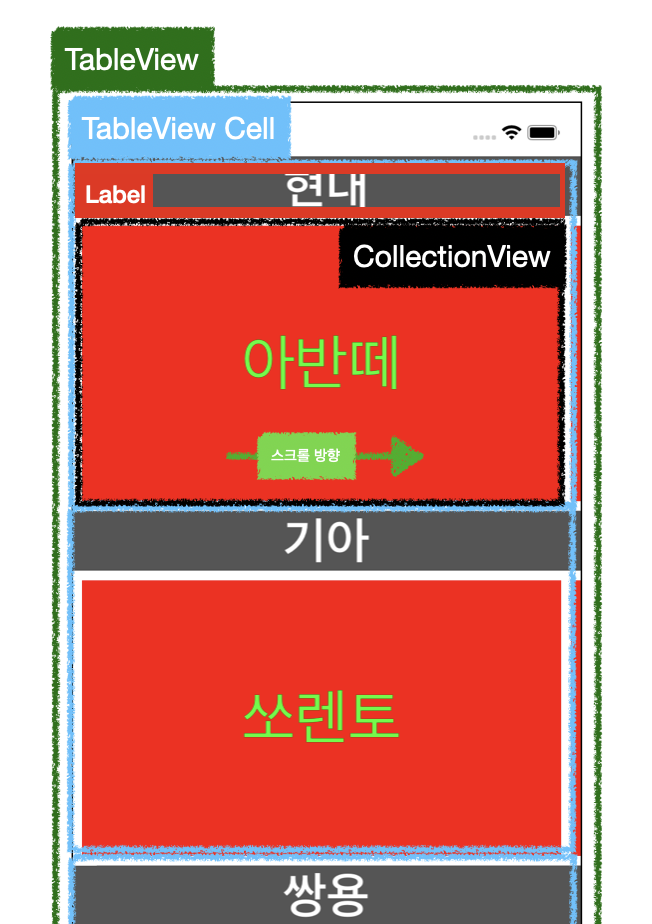
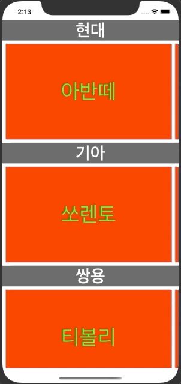

# CollecionView in TableView 특강

## 특강 개요

- 구현 목표
  - TableView의 Cell 안에 CollectionView을 넣어 가로로 스크롤하여 다양한 데이터를 보여주는 화면
- 화면 구성
  - TableView
    - tableViewCell
      - Label + CollectionView
  - 


### 구현 화면

- TableViewCell 안에 Label과 CollectionView구현
- data는 배열 + 딕셔너리 형태를 참고하여 구현




### 소스코드

- **ViewController.swift 주요코드**

  - 데이터 부분

    - ```swift
      let data: [[String: Any]] = [
        ["브랜드": "현대", "차종": ["아반떼", "펠리세이드", "싼타페", "그랜저", "투싼", "쏘나타"]],
        ["브랜드": "기아", "차종": ["쏘렌토", "k5", "셀토스", "카니발", "k3", "k9", "모하비"],],
        ["브랜드": "쌍용", "차종": ["티볼리", "코란도", "렉스턴"],],
        ["브랜드": "삼성", "차종": ["XM3", "QM6", "SM6", "SM3", "SM5", "SM&"],],
        ["브랜드": "벤츠", "차종": ["E클레스", "CLS클래스", "S클래스", "C클래스"],],
        ["브랜드": "BMW", "차종": ["X5", "5시리즈", "X4", "3시리즈", "X6", "X6 그란투리스모"]]
      ]
      ```

  - TablaVeiw 구현 부분

    - ```swift
      extension ViewController: UITableViewDataSource {
       func tableView(_ tableView: UITableView, numberOfRowsInSection section: Int) -> Int{
          return data.count
        }
      
       func tableView(_ tableView: UITableView, cellForRowAt indexPath: IndexPath) -> UITableViewCell {
          guard let cell = tableView.dequeueReusableCell(withIdentifier: CustomCell.identifier, for: indexPath) as? CustomCell else { fatalError() }
      
         // cell에서 데이터 설정을 위한 configure 함수 사용
         cell.configure(data: data[indexPath.row]) 
      
          return cell
        }
      }
      ```

  - tableViewCell 재사용에 따른 collectionView offset 변경 방지를 위한 코드

    - ```swift
      extension ViewController: UITableViewDelegate {	
      	// cell 보여지기 전에 기존에 저장해둔 Offset값 설정
        func tableView(_ tableView: UITableView, willDisplay cell: UITableViewCell, forRowAt indexPath: IndexPath) {
          guard let cell = cell as? CustomCell else {return}
          cell.offset = cachedOffset[indexPath.row] ?? .zero
        }
        // cell 사라지기 전에 기존에 저장해둔 Offset값 설정
        func tableView(_ tableView: UITableView, didEndDisplaying cell: UITableViewCell, forRowAt indexPath: IndexPath) {
          guard let cell = cell as? CustomCell else {return}
          cachedOffset[indexPath.row] = cell.offset
        }
      }
      ```

- **tableVeiw CustomCell 주요 코드**

  - 주요 변수 설정

    - ```swift
      // CollectionView layout 관련 옵션 
      struct Standard {
        static let space: CGFloat = 8
        static let inset: UIEdgeInsets = .init(top: 8, left: 8, bottom: 8, right: 8)
      }
      
      // collectionView의 offset값 저장
      var offset: CGPoint { 
        // set(value)
        set {
          collectionView.contentOffset = newValue
        }
        get {
          collectionView.contentOffset
        }
      }
      ```

  - 데이터 셋팅 부분 

    - ```swift
      // tableViewCell을 생성하는 부분에서 받아온 데이터를 label 및 carList함수에 저장
      func configure(data: [String:Any]) {
        titleLabel.text = data["브랜드"] as? String ?? "없음"
        carList = data["차종"] as? [String] ?? [String]()
      
        collectionView.reloadData()
      }
      ```

  - CollectionView Cell 생성 부분

    - ```swift
      extension CustomCell: UICollectionViewDataSource {
        
        func collectionView(_ collectionView: UICollectionView, numberOfItemsInSection section: Int) -> Int {
          return carList.count
        }
        
        func collectionView(_ collectionView: UICollectionView, cellForItemAt indexPath: IndexPath) -> UICollectionViewCell {
          
          guard let cell = collectionView.dequeueReusableCell(withReuseIdentifier: MyCellectionCell.identifier, for: indexPath) as? MyCellectionCell else { fatalError()}
          
          cell.backgroundColor = .red
          cell.titleLabel.text = carList[indexPath.item]
          
          return cell
        }
      }
      ```

  - CollectionView Layout 설정

    - ```swift
      // layout 설정
      extension CustomCell: UICollectionViewDelegateFlowLayout {  
        func collectionView(_ collectionView: UICollectionView, layout collectionViewLayout: UICollectionViewLayout, minimumLineSpacingForSectionAt section: Int) -> CGFloat {
          return Standard.space
        }
        
        func collectionView(_ collectionView: UICollectionView, layout collectionViewLayout: UICollectionViewLayout, minimumInteritemSpacingForSectionAt section: Int) -> CGFloat {
          return 0
        }
      
        func collectionView(_ collectionView: UICollectionView, layout collectionViewLayout: UICollectionViewLayout, insetForSectionAt section: Int) -> UIEdgeInsets {
          return Standard.inset
        }
        
        func collectionView(_ collectionView: UICollectionView, layout collectionViewLayout: UICollectionViewLayout, sizeForItemAt indexPath: IndexPath) -> CGSize {
          
          let width = collectionView.frame.width - Standard.inset.left - Standard.inset
            .right - Standard.space
          let height = collectionView.frame.height - Standard.inset.top - Standard.inset.bottom
          
          return CGSize(width: width, height: height)
        }
      }
      ```


### 소스코드 :point_right: [링크](../SourceCode/200624_CollecionView+TableView)

