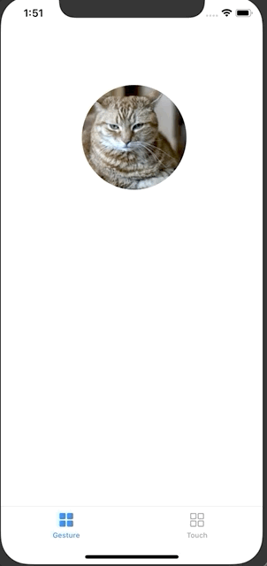

# UIGuestureRecognizer Practice

## 실습 1 

### 구현 화면

- 오른쪽/왼쪽으로 드래그 시 고양이 사진 변경
- 화면 터치 시 크기 변경 ( 4배 <-> 원래 크기 )



### 소스코드

- Tap 발생 시 처리 function

```swift
var isQuardruple = false

@IBAction private func handleTapGesture(_ sender: UITapGestureRecognizer) {
  guard sender.state == .ended else { return }
  print("tab")
  if !isQuardruple {	// false일 경우 크기 증가
    imageView.transform = imageView.transform.scaledBy(x: 4, y: 4)
  } else { 	// ture일 경우 크기 원래대로 복귀
    imageView.transform = .identity
  }
  isQuardruple.toggle()
}
```

- Swipe 발생 시 처리 function

```swift
// MARK: Swipe
@IBAction private func handleSwipeGesture(_ sender: UISwipeGestureRecognizer) {
  guard sender.state == .ended else { return }
  print(sender.direction.rawValue) // 왼쪽: 1, 오른쪽: 2

  if sender.direction == .left {	 // 스크롤 방향이 왼쪽일 경우 
    imageView.image = UIImage(named: "cat2")
    sender.direction = .right
  } else {												// 스크롤 방향이 오른쪽일 경우 
    imageView.image = UIImage(named: "cat1")
    sender.direction = .left
  }
}
```

- Rotation 발생 시 처리 Function

```swift
@IBAction private func handleRotationGesture(_ sender: UIRotationGestureRecognizer) {
  print(sender.rotation)

  imageView.transform = imageView.transform.rotated(by: sender.rotation)
  sender.rotation = 0 // 0으로 변경하지 않으면 돌아가는 속도가 점점 빨라짐
}
```


## 실습 2

### 구현 화면


### 소스코드

- 해당 이미지 클릭 시 처리 function

```swift
var isHoldingImage = false
var gapX:CGFloat = 0
var gapY:CGFloat = 0

// 터치가 시작될때 처리하는 함수
override func touchesBegan(_ touches: Set<UITouch>, with event: UIEvent?) {
  super.touchesBegan(touches, with: event)
  print("------ [Begin]-------")
  guard let touch = touches.first else { return }
  let touchPoint = touch.location(in: touch.view)	// 실제 터치한 위치

  if imageView.frame.contains(touchPoint) {	// 해당 그림을 클릭 한경우 처리
    imageView.image = UIImage(named: "cat2")	// 그림 변경
    gapX = imageView.center.x - touchPoint.x 	// 터치한 위치와 해당 그림의 가운데 좌표 차이 계산
    gapY = imageView.center.y - touchPoint.y
    isHoldingImage.toggle()										// 이미지를 잡고 있는 상태를 나타내주는 변수 true 변경
  }
}

// 마우스틑 누른 상태에서 움질일때 처리 사항
override func touchesMoved(_ touches: Set<UITouch>, with event: UIEvent?) {
  super.touchesMoved(touches, with: event)
  guard isHoldingImage, let touch = touches.first else { return }
  let touchPoint = touch.location(in: touch.view)

  // 마우스클릭 거리와 이미지 사이의 거리를 계속 같아지도록 움직이도록 설정
  if imageView.frame.contains(touchPoint) {		
    imageView.center.x = touchPoint.x + gapX
    imageView.center.y = touchPoint.y + gapY
  }
}

// 터치가 끝난 경우 처리
override func touchesEnded(_ touches: Set<UITouch>, with event: UIEvent?) {
  super.touchesEnded(touches, with: event)
  guard isHoldingImage else { return }
  imageView.image = UIImage(named: "cat1")	// 사진 다시 변경
  gapY = 0	// 계산 값 초기화
  gapX = 0
  isHoldingImage.toggle()	// bool 변수 변경
}

override func touchesCancelled(_ touches: Set<UITouch>, with event: UIEvent?) {
  super.touchesCancelled(touches, with: event)
  print("------ [cancel]-------")
  // 시스템이나 다른 방해(인터럽션) 상황으로 인해서 App이 inactive상태로 변경될떄
  // 터치 이벤트중이던 뷰가 사라지거나 다른 화면으로 전환 될 경우
  guard let touch = touches.first else { return }
  let touchPoint = touch.location(in: touch.view)
  guard isHoldingImage else { return }
}
```


- shake (흔들기) 시 처리하는 함수

```swift
override func motionBegan(_ motion: UIEvent.EventSubtype, with event: UIEvent?) {
    super.motionBegan(motion, with: event)
    if motion == .motionShake {
      imageView.image = UIImage(named: "cat2")
    }
  }
  
  override func motionEnded(_ motion: UIEvent.EventSubtype, with event: UIEvent?) {
    super.motionEnded(motion, with: event)
    if motion == .motionShake {
      imageView.image = UIImage(named: "cat1")
    }
  }
  
  override func motionCancelled(_ motion: UIEvent.EventSubtype, with event: UIEvent?) {
    super.motionCancelled(motion, with: event)
    if motion == .motionShake {
      imageView.image = UIImage(named: "cat1")
    }
  }
```


### 소스코드 :point_right: [링크](,,/SourceCode/200625_UIGuesture)

