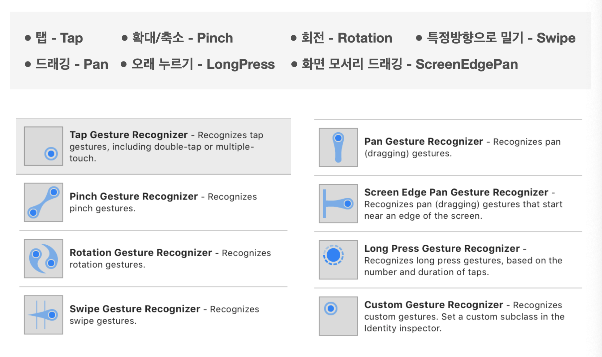
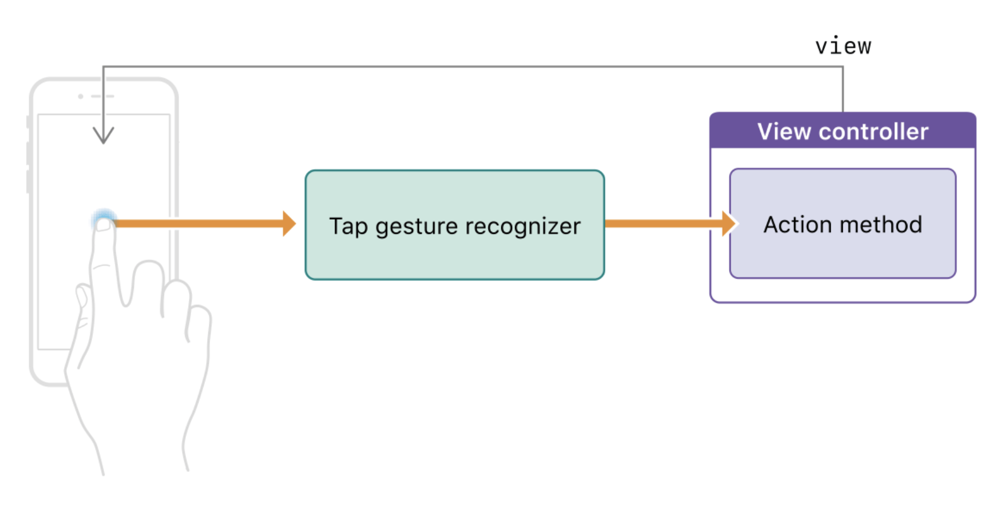
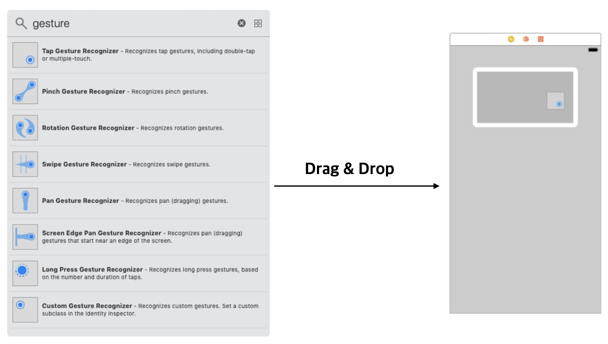
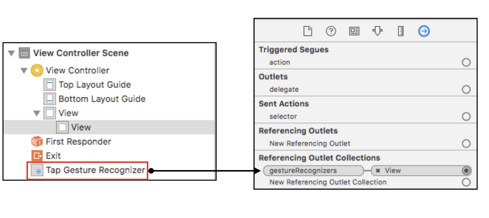
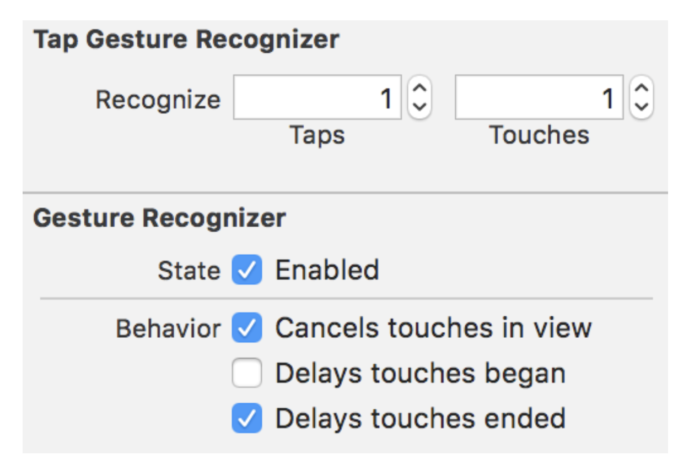
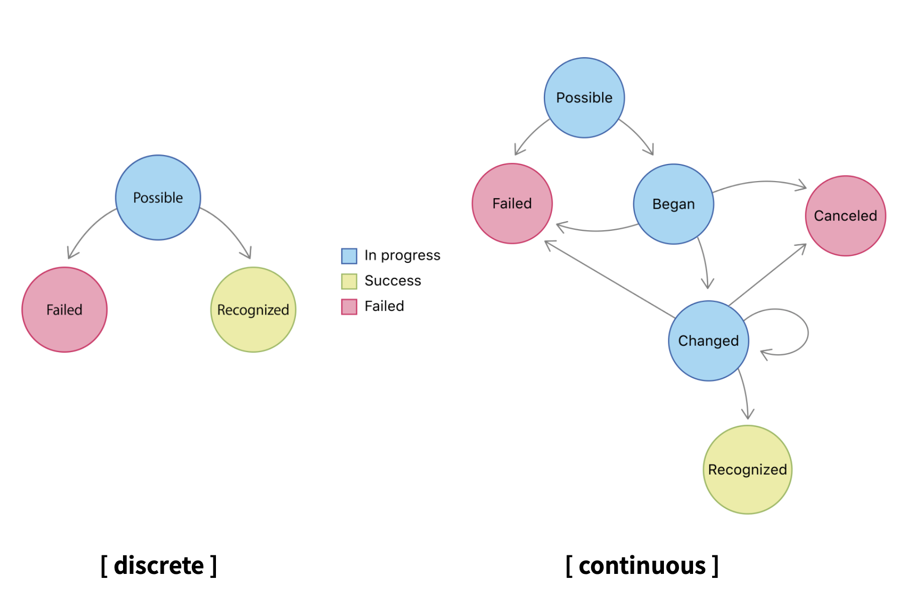

# UIGuestureRecognizer Theory

### 이론

- 정의

  - 아이폰에서 사용자의 제스커를 구체적으로 인지하는 기본적인 클래스
  - Gesturee-recognizer object 또는 간단하게 gesture recongnizer는 터치 또는 다른 입력들을 인식하고 그 인식에 대한 처리 로직을 분리시킨다. 사용자가 특정 제스처를 처리하는 target object를 만들었을 경우 그 로직에 따라서 처리된다.

- Declaration

  - ```swift
    class UIGestureRecognizer : NSObject
    ```

- 관련 서브 클래스

  - [`UITapGestureRecognizer`](https://developer.apple.com/documentation/uikit/uitapgesturerecognizer)
  - [`UIPinchGestureRecognizer`](https://developer.apple.com/documentation/uikit/uipinchgesturerecognizer)
  - [`UIRotationGestureRecognizer`](https://developer.apple.com/documentation/uikit/uirotationgesturerecognizer)
  - [`UISwipeGestureRecognizer`](https://developer.apple.com/documentation/uikit/uiswipegesturerecognizer)
  - [`UIPanGestureRecognizer`](https://developer.apple.com/documentation/uikit/uipangesturerecognizer)
  - [`UIScreenEdgePanGestureRecognizer`](https://developer.apple.com/documentation/uikit/uiscreenedgepangesturerecognizer)
  - [`UILongPressGestureRecognizer`](https://developer.apple.com/documentation/uikit/uilongpressgesturerecognizer)


### UIGuestureType

- 사용자의 입력 형태에 따른 다양한 제스쳐 타입 존제




### Gesture Recongizer notifiying its target

- 동작 방식
  
- 
  
- Code

  - ```swift
    override func viewDidLoad() {
     super.viewDidLoad()
     // action 연결
     let tapGesture = UITapGestureRecognizer(
        target: self,
        action: #selector(handleTap(_:))
        view.addGestureRecognizer(tapGesture)
     )
    }
    
    @objc func handleTap(_ sender: UITapGestureRecognizer) {
    	// code 해당 제스쳐 발생시 처리할 Action 내용
    }
    ```


## StoryBoard에서 적용 하는 방법

- 1. 제스쳐 설정

  - 

- 2. delegate 연결

  - 

- 3. Attributes Inspector

  - 각 Recongizer는 서로 다른 속성을 지님
  - 단, 공통 부모 클래스인 Guesture Recognizer에 대해서는 동일
    - 

### The states of a Guesture



- 연속적인 변경이 발생할 경우, `Failed`,`Canceled` 상태가 아닐경우 에는 지속적으로 상태가 변경됨

  

### 강의자료 :point_right: [링크](../LectureNote/UIGestureRecognizer.pdf)

### Reference

- apple
  - [UIGestureRecognizer](https://developer.apple.com/documentation/uikit/uigesturerecognizer)