# Data Structure ( Linked List )

### 이론

- 정의
  - 자료를 효율적으로 이용할 수 있도록 저장하는 방법을 의미
  - 1차원 형태의 메모리 공강과 현실 설계의 다차원 데이터를 어떻게 변환할 것인지 다루는 일이기도 함
  - 추상자료형에서 정의한 내용을 실제로 구체화한 형태
    - 추상화 - 무엇( What ) 을 할 것인가
    - 구체화 - 어떻게(  How  )  할 것인가
  - 잘 짜여진 자료구조는 적은 메모리 용량과 연산 시간을 갖게 되므로 효과적인 알고리즘 구현에 중요한 역할
  - 주요 관점 : 검색, 삽입, 변경, 삭제

### Type of Data Structure

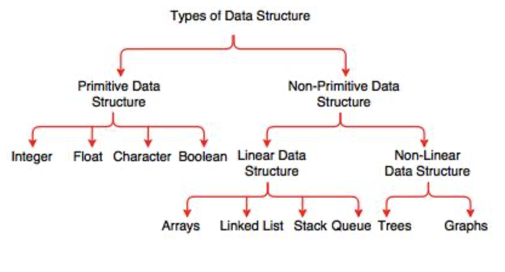

- 자료구조가 가져야 하는 특징
  - 정확성( Correctness ) - 필요한 자료에 필요한 연산을 정확히 적용할 수 있어야 함
  - 효율성( Efficiency ) - 상황에 맞는 구조를 사용하여 자료 처리의 효율성 상승
  - 추상화( Abstraction ) - 복잡한 자료의 핵심 개념 또는 기능을 추상화 하여 간단하고 쉽게 사용할 수 있도록 설계
  - 재사용성( Reuseability ) - 추상화된 개념을 모듈화하여 독립접이고 쉽게 재사용 가능하도록 함

### Data Structure Advanges, Disadvantages


### Complexity

- 시간복잡성 - 데이터 연산 시간은 가능한 작아야 함
- 공간복잡성 - 데이터 연산 및 저장에 필요한 메모리 공간은 가능한 작아야 함


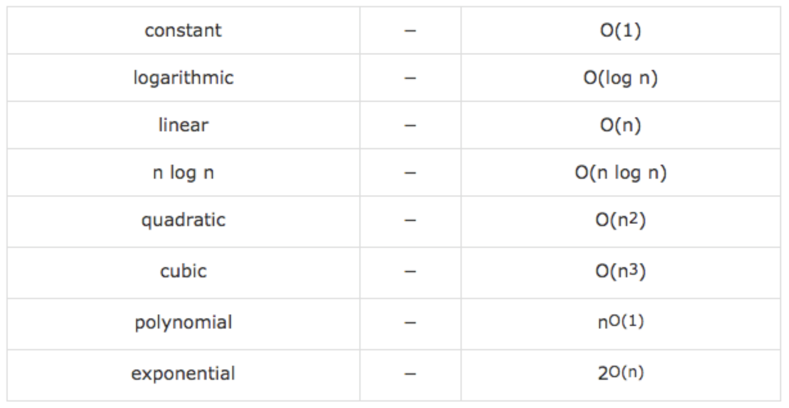

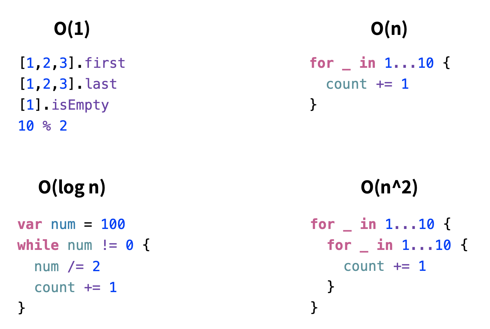


## Linked List

### Single Linked List ( 단일 연결 리스트 )

- 이론
  - 하나의 포인트 맴버로 다른 노트 데이터를 가르키는 것 ( Head 없이 TAIL 만 존재 )
  - 앞으로 돌아갈 수 없으며, 중간 위치로 바로 접근하지 못 함. 
  - Head 노드 주소를 잃어버리면 데이터 전체 접근 불가, 중간이 유실되면 그 이후 노트들에 접근 불가
  - Queue 구현에서 많이 사용, 파일 시스템 중 FAT 시스템이 이런 형태로 연결, 랜던 엑세스 성능이 낮고 불안정
- 구조

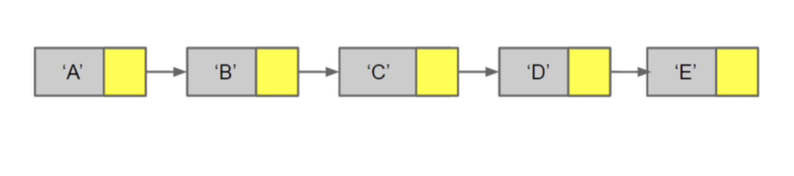

- ADT Example

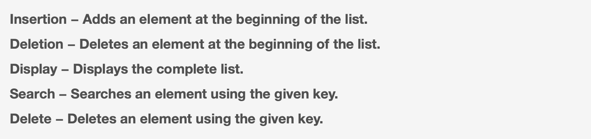

- Single Linked List Add / Delete


###  

### Double Linked List ( 이중 연결 리스트 )

- 이론
  - Head 가 이전, TAIL 이 이후 노트 데이터를 가르키는 것	
  - 끓어진 체인 복구 가능
- 구조

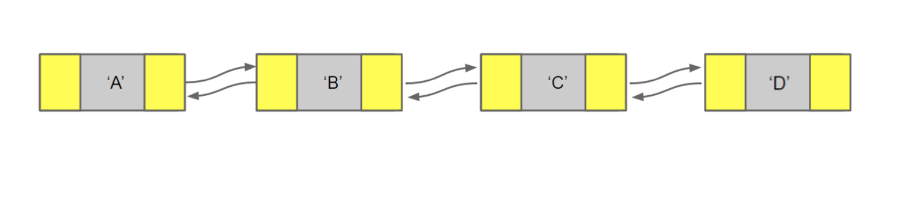


###  Circular Linked List ( 환영 연결 리스트 )

- 이론
  - 처음 노드와 마지막 노드가 서로 연결된 구조
  - 스트림 버퍼의 구현에 많이 사용되며 할당된 메모리 공간 삭제 및 재할방의 부담이 없어서 큐 구현에도 적합
- 구조

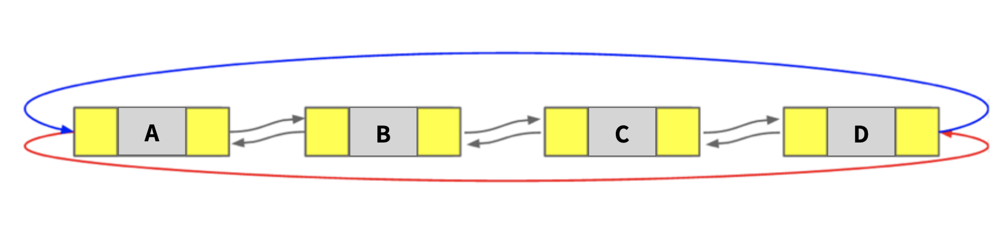


## Stack

- 이론
  - LIFO(Last In First Out), FILO(First In Last Out)
  - 웹 브라우저 히스토리 ( 뒤로 가기 ), 실행 취소( Undo / Redo )
- 구조

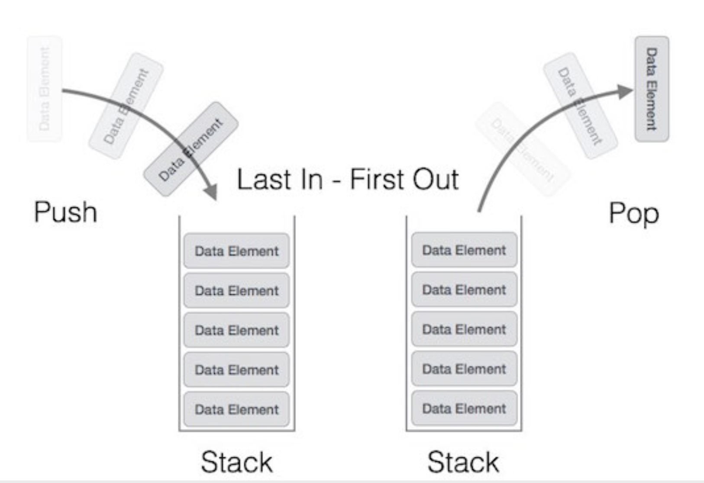

- stack pop/push

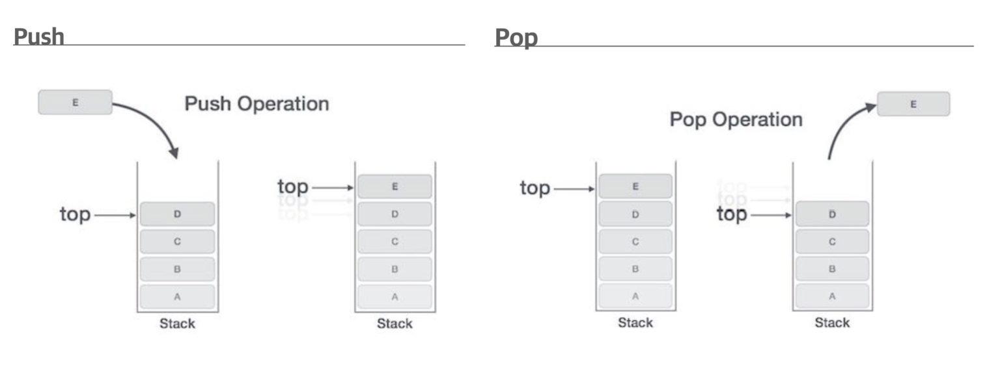

- Stack ADT Example

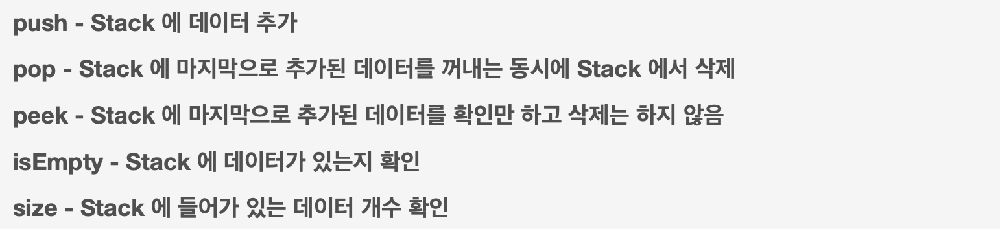


## Queue

- 이론
  - FIFO ( First In First Out) , LILO(Last In Last Out)
  - 은행 대기열, 컨테이너 벨트 등
  - DispatchQueue, NotificationQueue 등
- 데이터 입력 추출 
  - 값을 추가하는 것 : Enqueue 또는 Put 
  - 값을 꺼내오는 것 : Dequeue 또는 Get
  - Front : Dequeue 에 사용될 인덱스
  - Rear(Back) : Enqueue 에 사용될 인덱스

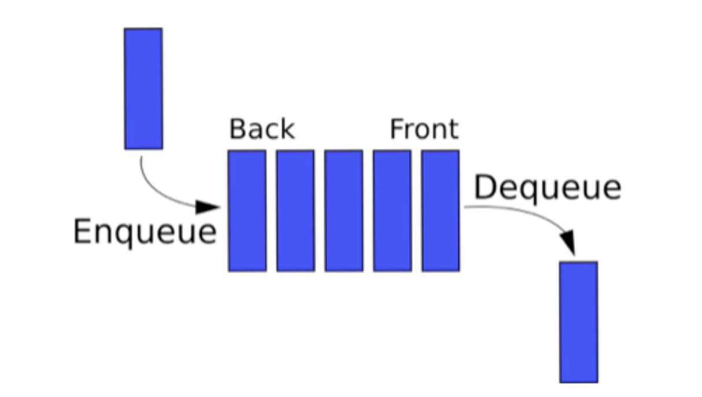

- Dequeue / Enqueue

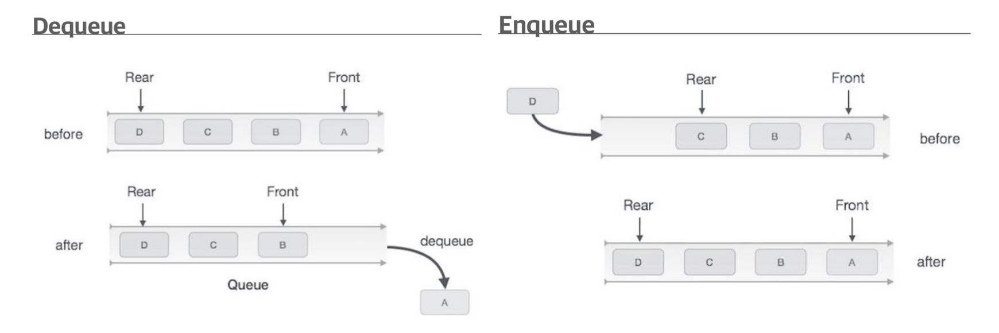

- Queue ADT

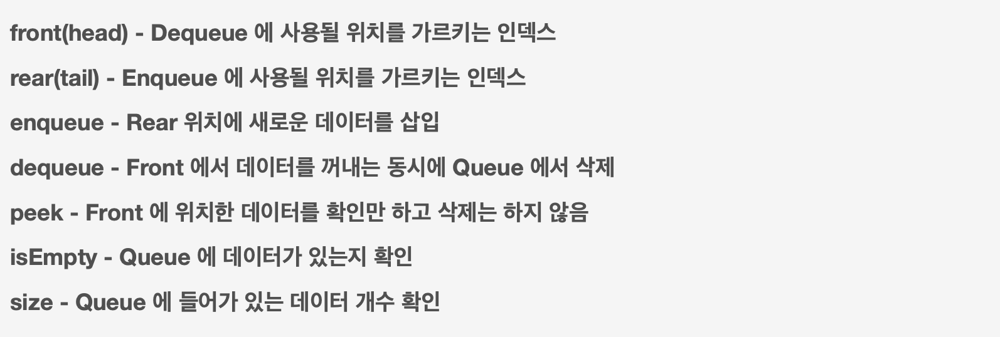


## Linked List 실습

```swift
final class SingleLinkedList: LinkedListStack {
  
  private var head: Node? = nil
  var beforeNode: Node? = nil
  var isEmpty: Bool { head == nil }
  var size: Int = 0
  
  private var lastNode:Node? {
    guard var currentNode = head else { return nil }  // 현재 노트가 head 면 중지
    while let nextNode = currentNode.next {
      currentNode = nextNode                  // 다음 노드가 있을 경우 다음 노드를 현재 노드로
    }
    return currentNode
  }
  
  func push(node: Node) {
    size += 1
    if let lastNode = lastNode {
      lastNode.next = node
    } else {
      head = node
    }
  }
  
  func peek() -> String? {
    lastNode?.value
  }
  
  func pop() -> String? {
    guard var currentNode = head else { return nil }
    while let _ = currentNode.next?.next {
      currentNode = currentNode.next!
    }
    size -= 1
    
    if let popValue = currentNode.next?.value {
      currentNode.next = nil
      return popValue
    } else {
      defer { head = nil } // defer - {} 종료되는 시점에 마지막으로 실행됨
      return head!.value
    }
  }
}
```


### 강의 자료 :point_right: [링크](../LectureNote/DataStructure.pdf)

### 소스코드 자료 :point_right: [링크](../SourceCode/LinkedList.playground)

