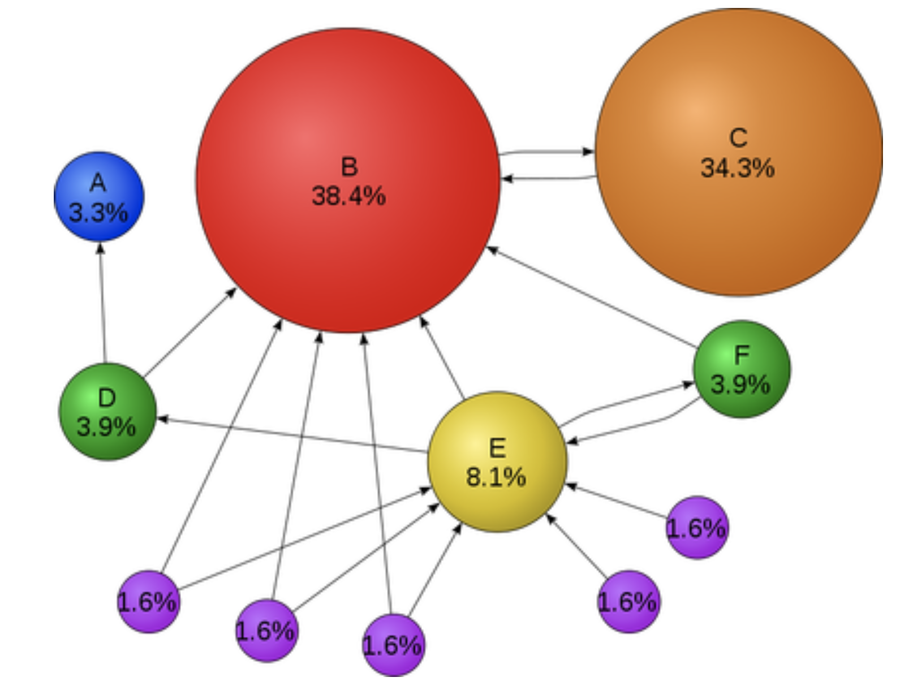
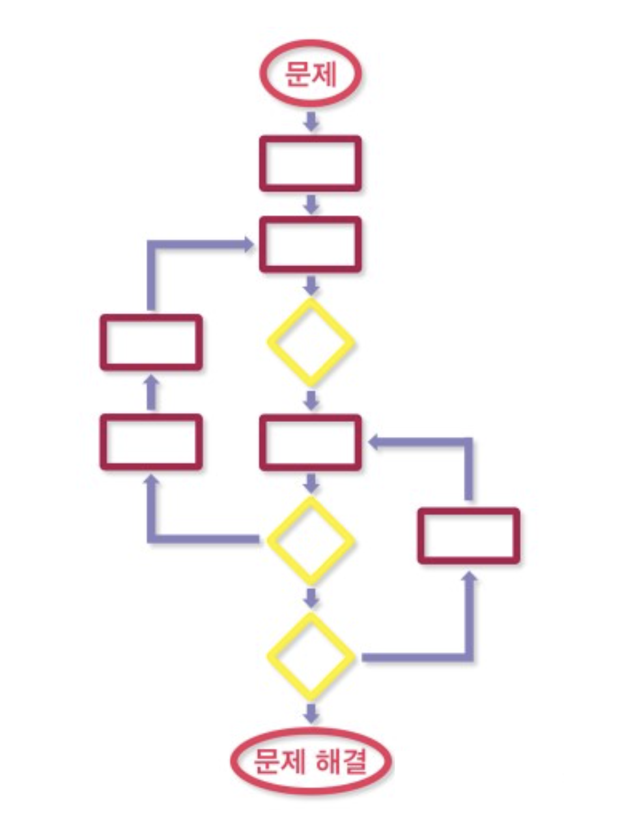
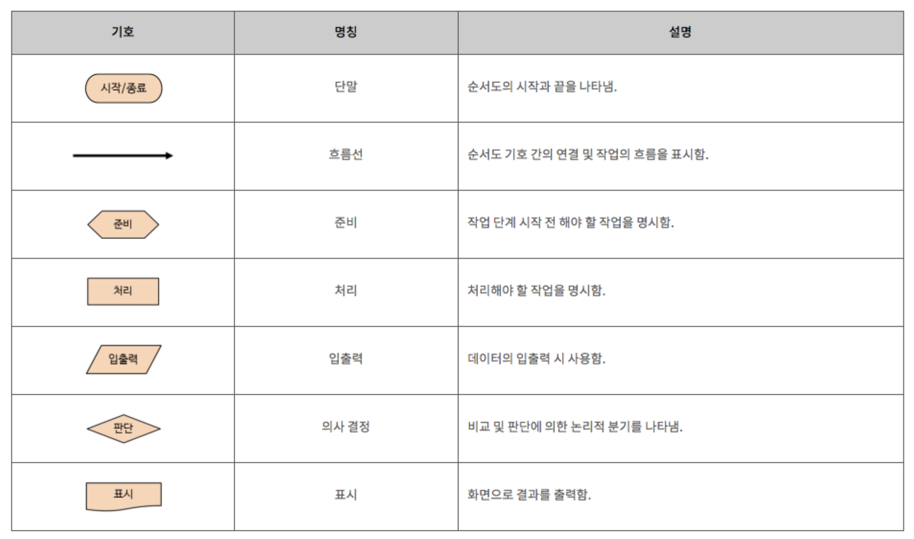
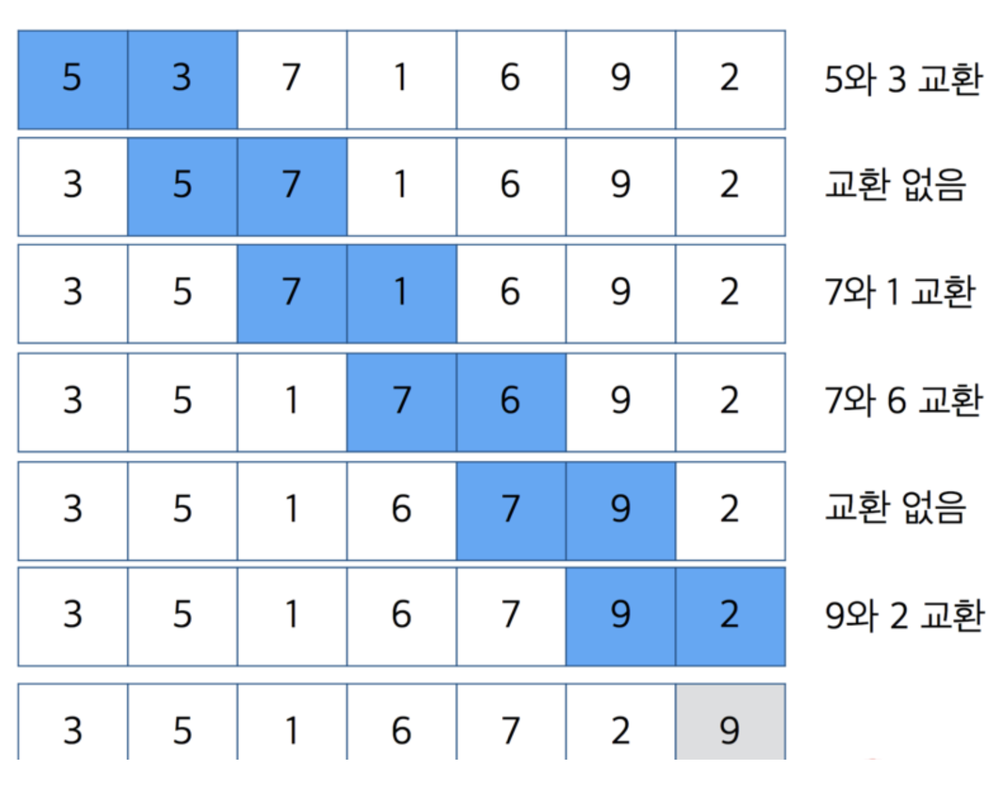
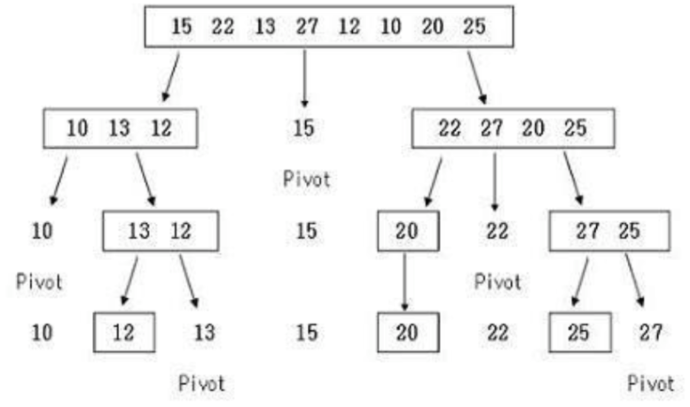
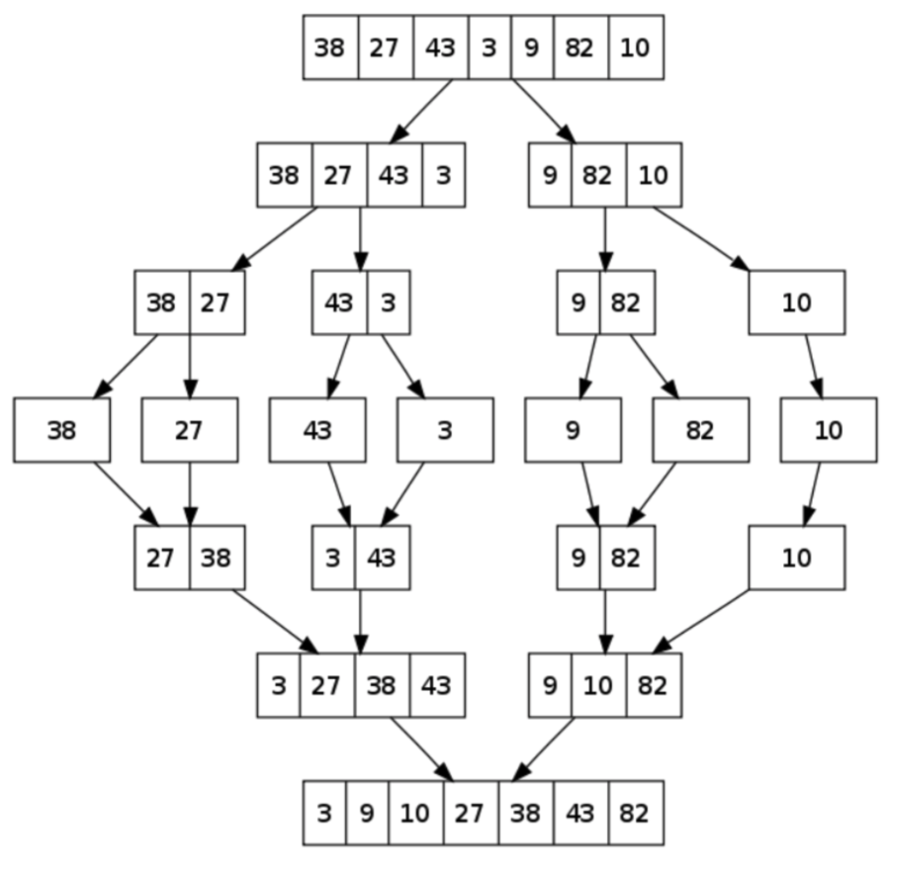

# Algorithm

## 기초 이론

- ### 정의

  - 어떤 문제를 해결하기 위해 정의된 절차와 방법, 명령어의 집합

- ### 알고리즘의 조건

  - 입력 : 외부에서 제공되는 자료가 0개 이상 존재한다.
  - 출력 : 적어도 1개 이상의 결과물을 출력해야 한다.
  - 명확성 : 수행 과정은 명확해야 하고 모호하지 않은 명령어로 구성되어야 한다.
  - 효율성 : 모든 과정은 명백하게 실행 가능(검증 가능)한 것이여야 한다.
  - 유한성(종결성) : 알고리즘의 명령어들은 계산을 수행한 후 반드시 종료해야 한다.

- ### 대표적인 알고리즘 예시

  - Google Search Algorithm
    - 세르게이 브린, 래리 페이지 논문
    - The Anatomy of a Large-Scale Hypertextual Web Search Engine [링크](http://infolab.stanford.edu/~backrub/google.html)
    - PageRank : 특정 페이지를 인용하는 다른 페이지가 얼마나 많이 있는지를 통해 랭킹 반영
      - 

  

- ### 기타 알고리즘 예시

  - 택배를 가장 빠르게 해달할 수 있는 루트
  - 로봇 청소기의 움직임
  - 자동 주식 거래 시스템
  - 최저의 검색 결과
  - 얼굴/지문 인식
  -  Siri

- ### 참고 자료 :FlowChart

  - 문제를 해결하기 위해 일정한 순서, 과정을 정리하여 하나의 차트로 정리하는 방법
    - 
  - FlowChart에서 사용되는 기호
    - 


## Bubble Sort

### 이론

- 인접한 두 원소의 크기를 비교하여 큰 값을 배열의 오른쪽으로 정렬해 나가는 방식
- 이미 대부분 정렬되어 있는 자료에서는 좋은 성능을 보이지만 그 외에는 매우 비효율적인 알고리즘
- 단, 직관적이고 쉬워 빠르게 구현이 가능하여 많이 알려져 있음
- **시간 복잡도** : -  O(n 제곱) 



### 구현 코드

```swift
func bubbleSort(input: inout [Int]) {
  if input.isEmpty { return }
  
  for reverseCount in 0..<input.count-1 {
    for index in 0..<input.count-1-reverseCount {
      if input[index] > input[index+1] {
        let temp = input[index]
        input[index] = input[index+1]
        input[index+1] = temp
      }
    }
  }
  print(input) // 정렬 확인 코드
}
```


## Selection Sort

### 이론

- 데이터를 반복 순회하며 최소값을 찾아 정렬되지 않은 숫자 중 가장 좌측의 숫자와 위치 교환하는 방식
  1. 최소값 선택 정렬 ( Mid-Selection Sort ) :  가장 작은 값을 기준으로 정렬 ( 오름차순 )
  2. 최대값 선태 정렬 ( Max-Selection Sort) :  가장 큰 값을 기준으로 정렬 ( 내림차준 )
- **시간 복잡도** : O(n 제곱)

### 구현 코드

```swift
func selectionSort(input: inout [Int]) {

  for i in input.indices {
    var minIndex = i
    for idx in (i+1)..<input.count {
      guard input[minIndex] > input[idx] else { continue }
      minIndex = idx
    }
    input.swapAt(i, minIndex)
  }
}

var array = [9,3,45,6,7,8]
selectionSort(input: &array)
```


## Insertion Sort

### 이론 

- 배열을 순회하며 현재 위치와 그보다 작은 인덱스의 값들을 비교해 적절한 위치에 삽입해 나가는 방식
- 버블, 선택, 삽입 중 일반적으로 가장 빠른 알고리즘
- **시간 복잡도** : O(n 제곱)

### 구현 코드

```swift
func insertionSort(input: inout [Int]) {
  guard input != [] else { return }
  
  for index in 0..<input.count - 1 {
    guard input[index] > input[index+1] else { continue }
    let tempValue = input[index+1]
    input.remove(at: index+1)
    
    if index == 0 {
      input.insert(tempValue, at: 0)
    } else {
      for i in 0..<index {
        if tempValue < input[i] {
          // 현재 기준값 이전 숫자들과 비교
          input.insert(tempValue, at: i)
          break
        }
        if i == index-1 {
          // 현재 기준값 이전의 모든 숫자들과 비교 후에도 제일 큰 숫자 처리
          input.insert(tempValue, at: index)
        }
      }
    }
  }
}

var array = [5, 6, 1, 3, 10, 2, 7, 14, 9]
insertionSort(input: &array)
```


## Quick Sort

### 이론

- 기준이 되는 pivot을 선정해 이를 기준으로 작은 값은 좌측, 큰 값을 우측에 재배치하는 것을 반복하는 방식
- 분할 정복 방식을 사용
- 일반적으로 실세계 데이터에 대입했을 때 가장 빠르다고 알려져있고 가장 많이 활용되는 정렬 알고리즘
- **시간 복잡도** : 평균적으로 O(nLogN), 최악의 경우 O(n 제곱)  




### Merge Sort

-  재귀함수를 통해 큰 데이터를 더 이상 나눌수 없는 단위까지 잘개 쪼갠 후 다시 합치면서( merge ) 정렬하는 방식
- 병합된 부분은 이미 정렬되어 있으므로 전부 비교하지 않아도 정렬 가능
- 분할 정복 방식의 대표적인 케이스 중 하나
- 데이터를 분해하고 합치는 작업에 필요한 ( 데이터 크기와 동일한 ) 추가 메모리 공간 필요
- 평균적으로 퀵 정렬에 비해 느리지만 퀵이나 힙과 달리 stable한 정렬이며 데이터에 영향을 거의 받지 않음
- **시간복잡도** : 항상 O(n Log N)




### 강의자료 :point_right: [링크](../LectureNode/Algorithm.pdf)

