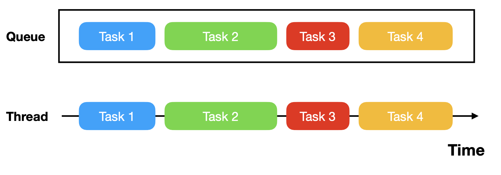
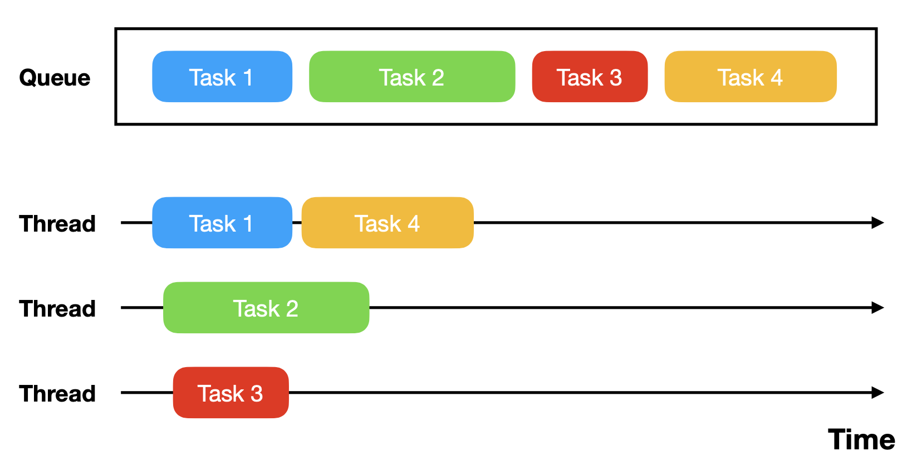
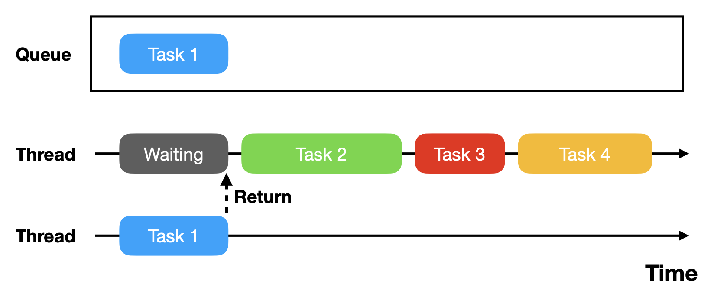
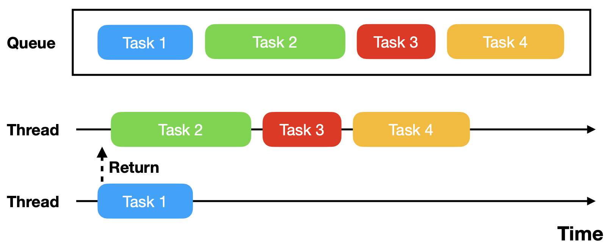
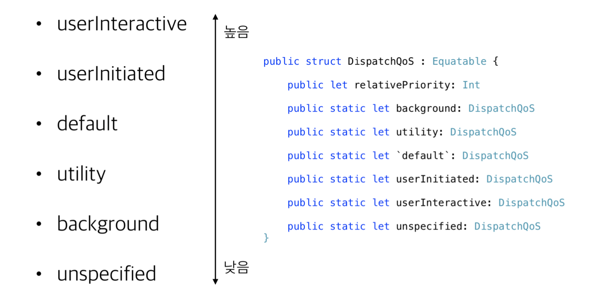
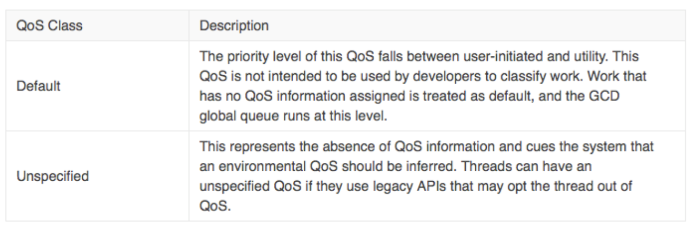

# GCD ( Grand Central Dispatch )

## 이론

- 정의
  - GCD는 멀티코어 프로세서 시스템에 대한 응용 프로그램 지원을 최적화 하기 위해 Apple에서 개발한 기술로 스레드 관리와 실행에 대한 책임을 어플리케이션 레벨에서 운영체제 레벨로 넘김
  - 작업단위는 Block이라 불리며, DisapatchQueue 가 Block 들을 관리
  - Thread 를 직접 생성하고 관리하는 것에 비해 관리 용이성과 이식성, 성능 증가
  - GCD는 각 어플리케이션에서 생성된 DispatchQueue 를 읽는 멀티코어 실행 엔진을 가지고 있으며 , 이것이 Queue에 등록된 각 작업을 꺼내 스레드에 할당
  - 개발자는 내부 동작을 자세히 알 필요 없이 Queue에 작업을 넘기기만 하면 됨  
- 장점
  - 앱의 메모리 공간에 있는 스레드 스택에 저장하는데 따른 메모리상의 불이익 감소
  - 스레드를 생성하고 구성하는데 필요한 코드 제거
  - 스레드에서 작업을 관리하고 스케쥴링하는데 필요한 코드 제거
  - 코드 단순화


### DispatchQueue

- GCD는 앱이 블럭 객체 형태로 작업을 전송할 수 있는 FIFO 대기열(Queue)을 제공하고 관리
- Queue에 전달된 작업은 시스템이 전적으로 관리하는 스레드 풀(a pool of threads) 에서 실행됨
- 작업이 실행될 스레드는 보장되지 않음
- DispatchQueue는 2개의 타입( Serial / Concurrent )으로 구분되며 둘 모두 FIFO 순서로 처리

- 앱을 실행하면 시스템이 자동으로 메인스레드 위에서 동작하는 Main 큐(Serial Queue)를 만들어 
 작업을 수행하고**,** 그 외에 추가적으로 여러 개의 Global 큐(Cuncurrent Queue)를 만들어서 큐를 관리
- 각 작업은 동기(sync) 방식과 비동기(async) 방식으로 실행 가능하지만 **Main 큐에서는 async 만 사용 가능**

### Serial Queue

- **이론**

  - 대기열에 들어온 작업을 특정 하나의 스레드에서 순서대로 처리
  - 

- 실습

  - Serial Sync

  - ```swift
    let serialQueue = DispatchQueue(label: "kr.giftbot.serialQueue")
    serialQueue.sync { log("1") }
    log("A")
    serialQueue.sync { log("2") }
    log("B")
    serialQueue.sync { log("3") }
    log("C")
    serialQueue.sync { log("4") }
    
    ```

    - 출력 결과 : 1 - A - 2 - B - 3 - C - 4 고정갑 출력

  - Serial AsyncOrder

    - ```swift
      let serialQueue = DispatchQueue(label: "kr.giftbot.serialQueue")
      serialQueue.async { log("1") }
      log("A")
      serialQueue.async { log("2") }
      log("B")
      serialQueue.async { log("3") }
      log("C")
      serialQueue.async { log("4") }
      print()
      ```

      - 출력 결과 :  A - B - C / 1 - 2 - 3 -4 순서 고정, 단, 영어와 숫자의 순서가 섞여서 나옴
        - **A - B - C -** **1 - 2 - 3 - 4**
        - **A - B - 1 - C - 2 - 3 -** **4**

### Concurrent Queue

- **이론** 

  - 대기열에 들어온 작업을 다중 스레드로 나누어 동시에(물리적으로 또는 논리적으로 ) 처리
    - 

- **실습**

  - Concurrent Sync

    - ```swift
      let concurrentQueue = DispatchQueue(
        label: "kr.giftbot.concurrentQueue",
        attributes: [.concurrent]
      )
      concurrentQueue.sync { log("1") }
      log("A")
      concurrentQueue.sync { log("2") }
      log("B")
      concurrentQueue.sync { log("3") }
      log("C")
      concurrentQueue.sync { log("4") }
      print()
      ```

    - 출력 결과 : **1 - A - 2 - B - 3 - C - 4**

  - Cuncurrent Async

    - ```swift
      let concurrentQueue = DispatchQueue(
        label: "kr.giftbot.concurrentQueue",
        qos: .userInteractive,
        attributes: [.concurrent]
      )
      concurrentQueue.async { log("1") }
      log("A")
      concurrentQueue.async { log("2") }
      log("B")
      concurrentQueue.async { log("3") }
      log("C")
      concurrentQueue.async { log("4") }
      print()
      ```

      - 출력 결과 :  영어/숫자 끼리는 순서대로 나오나, 종합적으로는 섞여서 나옴
        - **A - 1 - B - C -** **2 - 4 - 3**
        - **A - 1 - 2 - B - C -** **3 - 4**


### 참고] Concurrency VS Parallelism

- Parallelism 은 두개의 쓰레드가 동시에 작업을 진행
- Concurrency 는 서로 다른 작업을 아주 빠른속도로 번갈아 가면서 처리 ( 사용자 입장에서는 동시에 처리 되는걸로 느낌)


### Synchronous

- 대기열에 작업으 추가한 뒤, 다른 어떤 스레드(시스템이 결정)에서 실행 완료할 때까지 멈추어 대기
- 해당 작업이 완료되어 결과가 반환되면 다음 작업 실행




### Asynchronous

- 대기열에 작업을 추가한 뒤, 작업 완료를 기다리지 않고 바로 반환하여 다음 작업을 연이어 수행
- 주로 네트워크에서 데이터를 가져오거나 큰 파일을 다룰 때와 같이 시간이 걸리는 작업에 사용




### Sync VS Async

- 왼쪽: 결과값을 밭아오는 방식의 차이
- 오른쪽: 실행 시간에 따른 모든 스레드의 완료 시간의 차이


### System DispatchQueue

- 시스템이 제공하는 Queue는 Main과 Global이 있으며 앱 실행 시 생성됨

- **Main**

  - UI와 관련된 작업은 모두 main 큐를 통해서 수행하며 Serial Queue에 해당

  - MainQueue를 Sync 메서드로 동작시키면 Dead Lock 발생

  - ```swift
    DispatchQueue.main.async { }
    ```

    

- **Global**

  - UI를 제외한 작업에서 사용하며 Concurrent Queue에 해당

  - sync와 async 메서드 모두 사용 가능

  - QoS 클래스를 지정하여 우선 순위 설정 가능

  - ```swift
    DispatchQueue.global().async { }
    DispatchQueue.global(qos: .utility).sync { }
    ```

### Custom DispatchQueue

- Non Main Thread에서 작업 수행
- Serial / Concurrent Queue 및 QoS등의 여러 옵션을 지정하여 생성 가능

```swift
public convenience init(
	label: String,
	qos: DispatchQoS = default,
	attributes: DispatchQueue.Attributes = default,
	autoreleaseFrequency: DispatchQueue.AutoreleaseFrequency = default,
	target: DispatchQueue? = default
)

// label을 통해서 생성한 큐 구별 가능
let queue = DispatchQueue(label: "kr.giftbot.example.queue")
let queueOptions = DispatchQueue(label: "kr.giftbot.example.queue",
	qos: .userInteractive,
	attributes: [.concurrent]
)
```


### QoS ( Quality of Service )

- 시스템은 QoS정보를 통해 스케줄링, CPU 및 I/O 처리량, 타이머 대기 시간등의 우선 순위를 조정
- 총 6개의 QoS 클래스로, 4개의 주요 유형과 다른 2개의 특수 유형으로 구분
- 우선순위가 높을 수록 더 빨리 수행되고 더 많은 전력 소모
- 수행 작업에 적절한 QoS 클래스를 지정해주어야 더 반응성이 좋아지며, 효율적인 에너지 사용 가능




### Primary QoS classes

| QoS name             | description                                                  |
| -------------------- | ------------------------------------------------------------ |
| **User Interactive** | - 즉각 반응해야 하는 작은 분량의 작업에 사용, 반응성 및 성능에 중점<br />- 인터페이스 새로 고침, 화면 줌인/아웃 과 같이 사용자와의 상호작용 도중에 빠르게 처리하고 다시 메인큐로 돌아와야 할 정도로 빠른 반응이 필요한 경우에 사용 |
| **User Initiated**   | - 몇 초 이내의 짧은 시간 내 수행해야 하는 작업으로 반응성 및 성능에 중점, 가장 자주 활용<br />- 화면을 스와이프 하거나 문서열기, 버튼을 눌러 액션을 수행하는 것처럼 사용자에 의해 발생한 이벤트에 사용 |
| **Utility**          | - 수초에서 수분에 걸쳐 수행되는 작업으로 반응성, 성능, 그리고 에너지 효율성 간에 균형을 유지하는데 중점<br />- 일반적으로 사용자가 직접요청하지 않는 작업으로, 데이터를 읽어들이거나 다운로드 하는 등 작업을 완료하는데 어느 정도 시간이 걸릴 수 있으면 모돈 진행 표시줄로 표현 |
| **Background**       | - 수분에서 수시간에 걸쳐 수행되는 작업으로 에너지 효율성에 중점, NSOperation 클래스 사용 시 기본 값<br />- background에서 동작하며 큰 데이터 가공 및 DB 구성/삭제/백업 등 사용자가 볼 수 없고 오래 걸리는 작업에 할당<br />- 저전력 모드에서는 네트워킹을 포함하여 백그라운드 작업은 일시 중지 |


### Special QoS Classes

- 일반적으로, 별도로 사용할 일이 없는 특수 유형의 QoS
  - **Default**
    - QoS를 별도로 지정하지 않으면 기본값으로 사용되는 형태에서 User Initiated 와 Utility 의 중간 레벨
    - GCD global queue의 기본 동작 형태
  - **Unspecified**
    - QoS정보가 없으므로 시스템이 QoS를 추론해야 한다는 것을 의미




### DispatchQueue.Attributes

- `.concurrent`- Concurrent Queue로 생성, 이 옵션 미 지정시 Serial Queue가 기본 값
- `.initiallyInactive` - Inactive 상태로 생성, 작업 수행 시점에 active() 메서드를 호출해야 동작

```swift
extension DispatchQueue {
	public struct Attributes : OptionSet {
	public static let concurrent: DispatchQueue.Attributes
	public static let initiallyInactive: DispatchQueue.Attributes
	} 
}
```


### 실습 

#### Group Notify

```swift
let queue1 = DispatchQueue(label: "kr.giftbot.example.queue1")
let queue2 = DispatchQueue(label: "kr.giftbot.example.queue2")
let queue3 = DispatchQueue(label: "kr.giftbot.example.queue3", attributes: .concurrent)

func calculate(task: Int, limit: Int) {
  print("Task\(task) 시작")
  for _ in 0...limit { _ = 1 + 1 }
  print("Task\(task) 종료")
}

//    queue1.async { calculate(task: 1, limit: 10_000_000) } // 그룹 미 지정시 개별 종료됨
//    queue2.async { calculate(task: 2, limit:  5_000_000) }
//    queue3.async { calculate(task: 3, limit:  3_000_000) }
//    queue3.async { calculate(task: 4, limit:  1_000_000) }


let group = DispatchGroup() // 서로 끝나는 시간이 다른 큐들을 모아서 구룹화함, 최종 종료시간 알수 있음
queue1.async(group: group) { calculate(task: 1, limit: 10_000_000) }
queue2.async(group: group) { calculate(task: 2, limit:  5_000_000) }
queue3.async(group: group) { calculate(task: 3, limit:  3_000_000) }
queue3.async(group: group) { calculate(task: 4, limit:  1_000_000) }
group.notify(queue: .main) { print("모든 작업 완료") }
```

- 그룹 지정시 출력 정보 

  - ```swift
    Task1 시작
    Task2 시작
    Task4 시작
    Task3 시작
    Task4 종료
    Task3 종료
    Task2 종료
    Task1 종료
    모든 작업 완료
    ```


### DispatchQueue Stop

```swift
var myWorkItem: DispatchWorkItem!

myWorkItem = DispatchWorkItem {
  let bigNumber = 8_000_000
  let divideNumber = bigNumber / 4

  for i in 1...bigNumber {
    guard i % divideNumber == 0 else { continue }
		guard !self.myWorkItem.isCancelled else { return } // 실제로 종료를 시켜줌
    print(i / divideNumber * 25, "%")
  }
}

DispatchQueue.global().async(execute: myWorkItem) // 이 명령어를 통해 myWorkItem

let timeLimit = 3.0
DispatchQueue.global().async {
  let timeoutResult = self.myWorkItem.wait(timeout: .now() + timeLimit) // 3초 뒤에 실행되도록

  switch timeoutResult {
    case .success: print("Success within \(timeLimit) second")
    case .timedOut :
    self.myWorkItem.cancel()
    print("Timed out. task cancelled")
  }
}

```


### 강의 노트 :point_right: [링크](../LectureNode/GCD.pdf)

