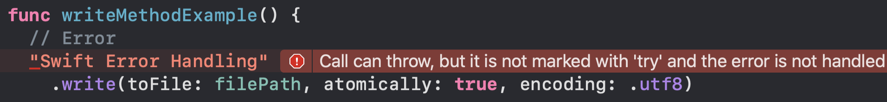

# Error Handling Practice

## 실습 

1. Basic

   - throws 키워드가 있는 메소드 사용시 try 처리를 안할 경우 오류 발생

     - 소스코드

       - ```swift
         let tmpDir = NSTemporaryDirectory()
         let filePath = NSTemporaryDirectory() + "swift.txt"
         print(tmpDir) // 플레이그라운드의 임시 저장 공간 
         
         func writeMethodExample() {
           // Error
         //  "Swift Error Handling"	// Try 붙이지 않으면 에러 발생
         //    .write(toFile: filePath, atomically: true, encoding: .utf8)
           
           try? "Swift Error Handling"
             .write(toFile: filePath, atomically: true, encoding: .utf8)
         }
         
         writeMethodExample()
         ```

     - 에러 내용

       - 

     - write 메소드

       - ```swift
         func write<T>(toFile path: T, atomically useAuxiliaryFile: Bool, encoding enc: Encoding) throws where T : StringProtocol
         ```

       - `throws` 키워드 주목

       - Error 발생 시 처리하기 위한 코드 필요

2. Three Type of Try 

   1. try

      - 소스코드 

        - ```swift
          func threeTypesOfTry() {
            /***************************************************
             try  -  do ~ catch 없이 단독 사용 불가.
             ***************************************************/
            do {
              let fileContents = try String(contentsOfFile: filePath)
              print(fileContents) // 정상 실행 (1번에서 해당 파일에 입력해 둠)
              
              let fileContents1 = try String(contentsOfFile: tmpDir)
              print(fileContents1) // 디렉토리에는 접근 불가
            } catch {
              print(error.localizedDescription)
            }
          }
          threeTypesOfTry()
          
          /*** 실행 결과
          Swift Error Handling
          The file “tmp” couldn’t be opened because you don’t have permission to view it.
          */
          ```

   2. try2?

      - 소스코드

        - ```swift
          func threeTypesOfTry() {  
          	/***************************************************
             try?  -  성공하면 Optional 값 반환, 에러가 발생하면 nil 반환
             ***************************************************/
            print("\n2. try?")
            let contentsOptional = try? String(contentsOfFile: filePath)
            print(contentsOptional ?? "nil") // 정상
          
            let contentsError = try? String(contentsOfFile: tmpDir)
            print(contentsError ?? "nil") // 에러
          }
          threeTypesOfTry()
          
          /** 출력 내용
          Swift Error Handling
          nil
          */
          ```

   3. try!

      - 소스코드

        - ```swift
          func threeTypesOfTry() {  
            /***************************************************
            try!  -  Optional 강제 언래핑. 단, 에러 발생 시 crash.
            ***************************************************/
          	let contentsUnwrapped = try! String(contentsOfFile: filePath)
            print(contentsUnwrapped) // 정상
            let unwrappedError = try! String(contentsOfFile: tmpDir)
            print(unwrappedError) // crach
          }
          threeTypesOfTry()
          /**
          Swift Error Handling
          Fatal error: 'try!' expression unexpectedly raised an error: ~~~
          /
          ```

3. Do Try Flow

   - do ~ catch 블럭 내에서 에러가 발생하면 해당 코드 이후의 내용들은 실행되지 않음.

   - 소스코드

     - ```swift
       func doTryFlow() {
         do {
           // 아래 내용 실행 결과?
           let r1 = try String(contentsOfFile: filePath);  print("r1 :", r1)
           let r2 = try? String(contentsOfFile: filePath); print("r2 :", r2 ?? "")
           let r3 = try? String(contentsOfFile: tmpDir);   print("r3 :", r3 ?? "")
           let r4 = try String(contentsOfFile: tmpDir);    print("r4 :", r4) // <- 오류 발생
           let r5 = try! String(contentsOfFile: filePath); print("r5 :", r5)
           let r6 = try! String(contentsOfFile: tmpDir);   print("r6 :", r6)
         } catch {
           print(error.localizedDescription)
         }
       }
       doTryFlow()
       /* 출력 결과
       r1 : Swift Error Handling
       r2 : Swift Error Handling
       r3 : 													// <- 정상 실행
       The file “tmp” couldn’t be opened because you don’t have permission to view it.
       */
       ```

4. Throw Error 처리 구별 방식

   1. throws 가 있는 방식

      - try 시도 후 에러가 발생한 경우throws를 통해서 외부에서 에어를 처리함으로 함수 내부에서는 별도로 에러를 처리해주지 않아도 된다.

      - 소스코드

        - ```swift
          func throwError() throws {
          	// code 
            
            // try
            try String(contentsOfFile: tmpDir)
          }
          try? throwError()
          ```

   2. throws가 없는 방식

      - throws 메서드에 대해 do catch를 통해서 함수 내부에서 에러 처리 필요

      - 소스코드

        - ```swift
          func throwsErrorExample() {
            do {
              try throwError() 
            } catch { // 에러 발생할 경우 catch 에서 처리
              print("Error :", error)
              print("=====")
              print("Error Description :", error.localizedDescription)
            }
          }
          throwsErrorExample()
          /* 에러가 발생 안했을떄
          =====
          Error : Error Domain=NSCocoaErrorDomain Code=257
          Error Description : The file “tmp” couldn’t be opened because you don’t have permission to view it.
          */
          
          /* 에러가 발생 했을때
          Error : errorWithParam(num: -1)
          =====
          Error Description : The operation couldn’t be completed. (__lldb_expr_670.MyError error 0.)
          */
          ```

5. Error Match

   - 어떤 오류가 발생했는지에 대해서 catch 가 구별해줌

   - 소스코드

     - ```swift
       func errorMatching() {
         do {
           try throwError()
         } catch MyError.errorWithoutParam { 
           print("Error without param")
         } catch MyError.errorWithParam(let num) {
           print("Error with number param :", num)
         } catch {
           print("The others")
         }
       }
       errorMatching()
       ```


## NSError

- 기본적으로 swift에서는 NSError를 통해서 에러를 전달해줌

  - 소스코드

  - ```swift
    func throwNSError() throws { 
      // NSError() - 기본 생성자 (X),  Domain cannot be nil, NSErorr를 직접생성하는 일은 많이없음
      throw NSError(domain: "Domain error string", code: 99, userInfo: ["MyKey": "MyValue"])
    }
    
    func throwsNSErrorExample() {
      do {
        try throwNSError()
      } catch {  // catch (myError) 등으로 변수를 지정해서 쓸 수 있다.
        print("Error :", error) 
        
        let e = error as NSError
        print("NSError :", e) 
        print("domain :", e.domain)
        print("code :", e.code)
        print("userInfo :", e.userInfo)
      }
    }
    
    throwsNSErrorExample()
    /* 출력 결과
    Error : Error Domain=Domain error string Code=99 "(null)" UserInfo={MyKey=MyValue}
    NSError : Error Domain=Domain error string Code=99 "(null)" UserInfo={MyKey=MyValue}
    domain : Domain error string
    code : 99
    userInfo : ["MyKey": "MyValue"]
    */
    ```


### LocalizedError, CustomNSError

- 에러가 발생했을에 에러가 발생한 이유나 오류 해결 방법을 상세하게 볼수 있는 방법이 있다.

- ㅁ

- 소스코드 예제

  - 상세한 정보가 없는 경우

    - ```swift
      enum MyError: Error {
        case errorWithoutParam
        case errorWithParam(num: Int)
      }
      
      // 발생한 오류가 정확히 무엇인지 알기 어려움
      func throwsErrorExample() {
        do {
          throw MyError.errorWithoutParam
        } catch {
          print(error.localizedDescription)
        }
      }
      throwsErrorExample()
      /* 출력 내용
      The operation couldn’t be completed. (__lldb_expr_684.MyError error 1.)
      */
      ```

  - 상세한 정보 확인 방법

    - ```swift
      enum CustomizedError: Error {
        case errorWithoutParam
        case errorWithParam(num: Int)
      }
      
      func localizedErrorExample() {
        do {
          throw CustomizedError.errorWithoutParam
        } catch {
          print(error.localizedDescription)
          
          let e = error as NSError
          print(e.localizedFailureReason ?? "")				// .localizedFailureReason
          print(e.localizedRecoverySuggestion ?? "")	// .localizedRecoverySuggestion
        }
      }
      
      /* 출력 정보
      The operation couldn’t be completed. (__lldb_expr_684.CustomizedError error 1.)
      */
      ```

      - 위와 같이 옵션을 localizedRecoverySuggestion 옵션을 넣어도 동일하게 출력된다.
      - 이를 해결하기 위해서는 위의 구체적인 정보들을 사전에 정의해주어야 함

    - extension을 통한 에러의 상세 정보 사전 정의

      - ```swift
        extension CustomizedError: LocalizedError {
          var errorDescription: String? {
            switch self {
            case .errorWithoutParam:
               return "Error without parameter"
        //       return NSLocalizedString("Error without parameter", comment: "")
              // 오류를 해당 국가에 맞게 자동으로 변경해주어서 출력해줌
            case .errorWithParam(let x):
              return "Error with param \(x)"
            }
          }
        
          var failureReason: String? {
            return "실패 이유"
          }
          var recoverySuggestion: String? {
            return "오류 해결 방법 제안"
          }
        }
        ```

    - 적용 후 최종 실행 결과

      - ```swift
        /*
        Error without parameter
        실패 이유							// 내가 지정한 문장으로 출력됨
        오류 해결 방법 제안			// 내가 지정한 문장으로 출력됨
        */
        ```

### Defer

- Defer에 따른 출력 순서

```swift
print("\n---------- [ deferOrder 1 ] ----------\n")
func throwError() throws {
  throw NSError(domain: "Domain", code: 1, userInfo: nil)
}
func deferExample() {
  /***************************************************
   문자열 출력 순서는??
   1) do 문에서 오류가 발생했을 때
   2) do 문에서 오류가 발생하지 않았을 때
   ***************************************************/
  defer { print("1) First defer") }
  
  do {
    print("2) Do")
    try throwError()
  } catch {
    return print("3) Error :", error)
  }
  defer { print("4) Second defer") }	// 나중에 등록된 defer 가 먼저 실행됨
  print("5) Last Print")
}
deferExample()

/* 
- 에러 발생시 출력 순서
2) Do
3) Error : Error Domain=Domain Code=1 "(null)"
1) First defer

- 에러 발생하지 않을때 출력 순서
2) Do
5) Last Print
4) Second defer
1) First defer
*/

print("\n---------- [ deferOrder 2 ] ----------\n")

func deferOrder() {
  print("start")
  defer { print("defer1") }
  print("center")
  defer { print("defer2") }
  defer { print("defer3") }
  print("end")
}
deferOrder()

/* 출력 결과
start
center
end
defer3
defer2
defer1
*/
```


### Result

- 네트워크 파일 전송이나 수신에 대한 결과를 통해서 성공할 경우, 또는 실해할 경우에 실행할 코드를 별도로 작성하여 결과에 따라 수행할 작업 작성

```swift
enum NetworkError: Error {
  case badUrl
  case missingData
}

/* generic type
enum Result<Success, Failure> where Failure : Error {
	case success(Success)
	case failure(Failure)  // 에러 정보
}
*/

func downloadImage(
  from urlString: String, // URL을 전달 받음 String형
  completionHandler: (Result<String, NetworkError>) -> Void)  {
 	 guard let url = URL(string: urlString) else { // String -> URL 
   	 return completionHandler(.failure(.badUrl))
  }

  // 다운로드를 시도했다고 가정
  print("Download image from \(url)")


  let downloadedImage = "Dog"
  //  let downloadedImage = "Missing Data"

  if downloadedImage == "Missing Data" {
    return completionHandler(.failure(.missingData))
  } else {
    return completionHandler(.success(downloadedImage))
  }
}
```


- Result 활용 예시

```swift
// 1) success, failure 결과 구분

let url = "https://loremflickr.com/320/240/dog"
//let url = "No Image Url"

downloadImage(from: url) { result in
  switch result {
  case .success(let data):
    print("\(data) image download complete")
  case .failure(let error):
    print(error.localizedDescription)
    
    // 에러를 구분해야 할 경우
//  case .failure(.badUrl): print("Bad URL")
//  case .failure(.missingData): print("Missing Data")
  }
}

// 2) get()을 통해 성공한 경우에만 데이터를 가져옴. 아니면 nil 반환

downloadImage(from: url) { result in
  if let data = try? result.get() {
    print("\(data) image download complete")
  }
}

// 3) Result를 직접 사용

let result = Result { try String(contentsOfFile: "ABC") }
print(try? result.get())
```


### 소스코드 :point_right: [링크](../SourceCode/200704_ErrorHandling)