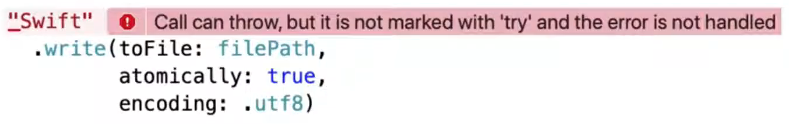
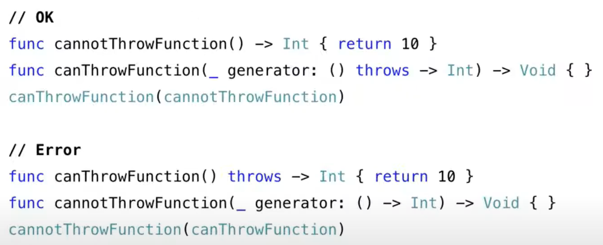
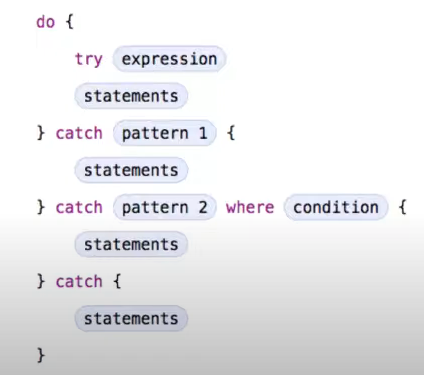
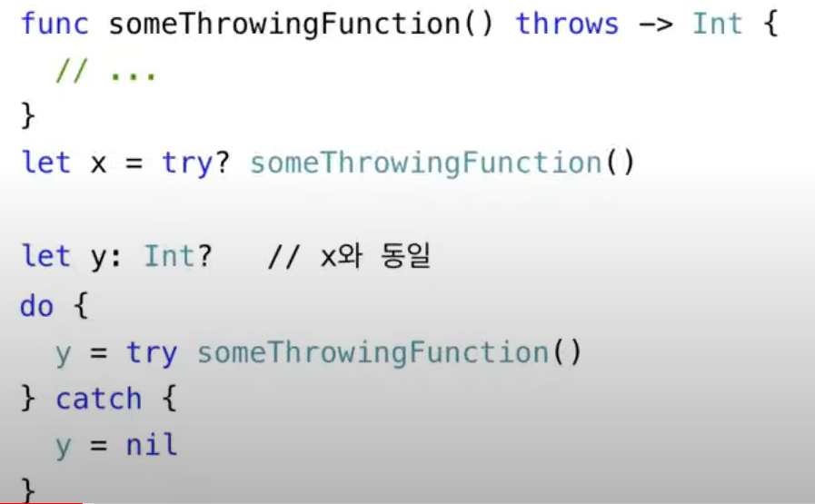
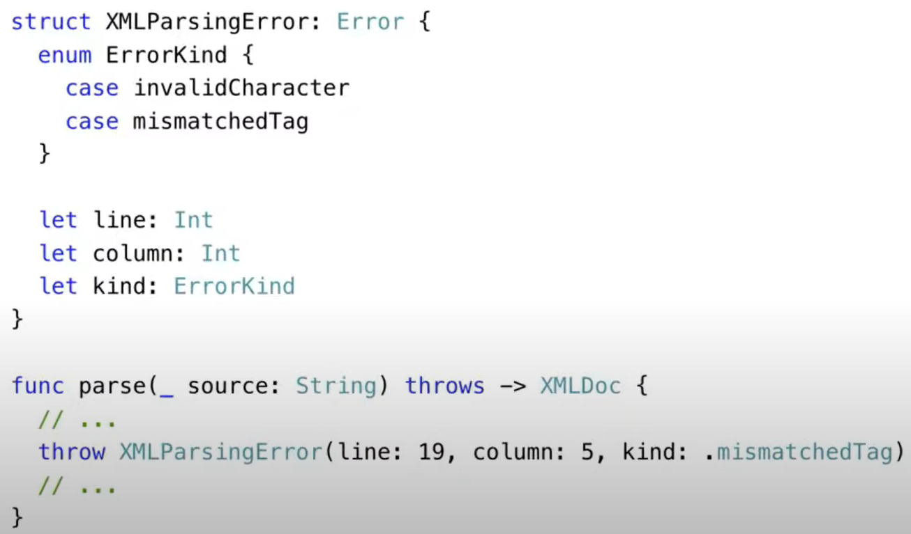

# Error Handling Theory

## 이론

### Error의 종류

1. **Simple Domain Error (단순 도메인 오류)**
   - 명백하게 실패하도록 되어 있는 연산 또는 추축에 의한 실행 등으로 발생
     1. 숫자가 아닌 문자로부터 정수를 파싱
     2. 빈 배열에서 어떤 요소를 꺼내느 동작 등
   - 오휴에 대한 자세한 설명이 필요하지 않으면 대개 쉽게 또는 즉시 에러를 처리할 수 있음
   - Swift에는 Optional등을 통해 잘 모델링 되어 있음
2. **Recovable ( 복구 가능한 오류 )**  **[중요 - Error Handling을 통해 관리해야 할 에러]**
   - 복잡한 연산을 수행하는 도중 실패가 발생할 수 있지만 사전 미리 오류를 합리적으로 예측할 수 있는 작업
     - EX) 파일을 읽고 쓰는 작업, 네트워크 연결을 통해 데이터 읽기 등
   - iOS 에서는 NSError 또는 Error 를 이용하여 처리
   - 일반적으로 이런 오류의 무시는 좋지 않으며 위험할 수도 있으므로 오류를 처리하는 코드 작성 권장
   - 오류 내용을 유저에게 알려주거나, 다시 해당 오류를 처리하는 코드를 수행하여 처리하는 것이 일반적
3. **Universal Error ( 범용적, 보편적 오류)**
   - 시스템이나 어떤 다른 요인에 의한 오류
   - 이론적으로는 복구가 가능하지만, 어느 지점에서 오류가 발생하는 지 예상하기 어려움
4. **Logic Failure**
   - Logic에 대한 오류는 프로그레머의 실수로 발생하는 것으로 프로그램적으로 컨트롤할 수 없는 오류에 해당
   - 시스템에서 메시지를 남기고 Abort()를 호출하더나 Exception발생

### Error Handling 이란?

- 프로그램 동작 중 예상 가능한 오류가 발생했을 때 이를 감지하고 복구하기 위한 일련의 처리 과정

- EX) Write 메서드를 사용할 때 발생 할수 있는 문제는? 

  - ```swift
    "Swift".wirte(toFile: filPath, atomically: true, encoding: .utf8)
    ```

    1. 해당 파일이 저장되어 있는 시스템 권한에 의해서 `쓰기` 권한이 없는 경우
    2. `filePath`가 잘못된 경우 (디렉토리 명 등)

  - 위와 같은 오류가 발생했을때 함수를 다룰 그 다음 행동에 대한 정의 필요

    - 

### 에러를 다루기 위한 4가지 방법

1. Propagating Errors Using Throwing Function

   - 오류에 대한 처리를 코드의 다른 부분에서 처리하도록  throws 키워드를 명시적으로 선언

   - throws 키워드가 없을 때는 오류를 해당 함수 내에서 처리함

   -  코드 예시

     - ```swift
       // this function is not permiited to throw. 에러를 내부에서 처리
       func foo() -> Int { }
       
       // this function are permiited to throw. 에러를 밖에서 처리
       func bar() throws -> Int { }
       func foo() throws -> { }
       func bar(_ callback: () throws -> ()) throws { }
       ```

   -  throws 함수와 non throws 함수

     - 
       - Throws가 없는 함수는 throws 가 있는 함수의 파라미터로 들어갈수 있지만
       - Throws 가 있는 함수는 없는 함수의 파라미터가 될 수 없다.

2. Handling Error Using Do-Catch

   - Do - catch를 통해서 명확하게 erroe 별로 처리할 내용을 상세하기 기입

   -  Do - catch 방법의 에러 헨들링

   - 소스코드 예시

     - ```swift
       do {
         let contents = try String(contentsOfFile: path)
         print(contents)
       } catch {  // 오류가 발생하면 catch로 이동
         print(error)
       }
       ```

     - 자판기에서 음료수를 구매하려고 할 때 발생할 수 있는 오류는 ?

       - ```swift
         do {
           try buyDrink(vendingMachine: vendingMachine)
           print("Success!")
         } catch VendingMachineRrror.outOfStock {				// 재고 부족
           print("Out of stock.")
         } catch VendingMachineError.insufficientFunds {	// 투입된 금액 부족
           print("Please insert an addtional coins.")
         } catch {														// 알 수 없는 에러 ( 위 에러가 아닌 나머지 에러 처리)
           print("Unexpected error: \(error).")
         }
         ```

3. Converting Error to Optional Value

   - try? 를 사용하여 do ~ catch 구문 없이 오류 처리 가능

   - 정상 수행시 optional값 반환, 오류 발생시 nil 반환

   - 코드 예시 

     - 

     - 특정 어플 실행시 헨드폰 로컬에서 데이터를 가져오고,  없을 경우 서버, 서버에도 없을 경우 nil 반환하는 예시

       ```swift
       func fetchData() -> Data? {
         if let data = try? fetchDataFromDisk() { return data }
         if let data = try? fetchDataFromServer() { return data }
         return nil
       }
       ```

       

4. Disabling Error Propagation

   - do ~ catch 구문 없이 throws 메서드 처리 가능하지만 오류 발생 시 앱 Crash
   - 오류가 발생하지 않는다고 확신할 수 있는 경우에만 `try!` 사용
   - EX) 앱 번들에 함께 제공되는 이미지 로드 등


### Specifying Cleanup Action

- `defer` 현재 코드 블럭이 종료되기 직전에 반드시 실행되어야 하는 코드 등록

- 해당 범위가 종료될 때 까지 연기하며 소스 코드에 기록된 순서의 역순으로 동작

- 소스코드 예시

  - ```swift
    func processFile(filename: String) throw {
      if exists(filename) {
        let file = open(filename)
        defer {
          close(file)
        }
        
        while let line = try file.readline() {
          // work with the hile
        }
      }
      // close(file) is called here, at the end of the scope
    }
    ```


### Define custon Error

- 에러가 발생했는데 처리하는 방법은 직접 구현하여 적용 가능

- 소스코드 예시

  - 사용자로부터 문자열 입력값을 받아서 해당 값이 Int64이면 정수 리턴

  - ```swift
    enum IntParsingError: Error { // 사용자가 직접 작성
      case overflow
      case invaliInput(String)
    }
    
    func parsingIntegar(numString: String) throw -> Int {  // 함수 정의
      guard let num = Int(numString) else { // Int형으로 안바뀌는 경우 Throw 실행
        throw IntParsingError.invalidInput(numString)
      }
      guard num <= Int64.max, num >= Int64.min else { // Int64초솨 시 throw 실행
        throw IntParsingError.overflow
      }
      return num // 정상 파싱될 경우 숫자 리턴
    }
    
    // 실제로 데이터를 변환하는 부분, 실제 에러 발생 부 
    do {
      let price = try parsingInteger(numString: "$100")
      print(price)
    } catch IntParsingError.invaliedInput(let invalid) {
      print("Invalid String: '\(Invalid)'")
    } catch IntParsingError.overflow {
      print("Overflow error")
    } catch {
      print("Other error")
    }
    ```

- 사용자 정의 에러 예시

  - 