# Network

## URI, URL, URI

### URI ( Uniform Resource Identifier )

- 인터넷의 자원을 유일하게 식별하기 위한 통합 자원 식별자
- 절대적 경로와 상대적 경로를 모두 포함하는 URL과 URN의 SupperSet

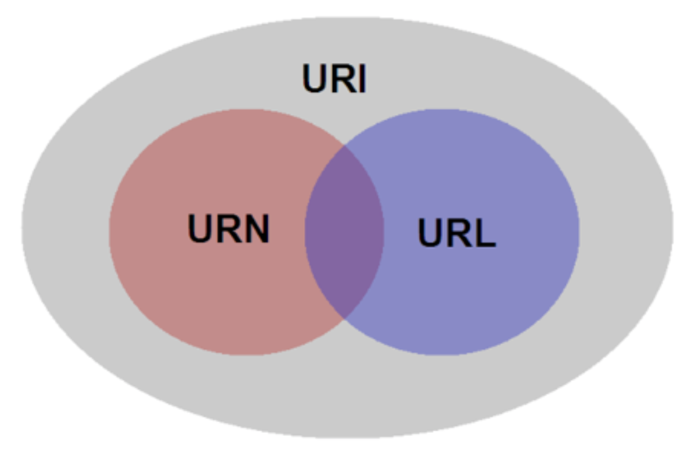


### URL ( Uniform Resource Locator )

- URL은 어떤 자원의 위치에 대한 절대경로 값을 지닌 문자열
- 어떤 특정 주소 또는 파일 리소스에 접근하기 위한 주소값으로 흔히 Http 로 시작하는 웹 주소로 인식하는 경우가 많지만, URL의 한 형태에 해당하는것으로 컴퓨터 네트워크의 자원을 모두 나타낼 수 있음

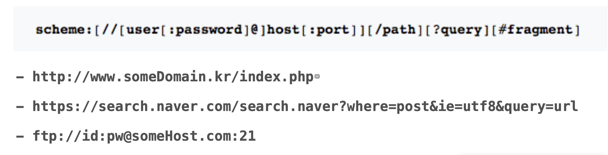


### URN ( Uniform Resource Name)

- URN은 위치에 독릭접이고, 지속되는 형태의 자원을 가르키기 위한 유일한 식별자
- IETF에서 표준 규격을 업데이트

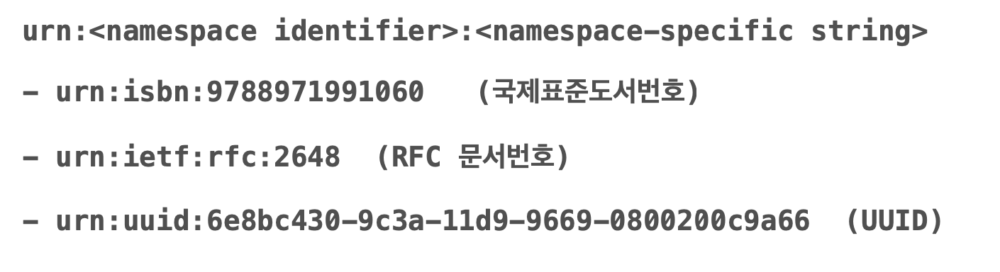


### URL 과 URN의 차이점

- URL - 주소 : 자료의 위치에 따라서 값이 변경됨
- URN - 주민등록증 : 특정 자료를 식별하기위한 유일한 값


### IRI ( International Resouce Identifier )

- URI의 상위 개념으로 확장된 버전

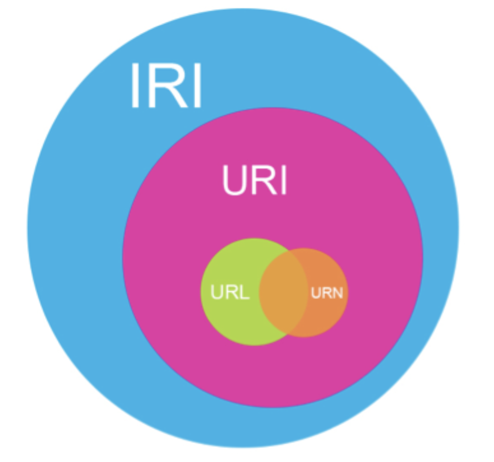


## Byte Ordering

- 시스템이 내부적으로 데이터를 저장하고 표현하는 순서
- CPU 벤터에 따라 바이트 단위로 데이터를 받아들이고 메모리에 저장하는 순서가 다른 데서 기인
- Big Endian / Little Endian
- 그외 Mixed, Middle, BI등의 Endian이 있으나 많이 사용되지 않음

**- Big Endian : IBM, Motorola, Sun Sparc, RISC, PowerPC** **계열의** **CPU**
 

**- Little Endian : Intel x86, x64, AMD** **계열의** **CPU**


### Big Endian

- Network Oedring이라고도 함
- 데이터를 상위 바이트로부터 낮은 메모리 주소에 저장하는 형태
- **e.g. 0x12345678 => 0x12 0x34 0x56 0x78** ( 낮은 주소 -> 높은 주소)

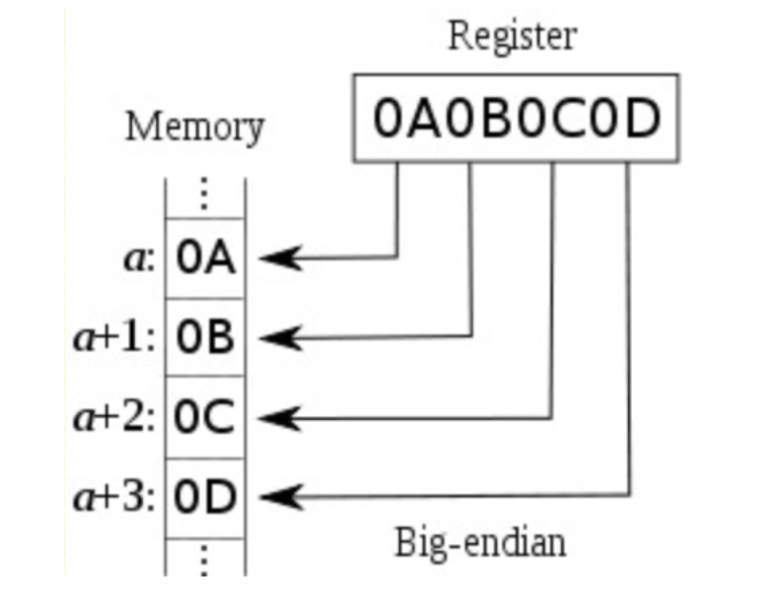

### Little Endian

- Host Ordering이라고도 하며, Iphone 도 여기에 해당
- 데이터를 하위 바이트로부터 낮은 메모리 주소에 저장하는 형태
- **e.g. 0x12345678 => 0x78 0x56 0x34 0x12** ( 낮은 주소 -> 높은 주소 )

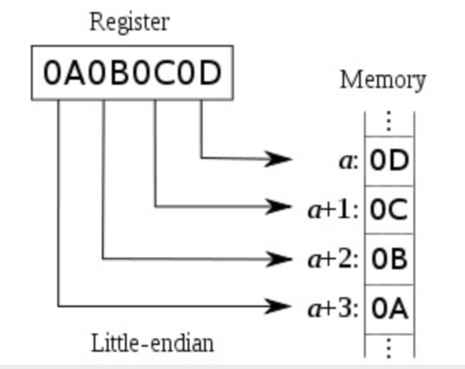


### Resolution

- Endian 통일 (Network Byte Order)

  - 모든 시스템이 저장하는 방식을 통일시키기는 어려운 상황이므로 모든 프로그램이 네트워크 전송 시, 약속된 공통의 Endian 을 사용하고 수신측에서 변환
  - 네트워크 바이드 오더 표준 : BigEndian

- Byte 단위 전송

  - Edian의 문제는 Byte단위로 저장할 때 순서의 차이에 의해 발생하므로, 애초에 1byte 단위로 데이터를 보내면 바이트 순서에 구애받지 않고 통신 가능

- Check Endian (Swift) 

  - ```swift
    let number: UInt32 = 0x12345678
    let convertedToBig = number.bigEndian
    if number == convertedToBig {
    	print("BigEndian \(number)")
    } else {
    	print("LittleEndian \(number)")
    }
    ```


## Internet Protocol Suite

- 인터넷 프로토콜 스위드(Protocol Suite)는 인터넷 네트워크에 쓰이는 프로토콜의 모음
- TCP/IP가 가장 많이 사용되기에 TCP/IP 프로토콜 스위트 또는 프로토콜 스택이라고도 함
- HTTP, FTP, Telnet 등이 TCP/IP 기반

**- TCP (Transmission Control Protocol) :** **패킷 전송 여부와 순서 보장의 특징**

**- IP (Internet Protocol) :** **비신뢰성 (패킷 전송 보장 X)과 비연결성의 특징 (IPv4, IPv6)**


### TCP/IP Protocol Suite

- 4개의 계층 구조로 구성 (Link 계층을 Physical 과 구분할 경우 5단계)
  1. Application 응용 계층 :  HTTP, FTP, SMTP, POP, Telnet 등
  2. Transport 전송 계층 : TCP, UDP, SCTP 등
  3. Network 계층 : IP, ARP 등
  4. Link 계층 : 이더넷, 토큰링, PPP, Wi - Fi 등
  5. Physical 물리계층 

- TCP/IP 계층 모형

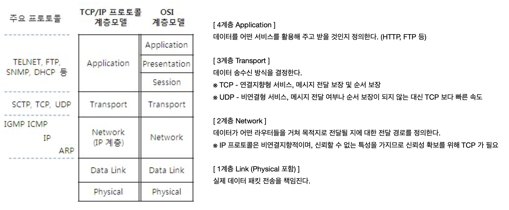

- TCP/IP 데이터 

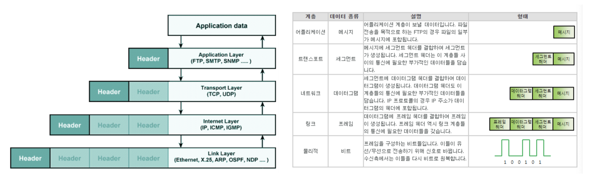

- 참조 : OSI 7 Layer

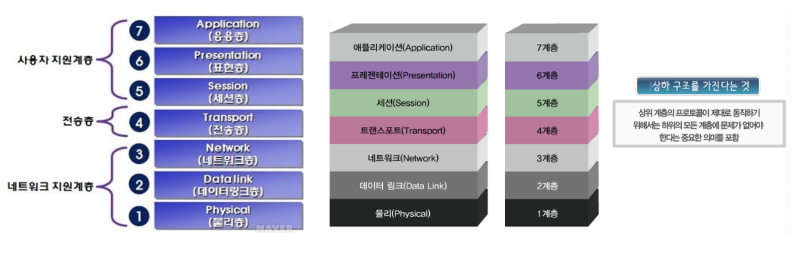


## HTTP

- Hyper Text Transfer Protocol
- 인터넷 상에서 텍스트를 주고받기 위해 만들어진 Protocol

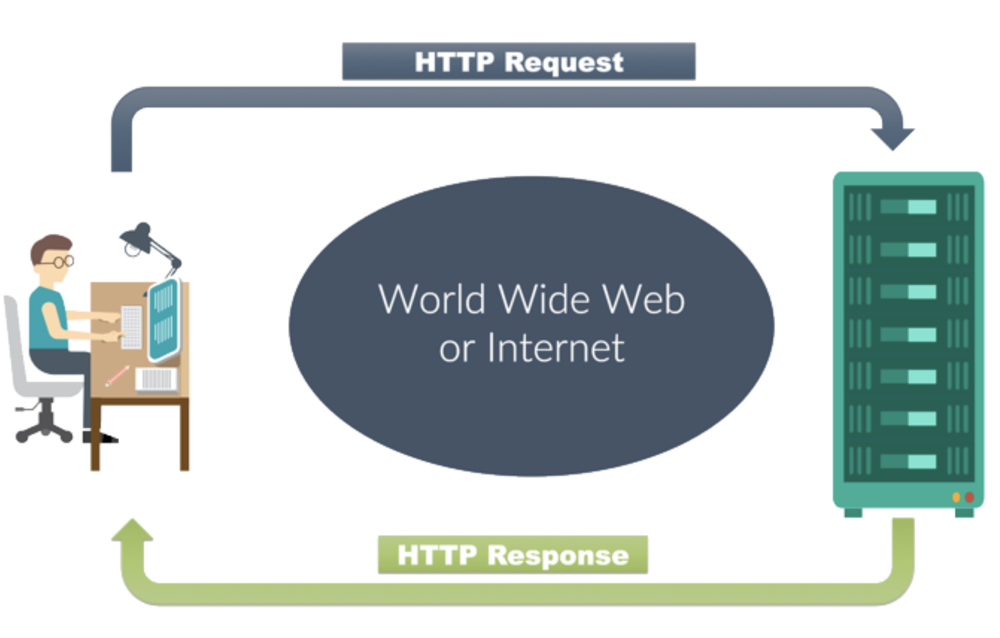

- HTTP 동작 방식 상세

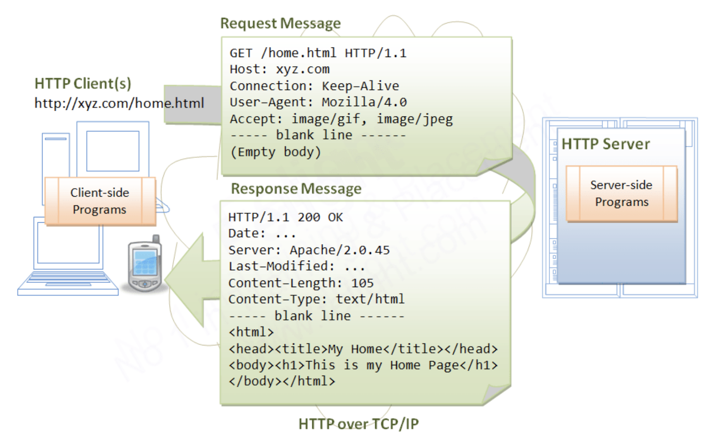


### HTTP Request

- 동작 방식 상세

- Request Line 
  - Method : Get, Post, Delete 등
  - URI : 일반적으로 URL 주소 형태 (https://www.google.com)
  - HTTP 버전 ( 현재 대부분 1.1 또는 2.0 )

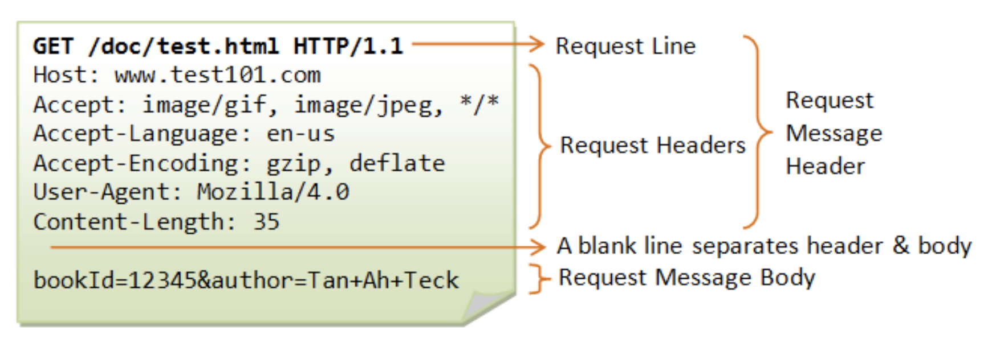

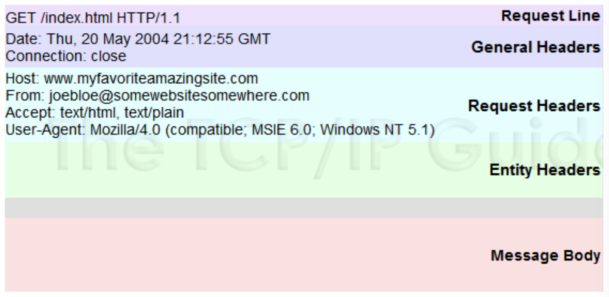


### HTTP Response

- Status Line
  - Response Status Code
  - HTTP 버전 (현재 대부분 1.1 또는 2.0)

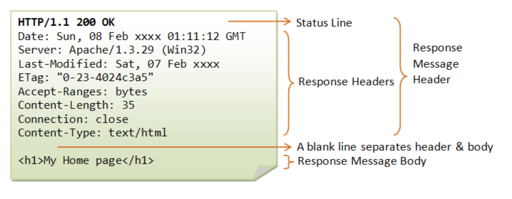

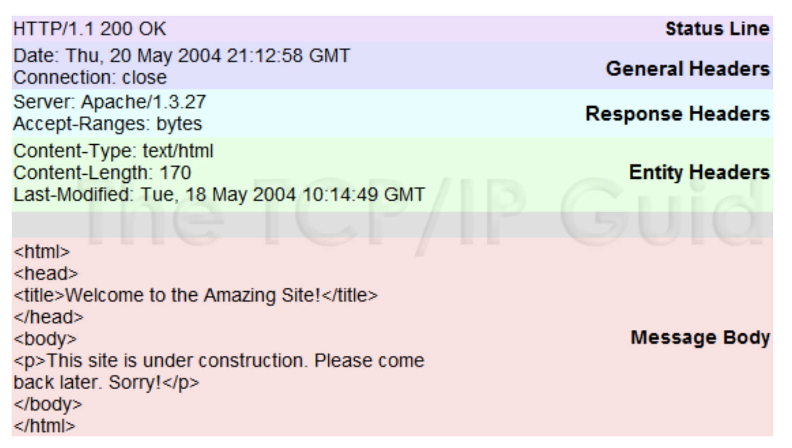


- HTTP Response State Code
  - 


## REST API

- REST - REpresentational State Transfer
- 자원을 정의하고 자원에 대한 주소를 지정하는 방법 등을 의미하는 네트워크 아키텍처 원리의 모음
- 웹 창시자 중 한 명인 Roy Fielding이 기존 아키텍처의 문제점을 보완하여 웹의 장점을 최대한 활용할 수 있는 네트워크 기반의 아키텍처로 설계하여 2000년 논문에서 발표
- REST 원리를 잘 따르는 시스템에 대하여 RESTFul 하다고 표현

### Main Components

- Rest 구성 요소
  - 메서드 : 자원에 대한 행위 정의 (Get, Post 등) - 아래 예제에서 Post
  - 리소스 : 자원을 정의 ( URI ) - 아래 예제에서 http://myweb/users
  - 메시지 : 자원에 대한 행위의 내용을 정의 (일반적으로 Json을 이용한 데이터)

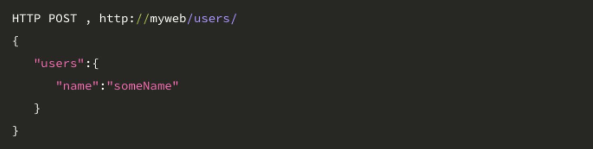


### Method

- HTTP 의 여러 메서드 중 CRUD에 해당하는 4가지 메소드만 사용
  - POST (Create)
    - URI 와 관련된 자원 생성 / 작업 수행
    - 다른 메서드들과 달리 URI에 특정 자원을 지정하는 ID 가 없음
    - 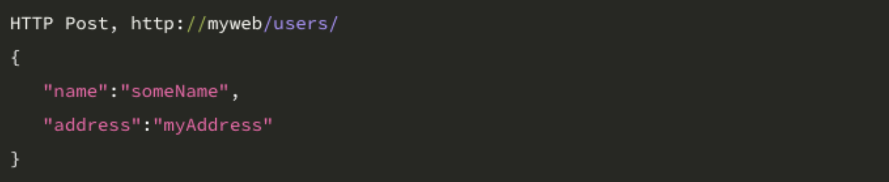
  - GET (Read)
    - 지정 URI에 해당하는 자원을 조회하고 가져오기 위함
    - 
  - PUT / PATCH (Update)
    - 지정 URI에 해당하는 자원 수정
      - PUT : 전체 내용 수정
      - PATCH : 일부 항목 수정
    - 
  - DELETE (Delete)
    - 지정 URI에 해당하는 자원 삭제
    - 


- REST API EXAMPLE


### 강의노트 :point_right: [링크](../LectureNote/Network.pdf)

