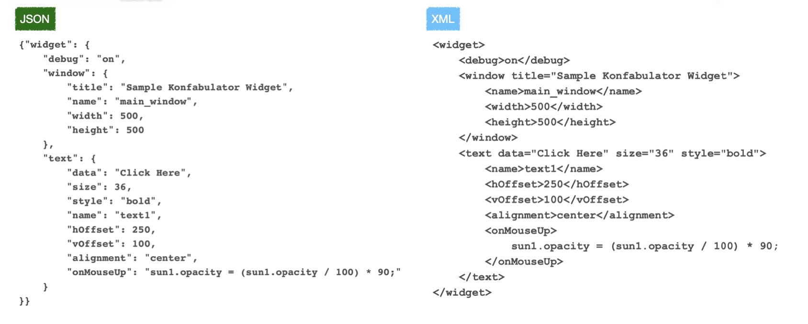

# JSON ( Javascript Object Notation )

## 이론

- Javascript 언어로부터 파생 (JavaScript Object Notation)
 
- 프로그래밍 언어와 플랫폼 간 **독립적**이고 가벼워서 XML 방식을 대체하여 
현재 거의 표준으로 사용되고 있는 데이터 교환 형식
 
- 두 개의 구조를 기본으로 가짐


  - 'Name : Value' 형태의 쌍을 이루는 콜렉션 타입. 각 언어에서 Hash table, Dictionary 등으로 구현
 
  - 값들의 순서화된 리스트. 대부분의 언어들에서 Array, Vector, List 또는 Sequence 로 구현
 
- XML 에 비해 기능이 적고 구조가 단순하여 파싱이 쉽고 빠르며 적은 용량으로 저장 가능
 따라서 사람이 읽고 쓰는 것뿐 아니라 기계가 분석하고 생성하는 것에도 (상대적으로) 더 용이 
- contents type 은 application/json 이며, 파일 확장자는 .json, 기본 인코딩은 UTF-8 을 사용 

### Json VS XML format 비교



### JSON in swift


## 실습

### Json Parsing  방법

1. [Sring: String] 형태로 되어있는 경우

   - ```swift
     let jsonData1 = """
     {
       "greeting": "hello world",
       "foo": "bar",
       "iOS": "Swift"
     }
     """.data(using: .utf8)!
     
     do {
       if let json = try JSONSerialization.jsonObject(with: jsonData1) as? [String: String],
         let greeting = json["greeting"],
         let foo = json["foo"],
         let iOS = json["iOS"] {
         print(greeting)	// "hello world\n"
         print(foo)			// "bar\n"
         print(iOS)			// "Swift\n"
       }
     } catch {
       print(error)
     }
     ```

2. [String: Any] 형태로 되어있는 경우

   - 각각 알맞은 타입으로 변경해주어야 함

   - ```swift
     let jsonData2 = """
     {
       "greeting": "hello world",
       "iOS": true,									// Bool 형
       "SwiftVersion": 5							// Int 형
     }
     """.data(using: .utf8)!
     // try? 를 통해서 에러가 났을때 nil 처리되도록 서렂ㅇ
     if let json = try? JSONSerialization.jsonObject(with: jsonData2) as? [String: Any],
       let greeting = json["greeting"] as? String,
       let iOS = json["iOS"] as? Bool,
       let version = json["SwiftVersion"] as? Int {
       print(greeting)		// hello world\n"
       print(iOS)				// "true\n"
       print(version)		// "5\n"
     }
     ```

3. 딕셔너리의 배열으로 되어 있는 경우

   - ``` swift
     let jsonData3 = """
     [	// 배열 형태
       {	// 딕셔너리 1번
          "postID": 1,
          "title": "JSON",
          "body": "Javascript Object Notation"
       },
       { // 딕셔너리 2번
         "postID": 2,
         "title": "JSON 파싱",
         "body": "JSONSerialization을 이용한 방법"
       }
     ]
     """.data(using: .utf8)!
     
     struct Post {
       let postID: Int
       let title: String
       let body: String
     }
     
     if let jsonObjects = try? JSONSerialization.jsonObject(with: jsonData3) as? [[String: Any]] {
       for json in jsonObjects {
         if let postID = json["postID"] as? Int,
           let title = json["title"] as? String,
           let body = json["body"] as? String {
           let post = Post(postID: postID, title: title, body: body)
           print(post)
         }
       }
     }
     /* 출력 예시
     Post(postID: 1, title: "JSON", body: "Javascript Object Notation")
     Post(postID: 2, title: "JSON 파싱", body: "JSONSerialization을 이용한 방법")
     */
     ```


### Question

>  User 구조체 타입을 선언하고, 다음 JSON 형식의 데이터를 User 타입으로 변환하여 출력하기 
>
>  e.g.
>  User(id: 1, firstName: "Robert", lastName: "Schwartz", email: "rob23@gmail.com")
>  User(id: 2, firstName: "Lucy", lastName: "Ballmer", email: "lucyb56@gmail.com")

- **Json Data**
  
  - ```swift
  let userJSONData = """
    {
      "users": [
        {
          "id": 1,
          "first_name": "Robert",
          "last_name": "Schwartz",
          "email": "rob23@gmail.com"
        },
        {
          "id": 2,
          "first_name": "Lucy",
          "last_name": "Ballmer",
          "email": "lucyb56@gmail.com"
        },
      ]
    }
    """.data(using: .utf8)!
    
    
    ```
  
- **문제 풀이 1 : User 외부에서 처리하는 방식**

  - ```swift
    
    
    struct User {
      let id: Int
      let first_name: String
      let last_name: String
      let email: String
    }
    
    var resultArray = [User]()
    
    if let jsonObjects = try? JSONSerialization.jsonObject(with: userJSONData) as? [String:[Any]] {
    
      if let tempArray = jsonObjects["users"] as? [[String:Any]] {
        
        for json in tempArray {
          if let userId = json["id"] as? Int,
            let first_name = json["first_name"] as? String,
            let last_name = json["last_name"] as? String,
            let email = json["email"] as? String {
            let user = User(id: userId, first_name: first_name, last_name: last_name, email: email)
            print(user)
          }
        }
      }
    }
    ```

- **문제 풀이 2 : User 내부에서 처리 하는 방식** 

  - ```swift
    struct User {
      let id: Int
      let firstName: String
      let lastName: String
      let email: String
    
      // 실패 가능한 생성자의 경우 ? 옵셔널 처리 가능
      init?(from json: [String: Any]) {	
        guard let id = json["id"] as? Int,
          let firstName = json["first_name"] as? String,
          let lastName = json["last_name"] as? String,
          let email = json["email"] as? String
          else { print("Parsing error"); return nil }
    
        self.id = id
        self.firstName = firstName
        self.lastName = lastName
        self.email = email
      }
    }
    
    func answer(jsonData: Data) {
      guard let json = try? JSONSerialization.jsonObject(with: jsonData) as? [String: Any],
        let userList = json["users"] as? [[String: Any]]
        else { return }
    
      let users: [User] = userList.compactMap { User(from: $0) }
      users.forEach { print($0) }
    }
    
    answer(jsonData: userJSONData)
```
  
- **데이터를 처리하는 위치**에 따라서 해당 코드가 MVC 모델에서 어디에 위치할지가 정해진다.

  - User Struct 내부에서 처리될 경우 -> Data 에 포함
  - User Struct 외부에서 처리될 경우 -> Controller 에 포함

### 강의노트 :point_right: [링크](../Lecture/JSON)

### 소스코드 :point_right: [링크](../SourceCode/"200706_URLSession/Network")


