# Debugging

## 이론

- 디버깅이란
  - 디버그(Debug)는 프로그래밍 과정중에 발생하는 오휴나 비 정상적인 연산, 즉 버그를 찾고 수정하는 것이다. 이 과정을 디버깅이라 하기도 한다.
  - 디버깅 과정을 통해서 코드에 대한 이해를 높이고 에러등을 찾는데 효율적
- 디버깅 방법
  1. 디버깅 도구 사용
  2. 코드 줄 출력 : print 를 통해서 정보를 출력하는 줄을 추가하는 식으로 프로그램을 임시로 수정
  3. 로깅 : 로그의 형태로 프로그램 실행을 언제나 확인할 수 있는 방법

- 디버깅 프로세스
  - 문제 식별 및 발생 위치 찾기
  - 실행 코드의 제어 흐름 및 데이터 구조를 조사하여 원인 규정
  - 솔루션을 고안하고 그에 따라 코드 수정
  - 수정됨 앱을 실행하고 수정된 코드가 잘 동작하는지 확인
- 디버깅 관련 용어 ( 공통 )
  - `breakpoint` : 중단지점입니다. 실행 모드가 아닌 디버그 모드에서 프로그램을 중지하게 되는 지점의 표시입니다. 보통 개발도구에서 소스 라인 맨 앞 여백을 더블클릭하면 생깁니다. 다시 더블클릭하면 없어집니다. resume을 실행하면 다음 중단점을 만날 때까지 실행됩니다.
  - `step over` : 한줄을 실행합니다. 함수가 있어도 실행 후 다음으로 넘어갑니다.
  - `step into` : 함수 내부로 들어갑니다.
  - `step out` : 함수를 끝까지 실행시키고 호출시킨 곳으로 되돌아 갑니다.
  - `resume` : 디버그로 한 줄 한 줄 실행시키는 트레이스 모드를 그만두고 다음 브레이크포인트를 만날 때까지 실행합니다.
  - `hot swap` : 디버깅 중의 메모리의 값을 변경해서 시뮬레이션하는 방법입니다.

## 실습

### Xcode 디버깅 관련 메뉴 및 옵션

- Debug Navigation
- BreakPoint Navigation

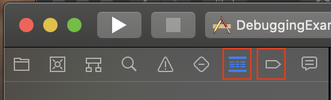

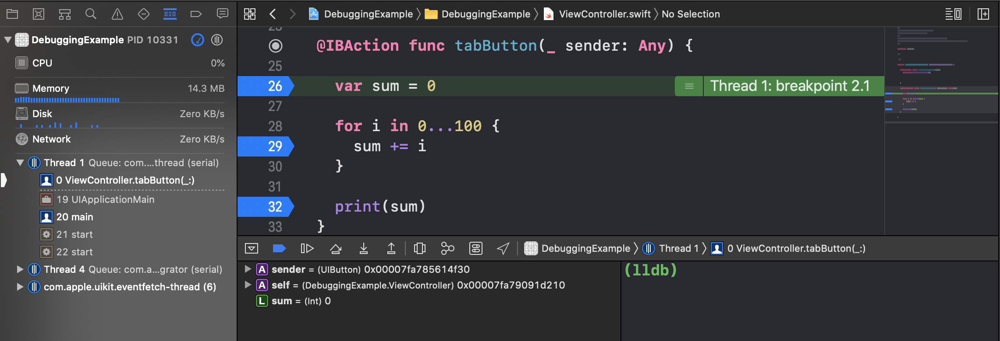

- LLVM 
  - Xcode의 컴파일러 + 툴체인
- llbm
  - LLVM 환경에서 동작하는 디버거

### 디버깅 상세 정보

- _ 로 되어있는 것들은 시스템에서 생성한 프로퍼티들

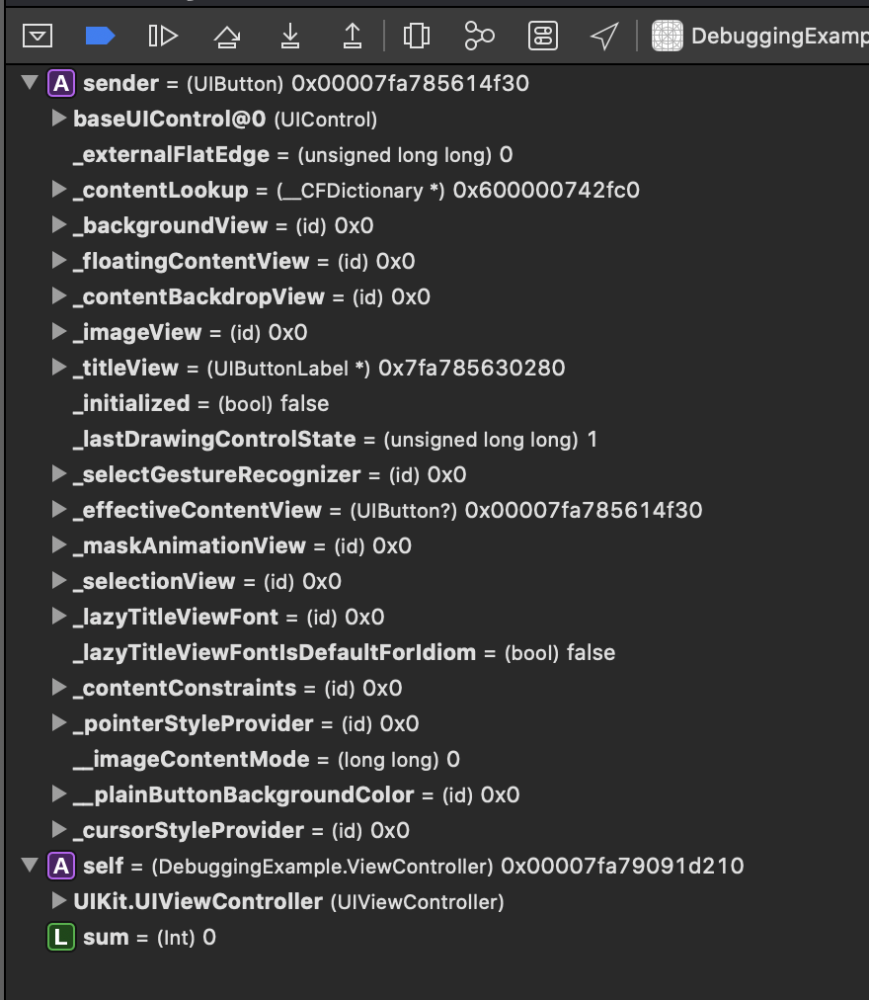

- 사용자가 지정한 프로퍼티들

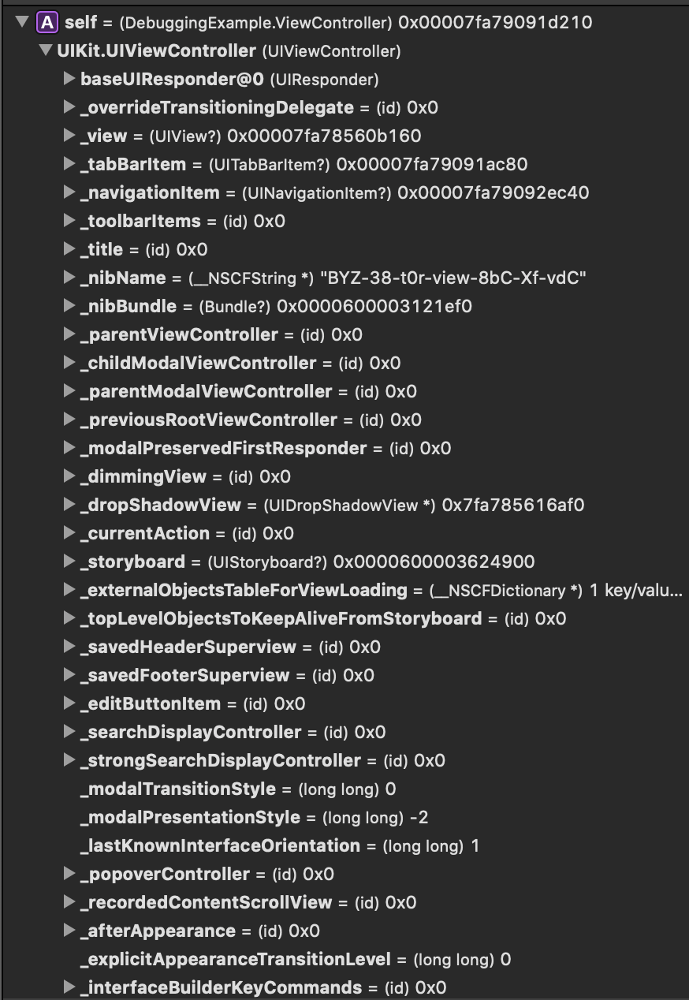

### 디버그를 통한 프로퍼티 값 확인 방법

1. 직접 해당 변수에 커서를 올려 확인
   - 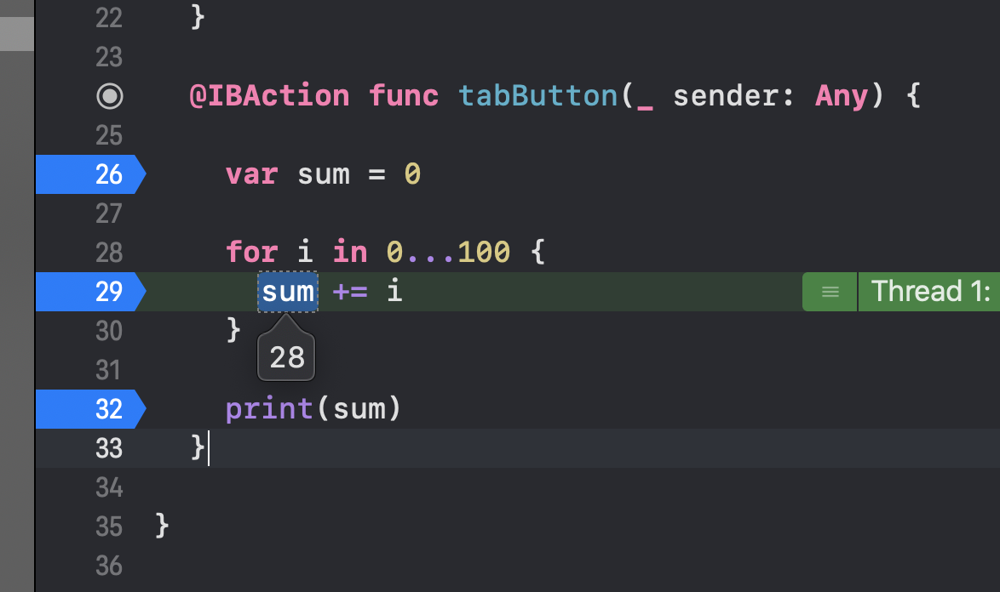
2. 디버깅 커맨드를 이용하여 변수 확인
   - 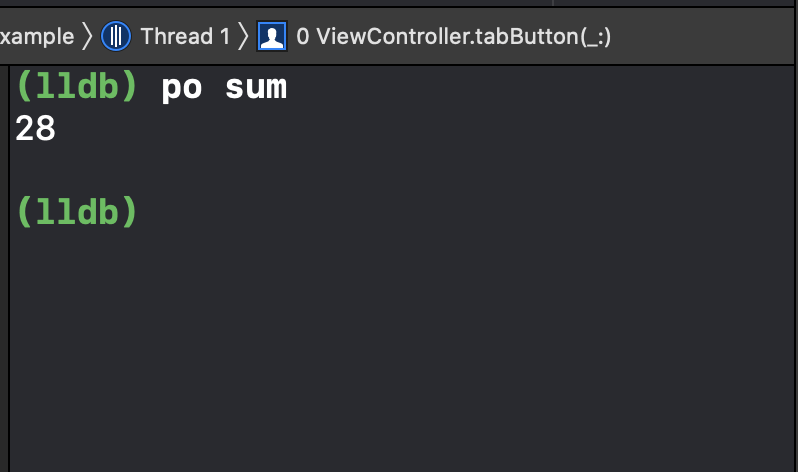
3. 화면 하단 프로퍼티를 보여주는 화면에서 변수 확인
   - 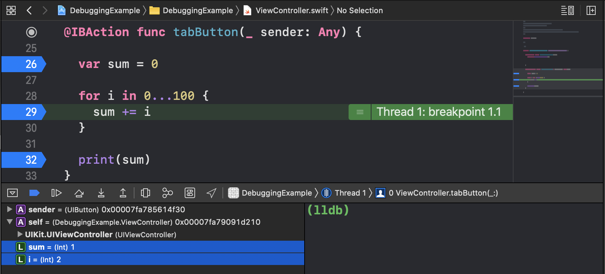

### Thread 정보

- 

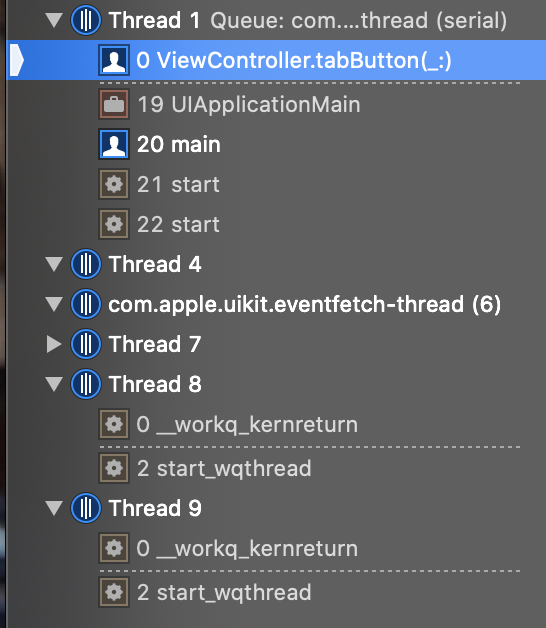

- stack
  - 가잔 나중에 저장된 데이터가 먼저 인출되는 방식으로 동작
  - 후입선출(LIFO, Last In First Out) 방식
  - push 동작으로 데이터를 저장하고, pop 동작으로 데이터를 인출
- stackFrame
  - 메모리의 스택(stack) 영역은 함수의 호출과 관계되는 지역 변수와 매개변수가 저장되는 영역입니다.
  - 스택 영역은 함수의 호출과 함께 할당되며, 함수의 호출이 완료되면 소멸함
    - 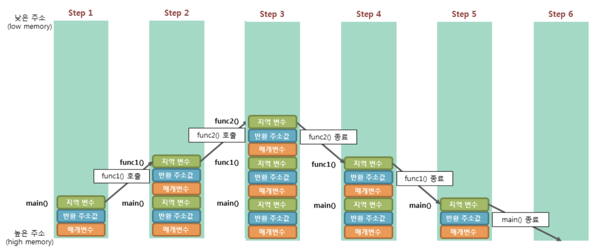
      - 
  - `bt` 디버깅 명령어를 통해서 현재 스택프레임을 상세하게 조회가능
    - 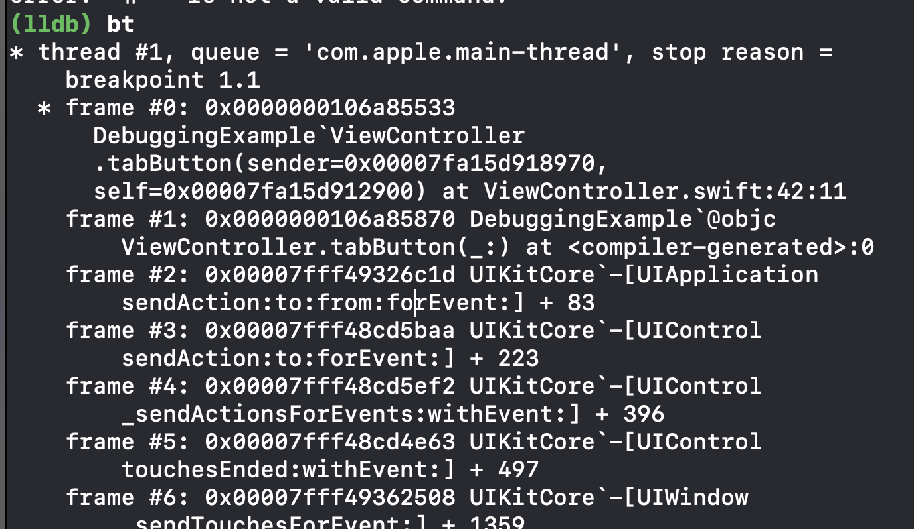

### 디버깅 프로세스 

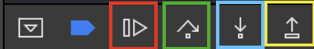

1. Continue ( 빨강색 )
   - 다음 breakPoint까지 실행시킴
2. stepOver ( 녹색 )
   - 코드 단위에서 함수가 나왔을때 함수의 결과만 가져와서(함수를 실행시키고) 다음 라인으로 진행
3. stepInto ( 파랑 )
   - 코드 단위에서 함수가 나올경우 해당 함수의 코드로 이동하여 디버깅 진행
   - 함수가 진행되면서 스택프레임의 스레드를 하나씩 줄여나가면서 진행됨 
   - 함수가 실행 됨 = 스택 프레임의 스래드가 하나씩 종료됨
4. stepOut ( 노랑 )
   - stepInto로 들어갔던 함수에서 즉시 빠져나옴

### 디버깅 명령어

- `help` 

  - 모든 명령어 목록을 표시하거나 특정 명령어에 대한 세부 도움말 출력

- `apropos`

  - 명령어와 서브 명령어 등의 설명부에서 지정한 키워드와 매칭되는 명령어를 검색하여 나열

- `po`

  - debugDescription 또는 description 내용 출력 (debugDescription > description 우선순위)

- `p`

  - LLDB 형태의 
  - 디버깅 중에 프로퍼티의 값을 변경할 수 있음

  

### Break Point 조건 생성

- Break Point에 사용자가 원하는 조건을 지정하여 해당 조건까지 실행된 후 break 되도록 설정 가능
- 설정 방법
  1. 설정한 브레이크 포인트에서 오른쪽 클릭
     - 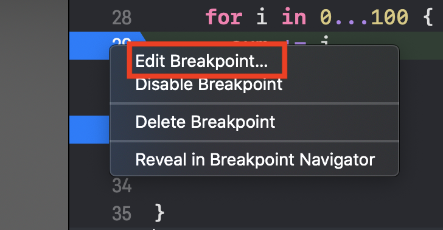
  2. Condition 설정
     - 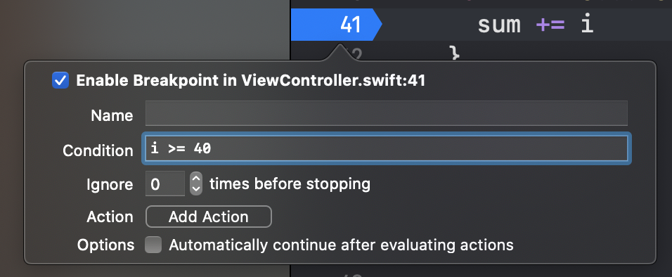
     - 조건 설정 시 아래와 같이 아이콘이 바뀜
       - 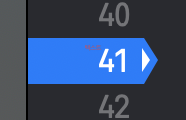 
  3. Continue를 통한 결과 확인
     - 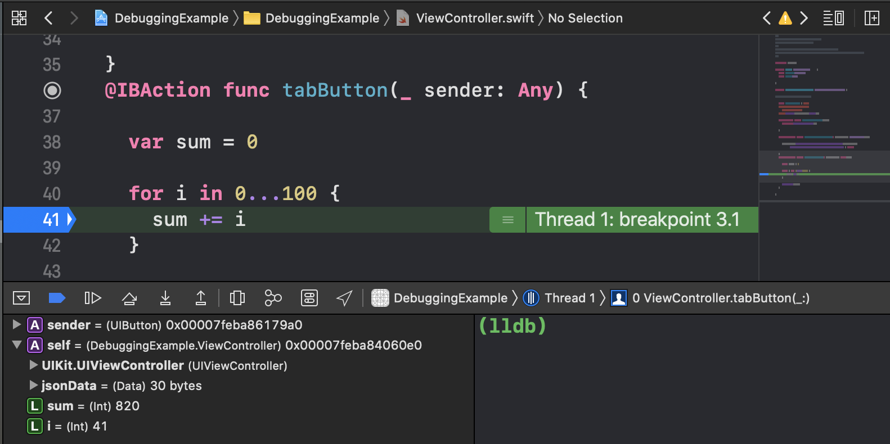
- 추가 옵션
  - 소리가 나거나 특정 단어, 변수를 음성으로 읽어주는 설정 가능
  - 

### CustomStringConvertible

- 로그를 찍을때 사용자가 커스텀해서 디버깅시 출력사항을 수정할 수 있다
  - 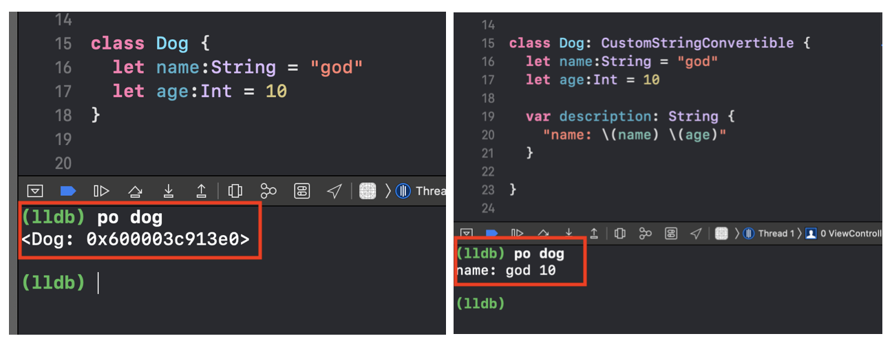

### Shared BreakPoint

- 협업을 하기 위해 git이나 다른 코드 공유 프로그램을 통해서 프로젝트 코드를 공유하는 경우 자신이 생성한  break point를 공유하기 위한 기능
  1. break point 공유 활성화/ 비활성화
     - 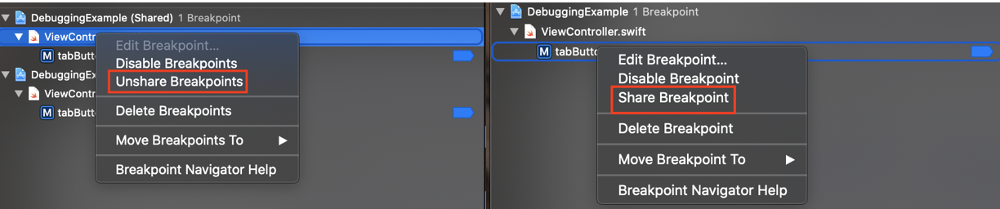
  2. 공유된 break Point
     - 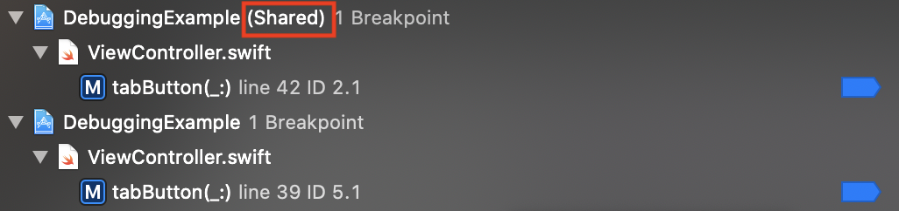

### Swift Error debugging

- 에러가 발생할 경우 자동으로 디버깅 모드로 진입함
- 설정 방법
  1. Error Breakpoint 설정
     - 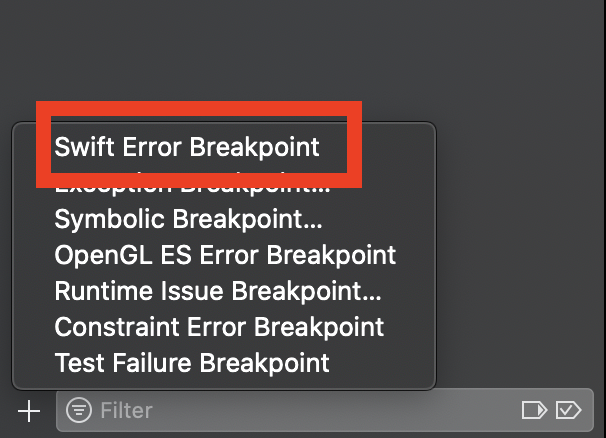
  2. 특정 모듈 검색 시 아래와 같이 설정
     - 모든 ViewDidLoad 관련 함수 break Ponint 설정
       - 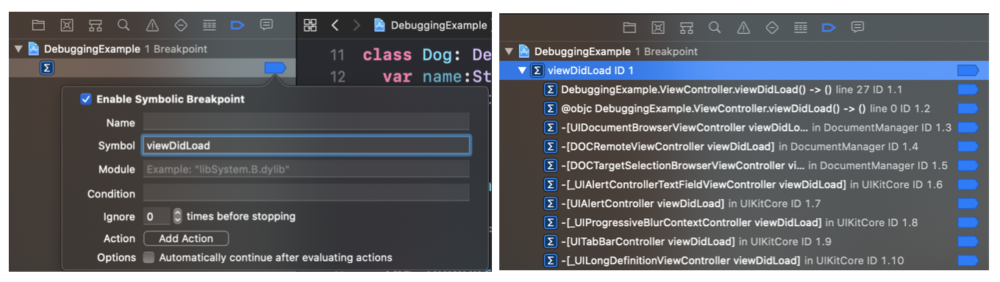
     - 프로젝트 명을 지정하여 특정 프로젝트내에서 사용되는 viewDidLoad 만 break Point 설정
       - 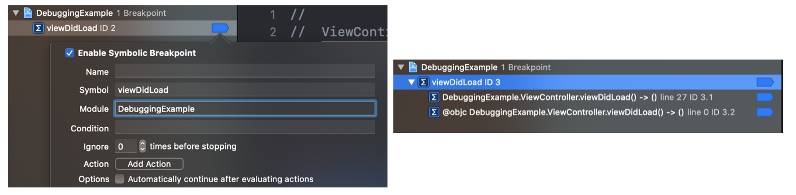

### Reference

- [ [스택프레임]  코딩의 시작, TCP School](http://tcpschool.com/c/c_memory_stackframe) 
-  [debug](https://okdevtv.com/mib/debug) 