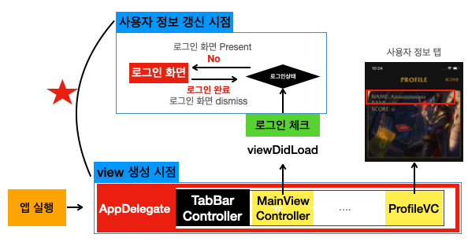
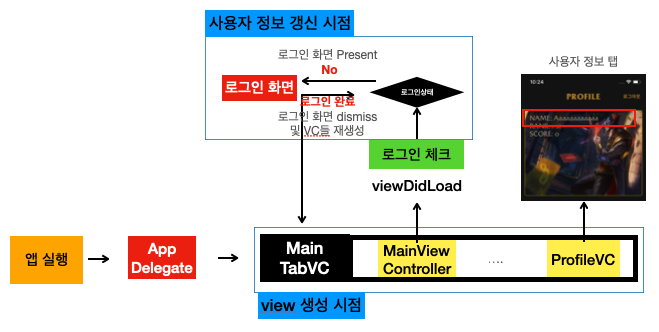

# 3th 해커톤 리뷰

## 로그인 프로세스 문제 

- Firebase를 통해서 사용자 로그인 기능을 구현한 뒤, 사용자로 로그인을 하여 사용자 정보를 Firebase에서 받아와 각각의 뷰에 적용
- 로그아웃 후 다른 사용자의 계정으로 로그인한 경우 이전 사용자의 정보가 남아 있는 문제 발생
- Firebase Auth 모듈의 특성상 별도로 로그인 하지 않을 경우 이전 사용자의 정보를 저장하고 있기 때문에 신규 사용자 로그인 시 새로운 유저의 데이터를 받아오도록 재생성 처리가 필요


### AS-IS 로그인 프로세스



- 문제가 있는 로그인 프로세스의 경우에는 사용자가 다른 계정으로 로그인 시 각각의 뷰 컨트롤러들을 갱신 해주는 코드가 없음
- AppDelegate에서 모든 탭바 인스턴스들을 생성함으로 로그인시 추가적인 탭바 초기화 기능을 구현하기 어려움 발생
- 결국 `사용자 정보 갱신 시점`에서 `view의 재생성 시점`에 관여 해야함


### TO-BE 로그인 프로세스



- AppDelegate내의 탭바를 생성하는 부분을 UITabBarController로 분리하여 별도의 swfit파일로 분류

- `MainTabVC` 내에 모든 탭바를 재생성하는 특정 함수를 만들어 새로운 로그인 발생시 해당 코드를 실행하여 모든 뷰 컨트롤러에서 신규 사용자의 로그인 정보를 사용하여 뷰 컨트롤러들을 초기화 해줌

- MainTabVC.swift

  - ```swift
    class MainTabVC: UITabBarController {
      
      override func viewDidLoad() {
        super.viewDidLoad()
        
        configureTabBar()
        
        checkIfUserIsLoggedIn()
        
      }
      
      // TabBar 버튼들의 인스턴스 재생성
      func configureTabBar() {
        
        let mainViewController = UINavigationController(rootViewController: MainViewController())
        let randomItenVC = UINavigationController(rootViewController: RandomItemVC())
        let userRankingVC = UINavigationController(rootViewController: UserRankingVC())
        let profileVC = UINavigationController(rootViewController: ProfileVC())
        
        mainViewController.tabBarItem = UITabBarItem(title: "Summoner", image: UIImage(systemName: CommonUI.SFSymbolKey.main.rawValue), tag: 0)
        randomItenVC.tabBarItem = UITabBarItem(title: "Item", image: UIImage(systemName: "archivebox.fill"), tag: 1)
        userRankingVC.tabBarItem = UITabBarItem(title: "Ranking", image: UIImage(systemName: "person.3.fill"), tag: 2)
        profileVC.tabBarItem = UITabBarItem(title: "Profile", image: UIImage(systemName: "person.fill"), tag: 3)
        
        UITabBar.appearance().barTintColor = CommonUI.pointColor
        UITabBar.appearance().tintColor = CommonUI.edgeColor
        
        viewControllers = [mainViewController, randomItenVC, userRankingVC, profileVC]
      }
      
      // Construct new controller
      func constructNavController(unselectedImage:UIImage, selectedImage:UIImage, rootViewController: UIViewController = UIViewController()) -> UINavigationController {
        
        // Construct nav controller
        let navController = UINavigationController(rootViewController: rootViewController)
        navController.tabBarItem.image = unselectedImage
        navController.tabBarItem.selectedImage = selectedImage
        navController.navigationBar.tintColor = .black
        
        // return new Controller
        return navController
      }
      
      func checkIfUserIsLoggedIn() {
        DispatchQueue.main.async {
          print(Auth.auth().currentUser)
          if Auth.auth().currentUser == nil {
            let loginVC = LoginVC()
            loginVC.modalPresentationStyle = .fullScreen
            self.present(loginVC, animated: true, completion: nil)
          }
        }
      }
    }
    ```

