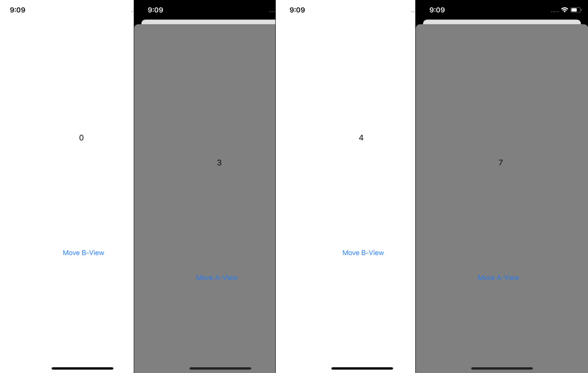

# 2020-04-24 homework

### [문제 - 오늘 배운것 응용]

> 문제: 3개의 뷰 컨트롤러 사이에 화면 전환하기
>      A는 B로 가는 버튼
>      B는 A로 돌아가는 dismiss 버튼과 C로 가는 버튼
>      C는 A 또는 B로 돌아가는 dismiss 버튼
>
> (참고)
> A -> B   
>   <- B -> C
>      B <- C
> A   <-    C

 ```swift

//핵심 코드 부분

// ----------- ViewController.swift  - A View --------------
// A -> B로 이동하는 버튼 구현 부분 
@objc func didTapButton(_ sender:Any) {
  let nextVC = NextViewController()		 		// B view 생성
  nextVC.view.backgroundColor = .brown		// B view 배경색 
  nextVC.modalPresentationStyle = .automatic	// Card Style로 생성
  present(nextVC, animated: true)	 // B view 화면 띄우기
}

// ----------- NextViewController.swift  - B View ----------- 
// B - > A 이동 부분 
@objc func didTapButton(_ sender:Any) {
  dismiss(animated: true)		// B view를 지움으로써 A View 표기됨
}
// B -> C 이동 부분  
@objc func moveCbuttonTap(_ sender:Any) {
  let nextCVC = CViewController()		// C View 생성
  present(nextCVC, animated: true)  // C View 화면 띄우기
}

// ----------- CViewController.swift  - C View ----------- 
// C view -> A View 
@objc func tapMoveAButton(_ sender:Any) {
  // 부모의 부모 부부 값 저장, 옵셔널 처리 필수
  if let beforeVC = presentingViewController?.presentingViewController { 
    // 값이 있을 경우 화면 띄우기
    beforeVC.dismiss(animated: true)  
  }
}
// C View -> B View 
@objc func tapMoveBButton(_ sender:Any) {
  dismiss(animated: true)  // C View를 지움으로써 부모 인 B View로 이동
}
 ```

### [과제 - 앱구현]

> **[ ViewController 데이터 전달]**
> AViewController 와 BViewController 를 만든 뒤, 각각 하나씩의 Label 생성
> A에서 B로 화면을 넘어갈 때는 B의 Label 값이 이전 값에서 +3 증가
> B에서 A로 화면을 넘어갈 때는 A의 Label 값이 이전 값에서 +1 증가
> e.g. A에서 B로 갈 때 3, B에서 다시 A로 넘어올 때 4, 다시 A에서 B로 가면 7, 다시 A로 오면 8 

- **구현 화면**




- **AViewController.swift 소스코드**

```swift
import UIKit

class AViewController: UIViewController {
    // 타 ViewController에서 접근하기 위한 프로퍼티 생성
    var numberLabel = UILabel()
    var numberAValue:Int = 0
    
    override func viewDidLoad() {
        super.viewDidLoad()
        
        // View A labe 
        numberLabel.frame = CGRect(x: 180, y: 200, width: 100, height: 200 )
        numberLabel.text = String(numberAValue)
        numberLabel.textColor = .black
        view.addSubview(numberLabel)
        
        // move B button
        view.backgroundColor = .white
        let moveBButton = UIButton(type: .system)
        moveBButton.setTitle("Move B-View", for: .normal)
        moveBButton.sizeToFit()
        moveBButton.frame = CGRect(x: 140, y: 500, width: 100, height: 100)
        moveBButton.addTarget(self, action: #selector(tapMoveBButton(_:)), for: .touchUpInside)
        view.addSubview(moveBButton)
    }

    @objc func tapMoveBButton(_ sender:Any) {
        let vcB = BViewController()
        vcB.numberBValue = numberAValue + 3 // 숫자 3 더하기
        vcB.numberLabel.text = String(vcB.numberBValue) // 라벨에 숫자 표기
        present(vcB, animated: true)
    }
}
```

- **BViewController.swift 소스코드**

```swift
import UIKit

class BViewController: UIViewController {
    // 타 ViewController에서 접근하기 위한 프로퍼티 생성
    var numberLabel = UILabel()
    var numberBValue:Int = 0
    
    override func viewDidLoad() {
        super.viewDidLoad()
        view.backgroundColor = .gray
        
        numberLabel.frame = CGRect(x: 180, y: 200, width: 100, height: 200 )
        numberLabel.text = String(numberBValue)
        numberLabel.textColor = .black
        view.addSubview(numberLabel)

        // move A button
        let moveAButton = UIButton(type: .system)
        moveAButton.setTitle("Move A-View", for: .normal)
        moveAButton.sizeToFit()
        moveAButton.frame = CGRect(x: 130, y: 500, width: 100, height: 100)
        moveAButton.addTarget(self, action: #selector(tapMoveAButton(_:)), for: .touchUpInside)
        view.addSubview(moveAButton)
    }

    @objc func tapMoveAButton(_ sender:Any) {
        if let vc = presentingViewController as? AViewController {
            vc.numberAValue = numberBValue + 1 // 숫자 1더하기
            vc.numberLabel.text = String(vc.numberAValue) // 라벨에 숫자 표기
        }
        dismiss(animated: true)
    }
}
```


### [도전 과제 - 앱구현] - 추후 Update

>  카드 스타일에서 제스처로 내릴 때는 UIAdaptivePresentationControllerDelegate 프로토콜을 사용한 별도의 작업 필요. 관련 내용을 검색해보고 presentationControllerDidDismiss 메서드를 이용해서 구현해보기

```swift

```


