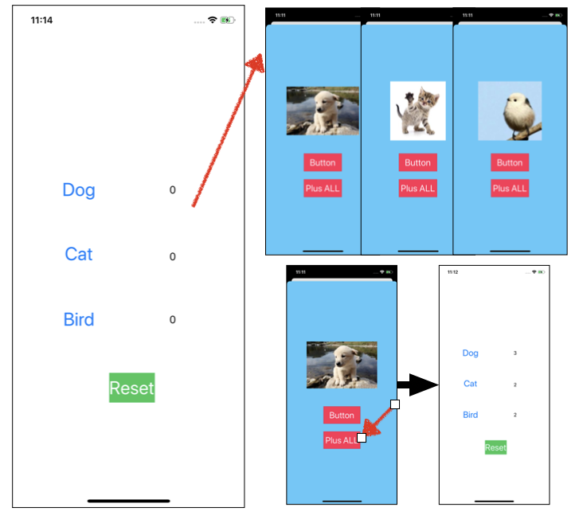

# 2020-05-07 homework

### [ 과제 ]

> - FirstVC 에 Dog, Cat, Bird 라는 이름의 Button을 3개 만들고 숫자를 표시하기 위한 Label 하나 생성 
> - SecondVC 에 UIImageView 하나와 Dismiss 를 위한 버튼 하나 생성 
> - FirstVC에 있는 버튼 3개 중 하나를 누르면 그 타이틀에 맞는 이미지를 SecondVC의 ImageView 에 넣기   (이미지는 구글링 등을 통해 활용) 
> - 각 버튼별로 전환 횟수를 세서 개는 8회, 고양이는 10회, 새는 15회가 초과되면 화면이 전환되지 않도록 막기  (전환 횟수가 초과된 버튼은 그것만 막고, 횟수가 초과되지 않은 버튼으로는 전환 가능) 
> - SecondVC에 추가로 UIButton 을 하나 생성하여 그 버튼을 누를 때마다 개와 고양이, 새 모두에 대해 전환 횟수가 각각 1회씩 추가되도록 구현

### 구현 화면




### 소스코드

- FirstViewController.swift

```swift
import UIKit

class FirstViewController: UIViewController {
    // 변수 변경시 레이블 자동 변경 코드 추가
    var dogCount:Int = 0 {
        didSet {
            dogCountLabel.text = String(dogCount)
        }
    }
    var catCount:Int = 0 {
        didSet {
            catCountLabel.text = String(catCount)
        }
    }
    var birdCount:Int = 0 {
        didSet {
            birdCountLabel.text = String(birdCount)
        }
    }
    
    // 사용자가 선택한 동물의 이름 저장
    var selectedAnimal:String = ""
    
    //SecondViewController에서 "Add ALL"버튼이 눌려진 횟수 가져옴
    var getplusButtonTabCount:Int = 0
    
    @IBOutlet weak var dogCountLabel: UILabel!
    @IBOutlet weak var catCountLabel: UILabel!
    @IBOutlet weak var birdCountLabel: UILabel!
    @IBOutlet weak var resetButton: UIButton!
    
    override func viewDidLoad() {
        super.viewDidLoad()
    }

    // 화면 이동이 발생한 경우 실행되는 함수
    override func prepare(for segue: UIStoryboardSegue, sender: Any?) {
        // SecondVC의 VC 변수 생성
        guard let secondVC = segue.destination as? SecondViewController else {return}
        // segue의 identifier 값 추출
        guard let identifier = segue.identifier else {return}
        secondVC.getSelectedAnimal = identifier
    }
    
    // 눌려진 버튼의 횟수에 따라서 segue를 실행 여부를 정하는 함수
    override func shouldPerformSegue(withIdentifier identifier: String, sender: Any?) -> Bool {
        if identifier == "Dog" && dogCount < 7 {
            return true
        } else if identifier == "Cat" && catCount < 9 {
            return true
        } else if identifier == "Bird" && birdCount < 14 {
            return true
        }
        
        return false
    }
    
    @IBAction func tabAnimalButton(_ sender: UIButton) {
        // 버튼 클릭시 전달할 데이터 생성
        guard let animal = sender.currentTitle else {return}
        if animal == "Dog" {
            dogCount += 1
        } else if animal == "Cat" {
            catCount += 1
        } else if animal == "Bird" {
            birdCount += 1
        }
        selectedAnimal = animal
    }
    
    // secondVC에서 되돌아올때 실행할 함수, SecondVC에 있는 전체 횟수를 늘리는 버튼이 눌려진 횟수 추출
    @IBAction func unwindToFirstVC(_ unwindSegue: UIStoryboardSegue) {
        guard let secondVC = unwindSegue.source as? SecondViewController else {return}
        getplusButtonTabCount = secondVC.plusButtonTabCount
        dogCount += getplusButtonTabCount
        catCount += getplusButtonTabCount
        birdCount += getplusButtonTabCount
    }
    @IBAction func tabResetButton(_ sender: Any) {
        catCount = 0
        dogCount = 0
        birdCount = 0
    }
}
```


- SecondViewController.swift

```swift
import UIKit

class SecondViewController: UIViewController {
    @IBOutlet weak var animalImageView: UIImageView!
		// FistVC로 부터 받아올 변수들    
    var getSelectedAnimal:String = ""
    var getAnimalNumber:Int = 0
  	
  	// FirstVC로 전달할 변수들
    var plusButtonTabCount:Int = 0
    
    
    override func viewDidLoad() {
        super.viewDidLoad()
        // 이미지 뷰에 이미지 설정
        let imageName = "\(getSelectedAnimal).jpeg"
        if getSelectedAnimal != "" {
            print(imageName)
            animalImageView.image = UIImage(named: imageName)
        }
    }
    // plusAll 버튼 누르는 카운터 체크 -> Unwind시 가져감
    @IBAction func tapButtonAction(_ sender: UIButton) {
        plusButtonTabCount += 1
    }
    
}

```

