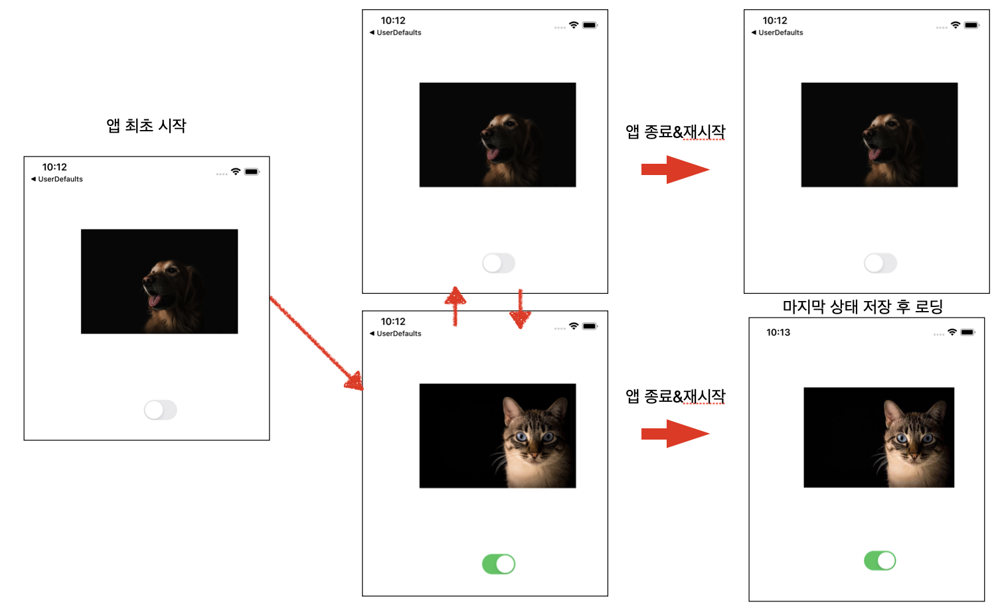

# 2020-05-08 homework

### [ 과제 ]

> - switch 를 통해서 off일 경우 Dog 출력, on일 경우 Cat 이미지를 출력해주는 화면 구성
> - UserDefaults 를 통해서 사용자가 마지막으로 셋팅 상태를 저장
> - 앱 재시작시 마지막으로 설정한 환경 로딩

### 구현 화면




### 소스코드

- ViewController.swift

```swift
import UIKit

class ViewController: UIViewController {
  // UserDefault Key입력시 오타 방지
  private struct Key {
    static var animalImage:String = "UserImage"
    static var togle:String = "toggle"
  }

  var imageBool:Bool = false

  @IBOutlet weak var animalImageView: UIImageView!
  @IBOutlet weak var animalSwitch: UISwitch!
  override func viewDidLoad() {
    super.viewDidLoad()
    // UserDefaults에 저장된 값 불러오기
    if let imageData = UserDefaults.standard.object(forKey: Key.animalImage) as? Data {
      print("Load userdata in image Data")
      self.animalImageView.image = UIImage(data: imageData)
    } else { 
      self.animalImageView.image = UIImage(named: "dog.jpg")
    }

    // UserDefaults에 저장된 값 불러오기
    if let temp = UserDefaults.standard.object(forKey: Key.togle) as? Bool {
      print("Load UserDefaultdate Bool Value")
      animalSwitch.isOn = temp
    }else { // 값이 없을 경우 기본값인 dog 그림 설정
      animalSwitch.isOn = false
    }

  }

  @IBAction func toggleSwtich(_ sender: Any) {
		// switch on off 확인
    if animalSwitch.isOn {
      animalImageView.image = UIImage(named: "cat.jpg")
    } else {
      animalImageView.image = UIImage(named: "dog.jpg")
    }
    
		//이미지 파일 얻어오기
    guard let image = animalImageView.image else {return}
		//이미지를 압축하여 저장
    let imageData = image.jpegData(compressionQuality: 0.3)
	
    //현재 데이터 저장
    UserDefaults.standard.set(imageData, forKey: Key.animalImage)
    UserDefaults.standard.set(animalSwitch.isOn, forKey: Key.togle)
  }

}


```


### 개선 후 소스코드

```swift
import UIKit

class ViewController: UIViewController {

  private struct Key {
    static var animalImage:String = "UserImage"
    static var togle:String = "toggle"
  }

  @IBOutlet weak var animalImageView: UIImageView!
  @IBOutlet weak var animalSwitch: UISwitch!

  override func viewDidLoad() {
    super.viewDidLoad()
    // 저장된 Bool 값 불러옴, 값이 없을 경우 false로 설정
		animalSwitch.isOn = UserDefaults.standard.object(forKey: Key.togle) as? Bool ?? false
		// Bool 값을 통해 true -> dog.jpg, false -> cat.jpg 
		let animalPictureName = animalSwitch.isOn ? "cat.jpg" : "dog.jpg"
    // 받아온 이미지 이름으로 이미지 뷰 설정
    animalImageView.image = UIImage(named: animalPictureName)

  }

  @IBAction func toggleSwtich(_ sender: Any) {
    let animalPictureName = animalSwitch.isOn ? "cat.jpg" : "dog.jpg"
    animalImageView.image = UIImage(named: animalPictureName)
    UserDefaults.standard.set(animalSwitch.isOn, forKey: Key.togle)
  }

}

```

