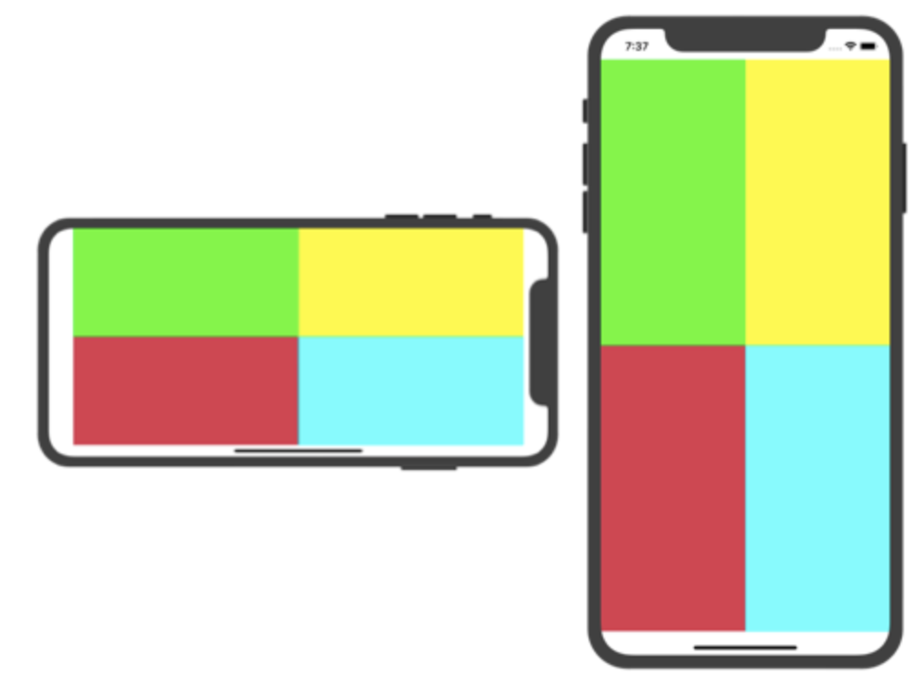
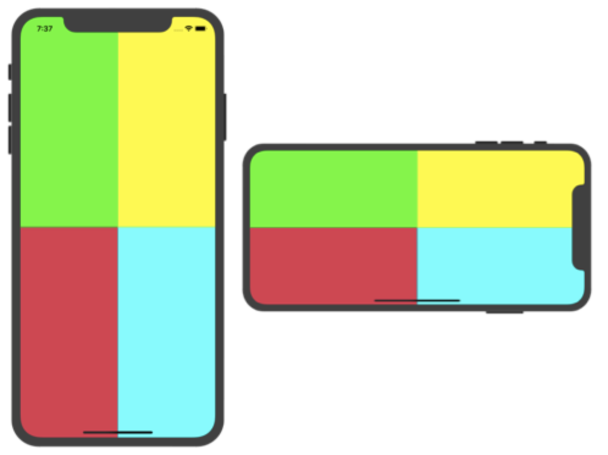
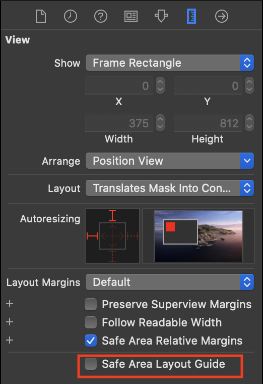
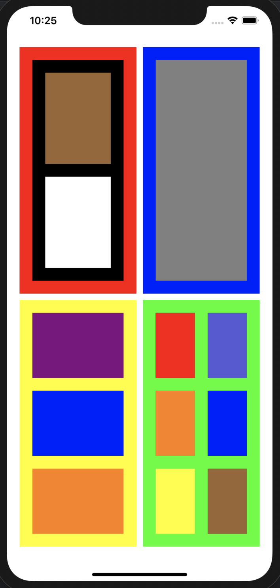

# 2020-05-15 homework

## [ 과제 1.오토레이아웃 연습 (별도 이미지 참고) ]

- View와 SafeArea를 구분해 오토레이아웃 설정하기

### Safe Area 기준 구성

- [소스코드 링크](https://github.com/tootoomaa/FastCampus_IOS_school/tree/master/homework/SourceCode/homework_AutoLayout_Practice1_SafeArea)

### View 기준 구성

- Safe Area Layout에 대한 Guide를 종료하고 위와 동일하게 설정해야 함
- 
- [소스코드 링크](https://github.com/tootoomaa/FastCampus_IOS_school/tree/master/homework/SourceCode/homework_AutoLayout_Practice1_View)

## [ 과제 2. 5개의 뷰 생성 (별도 이미지 참고) ]

- 5개의 뷰를 생성하고 높이는 150으로 통일 
- Safe Area Top 과 60 의 거리 
- 가장 왼쪽의 뷰는 leading 20, 가장 오른쪽의 뷰는 trailing 20으로 설정하고 각 view 간의 거리는 8로 고정 
- 각 위치에서 오른쪽에 있는 뷰는 왼쪽 뷰 width 의 0.7배에서 해당 위치의 인덱스만큼 뺀 값을 width 값으로 지님 
- 예시) 2번째 뷰의 width는 1번째 뷰 width의 0.7배보다 1 작게 설정 3번째 뷰의 width는 2번째 뷰 width의 0.7배보다 2 작게 설정

### 구현 목표

- [소스코드 링크](https://github.com/tootoomaa/FastCampus_IOS_school/tree/master/homework/SourceCode/homework_AutoLayout_Practice2_sixRect)

[과제 3. Auto Layout 연습]

- [소스코드 링크](https://github.com/tootoomaa/FastCampus_IOS_school/tree/master/homework/SourceCode/homework_AutoLayout_Practice3)

