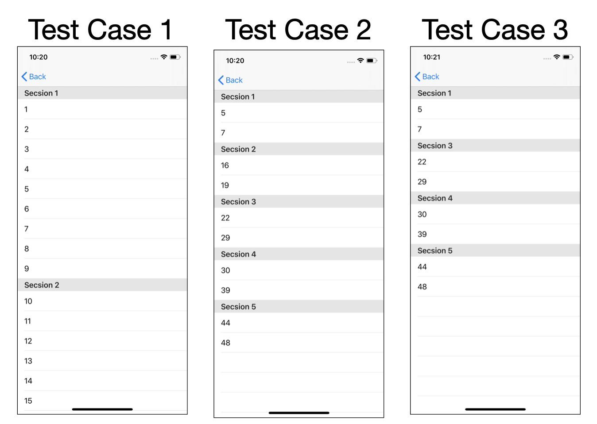
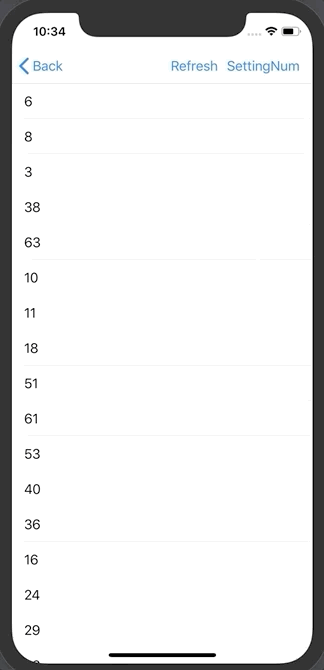

# 2020-05-25 homework

## [ 과제 1 ]

### 과제 설명

>  Data :  x ~ y까지의 숫자 (x, y는 임의의 숫자) (10 ~ 50, 60 ~ 78, 0 ~ 100)
> 섹션 타이틀을 10의 숫자 단위로 설정하고 각 섹션의 데이터는 해당 범위 내의 숫자들로 구성
>      
> e.g.
> 섹션 0 - 0부터 9까지의 숫자
> 섹션 1 - 10부터 19까지의 숫자
>      
> let data = [5, 7, 16, 19, 22, 29, 30, 39, 44, 48, 50]
> 위 데이터가 주어지면
> 섹션 0 - 5, 7
> 섹션 1 - 16, 19
> 섹션 2 - 22, 29

### 구현 화면



### 소스코드


```swift
import UIKit

final class TableViewSection: UIViewController {
  
    override var description: String { "Practice 3 - Section" }
    
//    let data = Array(1...100) 															// test case 1
//    let data = [5, 7, 16, 19, 22, 29, 30, 39, 44, 48, 50]		// test case 2
    let data = [5, 7, 22, 29, 30, 39, 44, 48, 50]							// test case 3
    var tempData:[Int] = []
    var sectionCount: Int = 0
    var numberCategories: [Int: [Int]] = [:]
    var sectionTitles: [Int] = []
    
    override func viewDidLoad() {
        super.viewDidLoad()
        
        let tableView = UITableView(frame: view.frame)
        view.addSubview(tableView)
        
        // Data 분류
        tempData = data
        inputData()
        
        tableView.register(UITableViewCell.self, forCellReuseIdentifier: "CellID")
        tableView.dataSource = self
    }
    
    // Data Input Function
    func inputData() {
        // Get Max Number in Array
        sectionCount = tempData.max()!/10
        for i in 1..<sectionCount+1 {
          	// Make Dictionary 
            numberCategories.updateValue([], forKey: i)
            for number in tempData {
                if i*10 > number {
                  	// input number
                    numberCategories[i]?.append(number)
                  	// remove input number, prevent input same number
                    tempData.remove(at: tempData.firstIndex(of: number)!)
                }
            }
            // Empty Session Delete
            if numberCategories[i]!.count == 0 {
                numberCategories.removeValue(forKey: i)
            } else {
                sectionTitles.append(i)
            }
        }
    }
}

// MARK: - UITableViewDataSource
extension TableViewSection: UITableViewDataSource {
    // section의 갯수
    func numberOfSections(in tableView: UITableView) -> Int {
        return sectionTitles.count
    }
    
    // 각 섹션의 해더 이름을 지정
    func tableView(_ tableView: UITableView, titleForHeaderInSection section: Int) -> String? {
        return String("Session \(sectionTitles[section])")
    }
    
    // 각 session 내 하위 row 갯수
    func tableView(_ tableView: UITableView, numberOfRowsInSection section: Int) -> Int {
        return numberCategories[sectionTitles[section]]!.count
    }
    
    //Cell 재사용 정의
    func tableView(_ tableView: UITableView, cellForRowAt indexPath: IndexPath) -> UITableViewCell {
        let cell = tableView.dequeueReusableCell(withIdentifier: "CellID", for: indexPath)
        let sectionNumber = numberCategories[sectionTitles[indexPath.section]]!
        cell.textLabel?.text = "\(sectionNumber[indexPath.row])"
        return cell
    }
}

```


## [ 과제 2 ]

### 과제 설명

>    [ 실습 - TableViewRefresh 기능을 이어서 수행 ]   
>    1) 처음 화면에 띄워질 목록은 1부터 지정한 숫자까지의 숫자들을 출력
>    2) 이후 갱신할 때마다 임의의 숫자들이 출력되도록 할 것
>
>    랜덤 숫자의 범위는 출력할 숫자 개수의 +50 이며, 모든 숫자는 겹치지 않아야 함.
>   (여기까지 TableViewRefresh 실습 내용과 동일)
>
>    3) 특정 테이블뷰셀을 선택하고 갱신하면 해당 셀에 있던 숫자는 유지되고 나머지 숫자들만 랜덤하게 갱신되도록 처리
>    (셀을 선택한 순서에 따라 그대로 다음 갱신 목록에 출력)
>    e.g. 20, 10 두 개의 숫자를 선택하고 갱신하면, 다음 숫자 목록은 (20, 10, random, random...)
>
>    4) 위 3번에서 숫자를 선택할 때 그 숫자가 7보다 작은 셀은 선택이 되지 않도록 처리.
>
> ​    < 힌트 키워드 >
>
>   willSelectRowAt - scrollViewDelegate 참고, 선택 가능 여부
>   selectedRow(s) - tableView 속성, 현재 선택된 행에 대한 정보
>   multipleSelection - 다중 선택 가능 여부

### 구현화면



### 소스코드

```swift
import UIKit

final class TableViewMultipleSelection: UIViewController {
  override var description: String { "Practice 3 - MultipleSelection" }
  let tableView = UITableView()

  var printDataNumber = 20
  var dataArray:[Int] = []
  var selectedDataArray:[Int] = []

  override func viewDidLoad() {
    super.viewDidLoad()
		// 테이블 생성 관련 옵션 정의
    setupTableView()
		// 데이터 생성 부분
    makeNewArrayData(printDataNumber)

    let refreshingButton = UIBarButtonItem(
      title: "Refresh", style: .plain, target: self,
      action: #selector(reloadData))

    let printNumberSeletngButton = UIBarButtonItem(
      title: "SettingNum", style: .plain, target: self,
      action: #selector(settingNumber))

    navigationItem.rightBarButtonItems = [printNumberSeletngButton, refreshingButton]

    let refreschControl = UIRefreshControl()
    refreschControl.tintColor = .blue
    refreschControl.addTarget(self, action: #selector(reloadData), for: .valueChanged)
    tableView.refreshControl = refreschControl
  }

  func setupTableView() {
    tableView.frame = view.frame
    view.addSubview(tableView)
    tableView.dataSource = self
    tableView.delegate = self
    tableView.allowsMultipleSelection = true
    tableView.register(UITableViewCell.self, forCellReuseIdentifier: "CellID")
  }
  
	// 추가 기능, 표현되는 숫자를 사용자가 입력하도록 지원
  @objc func settingNumber() {
    let addAlertMenu = UIAlertController(title: "옵션", message: "정수를 입력하세요", preferredStyle: .alert)
    //숫자를 입력받기 위한 textField 추가
    addAlertMenu.addTextField()
    // alert 창의 "Add Count" 메뉴 누를 시
    let addAction = UIAlertAction(title: "set Number", style: .default) { _ in
			if let userInputNumber = Int((addAlertMenu.textFields?.first?.text)!) {
      	self.printDataNumber = userInputNumber
      }
    }
    // alert 창의 "Cancle" 메뉴 누를 시
    let cancelAction = UIAlertAction(title: "Cancel", style: .cancel) { _ in }
    //각 메뉴 alert창에 추가
    addAlertMenu.addAction(addAction)
    addAlertMenu.addAction(cancelAction)
    // 화면에 띄우기
    present(addAlertMenu, animated: true)
  }

  @objc func reloadData() {
    makeNewArrayData(printDataNumber)
    tableView.refreshControl?.endRefreshing() // refreshing 후 원상태로 돌아가는
    tableView.reloadData()
  }
	// 입력된 배열으로부터 딕셔너리 값으로 적용
  func makeNewArrayData(_ makeNumber:Int) {
    dataArray = selectedDataArray
    while dataArray.count != makeNumber {
      let temp = (0...makeNumber+50).randomElement()
      if !dataArray.contains(temp!) {
        dataArray.append(temp!)
      }
    }
    selectedDataArray = []
    print(dataArray)
  }

}

// MARK: - UITableViewDataSource
// UITableViewDataSource 관련 부분 ( 데이터 표시 )
extension TableViewMultipleSelection: UITableViewDataSource {
  func tableView(_ tableView: UITableView, numberOfRowsInSection section: Int) -> Int {
    return dataArray.count
  }

  func tableView(_ tableView: UITableView, cellForRowAt indexPath: IndexPath) -> UITableViewCell {
    let cell = tableView.dequeueReusableCell(withIdentifier: "CellID", for: indexPath)
    cell.textLabel?.text = "\(dataArray[indexPath.row])"
    return cell
  }
}

// UITableViewDelegate 관련 부분 ( 테이블 선택, 해제 등 인터렉션 관련 부분 )
extension TableViewMultipleSelection: UITableViewDelegate {
  // row를 선택 해제 했을떄 해제된 값을 selectedDataArray에서 제거
  func tableView(_ tableView: UITableView, didDeselectRowAt indexPath: IndexPath) {
    selectedDataArray.remove(at: selectedDataArray.firstIndex(of: dataArray[indexPath.row])!)
  }
  // row를 선택 했을때 선택된 값을 selectedDataArray 저장
  func tableView(_ tableView: UITableView, didSelectRowAt indexPath: IndexPath) {
    selectedDataArray.append(dataArray[indexPath.row])
  }

  // 선택 한 값이 7보다 작은 경우 선택 안되도록 적용
  func tableView(_ tableView: UITableView, willSelectRowAt indexPath: IndexPath) -> IndexPath? {
    if dataArray[indexPath.row] < 7 {
      return nil
    }
    return indexPath
  }
}
```


## [ 과제 3 ]

### 과제 설명

>   **문제**
>
>   - 미리 정해진 동물의 이미지와 텍스트를 테이블뷰에 표현
>   - 각 셀의 크기는 80
>   - 셀을 선택하면 체크박스가 나타나고 다시 선택하면 체크표시가 해제되도록 구현
>
>     **도전 과제**
>
>   - 테이블뷰의 각 셀을 위아래로 스크롤 했다가 다시 나타낼 때, 체크 표시가 기존에 했던 곳에 정확히 다시 나타나도록 구현

### 구현화면


### 소스코드

```swift
import UIKit

final class TableViewAccessoryType: UIViewController {
  override var description: String { "Task 2 - AccessoryType" }

  let animals = [
    "bear", "buffalo", "camel", "dog", "elephant",
    "koala", "llama", "panda", "lion", "horse",
    "guinea_pig", "koala", "whale_shark", "whale", "duck",
    "seagull", "black_swan", "peacock", "giraffe"
  ]
  var selectedAnimalList:[Int] = []

  var tableView = UITableView()

  override func viewDidLoad() {
    super.viewDidLoad()
    tableView = UITableView(frame: view.frame)

    setTableView()

    navigationItem.rightBarButtonItem = UIBarButtonItem(title: "ReLoad", style: .plain, target: self, action: #selector(tabReloadButton))

    view.addSubview(tableView)
  }

  func setTableView() {
    tableView.dataSource = self
    tableView.delegate = self
    tableView.allowsMultipleSelection = true
    tableView.register(UITableViewCell.self, forCellReuseIdentifier: "CellID")
  }

  @objc func tabReloadButton() {
    tableView.refreshControl?.endRefreshing() // refreshing 후 원상태로 돌아가는
    tableView.reloadData()
  }
}

extension TableViewAccessoryType: UITableViewDataSource {
  func tableView(_ tableView: UITableView, numberOfRowsInSection section: Int) -> Int {
    return animals.count
  }

  func tableView(_ tableView: UITableView, heightForRowAt indexPath: IndexPath) -> CGFloat {
    return 80
  }

  func tableView(_ tableView: UITableView, cellForRowAt indexPath: IndexPath) -> UITableViewCell {
    let cell = tableView.dequeueReusableCell(withIdentifier: "CellID", for: indexPath)
    let animalName = animals[indexPath.row]
    cell.textLabel?.text = animalName
    cell.imageView?.image = UIImage(named: animalName)

    // selectedAnimalList에 저장된 순서에 row는 checkmark 지정
    if selectedAnimalList.contains(indexPath.row) {
      cell.accessoryType = UITableViewCell.AccessoryType.checkmark
    } else {
      cell.accessoryType = UITableViewCell.AccessoryType.none
    }
    return cell
  }
}


extension TableViewAccessoryType: UITableViewDelegate {
  // 선택된 row에 checkmark 추가
  func tableView(_ tableView: UITableView, didSelectRowAt indexPath: IndexPath) {
    selectedAnimalList.append(indexPath.row)
    tableView.cellForRow(at: indexPath)?.accessoryType = UITableViewCell.AccessoryType.checkmark
  }
	// 선택된 row의 checkmark삭제
  func tableView(_ tableView: UITableView, didDeselectRowAt indexPath: IndexPath) {
    // Reload 후 중복으로 저장되는 indexPath.row 값 모두 제거
    while selectedAnimalList.contains(indexPath.row) != false {
      selectedAnimalList.remove(at: selectedAnimalList.firstIndex(of: indexPath.row)!)
    }
    tableView.cellForRow(at: indexPath)?.accessoryType = UITableViewCell.AccessoryType.none
  }
}
```


## 전체 소스코드 링크 :point_right: [Link](https://github.com/tootoomaa/FastCampus_IOS_school/tree/master/homework/SourceCode/200525_homework)


