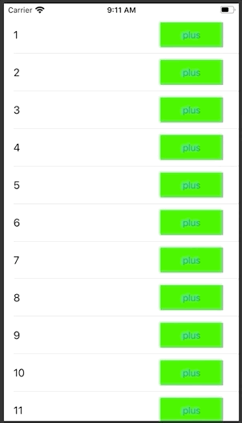
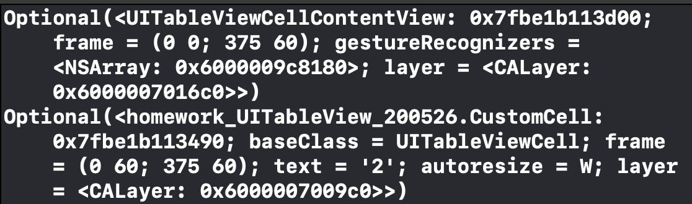

# 2020-05-26 homework

## [ 구현 목표 ]

- 1~50 까지 출력되는  TableView  구성
- 각각의  cell에 버튼을 추가하고 버튼을 누룰때마다 cell내에 있는  label에 1씩 추가



## [ 과제 1 ]  SuperView 사용 방법

- ViewCtroller.swift

```swift
import UIKit

class ViewController: UIViewController, UITableViewDelegate {

  var dataArray = Array(1...50)
  var tableView = UITableView()

  override func viewDidLoad() {
    super.viewDidLoad()

    setTableView()
  }

  func setTableView() {
    tableView = UITableView(frame: CGRect(x: 0, y: 0, width: view.frame.size.width, height: view.frame.size.height), style: .plain)
    tableView.register(CustomCell.self, forCellReuseIdentifier: "CellID")
    tableView.rowHeight = 60
    tableView.dataSource = self
    tableView.delegate = self
    view.addSubview(tableView)
  }
}

extension ViewController: UITableViewDataSource {

  func tableView(_ tableView: UITableView, numberOfRowsInSection section: Int) -> Int {
    return dataArray.count
  }

  func tableView(_ tableView: UITableView, cellForRowAt indexPath: IndexPath) -> UITableViewCell {
    let cell = tableView.dequeueReusableCell(withIdentifier: "CellID", for: indexPath) as! CustomCell
    cell.textLabel?.text = "\(dataArray[indexPath.row])"
    // Custom Cell의 plusbutton  Acition을 여기서 지정해줌
    cell.plusButton.addTarget(self, action: #selector(tabplusButton), for: .touchUpInside)
    cell.plusButton.addTarget(self, action: #selector(tabplusButton), for: .touchUpInside)
    return cell
  }
  // button의 superView -> tableViewCellContentView 의 superView -> CustomCell
  // CustomCell = Cell
  @objc func tabplusButton(sender:UIButton) {
    if let cell = sender.superview?.superview as? CustomCell,
    let row = tableView.indexPath(for: cell)?.row {
      let addedNumber = dataArray[row] + 1
      dataArray[row] = addedNumber
      cell.textLabel?.text = "\(addedNumber)"
    }
  }
}
```



- CustomCell.swift
  - 버튼에 대한 UI 지정부분만 존재

```swift
import UIKit

class CustomCell: UITableViewCell{
    
    var plusButton = UIButton(type: .system)
    
    override init(style: UITableViewCell.CellStyle, reuseIdentifier: String?) {
        super.init(style: style, reuseIdentifier: reuseIdentifier)
         
        plusButton.backgroundColor = .green
        plusButton.setTitle("Plus", for: .normal)
        plusButton.frame = CGRect(x: 250, y: 15, width: 60, height: 30)
        contentView.addSubview(plusButton)
    }
    
    required init?(coder: NSCoder) {
        fatalError("init(coder:) has not been implemented")
    }
}
```


### 소스코드 링크 :point_right: [link](https://github.com/tootoomaa/FastCampus_IOS_school/tree/master/homework/SourceCode/homework_UITableView_superview_200526)


## [ 과제 2 ] Delegate 활용

- ViewController.swift

```swift
import UIKit

class ViewController: UIViewController {

    var numberArray = Array(1...50)
    var tableView = UITableView()
    
    override func viewDidLoad() {
        super.viewDidLoad()
        
        tableView = UITableView(frame: view.frame, style: .plain)
        tableView.register(CustomCell.self, forCellReuseIdentifier: "CellId")
        tableView.dataSource = self
        tableView.rowHeight = 60
        view.addSubview(tableView)
    }
}


extension ViewController: UITableViewDataSource {
    func tableView(_ tableView: UITableView, numberOfRowsInSection section: Int) -> Int {
        return numberArray.count
    }
    
    func tableView(_ tableView: UITableView, cellForRowAt indexPath: IndexPath) -> UITableViewCell {
        let cell = tableView.dequeueReusableCell(withIdentifier: "CellId", for: indexPath) as! CustomCell
        cell.delegate = self								// delegate 지정
        cell.plusButton.tag = indexPath.row // 어떤 버튼이 눌렸는지 구별하기 위한 tag지정
        cell.textLabel?.text = "\(numberArray[indexPath.row])"
        return cell
    }
}
// delgate를 통해서 동작하는 부분
extension ViewController: CustomCellDelegate {
    func tabPlusButtonDelegate(_ cell: CustomCell,buttonRow: Int) {
        numberArray[buttonRow] += 1
        cell.textLabel?.text = "\(numberArray[buttonRow])"
    }
}
```

- protocol.swift

```swift
// Protocol 선언
protocol CustomCellDelegate {
   	// 전달인자 cell, Button Row(tag)
    func tabPlusButtonDelegate(_ cell: CustomCell,buttonRow:Int)
}
```

- CustomCell.swift

```swift
import UIKit

class CustomCell: UITableViewCell {
    
    var plusButton = UIButton(type: .system)
    var delegate: CustomCellDelegate? // delegate변수 선언

    override init(style: UITableViewCell.CellStyle, reuseIdentifier: String?) {
        super.init(style: style, reuseIdentifier: reuseIdentifier)
        // plusButton UI 설정
        plusButton.frame = CGRect(x: 250, y: 10, width: 100, height: 40)
        plusButton.setTitle("plus", for: .normal)
        plusButton.backgroundColor = .green
        plusButton.addTarget(self, action: #selector(tabplusButton(_:)), for: .touchUpInside)
        contentView.addSubview(plusButton)
    }
    
    required init?(coder: NSCoder) {
        fatalError("init(coder:) has not been implemented")
    }
    // plusButton Action에 delegate 함수 호출
    @objc func tabplusButton(_ sender:UIButton) {
        let row = sender.tag
        delegate?.tabPlusButtonDelegate(self, buttonRow: row)
    }
}
```


### 소스코드 링크 :point_right: [link](https://github.com/tootoomaa/FastCampus_IOS_school/tree/master/homework/SourceCode/homework_UITableview_delegate_200526)


