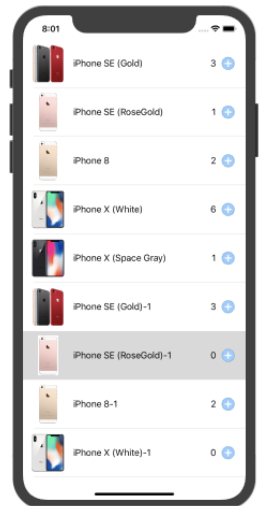
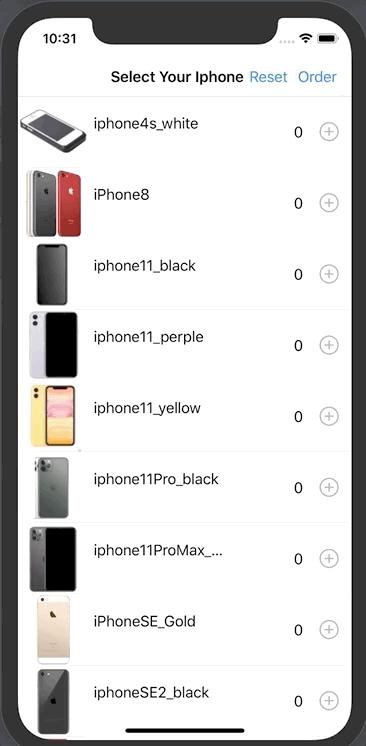
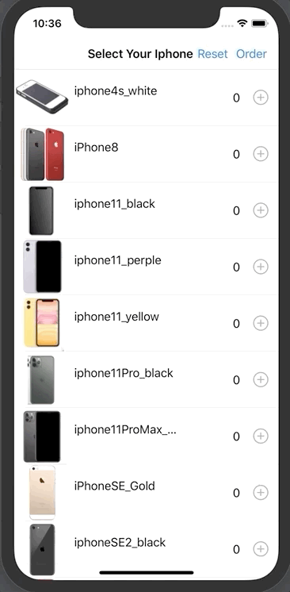
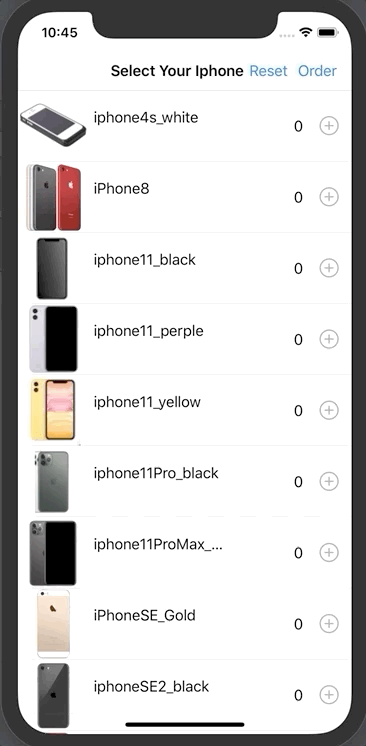

# 2020-05-27 homework - Shopping Item

## [ 실습 과제 ]

1. 구현 목표
   - 테이블뷰와 커스텀 셀을 이용해서 사고자 하는 아이템을 추가하는 기능 구현
   - 스크롤이 가능하도록 아이템 최소 15개 이상 생성

     -  프로젝트에 5개 이미지만 포함되어 있으므로 중복 사용하거나 다른 모델을 추가 원 한다면 직접 이미지 추가하여 사용
   -  각 아이템은 한정된 재고 수량을 가지도록 설정  버튼을 통해 해당 아이템의 주문 수량을 늘리려고 할 때, 

      재고 수량을 초과하면 셀 배경색을 일시적으로 빨갛게 만들고
 추가로 주문 불가 메시지 출력 (print 또는 alert)
2. 구현 화면 예시

## [ 구현 내용 ]

### 기본 요구 사항 구현 내용

### 추가 구현 내용

- Order Button을 통해서 OrderPage로 화면이동
- 화면 이동시 사용자가 선택한 물품들을 표시

- 화면 내에서 선택한 제품 삭제 기능 추가( Swipe )

- OrderPage에서 최종 `PlaceOrder`시 해당 물품의 재고 차감,
  - iphone 4s의 경우 재고량이 1개임으로 고객이 1개를 주문하게 되면 더 이상 주문 불가능

### 소스코드 링크 :point_right: [link](https://github.com/tootoomaa/FastCampus_IOS_school/tree/master/homework/SourceCode/200527_hoemwork_ShoppingItems)

