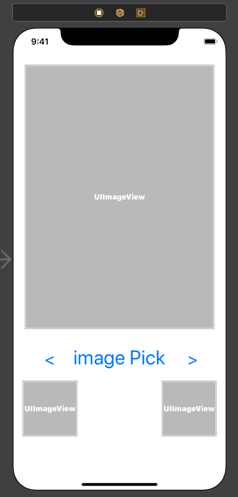

# 2020-06-02 homework ( UIContextMenuInteraction)

## [ 구현 목표 ]

- 사용자가 사진라이브러이에서 추가한 사진들을 좌우 버튼을 이용하여 순서대로 보여줌
- 오른쪽, 왼쪽 화살표 버튼을 길게 누를 경우 이전, 다음 사진이 작게 보여짐
- 첫 사진, 마지막 사진에는 이전, 다음 사진의 프리뷰는 안나옴

<video src="/Users/kimkwangsoo/Document/dev/FastCampus_IOS_school/homework/image/200602_homework_MainUI.mov"></video>

## [ 과제 풀이] 

### 구현 화면


#### 소스코드

- StoryBoard



- ViewCtroller.swift

```swift
import UIKit
import MobileCoreServices

class ViewController: UIViewController {

  //MARK: - Properties
  private let imagePicker = UIImagePickerController()
  var previewValue = UIImageView()

  @IBOutlet weak var leftPreview: UIImageView!
  @IBOutlet weak var rightPreview: UIImageView!

  @IBOutlet weak var rightButton: UIButton!
  @IBOutlet weak var leftButton: UIButton!

  var imageIndex:Int = 0
  var imageArray:[UIImage] = []

  @IBOutlet private weak var imageView: UIImageView! {

  @IBOutlet weak var imagePickbutton: UIButton!
  override func viewDidLoad() {
    super.viewDidLoad()
    // Do any additional setup after loading the view.
    imagePicker.delegate = self

    let interactionRight = UIContextMenuInteraction(delegate: self)
    rightButton.addInteraction(interactionRight)

    let interactionLeft = UIContextMenuInteraction(delegate: self)
    leftButton.addInteraction(interactionLeft)

    leftPreview.backgroundColor = .white
    view.addSubview(leftPreview)
    rightPreview.backgroundColor = .white
    view.addSubview(rightPreview)

  }
	// 이미지를 선택하기 위한 버튼
  @IBAction func tabimagePickButtonAction(_ sender: Any) {
    imagePicker.sourceType = .savedPhotosAlbum 	
    imagePicker.mediaTypes = [kUTTypeImage as String] // 이미지 불러오기

    present(imagePicker, animated: true, completion: nil)
  }
	// 왼쪽 버튼을 누를 때
  @IBAction func tabLeftButton(_ sender: Any) {
    if imageIndex >= 1 {
      imageIndex -= 1
      imageView.image = imageArray[imageIndex] // 이전 이미지 출력
    }
  }
	// 오른쪽 버튼을 누를 때
  @IBAction func tabrightButton(_ sender: Any) {
    if imageIndex < imageArray.count-1 {
      imageIndex += 1
      imageView.image = imageArray[imageIndex] // 다음 이미지 출력
    }
  }
}
//MARK: - UIImagePickerControllerDelegate
extension ViewController : UIImagePickerControllerDelegate & UINavigationControllerDelegate {

  func imagePickerController(_ picker: UIImagePickerController, didFinishPickingMediaWithInfo info: [UIImagePickerController.InfoKey : Any]) {

    // handle Image Type
    let originalImage = info[.originalImage] as! UIImage    // 이미지를 가져옴
    imageView.image = originalImage                         // 이미지 셋팅
    imageArray.append(originalImage)                        // 이미지 배열에 추가
    imageIndex += 1                                         // 이미지 배열 인덱스 추가

    dismiss(animated: true, completion: nil)                // imagePicker 종료
  }
}

//MARK: - UIContextMenuInteraction
extension ViewController: UIContextMenuInteractionDelegate {
  func contextMenuInteraction(_ interaction: UIContextMenuInteraction, configurationForMenuAtLocation location: CGPoint) -> UIContextMenuConfiguration? {		// previewValue 출력할 imageView를 담을 변수값
		// 누르는 버튼의 실제 x좌표를 이용하여 버튼을 구분
    if interaction.location(in: view).x < 150 {
      if imageIndex - 1 >= 0 {
        leftPreview.image = imageArray[imageIndex-1]
        previewValue = leftPreview
        return UIContextMenuConfiguration(identifier: nil, previewProvider: nil, actionProvider: nil)
      }
    } else {
      if imageIndex + 1 < imageArray.count {
        rightPreview.image = imageArray[imageIndex+1]
        previewValue = rightPreview
        return UIContextMenuConfiguration(identifier: nil, previewProvider: nil, actionProvider: nil)
      }
    }
    //위 조건에 해당하지 않을 경우 사용 안함
    return nil
  }

  // 내가 원하는 뷰를 타겟 브리뷰로 지정
  func contextMenuInteraction(_ interaction: UIContextMenuInteraction, previewForHighlightingMenuWithConfiguration configuration: UIContextMenuConfiguration) -> UITargetedPreview? {
		// 사전에 지정해둔 previewValue 띄워줌
    return UITargetedPreview(view: previewValue)
  }

  // interaction이 종료되기 전에 호출
  func contextMenuInteraction(_ interaction: UIContextMenuInteraction, willEndFor configuration: UIContextMenuConfiguration, animator: UIContextMenuInteractionAnimating?) {
    // 화면 삭제시 천천히 삭제되도록 설정
    UIView.animate(withDuration: 2) {
      self.previewValue.image = nil
    }
  }
}
```


### 소스코드 링크 :point_right: [link](https://github.com/tootoomaa/FastCampus_IOS_school/tree/master/homework/SourceCode/200602_imagePickPractice)


