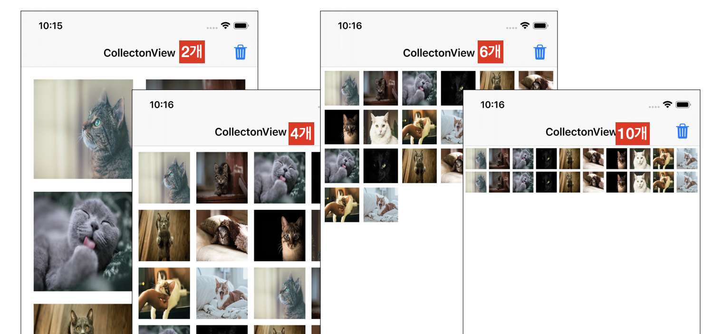

# 2020-06-16 homework ( UICollectionView )

## 구현 목표

### 구현 상세 내용

> - 10장의 이미지를 x 2 해서 20개 아이템으로 만들어 콜렉션뷰에 표시 (세로 방향 스크롤) 
> - 각 아이템을 선택했을 때 체크 아이콘 표시 (체크 이미지 : SF Symbol - checkmark.circle.fill)  + 선택되어 있는 느낌이 나도록 별도 효과 주기 (영상 참고, 효과는 변경 가능) 
> - 삭제 버튼을 눌렀을 때 체크표시 되어 있는 아이템들을 삭제 
> - 20개의 아이템이 모두 삭제되었을 경우는 다시 반복할 수 있도록 처음 20개 상태로 복구 
> - 손가락 2개로 터치 후 드래그했을 때 아이템이 다중 선택/해제될 수 있도록 구현  (이 기능은 샘플 영상에 없음) 
> - 한 라인에 지정된 개수만큼의 아이템이 나타나도록 처리 (4를 지정하면 한 라인에 4개의 아이템 출력) 

### [ 과제 관련 힌트 ]  

- allowsMultipleSelection 프로퍼티  
- deleteItems, insertItems 메서드  
- UICollectionViewDelegate - shouldBeginMultipleSelectionInteractionAt 
-  아이템 선택에 관련된 처리 방법 (다음 3가지 중 하나를 이용해서 처리 가능) 
  1. isSelected 프로퍼티 
  2. UICollectionViewDelegate의 didSelect/didDeselect 메서드 사용 
  3. selectedBackgroundView 프로퍼티


## 구현 내용

### 개요

- Collection View내의 선택된 item삭제 기능 구현
- 선택된 item들의 이미지를 선택한 이미지로 변경
- 모두 삭제 된 경우 초기화로 돌림


### 주요 소스코드

1. ##### 숫자 변경에 따른 화면상에 보여지는 구성이 변경됨

```swift
struct UI {
  static let viewImageCount:CGFloat = 10 // 화면에 보여지는 갯수 지정
  static let lineSpacing:CGFloat = 40 / viewImageCount // 화면에 보여지는 갯수에 따른
  static let itemSpacing:CGFloat = 40 / viewImageCount // 비율 조정
  static let sectionInset:CGFloat = 40 / viewImageCount
}

fileprivate func collectionVeiwLayout() { //화면 UI 구성 변경
  let layout = collectionView.collectionViewLayout as! UICollectionViewFlowLayout
  let cellWidth = (view.frame.size.width - UI.itemSpacing*(UI.viewImageCount-1) - UI.sectionInset*2)/UI.viewImageCount

  layout.minimumLineSpacing = CGFloat(UI.lineSpacing)
  layout.minimumInteritemSpacing = UI.itemSpacing
  layout.sectionInset = UIEdgeInsets(top: UI.sectionInset, left: UI.sectionInset, bottom: UI.sectionInset, right: UI.sectionInset)
  layout.itemSize = CGSize(width: cellWidth, height: cellWidth)
}

```

- viewImageCount 숫자 변경에 따른 화면




##### 2. 이미지 클릭시 이미지 변경

```swift
func collectionView(_ collectionView: UICollectionView, cellForItemAt indexPath: IndexPath) -> UICollectionViewCell {
    print(indexPath)
    let cell = collectionView.dequeueReusableCell(withReuseIdentifier: reuseableId, for: indexPath)
    let imageView = UIImageView(image: UIImage(named: imageArray[indexPath.item]), highlightedImage: UIImage(systemName: "checkmark.circle.fill")) // 이미지 생성시 higthlighted 이미지 지정
    imageView.frame = cell.contentView.frame
    cell.contentView.addSubview(imageView)
    cell.contentView.backgroundColor = .blue
    cell.isMultipleTouchEnabled = true
    if deleteItemList.contains(indexPath) { // 이미지 재생성시 사용자가 선택한 화면은 isHighlighted true 지정
      cell.isHighlighted = true
    } else {
      cell.isHighlighted = false
    }
    return cell
  }
```


##### 3. 체크된 이미지 삭제 메커니즘

```swift
// deleteItemList 삭제할 이미지들을 배열에 저장해둠
func collectionView(_ collectionView: UICollectionView, didSelectItemAt indexPath: IndexPath) {
    print("select")
    guard let cell = collectionView.cellForItem(at: indexPath) else {return}
    cell.isHighlighted.toggle()
    
    if !deleteItemList.contains(indexPath) {
      deleteItemList.append(indexPath)
      print(deleteItemList)
    }
  }

@IBAction func tabDeleteAction(_ sender: Any) {
    if !deleteItemList.isEmpty {
      //내림차순으로 정렬하여 배열중에 indeaPath가 가장 큰 값 부터 삭제
      for indexPath in deleteItemList.sorted(by:>) { 
        imageArray.remove(at: indexPath.row)
      }
      collectionView.deleteItems(at: deleteItemList)
    }
    // 이미지 배열이 비었을 경우 초기화
    print(imageArray)
    if imageArray.isEmpty {
      makeStringArray() // 이미지 배열에 고양이 사진의 파일 명을 다시 넣어줌
    }
    deleteItemList = []
    collectionView.reloadData() // 화면을 다시 보여줌
  }
```


### 소스코드 :point_right: [링크](./SourceCode/CollectionViewPractice_0616)


## 2차 소스코드 수정

